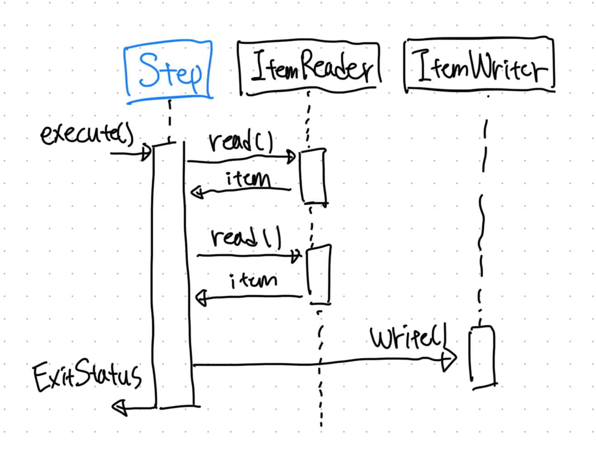

# Chunk 지향 처리

- 스프링 배치는 `chunk-oriented` 개념을 사용한다.
- `chunk-oriented`는 데이터를 하나씩 읽어와 `chunks`를 만드는 것을 말한다.
- 여기서 `chunk`란 데이터 덩어리를 의미하며, 각 커밋 사이에 처리되는 아이템의 개수를 의미한다.
- 아래는 공식 문서에 제시된 간단한 예시다.



```java
List items = new ArrayList();
for (int i = 0; i < commitInterval; i++) {
  Object item = itemReader.read();
  if (item != null) {
    items.add(item);    
  }
}
itemWriter.write(items);
```

<br/>

## Step 구성하기

- chunk 지향 처리 Step는 간단하게 아래와 같이 구성해볼 수 있다.

```java
@Configuration
public class MyJobConfig {
  
  @Bean
  public Job myJob(final JobRepository jobRepository) {
    return new JobBuilder("myJob", jobRepository)
        .start(myStep)
        .build();
  }
  
  @Bean
  public Step myStep(
      final JobRepository jobRepository, final PlatformTransactionManager transactionManager) {
    return new StepBuilder("myStep", jobRepository)
        .<String, String>chunk(10, transactionManager)
        .reader(itemReader())
        .writer(itemWriter())
        .build();
  } 
}
```

- 스프링의 `PlatformTransactionManager`는 실행 과정 중 트랜잭션의 실행과 커밋을 책임진다.
- `JobRepository`는 `StepExecution`, `ExecutionContext` 등의 정보를 저장해놓는다.
- `chunk()` 메소드는 해당 스텝이 아이템 기반의 스텝임을 나타내며, 트랜잭션이 아이템의 개수만큼 쪼개져 실행된다. 

<br/>

## 커밋의 간격

- 하나의 커밋 간격은 하나의 청크 단위를 `reading`하면서 시작되고 `writing`됨과 함께 끝난다. 
  - 이 때 트랜잭션은 `PlatformTransactionManager`에 의해 관리된다.
- 한 트랜잭션이 처리되는 수는 리소스가 허용하는 한 많은 것이 좋고, 이를 위해 청크 지향 처리는 청크의 크기를 지정할 수 있게 해준다.

```java
@Configuration
public class MyJobConfig {
  
  @Bean
  public Job myJob(final JobRepository jobRepository) {
    return new JobBuilder("myJob", jobRepository)
        .start(myStep)
        .build();
  }
  
  @Bean
  public Step myStep(
      final JobRepository jobRepository, final PlatformTransactionManager transactionManager) {
    return new StepBuilder("myStep", jobRepository)
        .<String, String>chunk(10, transactionManager)
        .reader(itemReader())
        .writer(itemWriter())
        .build();
  } 
}
```

- 예를 들어 위 코드가 실행될 때 10개씩 끊어서 트랜잭션이 각각 실행된다.
1. 100개의 아이템이 있다고 해보자.
2. `itemReader`는 `chunk()` 메소드에 지정된 수인 10개의 아이템을 가져온다.
3. 10개의 아이템은 `ItemWriter` chunk로 전달되고 매개변수를 통해 `writing`을 처리한다.
4. `writing` 작업이 끝나면 트랜잭션이 커밋된다.
5. 총 100개의 아이템이 있으므로 위의 작업이 총 10번 반복된다.

<br/>

## Step의 재실행 구성하기

### 실행 횟수 제한

- Step에서는 `startLimit()` 메소드를 통해 Step이 몇 번 실행될지 제어할 수 있다.
- 만약 제한 수보다 더 많이 실행하려고 하면 `StartLimitExceededException` 에러가 던져진다.
  - 이 방법은 생각보다 유용할 수도? 해당 Step이 실패하여 `startLimit`을 넘게 되면 에러가 발생하기 때문에 개발자가 해당 스텝에 문제가 있음을 바로 알아차릴 수 있다!
- `startLimit`의 기본값은 `Integer.MAX_VALUE`다.
- 아래는 Step을 1번만 실행되도록 강제한 코드다.

```java
@Configuration
public class MyJobConfig {
  
  @Bean
  public Step myStep(
      final JobRepository jobRepository, final PlatformTransactionManager transactionManager) {
    return new StepBuilder("myStep", jobRepository)
            .<String, String>chunk(10, transactionManager)
            .reader(itemReader())
            .writer(itemWriter())
            .startLimit(1)
            .build();
  } 
}
```

### 완료된 Step을 재실행하기

- 이미 `COMPLETED`된 Step을 재실행하고자 하는 요구사항이 있을 수 있다.
  - 원래 배치 서버에서는 성공적으로 실행된 스텝을 재실행하지 않는다. (`JobParameter`가 동일하다는 가정하에)
- 그 때는 `allowStartIfComplete(true)`를 사용하면 된다.

```java
@Configuration
public class MyJobConfig {
  
  @Bean
  public Step myStep(
      final JobRepository jobRepository, final PlatformTransactionManager transactionManager) {
    return new StepBuilder("myStep", jobRepository)
            .<String, String>chunk(10, transactionManager)
            .reader(itemReader())
            .writer(itemWriter())
            .allowStartIfComplete(true)
            .build();
  } 
}
```

<br/>

## JpaPagingItemReader 활용하기

- 먼저 `JpaPagingItemReader`가 값을 어떻게 읽어오는지 확인해보자.
- 현재 `Page`와 `PageSize(청크 단위)`를 확인해 그 개수만큼 조회해오는 것을 확인할 수 있다.

```java
public class JpaPagingItemReader<T> extends AbstractPagingItemReader<T> {

  ...
  
  protected void doReadPage() {

    EntityTransaction tx = null;

    if (transacted) {
      tx = entityManager.getTransaction();
      tx.begin();

      entityManager.flush();
      entityManager.clear();
    }//end if

    // PageSize = Chunk에서 지정한 수
    // 청크의 수만큼 페이징하여 값을 가져온다.
    Query query = createQuery().setFirstResult(getPage() * getPageSize())
            .setMaxResults(getPageSize());

    if (parameterValues != null) {
      for (Map.Entry<String, Object> me : parameterValues.entrySet()) {
        query.setParameter(me.getKey(), me.getValue());
      }
    }

    if (results == null) {
      results = new CopyOnWriteArrayList<>();
    } else {
      results.clear();
    }

    if (!transacted) {
      List<T> queryResult = query.getResultList();
      for (T entity : queryResult) {
        entityManager.detach(entity);
        results.add(entity);
      }//end if
    } else {
      results.addAll(query.getResultList());
      tx.commit();
    }//end if
  }
}
```

### 예시

- 아래 예시는 50개 단위로 끊어서 `member`를 읽어와 서비스 로직을 처리하는 예시 코드이다.
- 각 트랜잭션이 실행될 때마다 아래 쿼리를 실행해 페이징으로 아이템을 읽어온다. 
  - (MySQL 기준) `SELECT m FROM Member m WHERE m.mobile IS NOT NULL LIMIT 50 OFFSET ?`
  - `OFFSET`은 위에서 `JpaPagingItemReader`에서 확인했다시피 ((현재 페이지) * (청크에서 설정한 아이템 개수))로 결정된다. 

```java
@Configuration
@RequiredArgsConstructor
public class MyJob {

  private final int chunkSize = 50;
  private final EntityManagerFactory entityManagerFactory;
  private final MyService myService;

  @Bean
  public Job myJob(final JobRepository jobRepository) {
    return new JobBuilder("myJob", jobRepository)
            .start(myStep)
            .build();
  }

  @Bean
  public Step myStep(
          final JobRepository jobRepository, final PlatformTransactionManager transactionManager) {
    return new StepBuilder("myStep", jobRepository)
            .<Member, Member>chunk(chunkSize, transactionManager)
            .reader(memberReader())
            .writer(memberWriter())
            .build();
  }

  @Bean
  public JpaPagingItemReader<NotificationSetting> memberReader() {
    return new JpaPagingItemReaderBuilder<Memeber>()
            .name("memberReader")
            .entityManagerFactory(entityManagerFactory)
            .pageSize(chunkSize)
            .queryString("SELECT m FROM Member m WHERE m.mobile IS NOT NULL")
            .build();
  }

  @Bean
  public ItemWriter<NotificationSetting> memberWriter() {
    return chunk -> myService.service(chunk);
  }
}
```

# 참고 자료

- [스프링 공식 문서](https://docs.spring.io/spring-batch/reference/step/chunk-oriented-processing.html)
- [6. Spring Batch 가이드 - Chunk 지향 처리](https://jojoldu.tistory.com/331)
