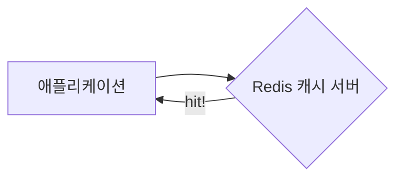
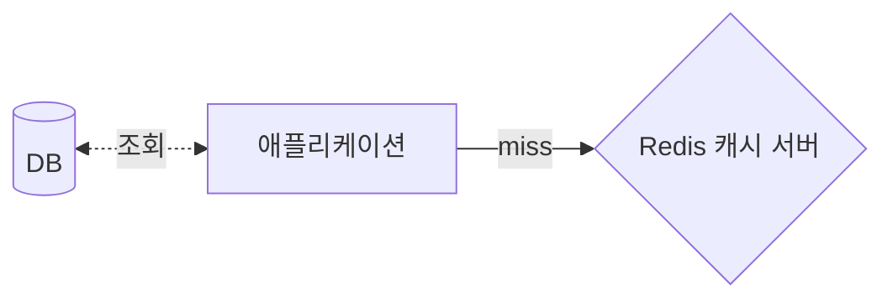

# Spring에서 Redis 사용하기

## 캐시 서버로 사용하기

- Redis를 캐시 서버로 활용하는 방법이다.
- 애플리케이션의 플로우는 대충 아래와 같이 흐르게 된다.

### Hit



### Miss



### 설정하기

- 우선 `@EnableCaching`을 통해 캐시 기능을 활성화 해줘야 한다!

```java
@EnableCaching
@Configuration
public class CacheConfig {

  //...
}
```

- 그리고 `CacheManager`의 구현체도 필요하다.
  - `RedisCacheManager`로 Bean을 만들어보자.

```java
@EnableCaching
@Configuration
public class CacheConfig {

  @Bean
  public CacheManager cacheManager(RedisConnectionFactory factory) {
    final RedisCacheConfiguration config =
        RedisCacheConfiguration.defaultCacheConfig()
            .serializeKeysWith(SerializationPair.fromSerializer(new StringRedisSerializer()))
            .serializeValuesWith(
                SerializationPair.fromSerializer(new GenericJackson2JsonRedisSerializer()))
            .entryTtl(Duration.ofMinutes(1L));
    return RedisCacheManager.RedisCacheManagerBuilder.fromConnectionFactory(factory)
        .cacheDefaults(config)
        .build();
  }
}
```

### 특정 캐시의 TTL 설정하기

- 캐시별로 TTL을 다르게 설정할 수 있다!
- 캐시 이름을 담은 클래스

```java
@NoArgsConstructor(access = AccessLevel.PRIVATE)
public final class CacheNames {

  public static final String MEMBER = "member";
}
```

- MEMBER 캐시에 대해서는 1시간이 유지되도록 설정을 수정해줬다.

```java
@EnableCaching
@Configuration
public class CacheConfig {

  @Bean
  public CacheManager cacheManager(RedisConnectionFactory factory) {
    final RedisCacheConfiguration defaultConfig = defaultConfig();
    return RedisCacheManager.RedisCacheManagerBuilder.fromConnectionFactory(factory)
        .cacheDefaults(defaultConfig)
        .withInitialCacheConfigurations(customTTLConfig())
        .build();
  }

  private RedisCacheConfiguration defaultConfig() {
    return RedisCacheConfiguration.defaultCacheConfig()
        .serializeKeysWith(fromSerializer(new StringRedisSerializer()))
        .serializeValuesWith(fromSerializer(new GenericJackson2JsonRedisSerializer()))
        .entryTtl(Duration.ofMinutes(1L));
  }

  private Map<String, RedisCacheConfiguration> customTTLConfig() {
    Map<String, RedisCacheConfiguration> configurations = new HashMap<>();
    configurations.put(
        CacheNames.MEMBER, defaultConfig().entryTtl(Duration.ofHours(1)));
    return configurations;
  }
}
```

### 사용하기

#### `@Cacheable`

- 메소드에 붙여서 사용할 것을 권장.
- 캐시를 저장 또는 조회할 때 사용한다.
- 메소드에서 조회할 캐시 데이터가 캐시 서버에 있는지 확인하고, 있으면 반환하고 없으면 새로 저장한 후 반환하는 것.

#### `@CachePut`

- 메소드에 붙여서 사용할 것을 권장.
- 캐시를 저장 또는 수정할 목적으로만 사용.
- 즉, 메소드에서 조회하고자 하는 데이터는 DB에서 직접 꺼내서 전달하고, 그 결과를 캐시 서버에 반영하기만 하는 것.

#### `@CacheEvict`

- 메소드에 붙여서 사용할 것을 권장.
- 캐시 제거를 위해 사용.

# 참고자료

- [Spring boot에서 Redis로 캐싱하기 (w. JPA)](https://velog.io/@juhyeon1114/Spring-boot%EC%97%90%EC%84%9C-Redis%EB%A1%9C-%EC%BA%90%EC%8B%B1%ED%95%98%EA%B8%B0-w.-JPA)
- [RedisCacheManager TTL, Serializer 를 캐시이름별로 다르게 설정하기](https://velog.io/@bonjugi/RedisCacheManager-TTL-Serializer-%EB%A5%BC-%EC%BA%90%EC%8B%9C%EC%9D%B4%EB%A6%84%EB%B3%84%EB%A1%9C-%EB%8B%A4%EB%A5%B4%EA%B2%8C-%EC%84%A4%EC%A0%95%ED%95%98%EA%B8%B0)

