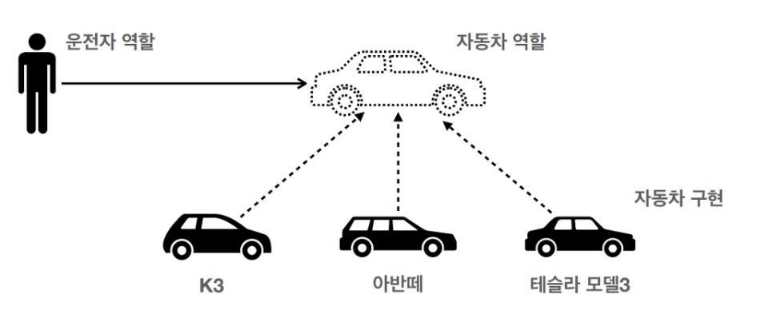
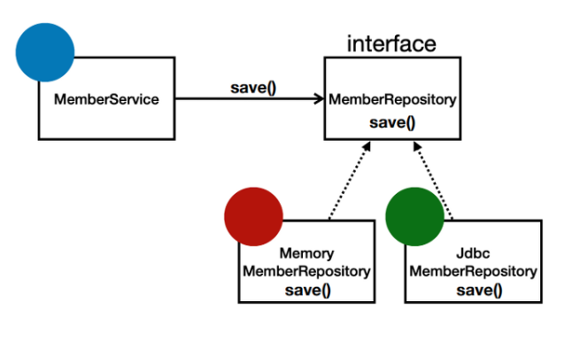

# What is Spring

## Spring

- 스프링은 한마디로 <u>자바 엔터프라이즈 개발을 편하게 해주는 오픈소스 경량급 애플리케이션 프레임워크</u>라고 표현할 수 있다.
- 스프링의 탄생 배경과 역사 등을 알아가보자!

### 스프링 이전 자바 진영

- 스프링을 사용하기 전에는 어떤 기술을 사용했을까? EJB(Enterprise Java Beans)와 JSP(Java Server Pages)를 많이 사용했다.

> **Java Beans**  
> Java Beans는 자바로 작성된 소프트웨어 컴포넌트이다. 자바는 프로그램 기본 단위가 클래스고, Java Bean은 그 클래스들이 복합적으로 이루어진 구조를 말한다. Java Bean은 자바의 클래스를 만드는 것과 규칙이 같다.
> EJB 자체가 Java Beans라는 말을 가지고 있지만 본질적으로 EJB와 Java Beans의 목적이 다르고, 동작하는 위치도 다르다.

> **EJB**  
> EJB는 주로 웹 시스템에서 JSP는 View를 보여주고, EJB는 비즈니스 로직(업무 로직)을 처리하기 위해 사용했다. 특히 거대 규모 시스템 구축을 위해 사용된 컴포넌트 모델이라고 할 수 있는데 그만큼 매우 복잡했다.
> EJB는 너무 복잡했기 때문에 단위 테스트가 거의 불가능에 가까웠고, 개발하는 시간이 오래 걸려 생산성이 많이 떨어졌다.

### 스프링의 등장

- 개발자들이 EJB에 불만을 품고 있을 무렵, 로드 존슨은 2003년에 "Expert One-on-One j2EE Design and Development"라는 책을 출간했는데, 여기서 사용한 프레임워크가 스프링의 기원이 됐다.
- EJB를 사용하던 J2EE의 긴 겨울이 끝나고 봄이 왔다는 의미에서 이 프레임워크의 이름이 "Spring"으로 결정됐다는 말이 있다.

### 스프링의 역사

- 2003년 스프링 프레임워크 1.0 : XML
- 2006년 스프링 프레임워크 2.0 : XML 편의 기능 지원
- 2009년 스프링 프레임워크 3.0 : 자바 코드 설정
- 2013년 스프링 프레임워크 4.0 : 자바8(최소 요구사항)
- 2014년 스프링부트 1.0
- 2017년 스프링 프레임워크 5.0, 스프링 부트2.0 : 리액티브 프로그래밍 지원
- 2022년 스프링 프레임워크 6.0, 스프링부트 3.0: 자바 17(최소 요구사항)

### 스프링 생태계

- 핵심기술 : 스프링 DI 컨테이너, AOP, 이벤트 등등
- 웹기술 : 스프링 MVC, 스프링 WebFlux 등등
- 데이터접근기술 : 트랜잭션, JDBC, ORM, XML 지원

 

## 객체 지향 설계와 스프링

- 스프링은 자바가 객체지향 언어라는 특징을 살려 좋은 객체지향 어플리케이션을 만들 수 있도록 도와주는 프레임워크다.
- 좋은 객체지향 어플리케이션을 만드려면 객체지향에 대한 이해는 필수다.

### 다형성

- 다형성이 가장 중요한 개념 중 하나다. 객체지향 프로그래밍은 프로그램을 유연하고 변경 용이하게 만들어주는데, 다형성이라는 특징 덕분에 이것이 가능하다. 레고 블럭을 조립하듯이 프로그래밍할 수 있게 되는 것이다!

- `운전자`는 클라이언트이자 인터페이스로 `자동차`라는 인터페이스에 의존한다. 이 때 `자동차` 인터페이스를 구현한(implement) 구현체(클래스)가 K3에서 아반떼로 달라지더라도 운전자에게 전혀 영향을 주지 않는다. 어차피 운전대, 엑셀, 브레이크 등의 인터페이스 엇비슷하기 때문이다.

- 다형성을 이용해 인터페이스와 클래스를 설계하고 상속했다면 위와 같이 `오버라이딩`을 이용해 현재 클래스 특성에 맞게 메소드 내용을 바꾸고, 그 메소드를 구현체에서 실행할 수 있다.

### 추상화

- 객체지향 프로그래밍에서 클라이언트는 내부 구조를 전혀 몰라도 된다는 특징이 있다. 내부 로직에 대한 이해없이 인터페이스만 알아도 사용이 가능하다는 특징을 **추상화**라고 한다.
- 위의 예시에서 봤다시피 우리는 운전을 할 때 운전대를 움직이는 방법과 엑셀, 브레이크를 밟는 방법만 알아도 운전을 능히 할 수 있다. 엔진과 기어가 움직이는 원리는 전혀 모르고 있어도 사용이 가능하다.

### SOLID: 좋은 객체 지향 설계의 5가지 원칙

- 아래의 5원칙을 이해하고 객체지향 프로그래밍을 바라보면 훨씬 좋다!
  1. SRP: 단일 책임 원칙(single responsibility principle)
  2. OCP: 개방-폐쇄 원칙 (Open/closed principle)
  3. LSP: 리스코프 치환 원칙 (Liskov substitution principle)
  4. ISP: 인터페이스 분리 원칙 (Interface segregation principle)
  5. DIP: 의존관계 역전 원칙 (Dependency inversion principle)

### 스프링이 주는 이점

- <b>Spring은 위에서 설명한 `다형성`과 `추상화`를 극대화할 수 있게 도와주는 도구다!</b>
- DI(의존성 주입)와 IoC 컨테이너를 통해 다형성, 개방폐쇄 원칙 및 의존관계 역전 원칙을 충족시켜준다. 클라이언트의 코드 변경없이 기능 확장을 유연하게 할 수 있도록 도와주는 것이다.

 

- 자세한 내용은 아래 링크 참고
- 링크: [SOLID: 객체 지향 5원칙](../../../Paradigm/Object-Oriented-Programming/02_SOLID.md)

 

## 참고자료

- 본 출처: 김영한님 강의 자료

- [스프링 핵심 원리 강의 정리1](https://velog.io/@easyhyun00/Spring-%EC%8A%A4%ED%94%84%EB%A7%81-%ED%95%B5%EC%8B%AC-%EC%9B%90%EB%A6%AC-%EA%B8%B0%EB%B3%B8%ED%8E%B8-%EC%9C%A0%EB%A3%8C%EA%B0%95%EC%9D%98-%EA%B0%95%EC%9D%98-%EC%A0%95%EB%A6%AC-1)

- [스프링 핵심 원리 정리1](https://roadofdevelopment.tistory.com/66)

- [스프링이란 무엇인가?](https://incheol-jung.gitbook.io/docs/study/tobys-spring/undefined/8)
