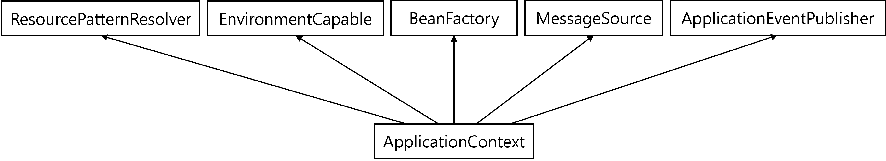

# Spring Container

## 스프링 컨테이너란?

- 스프링 컨테이너는 자바 객체의 생명주기를 관리하며 생성된 자바 객체(Java Bean)들에게 추가적인 기능을 제공하는 역할을 한다.
- 개발자가 객체를 생성 및 소멸하려면 new 연산자, 인터페이스 호출, 팩토리 호출 방식 등을 직접 코드로 작성해야하지만 스프링 컨테이너는 이 자잘한 역할 대신해준다. 제어 흐름을 외부에서 관리한다는 말이다!
- 스프링 컨테이너는 DI 등을 이용해 객체 간의 의존 관계를 런타임 과정에서 만들어준다.

### 싱글톤

- 스프링 컨테이너는 객체의 인스턴스를 싱글톤으로 관리하므로 싱글톤 컨테이너이다.

### IoC(Inversion of Control)

- 구현 객체는 자신의 로직만 실행하고 프로그램 제어 흐름은 스프링 컨테이너가 가져간다.
- 이렇게 프로그램 제어 흐름을 직접 제어하는 것이 아닌 외부에서 제어하는 것을 제어의 역전이라 한다.
- 이 때문에 스프링 컨테이너는 IoC 컨테이너라고도 불린다.
- IoC는 DI와도 큰 연관을 가지는데 DI에 대한 것은 아래 링크를 통해 자세히 알아보자!
- 링크: [Dependency Injection](./04_Dependency_Injection.md)

<br/>

## 스프링 컨테이너의 종류

- 스프링 컨테이너는 BeanFactory와 ApplicationContext가 있다.

### BeanFactory

- BeanFactory는 빈을 등록, 생성 및 조회하고 돌려주는 등, 빈을 관리하는 역할을 한다.
- getBean() 메소드를 이용하면 빈을 인스턴스화할 수 있다.

```java
@Configuration
public class AppConfig {

    @Bean
    public MyService myService() {
        return new MyService();
    }
}
```

```java
public class Main {

    public static void main(String[] args) {
        final BeanFactory beanFactory = new AnnotationConfigApplicationContext(AppConfig.class);

        // Bean 호출
        final MyService myService = beanFactory.getBean("myService", MyService.class);

        // 호출한 Bean의 메소드를 사용
        myService.method();
    }
}
```

- 위와 같이 BeanFactory를 AnnotationConfigApplicationContext로 정의하되, AppConfig를 구성 정보로 지정하면 스프링 컨테이너가 자동으로 스프링 빈 객체를 찾아줄 수 있다.
- getBean() 메소드에 여러 인자가 들어갈 수 있지만 `MyService.class`와 같이 클래스 타입을 적어주지 않으면 `myService`의 타입이 `MyService`가 아닌 Object가 된다.

```log
.context.annotation.AnnotationConfigApplicationContext - Refreshing org.springframework.context.annotation.AnnotationConfigApplicationContext@4e718207
13:52:20.460 [main] DEBUG org.springframework.beans.factory.support.DefaultListableBeanFactory - Creating shared instance of singleton bean 'org.springframework.context.annotation.internalConfigurationAnnotationProcessor'
13:52:20.738 [main] DEBUG org.springframework.beans.factory.support.DefaultListableBeanFactory - Creating shared instance of singleton bean 'org.springframework.context.event.internalEventListenerProcessor'
13:52:20.741 [main] DEBUG org.springframework.beans.factory.support.DefaultListableBeanFactory - Creating shared instance of singleton bean 'org.springframework.context.event.internalEventListenerFactory'
13:52:20.743 [main] DEBUG org.springframework.beans.factory.support.DefaultListableBeanFactory - Creating shared instance of singleton bean 'org.springframework.context.annotation.internalAutowiredAnnotationProcessor'
13:52:20.745 [main] DEBUG org.springframework.beans.factory.support.DefaultListableBeanFactory - Creating shared instance of singleton bean 'org.springframework.context.annotation.internalCommonAnnotationProcessor'
13:52:20.758 [main] DEBUG org.springframework.beans.factory.support.DefaultListableBeanFactory - Creating shared instance of singleton bean 'appConfig'
13:52:20.767 [main] DEBUG org.springframework.beans.factory.support.DefaultListableBeanFactory - Creating shared instance of singleton bean 'myService'
```

- 코드를 실행하면 위와 같은 로그가 보여진다.
- `Creating shared instance of singleton bean`이라는 문구로 확인했을 때 싱글톤 패턴으로 인스턴스(Bean)가 잘 생성됐다는 것을 알 수 있다.
- 이렇게 생성된 Bean은 스프링 컨테이너에 의해 자동으로 주입된다.

### ApplicationContext

- `ApplicationContext`도 `BeanFactory`와 같이 빈을 관리할 수 있다. 위 코드의 `BeanFactory`를 교체하면 똑같은 결과를 그대로 얻을 수 있다.
- 그렇다면 둘의 차이는 무엇일까?? `ApplicationContext`은 `BeanFactory` 등 여러 요소를 상속받은 인터페이스다.

```java
public interface ApplicationContext extends EnvironmentCapable, ListableBeanFactory, HierarchicalBeanFactory,
		MessageSource, ApplicationEventPublisher, ResourcePatternResolver {
	...
}
```



- `ApplicationContext`가 각각을 상속받아 지원하는 기능은 아래와 같다.
  - `BeanFactory`: 빈을 관리하는 기능
  - `ResourcePatternResolver`: 리소스를 읽어오기 위한 인터페이스
  - `MessageSource`: 메시지 다국화를 위한 인터페이스
  - `ApplicationEventPublisher`: 이벤트 관련 기능들을 제공하는 인터페이스(리스너로 등록된 빈에게 이벤트 발생 알림 등 부가적인 기능)
  - `EnvironmentCapable`: 개발, 운영 등 환경을 분리해서 처리하고 어플리케이션 구동 시 필요한 정보들을 관리하기 위한 인터페이스
- 하지만 `ApplicationContext`와 `BeanFactory`는 빈 관리 기능이 약간 다르다. `BeanFactory`는 `getBean()` 메소드가 호출된 시점에서야 해당 빈을 생성하지만 `ApplicationContext`는 Context 초기화 시점에 모든 싱글톤 빈을 미리 로드한 후 어플리케이션 가동 후에는 빈을 지연없이 받을 수 있다. 이런 이점 덕분에 실제 개발에서는 `ApplicationContext`가 주로 사용된다고 한다.

<br/>

<br/>

## 참고자료

- [인프런 김영한 로드맵: 스프링 핵심 원리(3)](https://roadofdevelopment.tistory.com/70?category=463221)

- [스프링 핵심 원리: 강의 정리2](https://velog.io/@easyhyun00/Spring-%EC%8A%A4%ED%94%84%EB%A7%81-%ED%95%B5%EC%8B%AC-%EC%9B%90%EB%A6%AC-%EA%B8%B0%EB%B3%B8%ED%8E%B8-%EC%9C%A0%EB%A3%8C%EA%B0%95%EC%9D%98-%EA%B0%95%EC%9D%98-%EC%A0%95%EB%A6%AC-2)

- [스프링 컨테이너와 빈이란?](https://steady-coding.tistory.com/459)

- [스프링 컨테이너](https://dev-aiden.com/spring/Spring-Container/)
