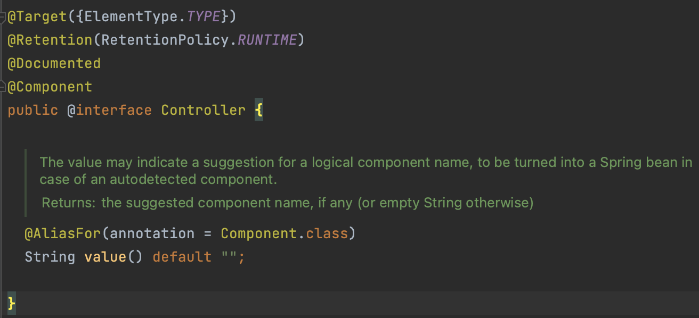
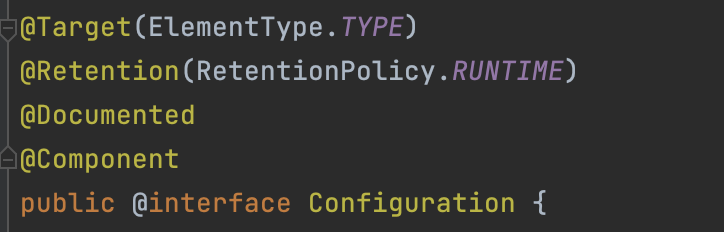

# Component Scan

## 컴포넌트 스캔이란?

- 스프링은 설정 정보 없이 스프링 빈을 자동으로 등록해주는 컴포넌트 스캔 기능을 제공한다.
- 등록할 클래스에 @Component를 붙여주고 `AppConfig` 파일에는 @Configuration과 @ComponentScan만 붙여주면 된다. 아래와 같이 말이다!

```java
public class Main {

    public static void main(String[] args) {
        final ApplicationContext ac = new AnnotationConfigApplicationContext(AppConfig.class);

        // Bean 호출
        final MyService myService = ac.getBean("myService", MyService.class);

        // 호출한 Bean의 메소드를 사용
        myService.method();
    }
}
```

```java
@Component
public class MyService {
    ...

    public void method() {
        ...
    }

    ...
}
```

```java
@Configuration
@ComponentScan
public class AppConfig {
    ...
}
```

- Bean으로 등록할 클래스에 `@Component`만 붙여주면 `@ComponentScan`은 `@Component`가 붙은 모든 객체를 찾아서 Bean으로 등록해준다.
- 로그를 확인해보면 Autowiring이라고 언급되어 있는데 의존 관계를 자동으로 주입해줌을 알 수 있다.

## 의존 관계 주입

- 컴포넌트 스캔으로 Bean을 등록하고 나면 의존 관계를 만들어야한다. 설정 파일에서 수동으로 의존 관계를 주입할 때는 직접 주입할 코드를 적어줘야했지만, 자동으로 Bean을 등록할 때는 `@Autowired`라는 어노테이션을 사용해야한다. 이 방법에도 4가지가 존재한다.
- 생성자 주입, 수정자 주입, 필드 주입, 일반 메소드 주입이 있다. ([자세한 내용 링크](./04_Dependency_Injection.md))
- @Autowired는 스프링 Bean이 아니라면 작동하지 않는다는 점을 유의하자.

<br/>

## 컴포넌트 스캔의 대상

- `@Component`를 포함해서 `@Component`가 붙어 있는 모든 어노테이션들 `@Controller`, `@Service`, `@Repository`, `@Configuration` 등이 스프링 컨테이너에 자동 등록된다.
- 아래 코드를 살펴보면 `@Controller` 어노테이션 인터페이스에 `@Component`가 붙어있는 것을 확인할 수 있다.



- `@Configuration`에도 당연히 붙어있다.



- 코드를 작성할 때 `@Component`를 사용하기보다는 사용 목적에 알맞게 아래 어노테이션을 적절히 사용하는 것이 좋다.
  - `@Controller`: 스프링 MVC 컨트롤러로 인식
  - `@Service`: 딱히 `@Component`와 다를 것이 없지만 개발자들이 코드를 봤을 때 핵심 비즈니스 계층이라는 구체적인 정보를 전달하기 위해 존재
  - `@Repository`: 스프링 데이터 접근 계층으로 인식, 해당 계층에서 발생하는 모든 예외는 `DataAccessException`으로 처리된다.
  - `@Configuration`: 스프링 설정 역할, Bean이 싱글톤이 되도록 보장, 스프링 컨테이너에서 Bean을 관리할 수 있도록 도와준다.

<br/>

## 참고자료

- [컴포넌트 스캔과 의존 관계 자동 주입](https://steady-coding.tistory.com/460)

- [핵심원리6 컴포넌트스캔](https://bangu4.tistory.com/295)
