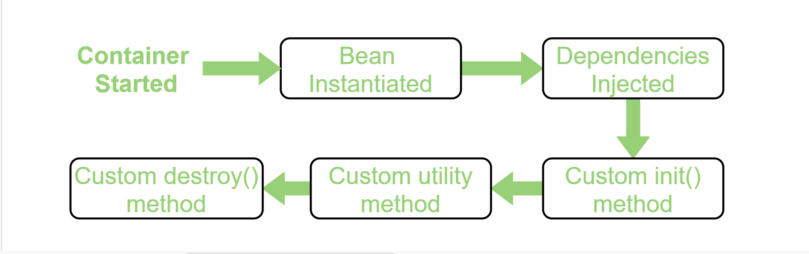

# Bean Life Cycle

## Java Bean Life Cycle



- 빈의 생명 주기는 아래와 같다.

  > 스프링 컨테이너 생성 -> 스프링 빈 생성 -> 의존 관계 주입 -> 초기화 콜백 -> 사용 -> 소멸전 콜백 -> 스프링 종료

- 컨테이너 생성과 스프링 빈 생성, 의존 관계 주입은 이전에 한 번 살펴봤지만, 초기화 콜백과 소멸 전 콜백은 무엇일까?

<br/>

## Bean 초기화 및 소멸 전 콜백

### 1. InitializingBean, DisposableBean 인터페이스 사용

- `InitializingBean` 에서는 `afterPropertiesSet()` 를 통해서 값이 초기화 된 후 실행되는 콜백 메소드를 가진다.
- `DisposableBean` 에서 `destroy()` 를 통해서, 빈 객체 소멸전 수행해주는 콜백 메소드를 지원한다.
- 아래와 같이 재정의해주면 Bean 초기화 및 소멸 전 콜백을 통해 Bean의 생명주기에 간섭할 수 있다.

```java
@Component
public class MyService implements InitializingBean, DisposableBean{
    ...

    public void method() {
        ...
    }

    ...

    @Override
    public void afterPropertiesSet() throws Exception {
        ...
    }

    @Override
    public void destroy() throws Exception {
        ...
    }
}
```

- 위 방법은 하지만 초기화와 소멸 메소드의 이름을 변경할 수 없고, 외부 라이브러리에 적용할 수 없다는 단점이 존재한다.

### 2. 설정 파일에 빈 등록 초기화, 소멸 메소드 지정

- 설정 파일에 빈등록 초기화, 소멸 메소드를 지정해줄 수 있다.
- 컴포넌트스캔 어노테이션이 붙은 설정 파일에서는 불가하고 수동 빈 등록일 때만 가능하다는 단점이 있다.
- destroyMethod는 설정하지 않아도 (inffered) 추론 기능이 있어 `close`, `shoutdown` 등의 종료 메소드가 있으면 찾아서 자동으로 호출해준다. (신기...)

```java
@Configuration
public class AppConfig {
    @Bean(initMethod = "init", destroyMethod = "close")
    public MyService myService() {
        return new MyService();
    }
}
```

- 위와 같이 초기화 메소드와 소멸 전 메소드를 정해줄 수 있다! (`MyService` 내에 있는 `init()`과 `close()`가 호출된다.)

### 3. @PostConstruct, @PreDestory 어노테이션 사용

- 컴포넌트 스캔을 사용하려면 `@PostConstruct(초기화 콜백)`, `@PreDestroy(소멸 전 콜백)` 어노테이션을 사용하면 된다.
- `javax.annotation` 패키지에 있는 자바표준이며, 최신 스프링에서 가장 권장하는 방법이라고 한다.

```java
@Component
public class MyService {
    ...

    public void method() {
        ...
    }

    ...

    @PostConstruct
    public void init() throws Exception {
        ...
    }

    @PreDestroy
    public void destroy() throws Exception {
        ...
    }
}
```

## 참고자료

- [Bean life cycle in Java Spring](https://www.geeksforgeeks.org/bean-life-cycle-in-java-spring/)

- [빈의 생명주기](https://steady-coding.tistory.com/461)

- [빈 생명주기 콜백에 대해서 알아보자](https://dev-coco.tistory.com/170)

- [핵심원리8 빈 생명주기](https://bangu4.tistory.com/301)
