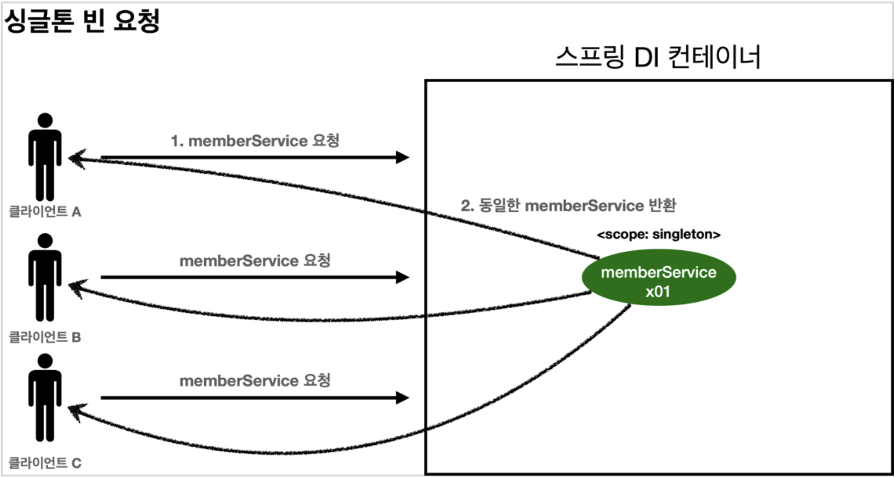
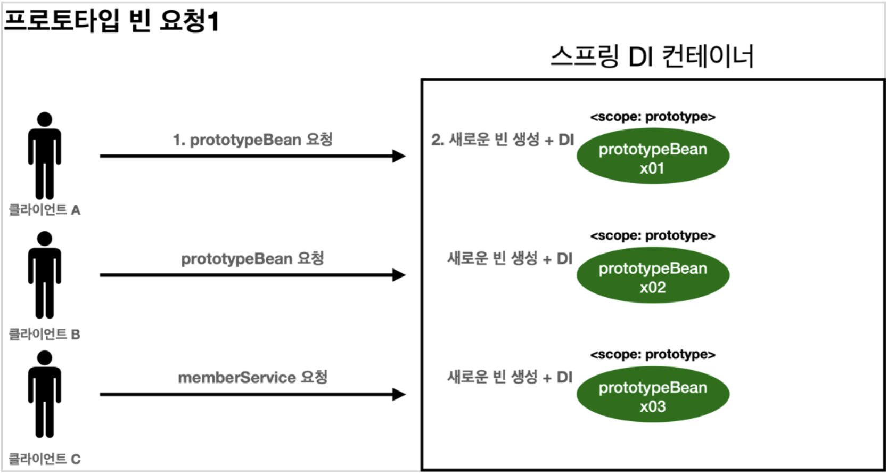
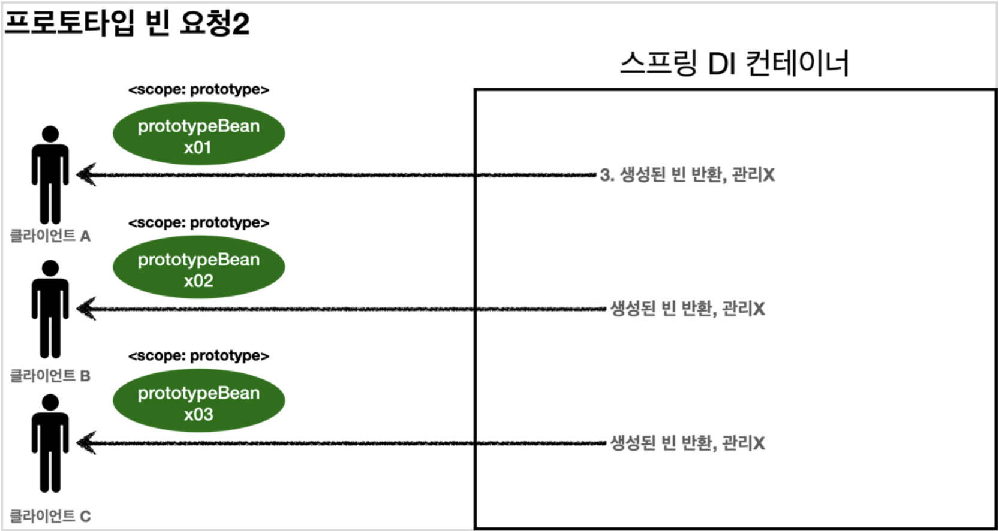
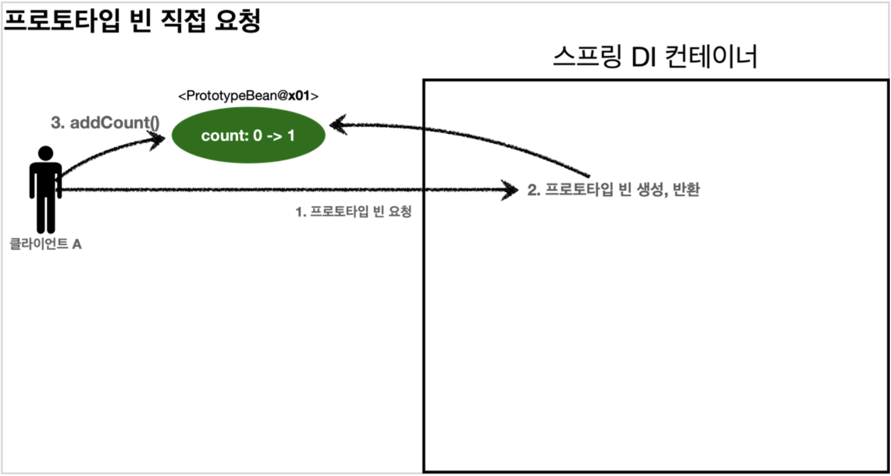
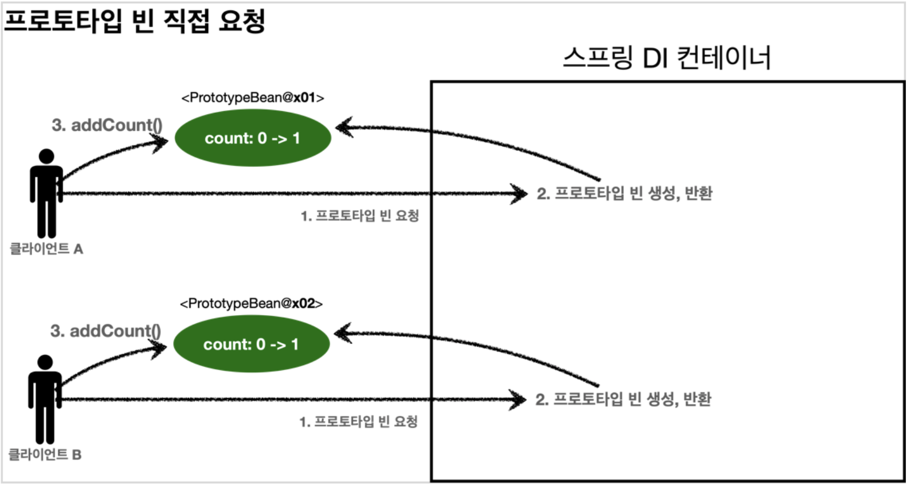
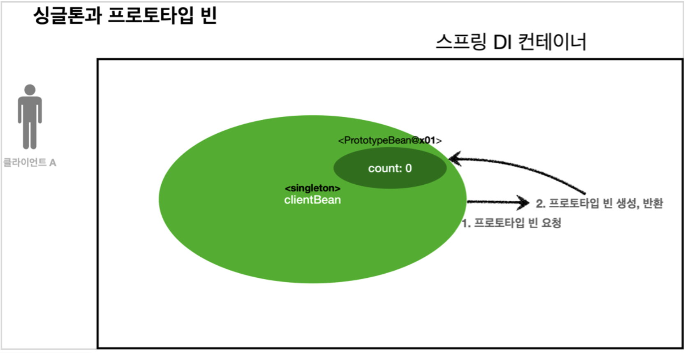
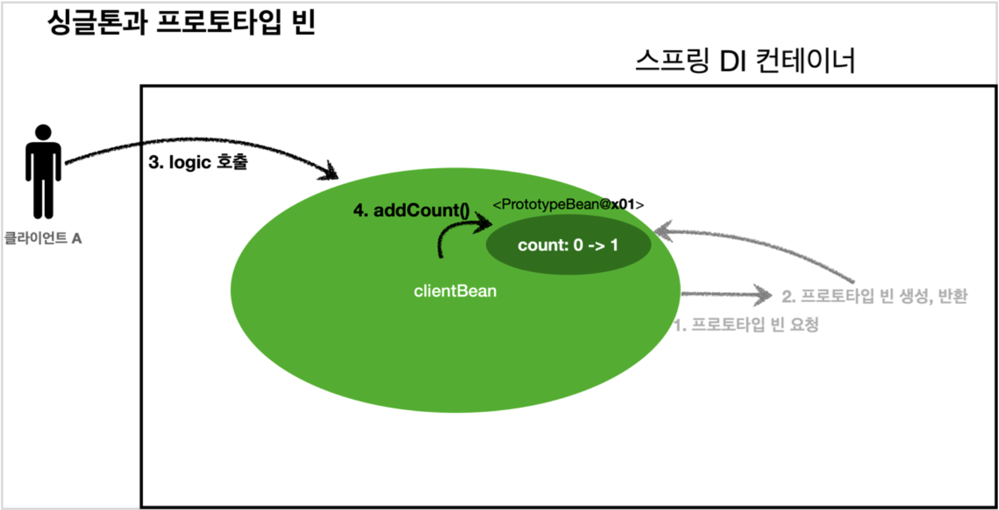
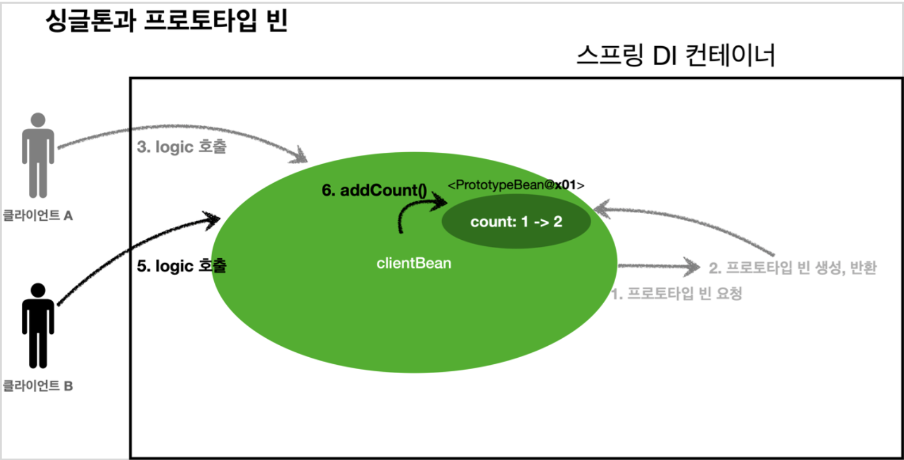
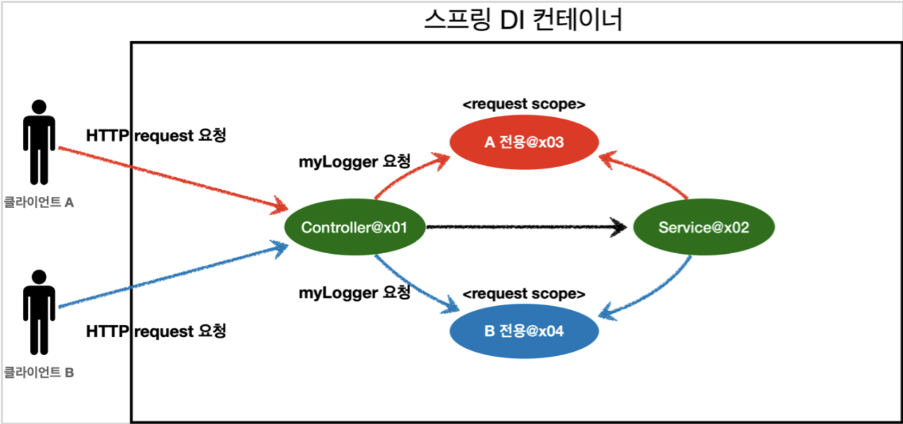

# Bean Scope

## Bean Scope란?

- 말 그대로 빈이 사용되는 범위이다. 앱을 구동하는 동안 빈이 한개만 만들어서 쓸 것인지 HTTP 요청마다 생성해서 사용할 것인지 등등을 결정하는 스코프이다.
- 보통의 스프링 빈은 스프링 앱이 구동될 때 한 번에 ApplicationContext에서 한 번에 모두 생성해 하나의 클래스는 한 개의 빈만 가진다. (Singleton 패턴)
- 하지만 HTTP 요청마다 다른 빈을 생성(Request)해서 사용하거나 아니면 매번 기능이 사용될 때마다 빈을 생성(Prototype)해 사용하는 등 설정이 가능하다.

### Bean Scope의 종류

<table>
    <tr>
        <th>Scope 종류</th>
        <th>설명</th>
    </tr>
    <tr>
        <td>singleton</td>
        <td>(기본값) 스프링 IoC 컨테이너 하나당 하나의 인스턴스만 사용, 기본 스코프, 스프링 컨테이너의 시작과 종료까지 유지되는 가장 넓은 범위의 스코프이다.</td>
    </tr>
        <td>prototype</td>
        <td>매번 새로운 빈을 정의해서 사용, 스프링 컨테이너는 프로토타입 빈의 생성과 의존관계 주입까지만 관여하고 더는 관리하지 않는 매우 짧은 범위의 스코프이다.</td>
    <tr>
        <td>request</td>
        <td>HTTP 요청이 들어오면 한 개의 빈을 생성해 사용하고, 나갈 때까지 유지된다. web-aware 컨텍스트에서만 사용 가능하다. (ex. ApplicationContext)</td>
    </tr>
        <td>session</td>
        <td>HTTP 세션마다 하나의 빈을 사용, web-aware 컨텍스트에서만 사용가능하다. (ex. ApplicationContext)</td>
    <tr>
        <td>application</td>
        <td>ServletContext 라이프사이클동안 하나의 빈만 생성해 사용, web-aware 컨텍스트에서만 사용 가능하다.</td>
    </tr>
    <tr>
        <td>websocket</td>
        <td>websocket 라이프사이클동안 하나의 빈을 생성해 사용, web-aware 컨텍스트에서만 사용하다.</td>
    </tr>
</table>

- 아래와 같이 작성하면 된다.
  - @Scope(value = "prototype")
  - @Scope(value = "singleton")
  - @Scope(value = "request")
  - @Scope(value = "session")
  - @Scope(value = "application")
  - @Scope(value = "websocket")

### 컴포넌트 스캔 자동 등록

```java
@Scope("prototype")
@Component
public class MyService {
    ...
}
```

### 수동 등록

```java
@Scope("prototype")
@Bean
PrototypeBean prototypeBean() {
    return new PrototypeBean();
}
```

<br/>

## 싱글톤과 프로토타입 스코프 비교

- 싱글톤 스코프의 빈을 조회하면 스프링 컨테이너는 항상 같은 인스턴스의 스프링 빈을 반환한다.
- 반면 프로토타입 스코프를 스프링 컨테이너에 조회하면 스프링 컨테이너는 항상 새로운 인스턴스를 생성해 반환한다.

### 스프링 빈 요청

1. 싱글톤 스코프의 빈을 스프링 컨테이너에 요청한다.
2. 스프링 컨테이너는 본인이 관리하는 스프링 빈을 반환한다.
3. 이후에 스프링 컨테이너에 같은 요청이 와도 같은 객체 인스턴스의 스프링 빈을 반환한다.



### 프로토타입 빈 요청

1. 프로토타입 스코프의 빈을 스프링 컨테이너에 요청한다.
2. 스프링 컨테이너는 이 시점에 프로토타입 빈을 생성하고, 필요한 의존관계를 주입한다.
3. 스프링 컨테이너는 생성한 프로토타입 빈을 클라이언트에게 반환한다.
4. 이후에 스프링 컨테이너에 같은 요청이 오면 항상 새로운 프로토타입 빈을 생성해서 반환한다.





- 스프링 컨테이너는 프로토타입 빈을 생성하고 의존 관계를 주입하며 초기화까지만 처리해준다.
- 클라이언트에 빈을 반환하고난 뒤에는 더이상 프로토타입 빈을 관리하지 않는다. 이 말인 즉슨, 프로토타입 빈을 관리할 책임은 프로토타입 빈을 받은 클라이언트에 있다는 말이다.
- `@PreDestroy`같은 종료 메소드가 호출되지 않는다.

<br/>

## 코드로 살펴보는 싱글톤 빈과 프로토타입 빈

### 싱글톤 빈 스코프

- `@Scope("singleton")`이 기본값이기 때문에 생략해도 된다.
- Bean을 AnnotationConfigApplicationContext의 파라미터로 넘겨주면 컴포넌트 스캔의 대상이 된다. 즉 `@Component` 어노테이션을 붙이지 않아도 된다는 말이다.

```java
public class SingletonTest {

    @Test
    void singletonBeanFind() {
        AnnotationConfigApplicationContext applicationContext = new AnnotationConfigApplicationContext(SingletonBean.class);
        SingletonBean singletonBean1 = applicationContext.getBean(SingletonBean.class);
        SingletonBean singletonBean2 = applicationContext.getBean(SingletonBean.class);
        Assertions.assertThat(singletonBean1).isSameAs(singletonBean2);
        System.out.println("singletonBean1 = " + singletonBean1);
        System.out.println("singletonBean2 = " + singletonBean2);
        applicationContext.close();
    }

    @Scope("singleton")
    static class SingletonBean {
        @PostConstruct
        public void init() {
            System.out.println("SingletonBean.init");
        }

        @PreDestroy
        public void destroy() {
            System.out.println("SingletonBean.close");
        }
    }
}
```

- 아래 로그를 살펴보면 다음과 같은 사실을 알 수 있다.
  1. 빈 초기화 메소드가 실행된다.
  2. 같은 인스턴스의 빈을 조회한다.
  3. 종료 메소드가 호출된다.

```log
SingletonBean.init
singletonBean1 = hello.core.scope.PrototypeTest$SingletonBean@96504afd
singletonBean2 = hello.core.scope.PrototypeTest$SingletonBean@96504afd
org.springframework.context.annotation.AnnotationConfigApplicationContext - Closing SingletonBean.destroy
```

### 프로토타입 빈 스코프

```java
public class PrototypeTest {

    @Test
    void prototypeBeanFind() {
        AnnotationConfigApplicationContext applicationContext = new AnnotationConfigApplicationContext(PrototypeBean.class);
        PrototypeBean prototypeBean1 = applicationContext.getBean(PrototypeBean.class);
        PrototypeBean prototypeBean2 = applicationContext.getBean(PrototypeBean.class);
        Assertions.assertThat(prototypeBean1).isNotSameAs(prototypeBean2);
        System.out.println("prototypeBean1 = " + prototypeBean1);
        System.out.println("prototypeBean2 = " + prototypeBean2);
        applicationContext.close();
    }

    @Scope("prototype")
    static class PrototypeBean {

        @PostConstruct
        public void init() {
            System.out.println("PrototypeBean.init");
        }

        @PreDestroy
        public void destroy() {
            System.out.println("PrototypeBean.destroy");
        }
    }
}
```

- 싱글톤 빈은 스프링 컨테이너 생성 시점에 초기화 메소드가 실행되는 반면, 프로토타입 스코프 빈은 스프링 컨테이너에서 빈을 조회할 때 생성되고 초기화 메소드가 실행된다.
- 프로토타입 빈을 2번 조회했기 때문에 초기화가 2번 실행되고, 인스턴스도 각각 생성되는 것을 확인할 수 있다.
- 싱글톤 스코프 빈은 스프링 컨테이너에서 관리하기 때문에 종료될 때 빈의 종료 메소드가 실행되는 것을 확인할 수 있었지만, 프로토타입 스코프 빈은 (생성, 의존관계 주입, 초기화 빼고는) 클라이언트가 관리해야하기 때문에 종료 메소드가 전혀 실행되지 않는 것을 확인할 수 있다. <u>그렇기 때문에 클라이언트가 종료 메소드 호출을 직접해야한다.</u>

```log
PrototypeBean.init
find prototypeBean2
PrototypeBean.init
prototypeBean1 = hello.core.scope.PrototypeTest$PrototypeBean@65a4592f
prototypeBean2 = hello.core.scope.PrototypeTest$PrototypeBean@252d7c71
org.springframework.context.annotation.AnnotationConfigApplicationContext - Closing
```

<br/>

## 프로토타입 스코프를 싱글톤 스코프와 함께 사용했을 때 생기는 문제

스프링 컨테이너에 프토토타입 스코프의 빈을 요청하면 항상 새로운 객체 인스턴스를 생성해서 반환한다. 하지만 싱글톤 빈과 함께 사용할 때는 의도한 대로 잘 동작하지 않으므로 신경써서 관리해줘야한다.

### 프로토타입 빈 직접 요청

1. 클라이언트 A가 스프링 컨테이너에 프로토타입 빈을 요청한다.
2. 스프링 컨테이너는 프로토타입 빈을 새로 생성해서 반환(`<PrototypeBean@x01>`)한다. 해당 빈의 count 필드 값은 0이다.
3. 클라이언튼는 조회한 프로토타입 빈에 addCount()를 호출하면서 count 필드에 1을 더한다.
4. 프로토타입 빈(`<PrototypeBean@x01>`)의 count는 1이 된다.



5. 클라이언트 B는 스프링 컨테이너에 프로토타입 빈을 요청한다.
6. 스프링 컨테이너는 프로토타입 빈을 새로 생성해 반환(`<PrototypeBean@x02>`)한다. 빈의 count 필드 값은 0이다.
7. 클라이언트는 조회한 프로토타입 빈에 addCount()를 호출해 count 필드에 1을 더한다.
8. 프로토타입 빈(`<PrototypeBean@x02>`)의 count는 1이 된다.



- 이 내용을 코드로 구현하면?

```java
public class SingletonWithPrototypeTest1 {

    @Test
    void prototypeFind() {
        AnnotationConfigApplicationContext applicationContext = new AnnotationConfigApplicationContext(PrototypeBean.class);
        PrototypeBean bean1 = applicationContext.getBean(PrototypeBean.class);
        bean1.addCount();
        Assertions.assertThat(bean1.getCount()).isEqualTo(1);

        PrototypeBean bean2 = applicationContext.getBean(PrototypeBean.class);
        bean2.addCount();
        Assertions.assertThat(bean2.getCount()).isEqualTo(1);
    }

    @Scope("prototype")
    static class PrototypeBean {
        private int count = 0;

        public void addCount() {
            count++;
        }

        public int getCount() {
            return count;
        }

        @PostConstruct
        public void init() {
            System.out.println("PrototypeBean.init " + this);
        }

        @PreDestroy
        public void destroy() {
            System.out.println("PrototypeBean.destroy " + this);
        }
    }
}
```

### 싱글톤 빈에서 프로토타입 빈 사용

1. `clientBean`은 싱글톤이므로 보통 스프링 컨테이너 생성 시점에 함께 생성되고 의존 관계 주입도 발생한다. 그러므로 `clientBean`은 의존관계를 자동 주입한다. 주입 시점에 스프링 컨테이너에 프로토타입 빈을 요청한다.
2. 스프링 컨테이너는 프로토타입 빈을 생성해서 `clientBean`에 반환한다. 프로토타입 빈의 count 필드 값은 0이다. `clientBean`은 프로토타입 빈을 내부 필드에 보관한다. (참조값 또는 주소값을 가지고 있는 것임)



3. 클라이언트 A는 `clientBean`을 스프링 컨테이너에 요청해서 받는다. 싱글톤이므로 항상 같은 `clientBean`이 반환된다.
4. `clientBean`은 `prototypeBean`의 `addCount()`를 호출해서 프로토타입 빈의 count를 증가시킨다. 고로 count가 1이 된다.



5. 클라이언트 B는 `clientBean`을 스프링 컨테이너에 요청해서 받는다. 싱글톤이므로 항상 같은 `clientBean`이 반환된다.
6. 여기서 주의! `clientBean`이 내부에 가지고 있는 프로토타입 빈은 이미 과거에 주입된 빈이므로 그 빈을 그대로 가지고 간다. 왜냐? 주입 시점에 스프링 컨테이너에 요청해서 프로토타입이 새로 생성된 것이지, 싱글톤 빈을 사용할 때마다 프로토타입을 생성하는 것은 아니기 때문이다. 심지어 프로토타입 빈을 destroy하지도 않았다.
7. 클라이언트 B는 `clientBean`은 `prototypeBean`의 `addCount()`를 호출하고 프로토타입 빈의 count를 1에서 2로 증가시킨다.



- 위 예시의 코드 내용

```java
public class SingletonWithPrototypeTest1 {

    @Test
    void prototypeFind() {
        AnnotationConfigApplicationContext applicationContext = new AnnotationConfigApplicationContext(PrototypeBean.class);
        PrototypeBean bean1 = applicationContext.getBean(PrototypeBean.class);
        bean1.addCount();
        assertThat(bean1.getCount()).isEqualTo(1);

        PrototypeBean bean2 = applicationContext.getBean(PrototypeBean.class);
        bean2.addCount();
        assertThat(bean2.getCount()).isEqualTo(1);
    }

    @Test
    void singletonClientUsePrototype() {
        AnnotationConfigApplicationContext applicationContext =
                new AnnotationConfigApplicationContext(ClientBean.class, PrototypeBean.class);
        ClientBean clientBean1 = applicationContext.getBean(ClientBean.class);
        int count1 = clientBean1.logic();
        assertThat(count1).isEqualTo(1);

        ClientBean clientBean2 = applicationContext.getBean(ClientBean.class);
        int count2 = clientBean2.logic();
        assertThat(count2).isEqualTo(2);
    }

    @Scope("singleton")
    static class ClientBean {
        final PrototypeBean prototypeBean;

        @Autowired
        public ClientBean(PrototypeBean prototypeBean) {
            this.prototypeBean = prototypeBean;
        }

        public int logic() {
            prototypeBean.addCount();
            return prototypeBean.getCount();
        }
    }

    @Scope("prototype")
    static class PrototypeBean {
        private int count = 0;

        public void addCount() {
            count++;
        }

        public int getCount() {
            return count;
        }

        @PostConstruct
        public void init() {
            System.out.println("PrototypeBean.init " + this);
        }

        @PreDestroy
        public void destroy() {
            System.out.println("PrototypeBean.destroy " + this);
        }
    }
}
```

### 여기서 문제

- 우리 원하는 것은 프로토타입 빈이 주입 시점에만 생성되는 것이 아니라 싱글톤 빈이 사용될 때마다 새로 생성해서 사용하는 것을 원할 것이다. 이 문제를 해결하려면 어떻게 해야할까??

<br/>

## 해결방안

### 스프링 컨테이너에 요청하라

- 가장 간단한 방법이다. 싱글톤 빈이 프로토타입 빈을 사용할 때마다 스프링 컨테이너에 새로 요청하는 방식이다.
- 의존관계를 외부에서 주입(DI)받는 것이 아닌 직접 탐색해 주입받는다. 이런 방식을 Dependency Lookup(DL), 즉, 의존관계 탐색(조회)이라고 한다.
- 그런데 이렇게 스프링의 애플리케이션 컨텍스트 전체를 주입받게 되면, 스프링 컨테이너에 종속적인 코드가 되고, 단위 테스트도 어려워진다.

```java
@Scope("singleton")
static class ClientBean {
    @Autowired
    AnnotationConfigApplicationContext applicationContext;

    public int logic() {
        PrototypeBean prototypeBean = applicationContext.getBean(PrototypeBean.class);
        prototypeBean.addCount();
        return prototypeBean.getCount();
    }
}
```

### ObjectFactory, ObjectProvider

- 지정한 빈을 컨테이너에서 대신 찾아주는 DL 서비스를 제공하는 객체가 있다. `ObjectProvider`다.
- `ObjectFactory`에 여러 편의 기능을 추가해 만들어진 도구이다.
- `clientBean`에서 `@Autowired`해서 가져와 사용할 수 있다. (**제네릭**이 포인트!)
- 실행하면 `prototypeBeanProvider.getObject()`를 통해 항상 새로운 프로토타입 빈이 생성된다. (DL)
- 스프링이 제공하는 기능을 사용하는 것이기 때문에 기능이 단순하므로 단위테스트를 만들거나 mock이 쉬워지는 장점이 있다.

```java
@Test
void singletonClientUsePrototype() {
    AnnotationConfigApplicationContext applicationContext =
            new AnnotationConfigApplicationContext(ClientBean.class, PrototypeBean.class);
    ClientBean clientBean1 = applicationContext.getBean(ClientBean.class);
    int count1 = clientBean1.logic();
    assertThat(count1).isEqualTo(1);

    ClientBean clientBean2 = applicationContext.getBean(ClientBean.class);
    int count2 = clientBean2.logic();
    assertThat(count2).isEqualTo(1);
}

@Scope("singleton")
static class ClientBean {
    @Autowired
    ObjectProvider<PrototypeBean> prototypeBeanProvider;

    public int logic() {
        PrototypeBean prototypeBean = prototypeBeanProvider.getObject();
        prototypeBean.addCount();
        return prototypeBean.getCount();
    }
}
```

### JSR-330 Provider

- `javax.inject.Provider`라는 JSR-330 자바 표준을 사용하는 방법이 있다. 이 방법을 사용하려면 `javax.inject:javax.inject:1` 의존성을 추가해줘야한다.
- 아래는 gradle 의존성 추가 방법

```groovy
implementation 'javax.inject:javax.inject:1'
```

- 아래 코드를 위에 제시했던 테스트로 실행해보면 `prototypeBeanProvider.get()`을 통해 매번 새로운 빈을 생성하는 것을 확인할 수 있다. (내부에서 스프링 컨테이너를 통해 해당 빈을 찾아서 반환해줌 - DL)
- 자바 표준 방식(스프링이 아닌 다른 컨테이너에서도 사용이 가능!)이고 단위테스트, mock 코드를 만들기 쉽다.

```java
@Scope("singleton")
static class ClientBean {
    @Autowired
    Provider<PrototypeBean> prototypeBeanProvider;

    public int logic() {
        PrototypeBean prototypeBean = prototypeBeanProvider.get();
        prototypeBean.addCount();
        return prototypeBean.getCount();
    }
}
```

- 스프링이 아닌 다른 컨테이너에서 DL을 사용해야한다면 강추! 그렇지 않다면 그냥 `ObjectProvider`를 사용하자.

### 기타

- 그 외에도 스프링에서 제공하는 `@Lookup` 어노테이션을 사용하는 방법이 있다고 한다.

<br/>

## 웹 스코프

- 웹 스코프는 웹 환경에서만 동작하는 녀석이다. 프로토타입과는 다르게 스프링이 해당 스코프의 종료 시점까지 관리한기 때문에 종료 메소드가 자동으로 호출된다는 특징이 있다.

### 웹 스코프의 종류

- **request**: HTTP 요청 사이클에 따라 생성 및 종료되는 스코프, HTTP 요청마다 별도의 빈 인스턴스가 생성되고 관리된다.
- **session**: HTTP Session과 동일 생명주기를 가진 스코프
- **application**: 서블릿 컨텍스트(`ServletContext`)와 동일한 생명주기를 가진 스코프
- **websocket**: 웹소켓과 생명주기를 함께하는 스코프

### Request 스코프

1. 클라이언트 A가 컨트롤러에 요청을 한다.
2. 컨트롤러가 Request Scope와 관련된 객체를 조회한다.
3. 클라이언트 A의 전용 객체가 만들어진다. (만약 2명의 클라이언트가 같은 HTTP 요청을 보내면 같은 객체의 인스턴스를 바로보게 한다.)



<br/>

## Request 스코프와 Provider 그리고 프록시

- 아래 자료의 마지막 목차를 보면 자세한 내용을 확인해볼 수 있다.
- [빈 스코프](https://velog.io/@lychee/%EC%8A%A4%ED%94%84%EB%A7%81-%ED%95%B5%EC%8B%AC-%EC%9B%90%EB%A6%AC-09.-%EB%B9%88-%EC%8A%A4%EC%BD%94%ED%94%84)

<br/>

## 참고자료

- 본 자료 출처: 김영한 스프링 핵심원리 강의

- [Bean 스코프](https://velog.io/@probsno/Bean-%EC%8A%A4%EC%BD%94%ED%94%84%EB%9E%80)

- [스프링 핵심 원리9-빈 스코프](https://velog.io/@lychee/%EC%8A%A4%ED%94%84%EB%A7%81-%ED%95%B5%EC%8B%AC-%EC%9B%90%EB%A6%AC-09.-%EB%B9%88-%EC%8A%A4%EC%BD%94%ED%94%84)

- [스프링 핵심 원리9-빈 스코프](https://hongchangsub.com/springcore9/)
