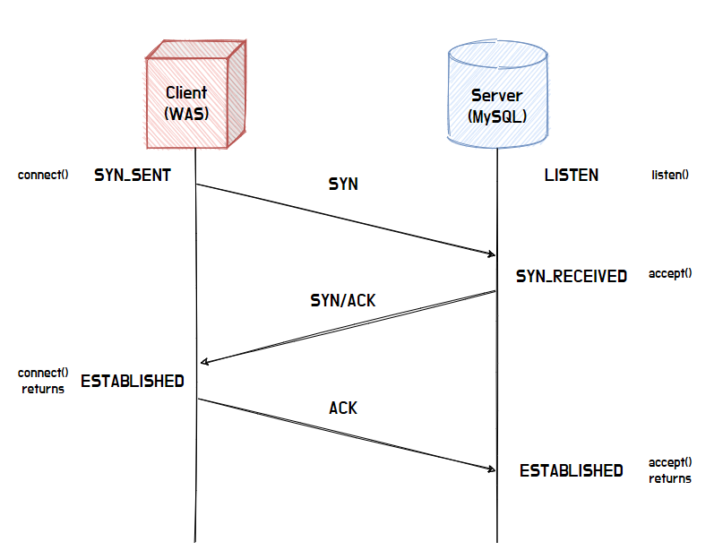

# DB Connection

## DB 커넥션의 프로토콜은 무엇인가?

- MySQL은 4가지 연결 방식을 지원한다. 

1. TCP/IP (모든 플랫폼 지원)
3. Unix socket file - Unix & Unix와 비슷한 시스템 전용
2. Named Pipe - Window 전용
4. Shared memory - Window 전용

- 스프링과 같은 애플리케이션은 보통 TCP/IP 연결을 사용한다!

- 보통 `INSERT`문을 실행하면 아래와 같은 비용이 든다고 한다.

> - Connecting: (3)
> - Sending query to server: (2)
> - Parsing query: (2)
> - Inserting row: (1 × size of row)
> - Inserting indexes: (1 × number of indexes)
> - Closing: (1)

# 참고 자료

- [공식문서: 프로토콜](https://dev.mysql.com/doc/refman/8.4/en/transport-protocols.html)
- [공식문서: INSERT 최적화](https://dev.mysql.com/doc/refman/8.0/en/insert-optimization.html)
- [Connection Pool](https://velog.io/@wkdwoo/Connection-Pool)
- [Database - MySQL #2](https://liferesetbutton.tistory.com/28)
- [[MySQL] MySQL 접속, 관리 프로그램](https://sacstory.tistory.com/entry/MySQL-MySQL-%EC%9B%8C%ED%81%AC%EB%B2%A4%EC%B2%98-%EB%8C%80%EC%B2%B4-%ED%94%84%EB%A1%9C%EA%B7%B8%EB%9E%A8)
