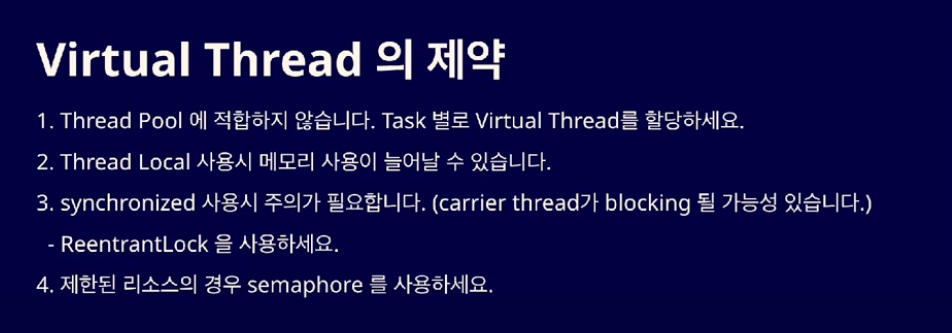
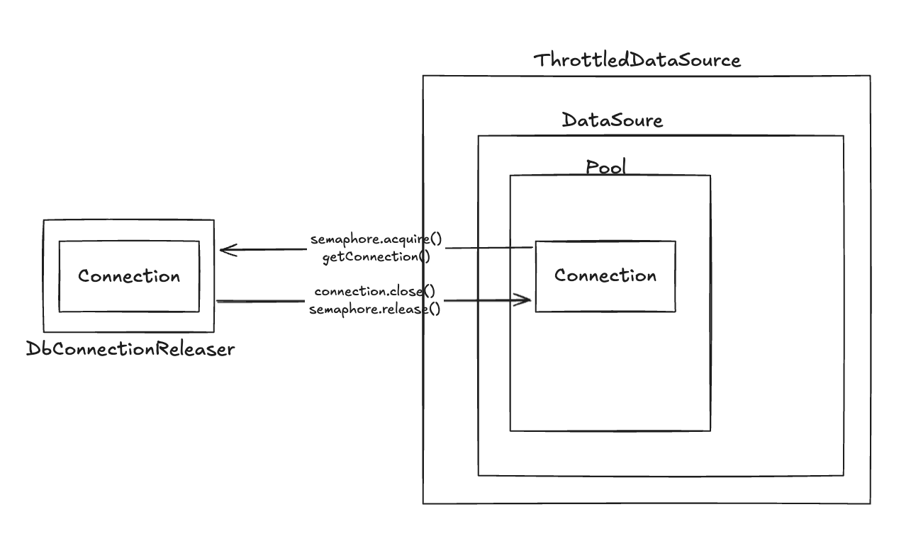
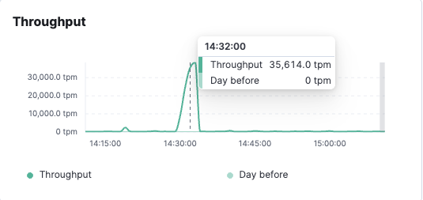

# DB Connection Semaphore

## 가상 스레드의 문제

- 가상 스레드의 가장 큰 장점이자 문제점. 요청이 들어오면 무제한으로 생긴다는 점.
  - Blocking I/O를 최소화할 수 있어서 좋지만.. 
  - 기존에 플랫폼 스레드의 동작 방식에 의한 Throttle이 안 되기 때문에 `Overwhelming` 현상(다량 요청에 의한 DB 커넥션 타임아웃 현상)이 발생할 수 있다.

- Throttle이 된다는 게 무슨 소리인가? 
  - 기존 톰캣의 HTTP Connector Pool은 최대 스레드 수가 제한되어 있어서 DB 커넥션 사용에 적절한 Waiting 유지가 가능했다.
  - 하지만 가상스레드를 톰캣 커넥터 풀에 적용하고 HTTP 요청을 다량으로 받으면, DB 커넥션을 풀에 대한 DB Connection 요청이 과다하게 요청되게 된다.

### Virtual Thread의 제약

- Kakao tech의 techmeet. "JDK 21의 신기능 Virtual Thread 알아보기" 발표에서는 아래와 같은 Virtual Thread의 제약 조건을 제시한다.



- DB Connection과 같이 제한된 리소를 사용할 때, 많은 양의 요청을 받으면 아래와 같은 에러를 마주할 수도 있다.

```
could not prepare statement [HikariCP-read - Connection is not available, request timed out after 14406ms.]
```

## 문제의 해결

- 자바에서 동시성을 처리해주는 `세마포어 Semaphore`를 사용하여 문제를 해결

### AOP 활용하기1 - HikariDataSource.getConnection()에 적용

```kotlin
@Pointcut("execution(* com.zaxxer.hikari..HikariDataSource.getConnection(..))")
fun hikariDataSource() = Unit

@Around("hikariDataSource()")
fun around(joinPoint: ProceedingJoinPoint): Any? {
  try {
    semaphore.acquire()
    return joinPoint.proceed()
  } finally {
      semaphore.release()
  }
}
```

- 이 방법은 굉장히 빈틈이 큰 방법이다.
  - 커넥션을 얻는 곳에만 `Semaphore`가 적용되어 있기 때문이다.
  - 따라서 사용을 권장하지 않는다.

### AOP 활용하기2 - `@Transactional`에 적용하기

- 그렇다면 커넥션을 반환하는 `@Transactional`을 기준으로 커넥션을 반환하면 되지 않을까?

```java
@Aspect
@Component
public class DbConnectionLimitAspect {

  private final Semaphore readSemaphore;
  private final Semaphore writeSemaphore;

  public DbConnectionLimitAspect(
      @Value("${spring.datasource.read.maximum-pool-size}") final int maxReadConnection,
      @Value("${spring.datasource.write.maximum-pool-size}") final int maxWriteConnection) {
    this.readSemaphore = new Semaphore(maxReadConnection);
    this.writeSemaphore = new Semaphore(maxWriteConnection);
  }

  @Around("@annotation(tx)")
  public Object around(ProceedingJoinPoint joinPoint, Transactional tx) throws Throwable {
    final Semaphore semaphore = tx.readOnly() ? readSemaphore : writeSemaphore;

    try {
      semaphore.tryAcquire();
      return joinPoint.proceed();
    } finally {
      semaphore.release();
    }
  }
}
```

- 하지만 이 방식 또한 빈틈이 있다.
- `@Transactional`이 안 달려 있는데, `Connection`을 요청하는 메소드는 커버가 안 된다. 

### 프록시 객체 만들기! - 권장하는 방법

- 아래의 요구사항을 충족시킬 수 있는 가장 좋은 방법이다.
1. `DataSource.getConnection()` 호출 시, `Semaphore` -1
2. `Connection.close()` 호출 시, `Semaphore` +1

- `DataSource`를 설정할 때 `HikariDataSource`를 감싸는 객체를 만들면 된다.

```java
public class ThrottledDataSource implements DataSource {

  private final DataSource dataSource;
  private final Semaphore semaphore;

  public ThrottledDataSource(final DataSource dataSource, final int maximumPoolSize) {
    this.dataSource = dataSource;
    this.semaphore = new Semaphore(maximumPoolSize);
  }

  @Override
  public Connection getConnection() throws SQLException {
    try {
      semaphore.acquire();
      return new DbConnectionReleaser(dataSource.getConnection(), semaphore);
    } catch (InterruptedException e) {
      throw new RuntimeException(e);
    }
  }

  // HikariCP에서 제공하지 않는 기능이라 HikariCP 쪽으로 바로 넘김
  // 해당 메소드를 호출하면 SQLFeatureNotSupportedException 에러가 기다리고 있음.
  @Override
  public Connection getConnection(final String username, final String password)
          throws SQLException {
    return dataSource.getConnection(username, password);
  }
  
  // .. 나머지는 dataSource에 위임
}
```

- 자원 반환 로직을 구현하기 위해 `Connection` 객체 또한 감싸서 만들 것이다.

```java
public class DbConnectionReleaser implements Connection {

  private final Connection delegate;
  private final Semaphore semaphore;

  public DbConnectionReleaser(final Connection delegate, final Semaphore semaphore) {
    this.delegate = delegate;
    this.semaphore = semaphore;
  }

  @Override
  public void close() throws SQLException {
    try {
      delegate.close();
    } finally {
      semaphore.release();
    }
  }

  // ... 나머지는 delegate 호출
}
```

- `DataSourceConfig`를 작성할 때 `ThrottledHikariDataSource`를 사용해 `DataSource`를 만들어 `Bean`으로 등록해주면 된다!

```java
@Bean
@ConfigurationProperties(prefix = "spring.datasource.write")
public HikariConfig writeHikariConfig() {
  return new HikariConfig();
}

@Bean
public DataSource writeDataSource(final HikariConfig writeHikariConfig) {
  HikariDataSource dataSource = new HikariDataSource(writeHikariConfig);
  return new ThrottledDataSource(dataSource, writeHikariConfig.getMaximumPoolSize());
}

@Bean
@ConfigurationProperties(prefix = "spring.datasource.read")
public HikariConfig readHikariConfig() {
  return new HikariConfig();
}

@Bean
public DataSource readDataSource(final HikariConfig readHikariConfig) {
  HikariDataSource dataSource = new HikariDataSource(readHikariConfig);
  return new ThrottledDataSource(dataSource, readHikariConfig.getMaximumPoolSize());
}
```

- 그림으로 구성해보면 아래와 같다.



### Fair Semaphore와의 차이?

- 기아 상태를 피하기 위해 Fair Semaphore를 사용할 수 있지만, 순서를 보장하기 위해 따로 관리가 필요하기 때문에 약간 느릴 수 있다.
- 아래와 같이 2번째 인자에 true 값을 넣어주는 걸로 `FairSync`를 사용하게 만들 수 있다. 

```java
new Semaphore(maximumPoolSize, true);
```

---

# Connector/J와 Virtual Thread

##  mysql jdbc의 문제

- mysql jdbc를 지원하는 `Connector/J`의 `connectionImpl` 클래스를 보면 `synchronized` 천지라서 스레드 피닝이 발생한다고 함.

### 스레드 피닝이란?

- `synchronized` 사용시 Virtual Thread에 연결된 Carrier Thread가 `Blocking` 될 수 있다고 한다.
  - 이때의 블로킹 현상을 `pinning`이라고 한다.
- 그래서 가상 스레드를 사용한다면 `synchronized`보다는 `ReentrantLock`을 사용하길 권장한다.
- 그런데 문제는 라이브러리에서 `synchronized`를 사용하면 스레드 피닝이 발생한다는 것이다.
  - 문제의 라이브러리 ex) mysql jdbc

### MySQL에서는 과연 가상 스레드를 지원하지 않을까?

- `MySQL Connector/J 9.0.0` 버전 이상으로 업그레이드를 진행하면 된다.
- `9.0.0` 버전의 릴리스 노트를 보면 아래와 같이 적혀있다.

> #### 참고
> - Functionality Added or Changed
>   - Synchronized blocks in the Connector/J code were replaced with ReentrantLocks. This allows carrier threads to unmount virtual threads when they are waiting on IO operations, making Connector/J virtual-thread friendly. Thanks to Bart De Neuter and Janick Reynders for contributing to this patch. (Bug #110512, Bug #35223851)

- `Connector/J`는 스레드 피닝을 없애기 위해 `synchronized`를 `ReentrantLock`으로 대체하는 작업을 진행했다.
- 아래와 같이 `Connector/J` 의존성을 9.0.0 버전 이상으로 설정해주자.

```kotlin
implementation("com.mysql:mysql-connector-j:9.0.0")
```

### Connector/J와 MySQL의 호환성

- [Compatibility with MySQL and Java Versions](https://dev.mysql.com/doc/connector-j/en/connector-j-versions.html)

> - MySQL Server versions: Connector/J 9.2 supports MySQL 8.0 and up.

- MySQL 8.0 버전 이상이기만 하면 9.2로 업그레이드가 가능하다.

----

## 성과?

- 서버 애플리케이션 파드 하나만으로도 꽤 많은 QPS를 처리



---

# 참고자료

- [JDK 21의 신기능 Virtual Thread 알아보기](https://www.youtube.com/watch?v=vQP6Rs-ywlQ)
- [Virtual Thread & Hikari & Semaphore](https://blo-gu.tistory.com/55)
- [MySQL 공식문서 - Connector/J 9.0.0 Release Note](https://dev.mysql.com/doc/relnotes/connector-j/en/news-9-0-0.html)
