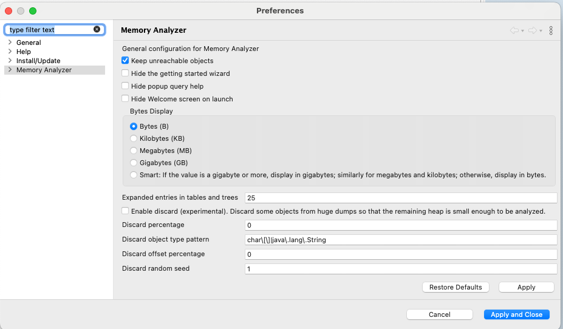

# DB Connection Leak

- 갑자기 OOM으로 Pod가 죽는다면?
- Memory Leak을 의심해봐야 한다. Heap Dump를 떠서 확인해보는 방법이 가장 좋다.
- 하지만 원인을 바로 파악하기 위해선 DashBoard가 있는 편이 좋다.

## 대시보드 준비!

- Heap Memory와 NonHeap Memory 영역, 그리고 GC와 관련된 영역을 기본적으로 대시보드에 추가하는 것이 좋다.
- 특히 GC 영역에 대한 대시보드 설정을 까다롭다.
  - `jvm_memory_max`, `jvm_memory_used`, `jvm_memory_committed`에 대해 값을 설정해야 하고,
  - `labels.id` 조건을 `labels.id:"Survivor Space"`, `labels.id:"Eden Space"`, `labels.id:"Tenured Gen"`에 걸어줘야 한다.

- Formula 예시

```
average(jvm_memory_max, kql='labels.id:"Survivor Space"  and labels.area:"heap"')
average(jvm_memory_used, kql='labels.id:"Survivor Space"  and labels.area:"heap"')
average(jvm_memory_committed, kql='labels.id:"Survivor Space"  and labels.area:"heap"')
```

## 대시보드를 통해 파악한 원인은?

- Heap 메모리와 Non Heap 메모리가 우상향하는 것을 볼 수 있었다.


- 예전에는 Heap 메모리의 최대치가 약 600,000,000Byte(600MB)였기 때문에 `OOM, Out of Memory`으로 파드가 죽고, 재실행된 적이 있었다.
  - 위의 수치를 봐도 Max 값이 600MB를 넘은 것을 알 수 있다. 메모리를 늘리기 전이었다면 파드가 죽었을 것이다.


- 문제는 `Old Gen`으로 보인다. Heap Memory 그래프와 동일하게 움직인다.
  - `Survivor`나 `Eden`은 우상향하지 않으나, `Old Gen`이 지속적으로 우상향한다는 사실을 확인할 수 있었다.

## Heap Dump 파일 생성하기

- 방법은 간단하다. JVM에 접속해 `jmap -dump` 명령어를 실행하면 된다.

```shell
$ jmap -dump:format=b,file=<파일경로> <pid>
```

- 예시

```shell
$ jmap -dump:format=b,file=/tmp/heapdump.hprof 1
```

- 해석
  - `-dump`: `jmap` 명령어에서 힙 덤프를 생성하는 명령
  - `format=b`: 덤프 파일을 바이너리 형식으로 생성(필수 옵션)
  - `file=<파일경로>`: 생성할 힙 덤프 파일 경로
  - `<pid>`: 힙 덤프를 생성할 JVM 프로세스의 ID. 예시의 `1`은 해당 JVM 프로세스의 PID(Process ID)를 뜻한다. 

> #### 주의사항
> - `jmap` 명령어를 사용해 heap dump를 생성하면 Java 프로세스가 아예 멈추게 된다.  따라서 운영 중인 시스템에서 이 파일을 생성하면 안 된다!
> - 쿠버네티스를 사용한다면 heap dump 파일을 생성할 pod로 로드밸런싱되지 않게 막아 놓고 덤프 파일을 생성하는 식으로 작업을 진행할 수 있다.


## Heap Dump 확인

- 이제 Heap Dump를 확인할 수 있는 Memory Analyzer가 필요하다.  
- 이때 사용할 수 있는 도구가 [eclipse memory analyzer](https://eclipse.dev/mat/)이다.
- MacOS를 사용하고 있다면 `homebrew`를 통해 쉽게 설치할 수 있다.

```shell
$ brew install --cask memoryanalyzer
```

> #### > 참고
> - 분석을 실행하기 전에 먼저 `Keep unreachable objects` 설정을 켜주자!
> 

- 이제 생성한 Heap Dump 파일을 통해 분석을 실행해보자.
- (참고로 아래의 예시는 파드가 실행된지 얼마 안 됐기 때문에 Leak이 적은 상태라고 보면 된다.)


- 그리고 아래와 같은 메시지를 확인할 수 있었다.

```shell
The class com.mysql.cj.jdbc.AbandonedConnectionCleanupThread, loaded by org.springframework.boot.loader.launch.LaunchedClassLoader @ 0xd9b11d28, occupies 19,208,416 (12.88%) bytes. The memory is accumulated in one instance of java.util.concurrent.ConcurrentHashMap$Node[], loaded by <system class loader>, which occupies 19,208,008 (12.88%) bytes.

Thread java.lang.Thread @ 0xdb5127b0 mysql-cj-abandoned-connection-cleanup has a local variable or reference to com.mysql.cj.jdbc.AbandonedConnectionCleanupThread @ 0xdb512860 which is on the shortest path to java.util.concurrent.ConcurrentHashMap$Node[2048] @ 0xe3dde298. The thread java.lang.Thread @ 0xdb5127b0 mysql-cj-abandoned-connection-cleanup keeps local variables with total size 264 (0.00%) bytes.

Significant stack frames and local variables

com.mysql.cj.jdbc.AbandonedConnectionCleanupThread.run()V (AbandonedConnectionCleanupThread.java:91)
com.mysql.cj.jdbc.AbandonedConnectionCleanupThread @ 0xdb512860 retains 16 (0.00%) bytes
java.util.concurrent.ThreadPoolExecutor.runWorker(Ljava/util/concurrent/ThreadPoolExecutor$Worker;)V (ThreadPoolExecutor.java:1144)
com.mysql.cj.jdbc.AbandonedConnectionCleanupThread @ 0xdb512860 retains 16 (0.00%) bytes
The stacktrace of this Thread is available. See stacktrace. See stacktrace with involved local variables.

Keywords

com.mysql.cj.jdbc.AbandonedConnectionCleanupThread
org.springframework.boot.loader.launch.LaunchedClassLoader
java.util.concurrent.ConcurrentHashMap$Node[]
com.mysql.cj.jdbc.AbandonedConnectionCleanupThread.run()V
AbandonedConnectionCleanupThread.java:91
java.util.concurrent.ThreadPoolExecutor.runWorker(Ljava/util/concurrent/ThreadPoolExecutor$Worker;)V
ThreadPoolExecutor.java:1144
```

## Connection의 생명주기

### Connection 생성

- Connection이 생성되면 `AbandonedConnectionCleanupThread`에 의해 `PhantomReference` 인스턴스가 생성되어 connectionFinalizerPhantomRefs에 보관한다.
- `PhantomReference`를 생성하는 이유는 `AbandonedConnectionCleanupThread`에서 Connection이 GC에게 수거되기 전에 네트워크 리소스를 지워주기 위함이다.
- `AbandonedConnectionCleanupThread`의 `trackConnection()` 메소드에서 `ConnectionFinalizerPhantomReference`를 생성할 때, Connection과 io(네트워크 리소스), referenceQueue를 넣어주면서 인스턴스를 만들게 된다.

### Connection 종료

- Connection이 종료되면 HikariCP에서 직접 Connection을 참조하던 부분이 끊기게 되고 Connection 객체는 Phantomly Reachable 상태가 된다.

> #### 참고: Phantomly Reachable 상태
> - GC가 Root에서 직접 접근하지 못하고 `PhantomReference`로 접근 가능한 상태

- GC가 동작하면 Phantomly Reachable 객체를 탐지한 후 `finalize()`하고 `PhantomReference`를 생성할 때 같이 넣어주었던 `ReferenceQueue`에 `enqueue()`를 한다.
- `AbandonedConnectionCleanupThread`는 내부에서 실행되는 백그라운드 스레드다.
  - `ReferenceQueue`를 계속해서 polling(`remove()`)하며 `enqueue()`된 `PhantomReference` 가져와 `finalizeResource()`를 실행한다.

```java
public class AbandonedConnectionCleanupThread implements Runnable {

  // ...
  private static final ExecutorService cleanupThreadExecutorService;
  // ...

  public void run() {
    while (true) {
      try {
        this.checkThreadContextClassLoader();
        Reference<? extends MysqlConnection> reference = referenceQueue.remove(5000L);
        if (reference != null) {
          finalizeResource((ConnectionFinalizerPhantomReference) reference);
        }
      } catch (InterruptedException var8) {
        threadRefLock.lock();

        try {
          threadRef = null;

          Reference<? extends MysqlConnection> reference;
          while ((reference = referenceQueue.poll()) != null) {
            finalizeResource((ConnectionFinalizerPhantomReference) reference);
          }

          connectionFinalizerPhantomRefs.clear();
        } finally {
          threadRefLock.unlock();
        }

        return;
      } catch (Exception var9) {
      }
    }
  }

  // ...
}
```

### 문제 원인

- `AbandonedConnectionCleanupThread`는 `newSingleThreadExecutor`에 의해 단일 스레드로 실행된다.

```java
public class AbandonedConnectionCleanupThread implements Runnable {
  
  // ...
  
  static {
    if (abandonedConnectionCleanupDisabled) {
      cleanupThreadExecutorService = null;
    } else {
      cleanupThreadExecutorService = Executors.newSingleThreadExecutor((r) -> {
        Thread t = new Thread(r, "mysql-cj-abandoned-connection-cleanup");
        t.setDaemon(true);
        ClassLoader classLoader = AbandonedConnectionCleanupThread.class.getClassLoader();
        if (classLoader == null) {
          classLoader = ClassLoader.getSystemClassLoader();
        }

        t.setContextClassLoader(classLoader);
        threadRef = t;
        return t;
      });
      cleanupThreadExecutorService.execute(new AbandonedConnectionCleanupThread());
    }

  }
}
```

- 그리고 한 번에 한 개의 Reference를 꺼내와 네트워크 자원을 종료해준다.
  - 네트워크 자원 종료는 클라이언트와 서버 간의 TCP/IP 소켓 연결을 확인하기 때문에 네트워크 환경에 따라 병목이 생길 수 있다.

### 해결하는 방법?

- mysql-connector-j 8.0.22 버전 이상부터 `AbandonedConnectionCleanupThread`를 비활성화 하는 옵션이 추가되었다.
- 자바 실행 옵션에서 아래의 명령어만 추가해주면 된다.

```shell
-Dcom.mysql.cj.disableAbandonedConnectionCleanup=true
```

## Remainder가 너무 크다면?

- 애플리케이션에서 메모리를 과도하게 사용하고 있다는 신호일 수 있다.
- 이때는 객체의 개수, 메모리 점유율 상위 객체, GC에 의해 해제되지 않는 오래된 객체를 확인해야 한다.


# 참고자료

- [도움이 될수도 있는 JVM memory leak 이야기](https://techblog.woowahan.com/2628/)
- [99%가 모른다는 DB Connection 누수 문제](https://helloworld.kurly.com/blog/connection-leak/)
- [Java Reference와 GC](https://d2.naver.com/helloworld/329631)
