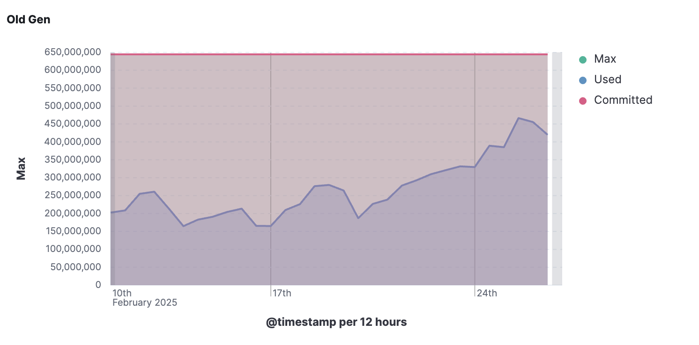
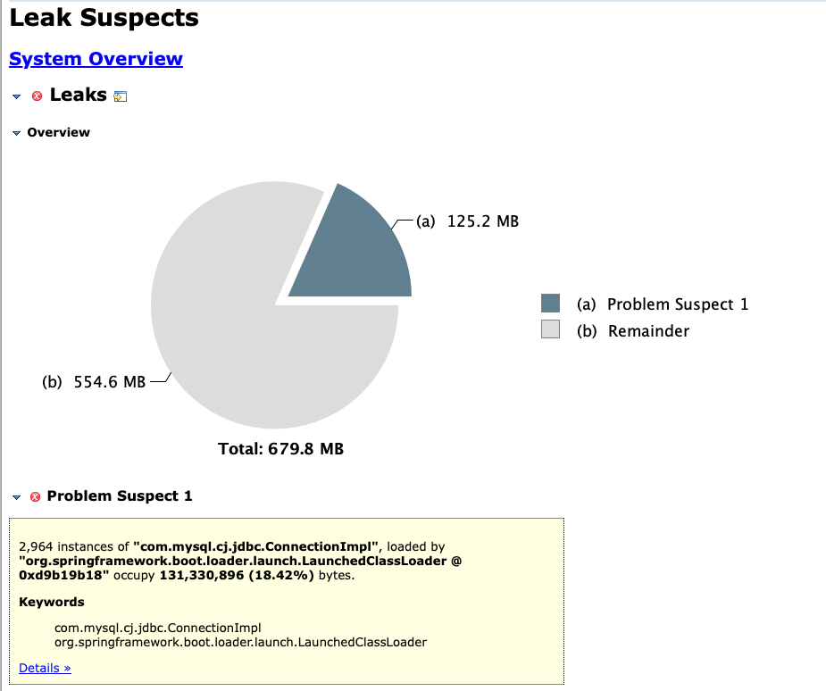

# ConnectionImpl Leak

- 갑자기 Old Gen의 메모리 사용량이 급격히 늘어난 것을 확인



## Heap dump를 통한 메모리 확인




```
2,964 instances of com.mysql.cj.jdbc.ConnectionImpl, loaded by org.springframework.boot.loader.launch.LaunchedClassLoader @ 0xd9b19b18 occupy 131,330,896 (18.42%) bytes.

Keywords

com.mysql.cj.jdbc.ConnectionImpl
org.springframework.boot.loader.launch.LaunchedClassLoader
```

## 문제 원인 분석

- HikariCP 풀을 관리하고 있음에도 불구하고, com.mysql.cj.jdbc.ConnectionImpl 객체가 누적되고 있다.
  - 이는 커넥션이 닫히지 않고 계속 유지되고 있는 문제일 수 있다.

## 싱글톤 EntityManager는 Thread-safe하지 않다.

```java
@Configuration
@EnableJpaAuditing
@RequiredArgsConstructor
@EntityScan(basePackages = "com.mypackage")
@EnableJpaRepositories(basePackages = "com.mypackage")
public class JpaConfig {

  private final EntityManager entityManager;

  @Bean
  public JPAQueryFactory jpaQueryFactory() {
    return new JPAQueryFactory(JPQLTemplates.DEFAULT, entityManager);
  }
}
```

- 혹은 아래와 같이 `@Autowired`를 사용했다면?

```java
@Autowired
private EntityManager entityManager;
```

- `EntityManager`가 기본적으로 Thread-Safe하지 않기 때문에 여러 커넥션에서 같은 `EntityManager`에 접근하여 문제가 생길 수 있다.
  - ex) `Connection.close()`가 제대로 작동하지 않는다던가?
- 아래와 같이 `@PersistenceContext`를 사용하는 것을 권장.

```java
public class JpaConfig {

  @PersistenceContext private EntityManager entityManager;

  @Bean
  public JPAQueryFactory jpaQueryFactory() {
    return new JPAQueryFactory(JPQLTemplates.DEFAULT, entityManager);
  }
}
```

- 그런데 스프링부트 최신 버전에서는 `@Autowired`로 주입하더라도 싱글톤이 아닌 Proxy EntityManager가 주입된다는 정보가 있다.
  - `@PersistenceContext`로 해놓고 지속적인 모니터링 필요...

# 참고자료

- [JPA/Hibernate Persistence Context](https://www.baeldung.com/jpa-hibernate-persistence-context)
- [EntityManager를 주입할 때 @PersistContext 대신 @Autowired 를 사용하면 안될까?](https://velog.io/@biddan606/EntityManager%EB%A5%BC-%EC%A3%BC%EC%9E%85%ED%95%A0-%EB%95%8C-Autowired-vs-PersistContext)
- [HikariCP의 커넥션 maxLifetime과 MySQL wait timeout간의 관계 알아보기!](https://seongonion.tistory.com/157)
- [HikariCP와 커넥션 누수(Connection Leak) 관련 트러블슈팅](https://do-study.tistory.com/97)
