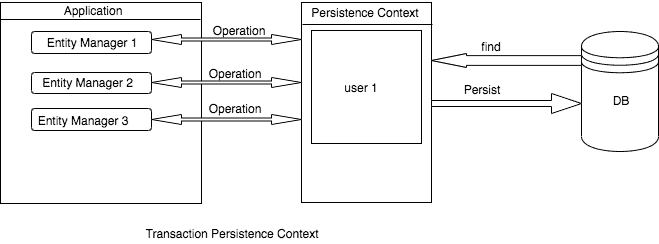
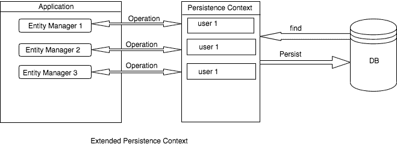

# EntityManager

> `EntityManager`의 인스턴스는 `영속성 컨텍스트 Persistence Context`와 연결된다. 영속성 컨텍스트는 각 영속적인 Entity Id 값을 키로 고유한 엔티티 인스턴스가 존재하는 엔티티 인스턴스의 집합이다. 영속성 컨텍스트 내에서는 엔티티 인스턴스의 생명주기를 관리하며, `EntityMangager`의 API는 영속적인 엔티티 인스턴스를 생성하고 제거하며, 기본 키를 통해 엔티티를 찾고, 엔티티들에 대해 쿼리를 수행하는 데 사용된다. 

## 1. Transaction 범위의 영속성 컨텍스트

- 트랜잭션의 시작과 끝과 함께 한다.
  - 트랜잭션이 끝나면 영속성 컨텍스트의 내용을 Persistence Storage(DB)로 flush한다.



- 트랜잭션 내에서 어떤 작업을 수행할 때, `EntityManager`는 영속성 컨텍스트를 확인하며, 만약 영속성 컨텍스트가 존재하면 그것을 사용하고, 그렇지 않으면 새 영속성 컨텍스트를 생성한다.
- 기본 영속성 컨텍스트 타입은 `PersistenceContextType.TRANSACTION`이다. `EntityManager`에게 트랜잭션 영속성 컨텍스트를 사용하도록 하려면, `@PersistenceContext` 어노테이션을 달아줘야 한다.

## 2. 확장된 범위의 영속성 컨텍스트

- 여러 트랜잭션에 걸쳐 지속되는 영속성 컨텍스트를 의미한다.
- 트랜잭션 없이 엔티티를 영속화할 수 있지만, 트랜잭션 없이 flush를 할 수는 없다.



- 아래와 같이 영속성 컨텍스트 타입은 `PersistenceContextType.EXTENDED`이며, `@PersistenceContext(type = PersistenceContextType.EXTENDED)`를 `EntityManager`에 어노테이션으로 달아줘야 한다.

## EntityManager의 동시성 문제

- `EntityManager`를 아래와 같이 `@Autowired`로 받게 되면 싱글톤 `EntityManager`를 받게 되고, 이는 곧 동시성 문제로 이어지게 된다.
  - 그런데 최신 스프링부트 버전에서는 프록시를 주입해주는 것 같다는 정보가..?

```java
@Autowired
private EntityManager em;
```

- 따라서 `EntityManager`를 주입할 때는 `@PersistenceContext`를 사용해야 한다.
  - `@PersistenceContext`를 사용하는 방식을 실제 로그를 찍어보면 서로 다른 `EntityManager`를 사용한다는 사실을 발견할 수 있을 것이다.

# 참고자료

- [Interface EntityManager](https://docs.oracle.com/javaee/7/api/javax/persistence/EntityManager.html)
- [JPA/Hibernate Persistence Context](https://www.baeldung.com/jpa-hibernate-persistence-context)
- [EntityManager를 주입할 때 @PersistContext 대신 @Autowired 를 사용하면 안될까?](https://velog.io/@biddan606/EntityManager%EB%A5%BC-%EC%A3%BC%EC%9E%85%ED%95%A0-%EB%95%8C-Autowired-vs-PersistContext)
- [안녕하세요, EntityManager에 대해 궁금한 점이 있어 질문 남깁니다.](https://www.inflearn.com/community/questions/158967/%EC%95%88%EB%85%95%ED%95%98%EC%84%B8%EC%9A%94-entitymanager%EC%97%90-%EB%8C%80%ED%95%B4-%EA%B6%81%EA%B8%88%ED%95%9C-%EC%A0%90%EC%9D%B4-%EC%9E%88%EC%96%B4-%EC%A7%88%EB%AC%B8-%EB%82%A8%EA%B9%81%EB%8B%88%EB%8B%A4)
