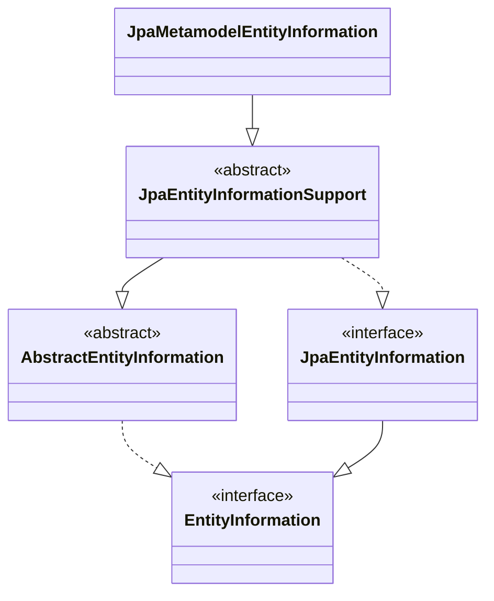

# Entity

## Spring Data JPA에서 새로운 Entity인지 판단하는 방법

- JPA에서 새로운 entity인지 판단하는 여부는 `isNew(T entity)`에 의해 결정된다.
- 별다른 설정이 없으면 `JpaEntityInformation`의 구현체 중 `JpaMetamodelEntityInformation`를 사용한다.

```java
public class JpaMetamodelEntityInformation<T, ID> extends JpaEntityInformationSupport<T, ID> {

  // ...
  
  @Override
  public boolean isNew(T entity) {

    if (!versionAttribute.isPresent()
        || versionAttribute.map(Attribute::getJavaType).map(Class::isPrimitive).orElse(false)) {
      return super.isNew(entity);
    }

    BeanWrapper wrapper = new DirectFieldAccessFallbackBeanWrapper(entity);

    return versionAttribute.map(it -> wrapper.getPropertyValue(it.getName()) == null).orElse(true);
  }
}
```



- 위 코드에서 `super.isNew(entity)` 부분이 `AbstractEntityInformation`의 `isNew()`를 호출하는 부분이다.
- 결국 `@Version`이 사용된 필드가 없거나 `@Version`이 사용된 필드가 primitive 타입이면 `AbstractEntityInformation`의 `isNew(T entity)`를 호출하는 것이다.
- `AbstractEntityInformation`의 `isNew()`
  - 원시 타입이 아닐 경우 null이라면 새로운 엔티티라고 보고, 숫자 타입일 경우 0이라면 새로운 엔티티라고 판단한다.
- `@GeneratedValue` 어노테이션으로 키 생성 전략을 사용하면 데이터베이스에 저장될 때 id가 할당된다.
  - 따라서 데이터베이스에 저장되기 전에 메모리에서 생성된 객체는 id가 비어있기 때문에 `isNew(T entity)`는 `true`가 되어 새로운 entity로 판단한다.

```java
public abstract class AbstractEntityInformation<T, ID> implements EntityInformation<T, ID> {
  
    // ...
  
    public boolean isNew(T entity) {
      
        ID id = getId(entity);
        Class<ID> idType = getIdType();
        
        if (!idType.isPrimitive()) {
            return id == null;
        }
        
        if (id instanceof Number) {
            return ((Number) id).longValue() == 0L;
        }
        
        throw new IllegalArgumentException(String.format("Unsupported primitive id type %s", idType));
    }
}
```

- 만약 자동 키 생성 전략을 사용하지 않고, 직접 id를 부여할 경우라면 새로운 entity로 간주하지 않게 된다.
- 이때는 `JpaPersistableEntityInformation`의 `isNew()`가 동작하도록 해야 한다.

```java
public class JpaPersistableEntityInformation<T extends Persistable<ID>, ID>
    extends JpaMetamodelEntityInformation<T, ID> {

  public JpaPersistableEntityInformation(Class<T> domainClass, Metamodel metamodel,
      PersistenceUnitUtil persistenceUnitUtil) {
    super(domainClass, metamodel, persistenceUnitUtil);
  }

  @Override
  public boolean isNew(T entity) {
    return entity.isNew();
  }

  @Nullable
  @Override
  public ID getId(T entity) {
    return entity.getId();
  }
}
```


### isNew Override?

- `Persistable` 인터페이스를 구현하면 `isNew()`를 entity에서 설정할 수 있다.
- 아래와 같이 설정하면 무조건 새로운 엔티티라고 판단할 것이다.

```java
@Entity
public class Member implements Persistable<UUID> {

    @Override
    public boolean isNew() {
        return true;
    }
}
```

### isNew는 왜 중요한가?

- `JpaRepository`를 상속받으면 기본적으로 `SimpleJpaRepository` 구현체를 사용하게 된다.
- `SimpleJpaRepository` 구현체는 `JpaEntityInformation`를 주입받으며 해당 객체의 `isNew(T entity)`를 사용하게 된다.
- `isNew(T entity)`는 `save(S entity)` 메소드에서 사용한다.
  - 새로운 엔티티임이 확인된다면 `persist`를 진행하고,
  - 아니라면 `merge`를 진행하게 되는 것이다. 그런데 `merge`는 `select`와 `insert` 2번의 쿼리를 실행한다.
  - entity 값이 존재하지 않더라도 2번의 쿼리가 실행되는 것이다.

```java
@Repository
@Transactional(readOnly = true)
public class SimpleJpaRepository<T, ID> implements JpaRepositoryImplementation<T, ID> {

  private final JpaEntityInformation<T, ?> entityInformation;
  
  // ...

  @Transactional
  @Override
  public <S extends T> S save(S entity) {

    Assert.notNull(entity, "Entity must not be null");

    if (entityInformation.isNew(entity)) {
      entityManager.persist(entity);
      return entity;
    } else {
      return entityManager.merge(entity);
    }
  }

  // ...
}
```

### 새로운 엔티티를 넣을 때 merge가 아닌 persist를 실행하게 만들려면?

#### primitive 타입을 ID로 사용하는 경우

- id 값이 0이 되면 새로운 entity라고 판단하기 때문에 `persist`만 실행된다.

```java
@Entity
public class Member {

  @Id
  @GeneratedValue(strategy = GenerationType.IDENTITY)
  private Long id;
}
```

#### 객체 타입을 ID로 사용하는 경우

- Long은 객체 타입이기 때문에 null이어야 새로운 엔티티로 받아들여 `persist`를 실행하게 된다.
- 만약 아래와 같이 객체 타입을 사용하는데 ID 값에 `0`을 넣게 되면 `isNew()`에서 false를 던지기 때문에 존재하는 entity로 받아들여 `merge`를 호출하게 된다.
  - select와 insert. 2개의 쿼리문을 실행하게 된다는 것이다.

```java
@Entity
public class Member {

  @Id
  @GeneratedValue(strategy = GenerationType.IDENTITY)
  private Long id;
}
```

# 참고자료

- [[JPA]는 새로운 엔티티를 어떻게 알아볼까?](https://hyewoncc.github.io/jpa-is-new/)
