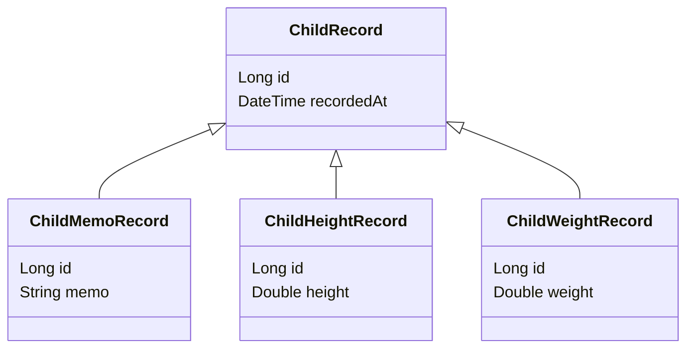

# @Inheritance JOINED Strategy

## JOINED 전략이란?

- 자식 테이블은 부모 테이블의 식별자 값을 ID로 가진다. `기본키 + 외래키` 형태

## 클래스 다이어그램



## Base 코드

```java
@Getter
@MappedSuperclass
@NoArgsConstructor(access = AccessLevel.PROTECTED)
public abstract class BaseEntity extends TimeEntity {

  @Id
  @GeneratedValue(strategy = GenerationType.IDENTITY)
  private Long id;

  public BaseEntity(long id) {
    this.id = id;
  }
}
```

```java
@Getter
@EntityListeners(AuditingEntityListener.class)
@MappedSuperclass
@NoArgsConstructor(access = AccessLevel.PROTECTED)
public abstract class TimeEntity {

  private String createId;

  @CreatedDate
  private LocalDateTime createdAt;

  private String updateId;

  @LastModifiedDate
  private LocalDateTime updatedAt;

  private LocalDateTime deletedAt;

  public TimeEntity(
      final String createId,
      final LocalDateTime createdAt,
      final String updateId,
      final LocalDateTime updatedAt,
      final LocalDateTime deletedAt) {
    this.createId = createId;
    this.createdAt = createdAt;
    this.updateId = updateId;
    this.updatedAt = updatedAt;
    this.deletedAt = deletedAt;
  }
}
```

## 실제 코드 실험 1 - DTYPE 지정 X

```java
@Entity
@Inheritance(strategy = InheritanceType.JOINED)
@NoArgsConstructor(access = AccessLevel.PROTECTED)
@ToString
public abstract class ChildRecord extends BaseEntity {

  @Getter private LocalDateTime recordedAt;

  public ChildRecord(final LocalDateTime recordedAt) {
    this.recordedAt = recordedAt;
  }
}
```

```java
@Entity
@NoArgsConstructor(access = AccessLevel.PROTECTED)
@ToString
public class ChildMemoRecord extends ChildRecord {

  @Getter private String memo;

  public ChildMemoRecord(final LocalDateTime recordedAt, final String memo) {
    super(recordedAt);
    this.memo = memo;
  }
}
```

```java
@Entity
@NoArgsConstructor(access = AccessLevel.PROTECTED)
@ToString
public class ChildWeightRecord extends ChildRecord {
  @Getter private Double weight;

  public ChildWeightRecord(final LocalDateTime recordedAt, final Double weight) {
    super(recordedAt);
    this.weight = weight;
  }
}
```

```java
@Entity
@NoArgsConstructor(access = AccessLevel.PROTECTED)
@ToString
public class ChildHeightRecord extends ChildRecord {

  @Getter private Double height;
  @Getter private String memo;

  public ChildHeightRecord(final LocalDateTime recordedAt, final Double height) {
    super(recordedAt);
    this.height = height;
  }
}
```

### 간단한 테스트 코드를 작성해보자.

```java
@SpringBootTest
class ChildRecordTest {

  @Autowired ChildRecordJpaRepository childRecordJpaRepository;

  @AfterEach
  void tearDown() {
    childRecordJpaRepository.deleteAllInBatch();
  }

  @Test
  void getTest() {
    childRecordJpaRepository.saveAll(
        List.of(createChildMemoRecord(), createChildHeightRecord(), createChildWeightRecord()));
    final List<ChildRecord> records = childRecordJpaRepository.findAll();

    for (ChildRecord record : records) {
      System.out.println(record);
    }
  }

  private ChildRecord createChildMemoRecord() {
    return new ChildMemoRecord(LocalDateTime.of(2024, 12, 10, 7, 0), "memo");
  }

  private ChildRecord createChildHeightRecord() {
    return new ChildHeightRecord(LocalDateTime.of(2024, 12, 10, 8, 0), 50d);
  }

  private ChildRecord createChildWeightRecord() {
    return new ChildWeightRecord(LocalDateTime.of(2024, 12, 10, 9, 0), 20d);
  }
}
```

### 테이블 생성

```shell
Hibernate: 
    create table child_height_record (
        height float(53),
        id bigint not null,
        memo varchar(255),
        primary key (id)
    )
Hibernate: 
    create table child_memo_record (
        id bigint not null,
        memo varchar(255),
        primary key (id)
    )
Hibernate: 
    create table child_record (
        created_at timestamp(6),
        deleted_at timestamp(6),
        id bigint generated by default as identity,
        recorded_at timestamp(6),
        updated_at timestamp(6),
        create_id varchar(255),
        update_id varchar(255),
        primary key (id)
    ) 
Hibernate: 
    create table child_weight_record (
        weight float(53),
        id bigint not null,
        primary key (id)
    )
```

### INSERT 문

- 객체를 저장할 때, INSERT 문이 총 2번 실행되는 것을 알 수 있다.
  - 부모 테이블 1회, 자식 테이블 1회

```shell
Hibernate: 
    insert 
    into
        child_record
        (create_id, created_at, deleted_at, recorded_at, update_id, updated_at, id) 
    values
        (?, ?, ?, ?, ?, ?, default)
Hibernate: 
    insert 
    into
        child_weight_record
        (weight, id) 
    values
        (?, ?)
```

### 부모 클래스를 직접 조회하면 JPA는 어떻게 동작할까?

- 모든 자식 테이블을 JOIN한다.
    - 만약 기록 타입이 추가되어 20개가 넘는 기록이 생긴다고 한다면 성능이 매우 느려질 수도 있다.

```shell
Hibernate: 
    select
        cr1_0.id,
        case 
            when cr1_1.id is not null 
                then 1 
            when cr1_2.id is not null 
                then 2 
            when cr1_3.id is not null 
                then 3 
            end,
            cr1_0.create_id,
            cr1_0.created_at,
            cr1_0.deleted_at,
            cr1_0.recorded_at,
            cr1_0.update_id,
            cr1_0.updated_at,
            cr1_1.height,
            cr1_1.memo,
            cr1_2.memo,
            cr1_3.weight 
        from
            child_record cr1_0 
        left join
            child_height_record cr1_1 
                on cr1_0.id=cr1_1.id 
        left join
            child_memo_record cr1_2 
                on cr1_0.id=cr1_2.id 
        left join
            child_weight_record cr1_3 
                on cr1_0.id=cr1_3.id
```

## 만약 객체 타입으로 조회하려고 하면?

```java
@Repository
@RequiredArgsConstructor
public class ChildRecordQueryRepository {

  private final JPAQueryFactory queryFactory;

  public List<ChildRecord> getMemos() {
    return queryFactory
        .selectFrom(childRecord)
        .where(childRecord.instanceOf(ChildMemoRecord.class))
        .fetch();
  }
}
```

- 아래 테스트 코드를 통해 직접 실행해보자.

```java
@SpringBootTest
class ChildRecordTest {
  @Test
  void getMemos() {
    childRecordJpaRepository.saveAll(
        List.of(createChildMemoRecord(), createChildHeightRecord(), createChildWeightRecord()));
    List<ChildRecord> records = childRecordQueryRepository.getMemos();

    for (ChildRecord record : records) {
      System.out.println(record);
    }
  }
  
  // ...
}
```

- 아래와 같이 WHERE 절에 WHEN CASE문이 붙는 것을 알 수 있다.
- `end=?`에는 아마도 `cr1_2`의 숫자 값으로 지정된 `2`값이 들어갈 것이다.

```shell
Hibernate: 
    select
        cr1_0.id,
        case 
            when cr1_1.id is not null 
                then 1 
            when cr1_2.id is not null 
                then 2 
            when cr1_3.id is not null 
                then 3 
            end,
            cr1_0.create_id,
            cr1_0.created_at,
            cr1_0.deleted_at,
            cr1_0.recorded_at,
            cr1_0.update_id,
            cr1_0.updated_at,
            cr1_1.height,
            cr1_1.memo,
            cr1_2.memo,
            cr1_3.weight 
        from
            child_record cr1_0 
        left join
            child_height_record cr1_1 
                on cr1_0.id=cr1_1.id 
        left join
            child_memo_record cr1_2 
                on cr1_0.id=cr1_2.id 
        left join
            child_weight_record cr1_3 
                on cr1_0.id=cr1_3.id 
        where
            case 
                when cr1_1.id is not null 
                    then 1 
                when cr1_2.id is not null 
                    then 2 
                when cr1_3.id is not null 
                    then 3 
                end=?
```

---

## DTYPE 추가

- `@DiscriminatorColumn` 어노테이션을 통해 DTYPE 필드를 추가할 수 있다.
  - `@DiscriminatorColumn(name ="TYPE")`과 같이 필드명을 직접 지정할 수 있다.

```java
@Entity
@Inheritance(strategy = InheritanceType.JOINED)
@DiscriminatorColumn // DTYPE 필드 추가
@NoArgsConstructor(access = AccessLevel.PROTECTED)
@ToString
public abstract class ChildRecord extends BaseEntity {

  @Getter private LocalDateTime recordedAt;

  public ChildRecord(final LocalDateTime recordedAt) {
    this.recordedAt = recordedAt;
  }
}
```

### CREATE TABLE

- `dtype varchar(31) not null`와 같이 `dtype`이라는 필드가 추가된 것을 확인할 수 있다.

```shell
Hibernate: 
    create table child_record (
        created_at timestamp(6),
        deleted_at timestamp(6),
        id bigint generated by default as identity,
        recorded_at timestamp(6),
        updated_at timestamp(6),
        dtype varchar(31) not null,
        create_id varchar(255),
        update_id varchar(255),
        primary key (id)
    )
```

### INSERT 문

- INSERT 문을 실행할 때 `dtype`필드가 부모 클래스인 `child_record`에 들어가는 것을 확인할 수 있다.

```shell
Hibernate: 
    insert 
    into
        child_record
        (create_id, created_at, deleted_at, recorded_at, update_id, updated_at, dtype, id) 
    values
        (?, ?, ?, ?, ?, ?, 'ChildWeightRecord', default)
Hibernate: 
    insert 
    into
        child_weight_record
        (weight, id) 
    values
        (?, ?)
```

### 타입 조회를 다시 살펴보자

- 테스트를 다시 실행해보자.
- 아래와 `dtype`을 조건문에 넣어 조회하는 것을 확인할 수 있다. 

```shell
Hibernate: 
    select
        cr1_0.id,
        cr1_0.dtype,
        cr1_0.create_id,
        cr1_0.created_at,
        cr1_0.deleted_at,
        cr1_0.recorded_at,
        cr1_0.update_id,
        cr1_0.updated_at,
        cr1_1.height,
        cr1_1.memo,
        cr1_2.memo,
        cr1_3.weight 
    from
        child_record cr1_0 
    left join
        child_height_record cr1_1 
            on cr1_0.id=cr1_1.id 
    left join
        child_memo_record cr1_2 
            on cr1_0.id=cr1_2.id 
    left join
        child_weight_record cr1_3 
            on cr1_0.id=cr1_3.id 
    where
        cr1_0.dtype=?
```

## CASE 문 기반 vs 필드 기반

- CASE 문은 조인된 모든 테이블의 `id`를 비교해야 하므로, 조인 테이블이 많아질수록 성능 저하가 생길 것이다.
- 또한 `type`과 관련된 인덱스를 활용이 어려워 전체 테이블 스캔 비용이 높아질 수 있다는 단점이 있다.

### dtype의 값을 직접 정하고 싶다면 @DiscriminatorValue를 사용한다 

```java
@Entity
@NoArgsConstructor(access = AccessLevel.PROTECTED)
@DiscriminatorValue("CHILD_WEIGHT_RECORD")
@ToString
public class ChildWeightRecord extends ChildRecord {
  @Getter private Double weight;

  public ChildWeightRecord(final LocalDateTime recordedAt, final Double weight) {
    super(recordedAt);
    this.weight = weight;
  }
}
```

- 테스트를 실행했을 때 INSERT 문을 확인해보면 아래와 같이 내가 지정해준 `CHILD_WEIGHT_RECORD` 값이 들어간 것을 확인할 수 있다.

```shell
Hibernate: 
    insert 
    into
        child_record
        (create_id, created_at, deleted_at, recorded_at, update_id, updated_at, dtype, id) 
    values
        (?, ?, ?, ?, ?, ?, 'CHILD_WEIGHT_RECORD', default)
Hibernate: 
    insert 
    into
        child_weight_record
        (weight, id) 
    values
        (?, ?)
```

# 참고자료

- 자바 ORM 표준 JPA 프로그래밍, 김영한 지음

