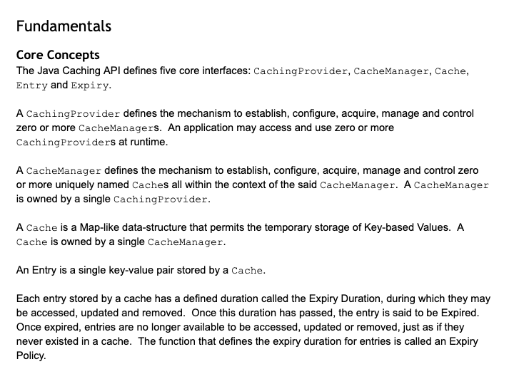

# Hibernate second-level cache

- Hibernate의 1차 캐시는 영속성 컨텍스트다. 
- 그렇다면 2차 캐시는 뭘까?

## 2차 캐시란?

- 1차 캐시는 보통 트랜잭션이 종료되면 함께 사라진다.
- 반면 2차 캐시는 `SessionFactory-scoped`에서 동작하며, 동일한 `SessionFactory`에서 생성된 모든 세션에서 공유된다.
- 어떤 엔티티가 ID를 기준으로 조회될 때, 해당 엔티티에 대한 2차 캐시가 활성화되어 있다면 아래와 같은 과정이 진행된다.

1. 1차 캐시에 해당 엔티티 인스턴스가 존재하면, 해당 인스턴스를 반환한다.
2. 1차 캐시에 존재하지 않지만, 2차 캐시에 데이터가 저장되어 있다면, 2차 캐시에서 데이터를 가져와 엔티티 인스턴스를 조립한 후 반환한다.
3. 1차, 2차 캐시 어디에도 데이터가 없는 경우, 데이터베이스에서 필요한 데이터를 로드한 후 엔티티 인스턴스를 조립하여 반환한다.

- 한 번 엔티티 인스턴스가 영속성 컨텍스트에 저장되면, 해당 세션이 닫힐 때까지 (혹은 명시적으로 1차 캐시에서 제거할 때까지) 모든 후속 호출에서 동일한 인스턴스를 반환하게 된다.
- 또한, 로드된 인스턴스 상태는 2차 캐시에 저장된다. (2차 캐시에 존재하지 않는 경우에!)

## Region Factory

- Hibernate의 2차 캐시는 특정 캐시 프로바이더에 종속되지 않도록 설계되어 있다. 
  - Hibernate 프레임워크는 단순히 `org.hibernate.cache.spi.RegionFactory` 인터페이스의 구현체만 제공받으면 된다.
  - 이 인터페이스는 실제 캐시 프로바이더와 관련된 모든 세부 사항을 캡슐화하며, 기본적으로 Hibernate와 캐시 프로바이더 사이의 브릿지 역할을 한다.
- 과거 Hibernate 5.x 버전에서는 Hibernate 유지보수 팀이 직접 `RegionFactory`의 구현체를 제공했었다.
  - ex) `hibernate-ehcache`, `hibernate-infinispan`과 같은 특정 캐시 스택에 대한 모듈
- 하지만 6.x 버전부터는 2차 캐시를 연결하는 표준 방식이 `JSR-107(jcache)` 어댑터를 사용하는 방식으로 변경되었다.
  - 이 접근 방식 덕분에 Hibernate 유지보수 팀은 각 캐시 프로바이더에 대해 개별적으로 `RegionFactory`를 구현할 필요 없이, 표준 인터페이스를 통해 다양한 캐시 프로바이더와 통합할 수 있게 되었다.

---
# 여기서 잠깐! 캐시 표준에 대해 알아보자!

## Ehcache

- `Ehcache`는 오픈소스 캐시 라이브러리이다. heap 뿐만 아니라 off-heap, disk 캐싱을 지원하고 TTL, TTI 등 다양한 캐시 만료 정책을 지원한다.
- `Ehcache`는 JSR-107 표준을 지원한다!

### JSR-107과 jcache

- 표준 Caching API. 표준 스펙.
- `JCache`는 캐싱을 위한 여러 인터페이스와 클래스를 표준화하여 제공한다.
  - `JCache` 자체로 캐시 구현체의 역할을 하지 못하지만, Java에서 여러 캐시 구현체를 일관되게 다룰 수 있는 인터페이스를 제공한다.

### JSR107 Specification



- 5가지의 핵심 인터페이스! `CachingProvider`, `CacheManager`, `Cache`, `Entry`, `Expiry`

#### 1. CachingProvider 

- `CachingProvider`는 캐시 관리자(CacheManager)를 설정, 구성, 획득, 관리 및 제어하는 메커니즘을 제공한다.
- 하나의 애플리케이션은 여러 개의 `CachingProvider`를 동시에 사용할 수 있다.

#### 2. CacheManager

- `CacheManager`는 여러 개의 고유한 이름을 가진 캐시(Cache)를 생성, 설정, 관리 및 제어하는 메커니즘을 제공한다.
- 하나의 `CacheManager`는 하나의 `CachingProvider`에 의해 관리된다.

#### 3. Cache

- `Cache`는 Key-Value 기반의 데이터를 일시적으로 저장하는 `Map`과 유사한 데이터 구조이다.
- 하나의 `Cache`는 하나의 `CacheManager`가 소유한다

#### 4. Entry

- `Entry`는 캐시에 저장된 하나의 Key-Value 쌍을 의미한다.

#### 5. Expiry

- 캐시에 저장된 각 엔트리(Entry)에는 접근, 갱신 및 삭제가 가능한 지속 시간(Expiry Duration)이 정의된다.
- 만료 시간이 지나면 해당 엔트리는 캐시에서 삭제되며, 더 이상 접근, 갱신 또는 삭제할 수 없다.
- 만료 정책(Expiry Policy)이란, 엔트리의 만료 시간을 정의하는 기능을 의미한다.

### Eh107Configuration

- 해당 클래스는 Ehcache와 JCache간의 호환성을 제공

---

## Hibernate Cache Config

#### 1. hibernate.cache.use_second_level_cache
- 2차 캐시 사용 여부를 설정
- 기본적으로 `RegionFactory`가 `NoCachingRegionFactory`가 아닌 경우, 2차 캐시가 활성화됨.
- `NoCachingRegionFactory`를 사용하면 2차 캐시가 비활성화됨.

#### 2. hibernate.cache.use_query_cache

- 쿼리 결과(Query Result)도 2차 캐시에 저장할지 여부
- 기본값: false (쿼리 결과 캐싱 비활성화)

#### 3. hibernate.cache.query_cache_factory

- 쿼리 결과 캐싱에서 "오래된 데이터(Stale Data)"를 다루는 방식 지정
- 기본 구현체는 오래된 데이터가 포함되지 않도록 보장
- 특정 애플리케이션에서 보다 유연한 캐싱 정책이 필요할 경우 변경 가능
- `org.hibernate.cache.spi.TimestampsCacheFactory`의 구현체 이름을 설정

#### 4. hibernate.cache.use_minimal_puts

- 쓰기 최소화 (Minimal Puts) 최적화
- 쓰기 연산을 줄이는 대신, 더 자주 읽기 연산을 수행하는 방식
- 대부분의 캐시 프로바이더가 적절한 기본값을 설정하므로 일반적으로 변경할 필요 없음

#### 5. hibernate.cache.region_prefix

- 2차 캐시의 모든 "영역(Region)" 이름 앞에 붙는 접두사(Prefix)를 정의
- 여러 애플리케이션이 동일한 캐시 저장소를 공유할 경우, 구분을 위해 사용 가능

#### 6. hibernate.cache.default_cache_concurrency_strategy

- 2차 캐시의 동시성 제어 전략(Concurrency Strategy) 기본값을 설정
- 개별 캐시 영역(Region)마다 별도로 설정할 수도 있음
- 유효한 값:
  - read-only (읽기 전용)
  - read-write (읽기-쓰기)
  - nonstrict-read-write (비엄격한 읽기-쓰기)
  - transactional (트랜잭션 동기화)

#### 7. hibernate.cache.use_structured_entries

- 2차 캐시에 데이터를 보다 사람이 읽기 쉬운(Human-Friendly) 형식으로 저장할지 여부
- true로 설정하면 데이터를 쉽게 탐색(browse)할 수 있지만, 성능에 영향을 줄 수 있음

#### 8. hibernate.cache.auto_evict_collection_cache

- 양방향 관계(Bidirectional Association)의 컬렉션 캐시 자동 제거(Eviction) 여부
- 연관된 엔티티의 소유 측(Owning Side)에서 변경이 발생하면, 컬렉션 캐시를 자동으로 제거할지 결정
- 기본값: false (자동 제거 비활성화)
- 활성화 시 성능에 영향이 있음, 하지만 컬렉션 캐시가 존재하면서 연관 관계를 직접 관리하지 않으면 오래된 데이터가 남을 가능성 있음

#### 9. hibernate.cache.use_reference_entries

- 2차 캐시에 엔티티의 참조(Reference)만 직접 저장할지 여부
- read-only 또는 immutable 엔티티에서 사용 가능
- 성능 최적화를 위해 참조만 저장하여 캐시 크기를 줄일 수 있음

#### 10. hibernate.cache.keys_factory

- 2차 캐시에서 Key-Value 데이터를 저장할 때, "Key"를 어떤 방식으로 구성할지 결정
- 기본적으로 Key는 엔티티 유형, 테넌트 정보(멀티 테넌시), 식별자(Primary Key) 를 포함하는 Tuple 형태로 저장
- 하지만, 특정 환경에서는 단순한 식별자(ID)만 Key로 저장하는 것이 더 효율적일 수 있음
- 유효한 값:
  - default (기본값, Tuple 형태로 Key 저장)
  - simple (Key를 단순한 ID 값으로 저장)
  - org.hibernate.cache.spi.CacheKeysFactory를 구현한 사용자 정의 클래스
- 현재 이 설정은 Infinispan을 2차 캐시 프로바이더로 사용할 때만 지원됨. 

---

## EhCache 2차 캐시 활성화 예시

- 의존성 추가

```kotlin
implementation("org.hibernate.orm:hibernate-jcache:6.6.9.Final")
implementation("com.github.ben-manes.caffeine:caffeine:3.2.0")
```

- factory_class를 `JCacheRegionFactory`로 설정했다.
- 또한 캐시 프로바이더는 `EhcacheCachingProvider`로 설정햇다.

```properties
hibernate.cache.use_second_level_cache=true
hibernate.cache.region.factory_class=org.hibernate.cache.jcache.internal.JCacheRegionFactory
hibernate.javax.cache.uri=ehcache.xml
hibernate.javax.cache.provider=org.ehcache.jsr107.EhcacheCachingProvider
```

- ehcache.xml

```xml
<config
        xmlns='http://www.ehcache.org/v3'
        xmlns:jsr107='http://www.ehcache.org/v3/jsr107'>

    <service>
        <jsr107:defaults default-template="default">
            <jsr107:cache name="category" template="categoryCache"/>
        </jsr107:defaults>
    </service>

    <cache-template name="default">
        <expiry>
            <ttl unit="days">14</ttl>
        </expiry>
        <heap unit="entries">10</heap>
    </cache-template>

    <cache-template name="categoryCache">
        <key-type>java.lang.Long</key-type>
        <value-type>com.example.commerce.entity.ProductCategory</value-type>
    </cache-template>
</config>
```

--- 

## 쿼리 자체에 캐시 사용하기

- `hibernate.cache.use_query_cache` 설정을 true로 둬야 한다.


# 참고자료

- [Hibernate 공식문서 - User Guide](https://docs.jboss.org/hibernate/orm/6.6/userguide/html_single/Hibernate_User_Guide.html)
- [Hibernate Second-Level Cache](https://www.baeldung.com/hibernate-second-level-cache)
- [[JPA] 2차 캐시에 대하여](https://velog.io/@bagt/JPA-2%EC%B0%A8-%EC%BA%90%EC%8B%9C%EC%97%90-%EB%8C%80%ED%95%98%EC%97%AC)
- [Ehcache, 제대로 알고 적용해보자 - 1](https://velog.io/@skydreamer21/Ehcache-%EC%A0%9C%EB%8C%80%EB%A1%9C-%EC%95%8C%EA%B3%A0-%EC%A0%81%EC%9A%A9%ED%95%B4%EB%B3%B4%EC%9E%90-1)
- [JSR107 Specification](https://docs.google.com/document/d/1YZ-lrH6nW871Vd9Z34Og_EqbX_kxxJi55UrSn4yL2Ak/edit?hl=en_US&tab=t.0)
- [EHCACHE 공식문서 - XML Configuration](https://www.ehcache.org/documentation/3.10/xml.html)
- [2차 캐시에 관하여 질문](https://www.inflearn.com/community/questions/33629/%EA%B0%95%EC%9D%98%EC%97%90%EB%8A%94-%EC%97%86%EB%8A%94-%EB%82%B4%EC%9A%A9%EC%9D%B4%EC%A7%80%EB%A7%8C-cache-%EA%B4%80%EB%A0%A8%ED%95%B4%EC%84%9C-%EC%A7%88%EB%AC%B8%EC%9D%B4-%EC%9E%88%EC%8A%B5%EB%8B%88%EB%8B%A4)
