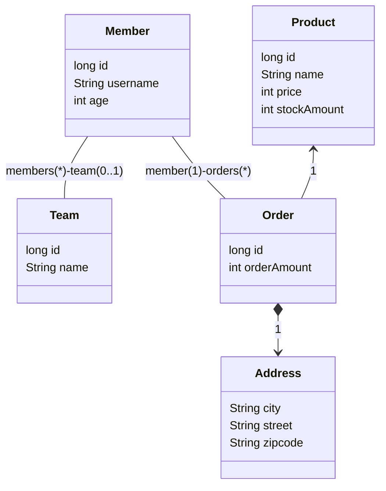
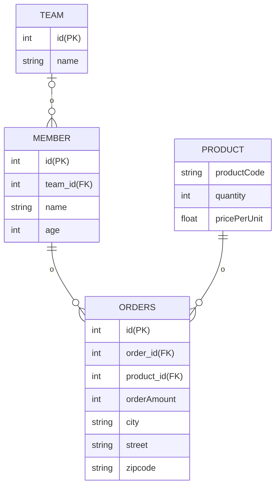

# 10장 객체지향 쿼리

## 1. 객체지향 쿼리 소개

- ORM을 사용하면 데이터베이스 테이블이 아닌 엔티티 객체를 대상으로 개발하므로 검색도 테이블이 아닌 엔티티 객체를 대상으로 하는 방법이 필요하다.
- JPQL은 이런 문제를 해결하기 위해 만들어졌는데 아래와 같은 특징이 있다.
  - 테이블이 아닌 객체를 대상으로 검색하는 객체지향 쿼리다.
  - SQL을 추상화해서 특정 데이터베이스 SQL에 의존하지 않는다.
- JPA는 JPQL뿐만 아니라 다양항 검색 방법을 제공한다. 다음은 JPA가 공식 지원하는 기능이다.
  - JPQL (Java Persistence Query Language)
  - Criteria 쿼리: JPQL을 편하게 작성하도록 도와주는 API, 빌더 클래스 모음
  - 네이티브 SQL: JPA에서 JPQL 대신 직접 SQL을 사용하는 방식
- JPA가 공식 지원하는 기능은 아니지만 알아둘 가치가 있는 기술들
  - QueryDSL: Criteria 쿼리처럼 JPQL을 편하게 작성하도록 도와주는 빌더 클래스 모음, 비표준 오픈소스 프레임워크
  - JDBC 직접 사용, MyBatis 같은 SQL 매퍼 프레임워크: 필요하면 JDBC를 직접 사용 가능

### JPQL 소개

- 엔티티 객체를 조회하는 객체지향 쿼리다. 문법은 SQL과 비슷하고 ANSI 표준 SQL이 제공하는 기능을 유사하게 지원한다.
- JPQL은 SQL을 추상화해서 특정 데이터베이스에 의존하지 않는다.
  - 데이터베이스 방언만 변경하면 JPQL을 수정하지 않아도 자연스럽게 데이터베이스를 변경할 수 있다.
- JPQL은 SQL보다 간결하다.
  - 엔티티 직접 조회, 묵시적 조인, 다형성 지원으로 SQL보다 코드가 간결하다.

```java
String jpql = "select m from Member as m where m.username = 'kim'";
List<Member> members = em.createQuery(jpql, Member.class).getResultList();
```

- 위 JPQL을 실행하면 아래와 같은 쿼리가 실행된다.

```sql
select
    member.id as id,
    member.age as age,
    member.team_id as team,
    member.name as name
from
    member
where
    member.name='kim'
```

### Criteria 쿼리 소개

- JPQL을 생서하는 빌더 클래스다.
- Criteria의 장점은 문자가 아닌 `query.select(m).where(...)`처럼 프로그래밍 코드로 JPQL을 작성할 수 있다는 점이다.
- JPQL의 문제
  - 만약 `select m from Membereeee m`처럼 오타가 있다고 가정했을 때, 컴파일이 성공하고 서버에 배포도 된다.
  - 문제는 해당 쿼리가 실행되는 시점에 런타임 오류가 발생한다는 점이다.
  - 이것이 문자 기반 쿼리의 단점이다.
- 반면에 Criteria는 문자가 아닌 코드로 JPQL을 작성하기 때문에 컴파일 시점에 오류를 발견할 수 있다.
- Criteria 장점
  - 컴파일 시점에 오류를 발견할 수 있다.
  - IDE를 사용하면 코드 자동완성을 지원한다.
  - 동적 쿼리를 작성하기 편하다.

```java
public class Example {

  public void query() {
    CriteriaBuilser cb = em.getCriteriaBuilder();
    CriteriaQuery<Member> query = cb.createQuery(Member.class);
    
    Root<Member> m = query.from(Member.class);
    
    CriteriaQuery<Member> cq = query.select(m).where(cb.equal(m.get("username"), "kim"));
    List<Member> members = em.createQuery(cq).getResultList();
  }
}
```

- 쿼리를 문자가 아닌 코드로 작성한 것을 확인할 수 있다.
  - 아쉬운 점은 `m.get("username")`가 같이 필드 명을 문자로 작성해야한다는 점이다.
  - 이 부분도 문자가 아닌 코드로 작성하고 싶으면 메타 모델(MetaModel)을 사용하면 된다.
- 메타모델 API
  - 자바가 제공하는 어노테이션 프로세서 기능을 사용하면 어노테이션을 분석해서 클래스를 생성할 수 있다.
  - JPA는 이 기능을 사용해서 Member 엔티티 클래스로부터 `Member_`라는 Criteria 전용 클래스를 생성하는데 이것을 메타모델이라고 한다.
  - 메타 모델을 사용하면 온전히 코드만 사용해서 쿼리를 작성할 수 있다.

```java
m.get("username") ==> m.get(Member_.username)
```

- Criteria가 가진 장점은 많지만 모든 장점을 상쇄할 정도로 복잡하고 장황하다. 따라서 사용하기 불편한 건 물론이고 Criteria로 작성한 코드도 한눈에 들어오지 않는다는 단점이 있다.

### QueryDSL 소개

- QueryDSL도 Criteria처럼 JPQL 빌더 역할을 한다.
- QueryDSL의 장점은 코드 기반이면서 단순하고 사용하기 쉽다는 점이다.
- 작성한 코드도 JPQL과 상당히 유사하기 때문에 한눈에 들어온다.

> 참고
> - QueryDSL은 JPA 표준이 아니라 오픈소스 프로젝트다.
> - JPA뿐만 아니라 JDO, 몽고DB, Java Collection, Lucene, Hibernate Search도 거의 같은 문법으로 지원한다.
> - 현재 스프링 데이터 프로젝트가 지원할 정도로 많이 기대되는 프로젝트다.

```java
public class Example {

  public void query() {
    JPAQuery = new JPAQuery(em);
    QMember member = QMember.member;
    
    List<Member> members = query
        .from(member)
        .where(member.username.eq("kim"))
        .list(member);
  }
}
```

### 네이티브 SQL 소개

- JPA는 SQL을 직접 사용할 수 있는 기능을 지원하는데 이것을 네이티브 SQL이라 한다.
- JPQL을 사용해도 가끔은 특정 데이터베이스에 의존하는 기능을 사용해야 할 때가 있다.
  - ex. 오라클의 `CONNECT BY` 기능, 특정 데이터베이스에서만 동작하는 SQL 힌트
  - 이런 기능들은 전혀 표준화되어 있지 않기 때문에 JPQL에서 사용할 수 없다.
- 네이티브 SQL의 단점
  - 특정 데이터베이스에 의존하는 SQL을 작성해야 한다는 점이다.
  - 데이터베이스를 변경하면 네이티브 SQL도 변경해야 한다.

```java
String sql = "select id, age, team_id, name from member where name='kim'";
List<Member> members = em.createNativeQuery(sql, Member.class).getResultList();
```

### JDBC 직접 사용

- JDBC 커넥션에 직접 접근하고 싶으면 JPA는 JDBC 커넥션을 획득하는 API를 제공하지 않으므로 JPA 구현체가 제공하는 방법을 사용해야 한다.
- 하이버네이트에서 직접 JDBC Connection을 획득하는 방법은 아래와 같다.

```java
Sesseion session = entityManager.unwrap(Session.class);
sessions.doWork(new Work() {
  
  @Override
  public void execute(Connection connection) throws SQLException {
    ...  
  }
});
```

- 먼저 JPA EntityManger에서 하이버네이트 Session을 구한다. 그리고 Sessions의 doWork() 메소드를 호출하면 된다.
- JDBC나 MyBatis를 JPA와 함께 사용하면 영속성 컨텍스트를 적절한 시점에 강제로 플러시해야 한다.
  - JDBC나 MyBatis와 같은 매퍼는 JPA를 우회해서 데이터베이스에 직접 접근한다.
  - 문제는 JPA를 우회하는 SQL에 대해 JPA는 전혀 인식하지 못한다는 점이다.
  - 영속성 컨텍스트와 데이터베이스가 불일치 상태가 되어 데이터 무결성이 훼손될 수 있다.
- 이런 이슈를 해결하는 방법은 JPA를 우회해서 SQL을 실행하기 직전에 영속성 컨텍스트를 수동으로 플러시해서 데이터베이스와 영속성 컨텍스트를 동기화하는 것이다.

<br/>

## 2. JPQL

- JPQL은 객체지향 쿼리 언어다. 따라서 테이블을 대상으로 쿼리하는 것이 아니라 엔티티 객체를 대상으로 쿼리한다.
- JPQL은 SQL을 추상화해서 특정 데이터베이스 SQL에 의존하지 않는다.
- JPQL은 결국 SQL로 변환된다.

- 예시 도메인 모델



- 예시 ERD



### 기본 문법과 쿼리

- JPQL도 SQL과 비슷하게 SELECT, UPDATE, DELETE 문을 사용할 수 있다.
- 아래와 같은 특징이 있다.
  - **대소문자 구분**: 엔티티와 속성은 대소문자를 구분해줘야 한다. 반면 `SELECT`, `FROM`, `AS`와 같은 JPQL 키워드는 대소문자를 구분하지 않는다.
  - **엔티티 이름**: JPQL에서 사용한 `Member` 클래스 명이 아니라 엔티티 명이다. 엔티티 명은 `@Entity(name="000")`와 같이 지을 수 있다. (사실, 클래스명이 기본 엔티티 명이다.)
  - **별칭은 필수**: JPQL은 별칭을 필수로 사용해야 한다. `select username from Member m`은 `username` 앞에 `m.`이라는 별칭을 붙이지 않았기 때문에 에러가 발생한다.

### TypeQuery, Query

- 작성한 JPQL을 실행하려면 쿼리 객체를 만들어야 한다.
  - 쿼리 객체로는 `TypeQuery`와 `Query`가 있는데, 반환할 타입을 명확하게 지정할 수 있다면 `TypeQuery` 객체를 사용하고, 반환 타입을 명확하게 지정할 수 없으면 `Query` 객체를 사용하면 된다.
- 아래는 `TypeQuery` 사용 예시다.

```java
TypedQuery<Member> query = em.createQuery("select m from Member m", Member.class);
List<Member> members = query.getResultList();
```

- 아래는 `Query` 사용 예시다.
  - 아래처럼 select 절에서 여러 엔티티나 컬럼을 선택할 때 반환할 타입이 명확하지 않으면 `Query` 객체를 사용한다.

```java
Query query = em.createQuery("select m.username, m.age from Member m");
List result = query.getResultList();
```

- `TypeQuery` 타입 캐스팅이 필요 없기 때문에 더 편하다.

### 결과 조회

- `query.getResultList()`: 결과 목록을 반환한다. 결과가 없으면 빈 컬럼을 반환한다.
- `query.getSingleResult()`: 결과가 정확히 하나일 때 사용한다.
  - 결과가 없으면 `javax.persistence.NoResultException`이 발생한다. 
  - 만약 결과가 1보다 많으면 `javax.persistence.NonUniqueResultException` 에러가 발생한다.

### 파라미터 바인딩

- JDBC는 위치 기준 파라미터 바인딩만 지원하지만 JPQL은 이름 기준 파라미터 바인딩도 지원한다.
- 이름 기준 파라미터 바인딩
  - 이름 기준 파라미터 앞에는 `:`을 사용한다.

```java
String usernameParam = "user1";

TypedQuery<Member> query = em.createQuery("select m from Member m where m.username := username", Member.class);
query.setParameter("username", usernameParam);
List<Member> members = query.getResultList();
```

- 아래와 같이 메소드 체이닝으로 작성할 수 있다.

```java
String usernameParam = "user1";
List<Member> members = em.createQuery("select m from Member m where m.username := username", Member.class)
        .setParameter("username", usernameParam)
        .getResultList();
```

- 위치 기준 파라미터
  - `?` 다음에 위치 값을 주면 된다.

```java
List<Member> members =
  em.createQuery("select m from Member m where m.username = ?1", Member.class)
        .setParameter(1, usernameParam)
        .getResultList();
```

<br/>

# 참고자료

- 자바 ORM 표준 JPA 프로그래밍, 김영한 지음
