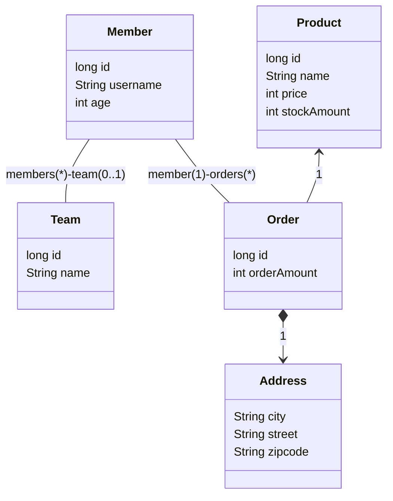
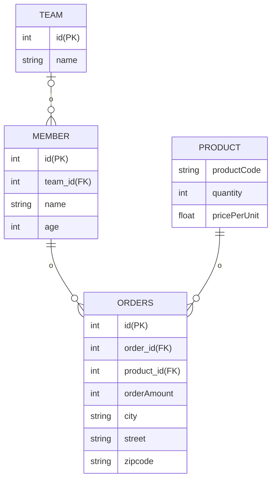

# JPQL

- JPQL은 객체지향 쿼리 언어다. 따라서 테이블을 대상으로 쿼리하는 것이 아니라 엔티티 객체를 대상으로 쿼리한다.
- JPQL은 SQL을 추상화해서 특정 데이터베이스 SQL에 의존하지 않는다.
- JPQL은 결국 SQL로 변환된다.

- 예시 도메인 모델



- 예시 ERD



## 기본 문법과 쿼리

- JPQL도 SQL과 비슷하게 SELECT, UPDATE, DELETE 문을 사용할 수 있다.
- 아래와 같은 특징이 있다.
    - **대소문자 구분**: 엔티티와 속성은 대소문자를 구분해줘야 한다. 반면 `SELECT`, `FROM`, `AS`와 같은 JPQL 키워드는 대소문자를 구분하지 않는다.
    - **엔티티 이름**: JPQL에서 사용한 `Member` 클래스 명이 아니라 엔티티 명이다. 엔티티 명은 `@Entity(name="000")`와 같이 지을 수 있다. (사실, 클래스명이 기본 엔티티 명이다.)
    - **별칭은 필수**: JPQL은 별칭을 필수로 사용해야 한다. `select username from Member m`은 `username` 앞에 `m.`이라는 별칭을 붙이지 않았기 때문에 에러가 발생한다.

### TypeQuery, Query

- 작성한 JPQL을 실행하려면 쿼리 객체를 만들어야 한다.
    - 쿼리 객체로는 `TypeQuery`와 `Query`가 있는데, 반환할 타입을 명확하게 지정할 수 있다면 `TypeQuery` 객체를 사용하고, 반환 타입을 명확하게 지정할 수 없으면 `Query` 객체를 사용하면 된다.
- 아래는 `TypeQuery` 사용 예시다.

```java
TypedQuery<Member> query = em.createQuery("select m from Member m", Member.class);
List<Member> members = query.getResultList();
```

- 아래는 `Query` 사용 예시다.
    - 아래처럼 select 절에서 여러 엔티티나 컬럼을 선택할 때 반환할 타입이 명확하지 않으면 `Query` 객체를 사용한다.

```java
Query query = em.createQuery("select m.username, m.age from Member m");
List result = query.getResultList();
```

- `TypeQuery` 타입 캐스팅이 필요 없기 때문에 더 편하다.

### 결과 조회

- `query.getResultList()`: 결과 목록을 반환한다. 결과가 없으면 빈 컬럼을 반환한다.
- `query.getSingleResult()`: 결과가 정확히 하나일 때 사용한다.
    - 결과가 없으면 `javax.persistence.NoResultException`이 발생한다.
    - 만약 결과가 1보다 많으면 `javax.persistence.NonUniqueResultException` 에러가 발생한다.

### 파라미터 바인딩

- JDBC는 위치 기준 파라미터 바인딩만 지원하지만 JPQL은 이름 기준 파라미터 바인딩도 지원한다.
- 이름 기준 파라미터 바인딩
    - 이름 기준 파라미터 앞에는 `:`을 사용한다.

```java
String usernameParam = "user1";

TypedQuery<Member> query = em.createQuery("select m from Member m where m.username := username", Member.class);
query.setParameter("username", usernameParam);
List<Member> members = query.getResultList();
```

- 아래와 같이 메소드 체이닝으로 작성할 수 있다.

```java
String usernameParam = "user1";
List<Member> members = em.createQuery("select m from Member m where m.username := username", Member.class)
        .setParameter("username", usernameParam)
        .getResultList();
```

- 위치 기준 파라미터
    - `?` 다음에 위치 값을 주면 된다.

```java
List<Member> members =
  em.createQuery("select m from Member m where m.username = ?1", Member.class)
        .setParameter(1, usernameParam)
        .getResultList();
```

## 프로젝션

- select 문에서 조회할 대상을 지정하는 것을 프로젝션이라 한다.
- 엔티티는 영속성 컨텍스트에서 관리된다.

```sql
SELECT m FROM Member m
SELECT m.team FROM Member m
```

- 임베디드 타입으로 조회한 것은 프로젝션으로 취급한다. 값 타입이기 때문에 영속성 컨텍스트에서 관리되지 않는다.

```java
String query = "select a from Address a";
List<Address> addresses = em.createQuery(query, Address.class)
        .getResultList();
```

- 스칼라 타입 프로젝션은 숫자, 문자, 날짜와 같은 기본 데이터 타입을 의미한다.
- `Query`를 통해 여러 값을 Object를 사용해 반환받을 수 있다.
- New 명령어를 사용해 `TypedQuery`를 활용할 수 있다.
    1. 패키지 명을 포함한 전체 클래스 명을 입력해야 한다.
    2. 순서와 타입이 일치하는 생성자가 필요하다.

```java
TypedQuery<UserDTO> query =
  em.createQuery("select new com.my.user.UserDTO(m.username, m.age) " 
        + "from Member m", UserDTO.class);
List<UserDTO> users = query.getResultList();
```

## 페이징 API

- JPA는 페이징을 2개의 API로 추상화했다.
    - `setFirstResult(int startPosition)`: 조회 시작 위치(0부터 시작)
    - `setMaxResults(int maxResult)`: 조회할 데이터 수

```java
TypedQuery<Member> query =
  em.createQuery("select m from Member m", Member.class);

query.setFirstResult(10);
query.setMaxResult(20);
query.getResultList();
```

- (조회가 0부터 시작하기 때문에) 위 코드에서는 11번째부터 총 20건의 데이터를 조회해 11~30번의 데이터를 조회한다.
- 각 JPA 구현체는 데이터베이스의 특성에 맞게 페이징 쿼리를 실행한다.

## 집합 및 정렬

### 집합 함수

- 집합 함수는 아래와 같다.

|함수|설명|
|:--:|:--:|
|COUNT|결과 수를 구한다. 반환 타입: `Long`|
|MAX, MIN|최대. 최소 값을 구한다. 문자, 숫자, 날짜 등에 사용한다.|
|AVG|평균값을 구한다. 숫자 타입만 사용할 수 있다. 반환 타입: `Double`|
|SUM|합을 구한다. 숫자 타입만 사용할 수 있다. 반환 타입: 정수합 `Long`, 소수합: `Double`, `BigInteger`합: `BigInteger`, `BigDecimal`합: `BigDecimal`|

- NULL 값은 무시해 통계에 잡히지 않는다.
- 집계 함수 대상의 값이 아예 없을 경우 NULL을 반환한다. COUNT는 0을 반환한다.
- DISTINCT를 집합 함수 안에 사용해서 중복된 값을 제거하고 나서 집합을 구할 수 있다.

```jpaql
select count(distinct m.age) from Member m
```

- DISTINCE를 COUNT에서 사용할 때 임베디드 타입은 지원하지 않는다.

### 그룹화

- `GROUP BY`와 `HAVING`

### 정렬

- `ORDER BY`

## 조인

### JPQL 조인

- SQL 조인과 기능은 같고 문법이 약간 다르다.
- INNER JOIN
    - member가 가지고 있는 연관 필드로 team을 바로 조인해버린다. (별도의 `on` 절이 필요 없다.)
    - 조인해 온 team에도 별칭인 `t`를 붙였다.

```jpaql
select m from Member m inner join m.team t
  where t.name = :teamName
```

- OUTER JOIN

```jpaql
select m from Member m left [outer] join m.team t
```

- Collection Join
    - 일대다 관계나 다대다 관계처럼 컬렉션을 사용하는 곳에 조인을 하는 것을 말한다.

```jpaql
select t, m from Team t left join t.members m
```

- Theta Join
    - where절을 사용해 조인을 한다.
    - 세타 조인은 내부 조인만 지원한다.

```jpaql
select count(m) from Member m, Team t
where m.username = t.name
```

- Join On 절

```jpaql
select m, t from Member m
left join m.team t on t.name = 'A'
```

- Fetch Join
    - JPQL에서 성능 최적화를 위해 제공하는 기능이다.
    - 연관된 엔티티나 컬력센을 한 번에 조회하는 기능이다.
    - `join fetch` 명령어로 사용할 수 있다.
- Entity Fetch Join
    - INNER JOIN으로 fetch join을 실행하면 팀이 있는 회원만 조회하게 된다.
    - INNER JOIN은 연관된 테이블 값이 NULL이면 탈락시켜 버린다.

```jpaql
select m from Member m join fetch m.team
```

- Collection Fetch Join
    - 조인해서 조회한 결과를 JPA는 컬렉션에 자동으로 매핑해준다.

```jpaql
select t from Team t join fetch t.members
```

### Fetch Join의 특징과 한계

- SQL 한 번으로 연관된 엔티티를 함께 조회할 수 있어 SQL 호출 횟수를 줄여 성능을 최적화할 수 있다.
- Fetch Join은 글로벌 로딩 전략보다 우선한다.
    - 글로벌 로딩 전략은 웬만하면 지연 로딩으로 설정하자.
- Fetch Join은 연관된 엔티티를 쿼리 시점에 조회하므로 지연 로딩이 발생하지 않는다. 준영속 상태에서도 객체 그래프를 탐색할 수 있다는 말이다.
- 하지만 아래와 같은 한계가 있다.
    - 페치 조인 대상에는 별칭을 줄 수 없다.
    - 둘 이상의 컬렉션을 페치 조인할 수 없다. 구현체에 따라 되기도 하지만 카테시안 곱이 만들어지므로 주의해야 한다.
    - 컬렉션을 페치 조인하면서 페이징 API를 문제가 생길 수 있다. 경고 로그가 뜨면서 페이징 처리를 하는데 데이터가 너무 많으면 Out Of Memory 에러가 발생할 수 있다.

## 경로 표현식

- 경로 표현식이란 쉽게 말해서 `.`을 찍어서 객체 그래프를 탐색하는 것이다.
    - 아래의 `m.username`, `m.team t`, `m.orders o` 모두 경로 표현식을 사용한 것이다.

```jpaql
select m.username // 상태 필드
from Member m
  join m.team t // 단일 값 연관 필드
  join m.orders o // 컬렉션 값 연관 필드
```

- 경로 표현식 용어
    - 상태 필드(state field): 단순히 값을 저장하기 위한 필드
    - 연관 필드(association field): 연관관계를 위한 필드, 임베디드 타입 포함
        - 단일 값 연관 필드: `@ManyToOne`, `@OneToOne`, 대상이 엔티티다.
        - 컬렉션 값 연관 필드:  `@OneToMany`, `@ManyToMany`, 대상이 컬렉션이다.
- 경로 표현식 특징
    - 상태 필드 경로: 경로의 끝. 더 이상 탐색할 수 없다.
    - 단일 값 연관 경로: 묵시적으로 내부 조인 발생. 계속 탐색 가능
    - 컬렉션 값 연관 경로: 묵시적으로 내부 조인 발생. 더는 탐색할 수 없다. (단, join 절에서 조인을 통해 별칭을 얻으면 별칭으로 탐색 가능)

```jpaql
select t.members.username from Team t // 경로 표현식으로 바로 접근하려고 하면 실패
select m.username from Team t join t.members m // 조인 절에서 별칭을 획득해 사용해야함.
```

- 명시적 조인과 묵시적 조인
    - 명시적 조인: JOIN을 적어주는 것
    - 묵시적 조인: 경로 표현식에 의해 묵시적으로 조인이 일어나는 것. 내부 조인만 할 수 있다.
- 묵시적 조인 주의사항
    - 항상 내부 조인이다.
    - 컬렉션은 경로 탐색의 끝이다. 더 탐색하고 싶으면 명식적 조인을 통해 별칭을 부여해야 한다.
    - 묵시적 조인이 SQL의 FROM 절에 영향을 줄 수 있다.
- 웬만하면 명시적 조인을 사용하자!!!

## 서브쿼리

- JPQL에서는 WHERE, HAVING 절에서 서브쿼리를 사용할 수 있고, SELECT, FROM 절에서는 사용할 수 없다.

```jpaql
select m from Member m
where (select count(o) from Order o where m = o.member) > 0
```

### 서브쿼리 함수

- 아래 함수와 서브쿼리를 함께 사용할 수 있다.
    - [NOT] EXISTS (subquery)
    - {ALL | ANY | SOME} (subquery)
    - [NOT] IN (subquery)
- `EXISTS`
    - 서브쿼리에 결과가 존재하면 참이다.

```jpaql
select m FROM Member m
where exists (select t from m.team t where t.name = 'teamA')

select m FROM Member m
where not exists (select t from m.team t where t.name = 'teamA')
```

- {`ALL` | `ANY` | `SOME`}
    - 비교 연산자{ = | > | >= | < | <= | <> }와 함께 사용한다.
    - `ALL`: 조건을 모두 만족해야 참
    - `ANY`, `SOME`: 같은 의미. 하나라도 만족하면 참

```jpaql
// 전체 상품 각각의 재고보다 주문량이 많은 주문들
select o from Order o
where o.orderAmount > ALL (select p.stockAmount from Product p)

// 어떤 팀에 소속된 회원
select m from Member m
where m.team = ANY (select t from Team t)
```

- `IN`
    - 서브쿼리의 결과 중 하나라도 같은 것이 있으면 참
    - `IN` 절은 서브쿼리가 아닌 곳에서도 사용 가능

```jpaql
// 20세 이상을 보유한 팀
select t from Team t
where t IN (select t2 from Team t2 join t2.members m2 where m2.age >= 20)
```

## 조건식

### 조건식 - 타입 표현

- JPQL에서 사용하는 타입은 아래와 같이 표시한다.

|종류|설명|예제|
|:--:|:--:|:--:|
|문자|작은 따옴표|'hello'|
|숫자|L(Long), D(Double), F(Float)|10L|
|날짜|DATE {d 'yyyy-mm-dd'}, TIME {t 'hh-mm-ss'}, DATETIME {ts 'yyyy-mm-dd hh-mm-ss.f'}|{ts '2024-04-13 10-10-10.111}|
|Boolean|TRUE, FALSE||
|Enum|패키명을 포함한 전체이름|com.my.user.UserType.ADMIN|
|Entity Type|엔티티의 타입을 표현. 주로 상속 관련|TYPE(m)=Member|

### 조건식 - 연산자 우선 순위

- 우선순위는 아래와 같다.
1. 경로 탐색 연산: `.`
2. 수학 연산: `+`, `-`, `*`, `/`
3. 비교 연산: `=`, `>`, `>=`, `<`, `<=`, `<>(다름)`, `[NOT] BETWEEN`, `[NOT] LIKE`, `IN`, `IS [NOT] NULL`, `IS [NOT] EMPTY`, `[NOT] MEMBER [OF]`, `[NOT] EXISTS`
4. 논리 연산: `AND`, `OR`, `NOT`

### LIKE 식

- `%(퍼센트)`: 아무 값들이 입력되어 됨
- `_(언더라인)`: 한 글자는 아무 값이 입력되어도 되지만 값이 있어야 한다.

```jpaql
// city 테이블의 city_code 컬럼에서 'B' 앞뒤로 각각 1개의 문자가 있는 문자열
select c from city c where c.code like '_B_' 
```

### 컬렉션 식

- 컬렉션 식은 컬렉션에서만 사용할 수 있는 특별한 기능이다.
- 참고로 컬렉션은 컬렉션 식 이외에 다른 식을 사용할 수 없다.
- 빈 컬렉션 비교: `{컬렉션 연관 경로} IS [NOT] EMPTY`

```jpaql
select m from Member m
where m.orders is not empty
```

- 컬렉션의 멤버 식: `{엔티티나 값} [NOT] MEMBER [OF]`

```jpaql
select t from Team t
where :memberParam member of t.members
```

### 스칼라 식

- 숫자, 문자, 날짜, case, 엔티티 타입(엔티티 타입 정보) 같은 가장 기본적인 타입들에 사용하는 식
- 수학 식, 문자함수, 수학함수, 날짜함수 등을 사용할 수 있다.
    - 상세 문법은 필요할 때 찾아보자.

### CASE 식

- CASE 식에는 4자기 종류가 있다.
    - BASIC CASE
    - SIMPLE CASE
    - COALESCE
    - NULLIF

## 다형성 쿼리

- JPQL로 부모 엔티티를 조회하면 그 자식 엔티티도 함께 조회한다.
    - 이전에 정리했던 상속 관계 매핑이다. `InheritanceType.JOINED`를 사용하면 자동으로 join을 해서 값을 가져온다.
- `TYPE`을 사용해 상속 구조에서 조회 대상을 특정 자식 타입으로 한정해 가져올 수 있다.

```jpaql
select i from Item i
where type(i) in (Book, Movie)
```

### TREAT
- 자바의 타입캐스팅과 비슷하다.
- 상속 구조에서 부모 타입을 특정 자식 타입으로 다룰 때 사용한다.

```jpaql
select i from Item i where treat(i as Book).author = 'kim'
```

## 사용자 정의 함수 호출

- 아래와 같이 사용자 지정 함수를 통해 함수를 사용할 수 있다.

```jpaql
select funtion('group_concat', i.name) from Item i
```

## 기타

- enum은 `=` 비교 연산만 지원한다.
- 임베디드 타입은 비교를 지원하지 않는다.
- EMPTY STRING
    - JPA 표준은 ''을 길이가 0인 empty string으로 정했지만 데이터베이스에 따라 그냥 NULL로 사용하는 데이터베이스도 있다.ㄴ
- NULL 정의
    - 조건을 만족하는 데이터가 하나도 없으면 NULL이다.
    - NULL = unkown value
    - NULL과의 모든 수학적 계산 결과는 NULL
    - NULL == NULL은 알 수 없는 값
    - NULL is NULL 은 참이다.

### 엔티티 직접 사용

- 기본 키 사용
    - 아래와 같이 `count`와 같은 집계 쿼리에 엔티티를 넘겨주면 어떻게 될까?
    - JPQL이 변환될 때, 해당 엔티티의 기본 키를 사용한다.

```jpaql
select count(m) from member m
```

- 외래 키 사용
    - 아래와 같이 연관관계에 있는 객체와 객체를 비교하면 어떻게 될까?
    - 마찬가지로 JPQL이 변환될 때, 엔티티가 가지고 있는 외래 키를 사용해 키 값을 비교한다.

```jpaql
select m from Member m where m.team = :team
```

## Named Query: 정적 쿼리

- JPQL 쿼리는 동적 쿼리와 정적 쿼리로 나눌 수 있다.
    - 동적 쿼리: em.createQuery를 사용한 문자로 완성해서 넘기는 쿼리.
    - 정적 쿼리: 미리 정의한 쿼리에 이름을 부여해서 필요할 때 사용하는 쿼리. 한 번 정의하면 변경할 수 없다.
- Named Query는 애플리케이션 로딩 시점에 JPQL 문법을 체크하고 미리 파싱해둔다. 따라서 컴파일 시점에 오류를 확인할 수 있다는 장점이 있다.
- 또한, 사용하는 시점에는 파싱된 결과를 재사용하기 때문에 성능상 이점도 있다.

### @NamedQuery

- 아래와 같이 해당 엔티티 위에 정의한다.

```java
@Entity
@NamedQuery(
    name = "Member.findByUsername",
    query = "select m from Member m where m.username = :username")
public class Member {...}
```

- 사용할 때는 아래와 같이 `em.createNamedQuery()` 메소드를 사용해 Named Query를 실행할 수 있다.

```java
em.createNamedQuery("Member.findByUsername", Member.class)
        .setParameter("username", "memberA")
        .getResultList();
```

- 2개 이상의 Named Query를 정의하려면 `@NameQueries` 어노테이션을 사용하면 된다.

```java
@Entity
@NamedQueries({
        @NamedQuery(
                name = "Member.findByUsername",
                query = "select m from Member m where m.username = :username"),
        @NamedQuery(
                name = "Member.count",
                query = "select count(m) from Member m")})
public class Member {...}
```

<br/>

# 참고자료

- 자바 ORM 표준 JPA 프로그래밍, 김영한 지음