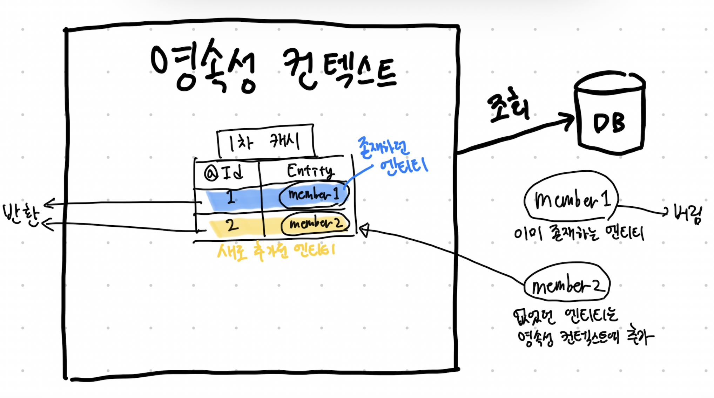

# 객체지향 쿼리 심화

## 벌크 연산

- 벌크 연산을 사용하려면 `executeUpdate()` 메소드를 사용하면 된다.

```java
String jpql = "update Product p set p.price = p.price * 1.1 where p.stockAmount < :stockAmount";

int resultCount  = em.createQuery(jpql)
    .setParameter("stockAmount", 10)
    .executeUpdate();
```

- JPA 표준은 아니지만 하이버네이트는 INSERT도 지원하는데 insert 문을 작성하고 똑같이 `executeUpdate()` 메소드를 사용하면 된다.
- 벌크 연산은 영속성 컨텍스트를 무시하고 진행하기 때문에 주의해야 한다.
    - 데이터 무결성이 깨진다!

## 벌크 연산 데이터 무결성 문제 해결

- `em.refresh()`
    - 벌크 연산을 수행한 직후 `em.refresh()`를 사용하면 해당 엔티티를 데이터베이스에서 다시 조회한다.
    - ex. `em.refresh(productA);`
- 벌크 연산 먼저 실행
    - 벌크 연산을 먼저 실행하고 그 뒤부터 값을 조회하는 방법 (가장 실용적으로 보고 있음)
- 벌크 연산 수행 후 영속성 컨텍스트 초기화
    - 벌크 연산을 실행한 직후 영속성 컨텍스트를 초기화해서 영속성 컨텍스트에 남아 있는 엔티티를 제거하는 것도 좋은 방법이다.
    - 데이터베이스가 아닌 영속성 컨텍스트에 남아 있는 데이터를 읽어올 수도 있기 때문이다.

## 영속성 컨텍스트와 JPQL

- 쿼리 후 영속 상태인 것과 아닌 것
    - 영속 상태인 것: 엔티티
    - 영속 상태가 아닌 것: 엔티티를 제외한 모든 것
- JPQL로 조회한 엔티티와 영속성 컨텍스트
    - JPQL로 조회한 엔티티가 이미 영속성 컨텍스트에 있으면 JPQL로 **데이터베이스에서 조회한 결과를 버리고** 대신에 영속성 컨텍스트에 있던 엔티티를 반환한다.



1. JPQL을 사용해서 조회를 요청
2. JPQL은 SQL로 반환되어 데이터베이스를 조회
3. 조회한 결과와 영속성 컨텍스트를 비교
4. 식별자 값을 기준으로 member1은 이미 영속성 컨텍스트에 있으므로 조회 결과를 버린다.
5. 식별자 값을 기준으로 member2는 영속성 컨텍스트에 없으므로 영속성 컨텍스트에 추가한다.
6. 쿼리 결과인 member1, member2를 영속성 컨텍스트에서 꺼내서 반환한다.

<br/>

### JPQL과 영속성 컨텍스트

- JPQL로 조회한 엔티티는 영속 상태다.
- 영속성 컨텍스트에 이미 존재하는 엔티티가 있으면 기존 엔티티를 반환한다.
    - 이를 통해 영속성 컨텍스트는 영속 상태인 엔티티의 동일성을 보장한다.

### JPQL vs find()

- JPQL은 항상 데이터베이스를 먼저 조회하기 때문에 영속성 컨텍스트를 먼저 확인하는 `EntityManager`의 `find()` 메소드보다 느릴 수 밖에 없다.
- JPQL은 쿼리 결과가 영속성 컨텍스트에 존재하더라도 데이터베이스에서 먼저 조회한 뒤 버리는 식으로 로직이 실행된다.

### JPQL과 Flush Mode

- JPQL은 영속성 컨텍스트에 있는 데이터를 고려하지 않고 데이터를 조회하기 때문에 JPQL을 실행하기 전에 영속성 컨텍스트의 내용을 데이터베이스에 반영해야 한다!
    - 의도하지 않은 문제가 발생할 수 있음!
- 기본 FlushMode는 `FlushModeType.AUTO`다.
    - 커밋 직전이나 쿼리 실행 직전 자동으로 플러시가 호출된다. (따라서 굳이 `em.flush()`를 실행해줄 필요가 없다.)
- 그런데 `FlushModeType.COMMIT`을 사용하는 순간부터 문제가 된다.
    - 커밋 전에만 플러시를 하기 때문에 JPQL로 조회해도 자동으로 플러시가 되지 않는다. => 의도하지 않은 결과가 발생할 수 있다.
    - 따라서 이 옵션은 성능 최적화를 위해 꼭 필요할 때만 사용해야 한다.

### 플러시 모드와 최적화

- `FlushModeType.COMMIT` 모드는 트랜잭션을 커밋할 때만 플러시하고 쿼리를 실행할 때는 플러시하지 않는다.
- 이 모드를 사용하면 쿼리할 때 발생하는 플러시 횟수를 줄여 성능을 최적화할 수 있다.

<br/>

# 참고자료

- 자바 ORM 표준 JPA 프로그래밍, 김영한 지음
