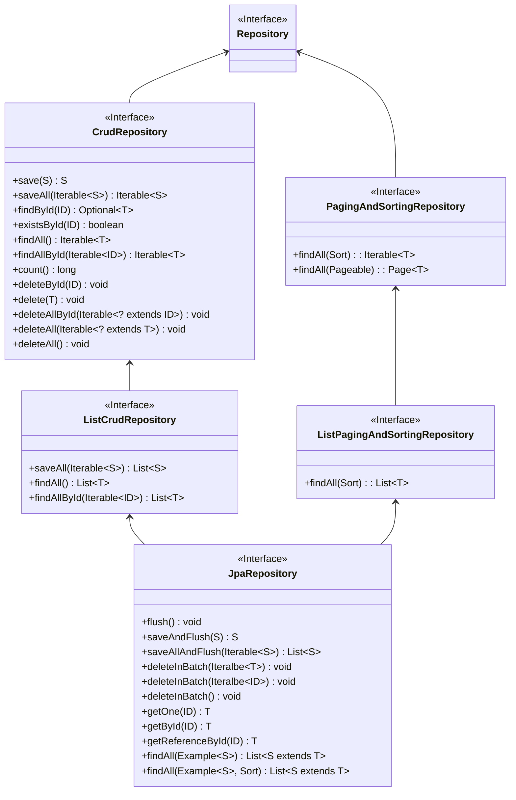

# 12장 스프링 데이터 JPA

## 01 Spring Data

- 스프링 프레임워크에서 JPA를 편리하게 사용할 수 있도록 지원하는 프로젝트.
- 데이터 접근 계층을 개발할 때 구현 클래스 없이 인터페이스만 작성해도 개발을 완료할 수 있다.
- CRUD를 처리하기 위한 공통 메소드는 스프링 데이터 JPA가 제공하는 `org.springframework.data.jpa.repository.JpaRepository` 인터페이스에 정의되어 있다.
  - 인터페이스의 구현체는 런타임에 스프링 데이터 JPA가 생성해 주입해준다. (프록시 패턴)
- 스프링 데이터 프로젝트는 다양한 데이터 저장소를 지원한다.
  - JPA, Redis, MongoDB, NEO4J, Hadoop, Gemfire

### 스프링 데이터 JPA 설정

- 아래와 같이 `org.springframework.data.jpa.repository.config.EnableJpaRepositories` 어노테이션을 추가해줘야 한다.
  - `basePackages` 속성에는 레포지토리를 검색할 패키지 위치를 작성해주면 된다.
  - `basePackages` 기준으로 `JpaRepository`를 상속한 인터페이스를 찾아 구현 클래스를 주입해준다.

```java
@Configuration
@EnableJpaRepository(basePackages = "com.my.shop")
public class JpaConfig {...}
```

<br/>

## 2. 공통 인터페이스 기능

- `JpaRepository` 인터페이스의 계층 구조는 아래와 같다.
- `Repository`, `ListCrudRepository`, `CrudRepository`, `ListPagingAndSortingRepository`, `PagingAndSortingRepository`는 스프링 데이터(`org.springframework.data.repository`)에 속한다.
  - `JpaRepository`는 스프링 데이터 JPA(`org.springframework.data.jpa.repository`)에 속한다.



<br/>

## 3. 쿼리 메소드 기능

- 쿼리 메소드 기능은 3가지가 있다.
1. 메소드 이름으로 쿼리 생성
2. 메소드 이름으로 JPA NamedQuery 호출
3. `@Query` 어노테이션을 사용해서 레포지토리 인터페이스에 쿼리 정의

### 메소드 이름으로 쿼리 생성

- [공식문서](https://docs.spring.io/spring-data/jpa/reference/jpa/query-methods.html)
- 공식문서의 표를 보면 어떻게 사용해야 하는지 쉽게 알 수 있다.
- 심지어 IntelliJ를 사용하면 JPA 문법 추천이 자동으로 뜬다!!

### JPA Named Query

- 스프링 데이터 JPA는 메소드 이름으로 JPA Named 쿼리를 호출하는 기능을 제공한다.

```java
@Entity
@NamedQuery(
    name = "Member.findByUsername",
    query = "select m from Member m where m.username = :username")
public class Member {...}
```

- 위에서 정의한 Named Query를 아래와 같이 사용할 수 있다. (기존에는 EntityManager에서 직접 호출해야 했다.)
  - `도메인 클래스(T)` + "." + `메소드 이름`으로 NamedQuery를 찾는다.
  - NamedQuery를 먼저 찾고 없으면 메소드 이름 전략을 사용한다. (우선순위가 Named Query가 더 높다는 의미)

```java
public interface MemberRepository extends JpaRepository<Member, Long> {
  
  List<Member> findByUsername(@Param("username") String username);
}
```

### @Query

- 아래와 같이 메소드 위에 JPQL을 직접 작성할 수 있다.

```java
public interface MemberRepository extends JpaRepository<Member, Long> {
  
  @Query("select m from Member m where m.username = ?1")
  Member findByUsername(String username);
}
```

- 네이티브 쿼리를 사용할 수도 있다.
  - JPQL은 위치 기반 파라미터 시작이 `1`부터인 반면 네이티브 쿼리는 `0`부터 시작한다.
  - *참고로 스프링 데이터 JPA는 위치 기반 파라미터 바인딘과 이름 기반 파라미터 바인딩 둘 다 지원한다.*

```java
public interface MemberRepository extends JpaRepository<Member, Long> {
  
  @Query(value = "select * from member where username = ?0",
      nativeQuery = true)
  Member findByUsername(String username);
}
```

### 벌크성 수정 쿼리

- 벌크성 수정, 삭제 쿼리는 `@Modifying`을 사용하면 된다.
- 벌크성 쿼리를 실행하고 나서 영속성 컨텍스트를 초기화하고 싶으면 `@Modifying(clearAutomatically = true)` 설정을 해주면 된다. (기본값은 당연히 `false`)

```java
public interface ProductRepository extends JpaRepository<Product, Long> {

  @Modifying
  @Query("update Product p set p.price = p.price * 1.1 where p.stockAmount < :stockAmount")
  int bulkPriceUp(@Param("stockAmount") String stockAmount);
}
```

### 반환 타입

- 단순하다. 한 건 이상이면 컬렉션, 단건이면 엔티티 타입이다.
- 조회 결과가 없으면 컬렉션은 빈 컬렉션, 단건은 `null`을 반환한다.
  - 기존 `EntityManager`로 조회할 때는 한 건도 조회되지 않으면 `NoResultException`이 발생했었는데 스프링 데이터 JPA가 예외를 무시하고 `null` 값을 주는 것이다.

### 페이징과 정렬

- `Sort`와 `Pageable`을 사용하면 된다.
- `Page`를 리턴 값으로 받으면 추가적으로 count 쿼리를 호출한다. (대신 Pageable을 꼭 넘겨야 한다.)
  - `List`를 사용하면 count 쿼리 호출 X

```java
public interface MemberRepository extends JpaRepository<Member, Long> {
  
  Page<Member> findByUsername(String username, Pageable pageable);
}
```

### 힌트

- JPA 쿼리 힌트를 사용하려면 `@QueryHints` 어노테이션을 사용하면 된다.
  - 참고로 SQL 힌트가 아니라 JPA 구현체에게 제공하는 힌트다.

```java
public interface MemberRepository extends JpaRepository<Member, Long> {
  
  @QueryHints(value = {@QueryHint(name = "org.hibernate.readOnly", value = "true")},
      forCounting = true)
  Page<Member> findByUsername(String username, Pageable pageable);
}
```

### Lock

- 쿼리 시 락을 걸려면 `@Lock` 어노테이션을 사용하자. 
- `LockModeType` - 낙관적 락
  - `OPTIMISTIC`: 트랜잭션 시작 시 버전 점검이 수행되고, 트랜잭션 종료 시에도 버전 점검이 수행
  - `OPTIMISTIC_FORCE_INCREMENT`: 낙관적 락을 사용하면서 추가로 버전을 강제로 증가시키는 방법
- `LockModeType` - 비관적 락
  - `PESSIMISTIC_READ`: 다른 트랜잭션에게 읽기만 허용
  - `PESSIMISTIC_WRITE`: 배타 잠금. 다른 트랜잭션이 쓰지도 읽지도 못한다.
  - `PESSIMISTIC_FORCE_INCREMENT`: 배타 잠금. 잠금을 걸고 동시에 버전을 증가시킨다.

```java
public interface MemberRepository extends JpaRepository<Member, Long> {
  
  @Lock(LockModeType.PESSIMISTIC_WRITE)
  List<Member> findByUsername(String username);
}
```

<br/>

# 참고자료

- 자바 ORM 표준 JPA 프로그래밍, 김영한 지음
