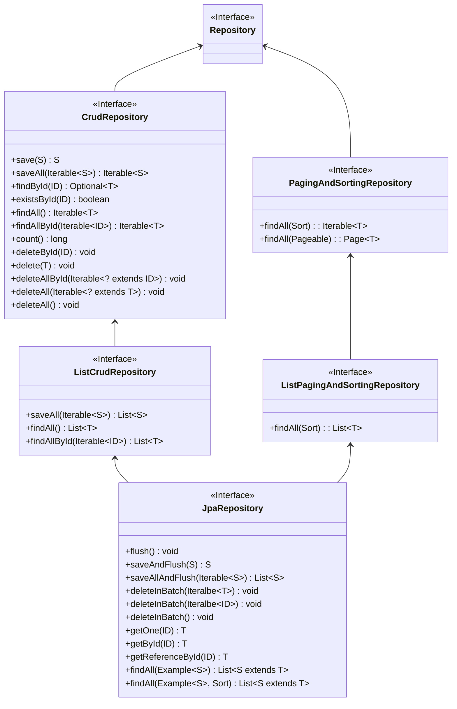

# 12장 스프링 데이터 JPA

## 01 Spring Data

- 스프링 프레임워크에서 JPA를 편리하게 사용할 수 있도록 지원하는 프로젝트.
- 데이터 접근 계층을 개발할 때 구현 클래스 없이 인터페이스만 작성해도 개발을 완료할 수 있다.
- CRUD를 처리하기 위한 공통 메소드는 스프링 데이터 JPA가 제공하는 `org.springframework.data.jpa.repository.JpaRepository` 인터페이스에 정의되어 있다.
  - 인터페이스의 구현체는 런타임에 스프링 데이터 JPA가 생성해 주입해준다. (프록시 패턴)
- 스프링 데이터 프로젝트는 다양한 데이터 저장소를 지원한다.
  - JPA, Redis, MongoDB, NEO4J, Hadoop, Gemfire

### 스프링 데이터 JPA 설정

- 아래와 같이 `org.springframework.data.jpa.repository.config.EnableJpaRepositories` 어노테이션을 추가해줘야 한다.
  - `basePackages` 속성에는 레포지토리를 검색할 패키지 위치를 작성해주면 된다.
  - `basePackages` 기준으로 `JpaRepository`를 상속한 인터페이스를 찾아 구현 클래스를 주입해준다.

```java
@Configuration
@EnableJpaRepository(basePackages = "com.my.shop")
public class JpaConfig {...}
```

<br/>

## 2. 공통 인터페이스 기능

- `JpaRepository` 인터페이스의 계층 구조는 아래와 같다.
- `Repository`, `ListCrudRepository`, `CrudRepository`, `ListPagingAndSortingRepository`, `PagingAndSortingRepository`는 스프링 데이터(`org.springframework.data.repository`)에 속한다.
  - `JpaRepository`는 스프링 데이터 JPA(`org.springframework.data.jpa.repository`)에 속한다.



<br/>

## 3. 쿼리 메소드 기능

- 쿼리 메소드 기능은 3가지가 있다.
1. 메소드 이름으로 쿼리 생성
2. 메소드 이름으로 JPA NamedQuery 호출
3. `@Query` 어노테이션을 사용해서 레포지토리 인터페이스에 쿼리 정의

### 메소드 이름으로 쿼리 생성

- [공식문서](https://docs.spring.io/spring-data/jpa/reference/jpa/query-methods.html)
- 공식문서의 표를 보면 어떻게 사용해야 하는지 쉽게 알 수 있다.
- 심지어 IntelliJ를 사용하면 JPA 문법 추천이 자동으로 뜬다!!

### JPA Named Query

- 스프링 데이터 JPA는 메소드 이름으로 JPA Named 쿼리를 호출하는 기능을 제공한다.

```java
@Entity
@NamedQuery(
    name = "Member.findByUsername",
    query = "select m from Member m where m.username = :username")
public class Member {...}
```

- 위에서 정의한 Named Query를 아래와 같이 사용할 수 있다. (기존에는 EntityManager에서 직접 호출해야 했다.)
  - `도메인 클래스(T)` + "." + `메소드 이름`으로 NamedQuery를 찾는다.
  - NamedQuery를 먼저 찾고 없으면 메소드 이름 전략을 사용한다. (우선순위가 Named Query가 더 높다는 의미)

```java
public interface MemberRepository extends JpaRepository<Member, Long> {
  
  List<Member> findByUsername(@Param("username") String username);
}
```

### @Query

- 아래와 같이 메소드 위에 JPQL을 직접 작성할 수 있다.

```java
public interface MemberRepository extends JpaRepository<Member, Long> {
  
  @Query("select m from Member m where m.username = ?1")
  Member findByUsername(String username);
}
```

- 네이티브 쿼리를 사용할 수도 있다.
  - JPQL은 위치 기반 파라미터 시작이 `1`부터인 반면 네이티브 쿼리는 `0`부터 시작한다.
  - *참고로 스프링 데이터 JPA는 위치 기반 파라미터 바인딘과 이름 기반 파라미터 바인딩 둘 다 지원한다.*

```java
public interface MemberRepository extends JpaRepository<Member, Long> {
  
  @Query(value = "select * from member where username = ?0",
      nativeQuery = true)
  Member findByUsername(String username);
}
```

### 벌크성 수정 쿼리

- 벌크성 수정, 삭제 쿼리는 `@Modifying`을 사용하면 된다.
- 벌크성 쿼리를 실행하고 나서 영속성 컨텍스트를 초기화하고 싶으면 `@Modifying(clearAutomatically = true)` 설정을 해주면 된다. (기본값은 당연히 `false`)

```java
public interface ProductRepository extends JpaRepository<Product, Long> {

  @Modifying
  @Query("update Product p set p.price = p.price * 1.1 where p.stockAmount < :stockAmount")
  int bulkPriceUp(@Param("stockAmount") String stockAmount);
}
```

### 반환 타입

- 단순하다. 한 건 이상이면 컬렉션, 단건이면 엔티티 타입이다.
- 조회 결과가 없으면 컬렉션은 빈 컬렉션, 단건은 `null`을 반환한다.
  - 기존 `EntityManager`로 조회할 때는 한 건도 조회되지 않으면 `NoResultException`이 발생했었는데 스프링 데이터 JPA가 예외를 무시하고 `null` 값을 주는 것이다.

### 페이징과 정렬

- `Sort`와 `Pageable`을 사용하면 된다.
- `Page`를 리턴 값으로 받으면 추가적으로 count 쿼리를 호출한다. (대신 Pageable을 꼭 넘겨야 한다.)
  - `List`를 사용하면 count 쿼리 호출 X

```java
public interface MemberRepository extends JpaRepository<Member, Long> {
  
  Page<Member> findByUsername(String username, Pageable pageable);
}
```

### 힌트

- JPA 쿼리 힌트를 사용하려면 `@QueryHints` 어노테이션을 사용하면 된다.
  - 참고로 SQL 힌트가 아니라 JPA 구현체에게 제공하는 힌트다.

```java
public interface MemberRepository extends JpaRepository<Member, Long> {
  
  @QueryHints(value = {@QueryHint(name = "org.hibernate.readOnly", value = "true")},
      forCounting = true)
  Page<Member> findByUsername(String username, Pageable pageable);
}
```

### Lock

- 쿼리 시 락을 걸려면 `@Lock` 어노테이션을 사용하자. 
- `LockModeType` - 낙관적 락
  - `OPTIMISTIC`: 트랜잭션 시작 시 버전 점검이 수행되고, 트랜잭션 종료 시에도 버전 점검이 수행
  - `OPTIMISTIC_FORCE_INCREMENT`: 낙관적 락을 사용하면서 추가로 버전을 강제로 증가시키는 방법
- `LockModeType` - 비관적 락
  - `PESSIMISTIC_READ`: 다른 트랜잭션에게 읽기만 허용
  - `PESSIMISTIC_WRITE`: 배타 잠금. 다른 트랜잭션이 쓰지도 읽지도 못한다.
  - `PESSIMISTIC_FORCE_INCREMENT`: 배타 잠금. 잠금을 걸고 동시에 버전을 증가시킨다.

```java
public interface MemberRepository extends JpaRepository<Member, Long> {
  
  @Lock(LockModeType.PESSIMISTIC_WRITE)
  List<Member> findByUsername(String username);
}
```

<br/>

### 4. 명세

- 책 "도메인 주도 설계"는 명세(SPECIFICATION)이라는 개념을 소개하는데 스프링 데이터 JPA는 JPA Criteria로 이 개념을 사용할 수 있도록 지원한다.
- `org.springframework.data.jpa.domain.Specification`
- `Specification`은 컴포지트 패턴으로 구성되어 있어서 여러 `Specification`을 조합할 수 있다.
  - 다양한 검색 조건을 조립해서 새로운 검색 조건을 만든다.
- 해당 기능을 사용하기 위해 `JpaSpecificationExecutor` 인터페이스를 상속 받으면 된다.

```java
public interface OrderRepository extends JpaRepository<Order, Long>, JpaSpecificationExecutor<Order> {}
```

```java
public interface JpaSpecificationExecutor<T> {

  Optional<T> findOne(Specification<T> spec);

  List<T> findAll(Specification<T> spec);

  Page<T> findAll(Specification<T> spec, Pageable pageable);

  List<T> findAll(Specification<T> spec, Sort sort);

  long count(Specification<T> spec);

  boolean exists(Specification<T> spec);

  long delete(Specification<T> spec);

  <S extends T, R> R findBy(Specification<T> spec, Function<FluentQuery.FetchableFluentQuery<S>, R> queryFunction);
}
```

- 아래는 명세를 정의한 코드다.

```java
public class OrderSpec {
  
  public static Specification<Order> memberName(final String memberName) {
    return new Specification<Order> () {
      public Predicate toPredicate(Root<Order> root, CriteriaQuery<?> query, CriteriaBuilder builder) {
        if (!StringUtils.hasText(memberName)) {
          return null;
        }
        Join<Order, Member> m = root.join("member", JoinType.INNER);
        return builder.equal(m.get("name"), memberName);
      }
    };
  }

  public static Specification<Order> isOrderStatus() {
    return new Specification<Order> () {
      public Predicate toPredicate(Root<Order> root, CriteriaQuery<?> query, CriteriaBuilder builder) {
        return builder.equal(root.get("status"), OrderStatus.ORDER);
      }
    };
  }
}
```

```java
public List<Order> findOrders(String name) {
  List<Order> result = orderRepository.findAll(where(memberName(name)).and(isOrderStatus()));
  return result
}
```

<br/>

## 5. 사용자 정의 레포지토리 구현

- 스프링 데이터 JPA는 필요한 메소드만 구현할 수 있는 방법을 제공한다.

```java
// 사용자 정의 인터페이스
public interface MemberRepositoryCustom {
  public List<Member> findMemberCustom();
}
```

```java
public class MemberRepositoryImpl implements MemberRepositoryCustom {
  @Override
  public List<Member> findMemberCustom() {
    // 사용자 정의 구현
  }
}
```

- JPA에서는 위에서 정의한 사용자 정의 인터페이스를 상속받으면 사용자 정의 구현을 사용할 수 있다!!

```java
public interface MemberRepository extends JpaRepository<Member, Long>, MemberRepositoryCustom {}
```

<br/>

## 6. Web 확장

- 스프링 데이터가 제공하는 Web 확장 기능을 활성화하려면 `org.springframework.data.web.config.SpringDataWebConfiguration`을 스프링 빈으로 등록하면 된다.
- `JavaConfig`를 사용할 시, `org.springframework.data.web.config.EnableSpringDataWebSupport` 어노테이션을 사용하면 된다.
  - 설정을 완료하면 도메인 클래스 컨버터와 페이징과 정렬을 위한 `HandlerMethodArgumentResolver`가 스프링 빈으로 등록된다.
  - 등록되는 도메인 클래스 컨버터는 `org.springframework.data.repository.support.DomainClassConverter`다.

```java
@Configuration
@EnableWebMvc
@EnableSpringDataWebSupport
public class WebAppConfig {...}
```

### 도메인 클래스 컨버터 기능

- 도메인 클래스 컨버터는 HTTP 파라미터로 넘어온 엔티티의 아이디로 엔티티 객체를 찾아서 바인딩해준다.
- `@RequestParam("id") Member member` 부분을 보면 HTTP 요청으로 회원 아이디를 받고 도메인 클래스 컨버터가 중간 다리 역할을 하여 아이디를 회원 엔티티 객체로 변환해서 넘겨준다.
  - 도메인 클래스 컨버터는 엔티티와 관련된 레포지토리를 사용해 회원 ID로 엔티티를 찾는다.
  - 여기서 찾아온 엔티티를 수정해도 데이터베이스에 적용되지 않는다. (조회된 엔티티가 준영속 상태이기 때문. OSIV와 깊은 관련이 있음.)

```java
@Controller
public class MemberController {
  
  @RequestMapping("member/memberUpdateForm")
  public String memberUpdateForm(@RequestParam("id") Member member, Model model) {
    model.addAttribute("member", member);
    return "member/memberSaveForm";
  }
}
```

### 페이징과 정렬 기능

- 페이징 기능: `PageableHandlerMethodArgumentResolver`
- 정렬 기능: `SortHandlerMethodArgumentResolver`

```java
@Controller
public class MemberController {

  @RequestMapping(value = "/member", method = RequestMethod.GET)
  public String list(pageable pageable, Model model) {
    Page<Member> page = memberService.findMembers(pageable);
    model.addAttribute("members", page.getContent());
    return "members/memberList";
  }
}
```

<br/>

## 7. 스프링 데이터 JPA가 사용하는 구현체

- 스프링 데이터 JPA가 제공하는 공통 인터페이스는 `org.springframwork.data.jpa.repository.support.SimpleJpaRepository` 클래스가 구현된다.
- 특징
  - `@Repository` 적용
  - `@Transactional` 적용
  - 데이터를 조회하는 메소드에는 `@Transactional(readOnly = true)` 적용
  - `save()` 메소드를 보면 저장할 엔티티가 새로운 엔티티면 `persist()`, 이미 있는 엔티티면 `merge()`

```java
@Repository
@Transactional(readOnly = true)
public class SimpleJpaRepository<T, ID> implements JpaRepositoryImplementation<T, ID> {
  
  ...

  @Transactional
  @Override
  public <S extends T> S save(S entity) {

    Assert.notNull(entity, "Entity must not be null");

    if (entityInformation.isNew(entity)) {
      em.persist(entity);
      return entity;
    } else {
      return em.merge(entity);
    }
  }
  
  ...
  
}
```

```java
@NoRepositoryBean
public interface JpaRepositoryImplementation<T, ID> extends JpaRepository<T, ID>, JpaSpecificationExecutor<T> {

	void setRepositoryMethodMetadata(CrudMethodMetadata crudMethodMetadata);

	default void setEscapeCharacter(EscapeCharacter escapeCharacter) {

	}
}
```

<br/>

## 8. 스프링 데이터 JPA와 QueryDSL 통합

- 스프링 데이터 JPA는 2가지 방법으로 QueryDSL을 지원한다.
  - `org.springframework.data.querydsl.QueryDslPredicateExecutor`
  - `org.springframework.data.querydsl.QueryDslRepositorySupport`

### 8-1. QueryDslPredicateExecutor

- 인터페이스는 아래와 같이 정의되어 있다.

```java
public interface QuerydslPredicateExecutor<T> {

	Optional<T> findOne(Predicate predicate);

	Iterable<T> findAll(Predicate predicate);

	Iterable<T> findAll(Predicate predicate, Sort sort);

	Iterable<T> findAll(Predicate predicate, OrderSpecifier<?>... orders);

	Iterable<T> findAll(OrderSpecifier<?>... orders);

	Page<T> findAll(Predicate predicate, Pageable pageable);

	long count(Predicate predicate);

	boolean exists(Predicate predicate);

	<S extends T, R> R findBy(Predicate predicate, Function<FluentQuery.FetchableFluentQuery<S>, R> queryFunction);
}
```

- 아래와 같이 레포지토리에서 `QueryDslPredicateExecutor`를 상속받을 수 있다.

```java
public interface ItemRepository extends JpaRepository<Item, Long>, QueryDslPredicateExecutor<Item> {...}
```

- 이제 `QueryDslPredicateExecutor`에 정의되어 있는 메소드를 사용해 QueryDSL의 검색조건을 사용할 수 있다.
- **하지만 join, fetch를 사용할 수 없다는 문제가 있다.**

```java
@Service
@Transactional
@RequiredArgsConstructor
public class ItemService {
  
  private final ItemRepository itemRepository;
  
  public Iterable<Itme> findItem() {
    QItem item = QItem.item;
    Iterable<Item> result = itemRepository.findAll(
      item.name.contains("상품1").and(item.price.between(10000, 20000))  
    );
  }
}
```

### 8-2. QueryDslRepositorySupport

- QueryDSL의 모든 기능을 사용하려면 JPAQuery 객체를 직접 생성해서 사용하면 된다.
- 이 때 스프링 데이터 JPA가 제공하면 QueryDslRepositorySupport를 상속받아 사용하면 조금 더 편리하게 QueryDSL을 사용할 수 있다.

```java
public interface CustomOrderRepository {
  
  public List<Order> search(OrderSearch orderSearch);
}
``` 

```java
public class OrderRepositoryImpl extends QueryDslRepositorySupport implements CustomOrderRepository {
  public OrderRepositoryImpl() {
    super(Order.class);
  }
  
  @Override
  public List<Order> search(OrderSearch orderSearch) {
    QOrder order = QOrder.order;
    QMember member = QMember.member;
    
    JPQLQuery query = from(order);
    
    if (StringUtils.hasText(orderSearch.getMemberName())) {
      query.leftJoin(order.member, member)
              .where(member.name.contains(orderSearch.getMemberName()));
    }
    
    if (orderSearch.getOrderStatus() != null) {
      query.where(order.status.eq(orderSearch.getOrderStatus()));
    }
    
    return query.fetch(order);
  }
}
```

- 첨언을 하자면, QueryDSL에서 많이 사용하는 `JPAQueryFactory`는 `JPQLQueryFactory`의 구현체이다.

```java
public class JPAQueryFactory implements JPQLQueryFactory {...}
```

- `JPAQuery`는 `JPAQueryBase`를 구현하는데, `JPAQueryBase`가 `JPQLQuery`를 상속받고 있다.

```java
public class JPAQuery<T> extends AbstractJPAQuery<T, JPAQuery<T>> {...}
public abstract class AbstractJPAQuery<T, Q extends AbstractJPAQuery<T, Q>> extends JPAQueryBase<T, Q> {...}
public abstract class JPAQueryBase<T, Q extends JPAQueryBase<T, Q>> extends FetchableSubQueryBase<T, Q> implements JPQLQuery<T> {...}
```

<br/>

# 참고자료

- 자바 ORM 표준 JPA 프로그래밍, 김영한 지음
