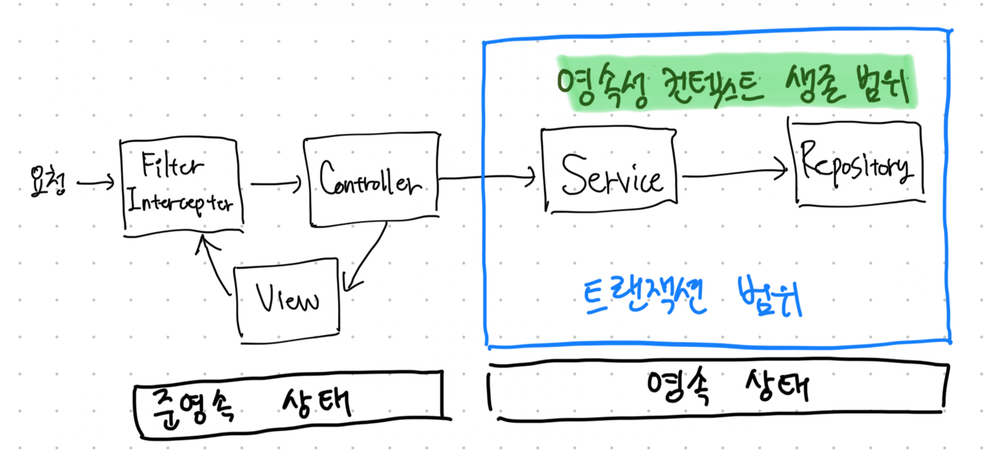

# 13장 웹 애플리케이션과 영속성 관리

- Spring이나 J2EE 컨테이너 환경에서 JPA를 사용하면 컨테이너가 트랜잭션과 영속성 컨텍스트를 관리해주므로 애플리케이션을 손쉽게 개발할 수 있다.

## 1. 트랜잭션 범위의 영속성 컨텍스트

- 순수한 J2SE 환경에서 JPA를 사용하면 개발자가 직접 엔티티 매니저를 생성하고 트랜잭션도 관리해야 한다.
- 하지만 Spring이나 J2EE 컨테이너 환경에서 JPA를 사용하면 컨테이너가 제공하는 전략을 따라야 한다.

### 1-1. 스프링 컨테이너의 기본 전략

- 스프링 컨테이너는 `트랜잭션 범위의 영속성 컨텍스트` 전략을 기본으로 사용한다.
- 이 전략은 이름 그대로 트랜잭션의 범위와 영속성 컨텍스트의 생존 범위가 같다는 뜻이다.
    - 트랜잭션을 시작할 때 영속성 컨텍스트를 생성하고, 트랜잭션이 끝날 때 영속성 컨텍스트를 종료한다.
    - 그리고 같은 트랜잭션 안에서는 항상 같은 영속성 컨텍스트에 접근한다.



- 스프링 트랙잭션 AOP 대상 메소드를 호출하기 직전에 트랜잭션을 시작하고 대상 메소드가 정상 종료되면 트랜잭션을 커밋하면서 종료한다.
- 정상 처리되어 스프링 AOP 트랜잭션이 커밋되면 JPA는 먼저 영속성 컨텍스트를 플러시해서 변경 내용을 DB에 반영하고 DB 트랜잭션을 커밋한다.
- 만약 예외가 발생하면 트랜잭션을 롤백하고 종료한다. 이 때는 플러시를 하지 않는다.

<br/>

## 2. 준영속 상태와 지연 로딩

- 보통 `@Transactional`은 서비스 계층에 많이 걸어 놓는다.
    - 서비스 계층에서 트랜잭션이 종료되면서 영속성 컨텍스트 종료된다.
    - 컨트롤러(준영속) - 서비스(영속) - 레포지포리(영속)
- 만약 지연 로딩이 프리젠테이션 계층에서 발생하면 어떻게 될까? 지연 로딩 시점에 예외가 발생한다.
- 준영속 상태와 변경 감지
    - 변경 감지 기능은 영속성 컨텍스트가 살아 있는 서비스 계층까지만 동작한다.
- 준영속 상태와 지연 로딩
    - 준영속 상태의 가장 골치 아픈 문제는 지연 로딩 기능이 동작하지 않는 점이다.
    - 하이버네이트 구현체에서 준영속 상태인 엔티티의 지연 로딩을 시도하면 `org.hibernate.LazyInitializationException` 예외가 발생한다.
- 준영속 상태의 지연 로딩 문제를 해결하는 방법
    1. 뷰가 필요한 엔티티를 미리 로딩한다.
    2. OSIV를 사용해서 엔티티를 항상 영속 상태로 유지한다.

### 2-1. 엔티티 미리 로딩 - 글로벌 페치 전략 수정

- 가장 간단한 방법은 글로벌 페치 전략을 즉시 로딩으로 변경하는 것이다.
    - `@ManyToOne(fetch = FetchType.EAGER)`
- 글로벌 페치 전략에 즉시 로딩 사용 시 단점은 아래와 같다.

1. 사용하지 않는 엔티티를 로딩한다.
   - 즉시 로딩을 했는데 로직에 따라 사용하는 곳이 있고 사용하지 않는 곳이 있다.
2. N+1 문제가 발생한다.
  - `em.find()`를 사용하면 JOIN 쿼리로 함께 조회하기 때문에 N+1 문제가 발생하지 않는다.
  - 문제는 JPQL을 사용할 때 발생한다. **JPA가 JPQL을 분석해서 SQL을 생성할 때는 글로벌 페치 전략을 참고하지 않고 오직 JPQL 자체만 사용한다.** 따라서 지연 로딩이든 즉시 로딩이든 구분하지 않고 JPQL 쿼리에 충실한 SQL을 만든다.

### 2-2. 엔티티 미리 로딩 - JPQL 페치 조인

- 즉시 로딩 전략은 애플리케이션 전체에 영향을 주므로 너무 비효율적이다.
- FetchJoin은 N+1 문제를 해결하면서 화면에 필요한 엔티티를 미리 로딩하는 현실적인 방법이다.
- JPQL FetchJoin 단점
  - 무분별하게 사용하면 프리젠테이션 계층이 데이터 접근 계층에 침범하는 결과를 낳을 수 있다. (뷰와 레포지토리 간의 논리적인 의존관계 발생)
- 무분별한 최적화로 프리젠테이션 계층과 데이터 접근 계층 간의 의존관계가 급격하게 증가하는 것보다는 적절한 선에서 타협점을 찾는 것이 합리적이다.

### 2-3. 강제로 초기화

- 영속성 컨텍스트가 살아있을 때 프리젠테이션 계층에 필요한 엔티티를 강제로 초기화해서 반환하는 방법이다.

```java
class OrderService {
  
  @Transactional
  public Order findOrder(long id) {
    Order order = orderRepository.findById(id);
    order.getMember().getName(); // 프록시 객체 강제 초기화
    return order;
  }
}
```

- 아니면 하이버네이트의 `org.hibernate.Hibernate.initialize` static 메소드를 사용해 강제로 초기화할 수 있다.

```java
class OrderService {

  @Transactional
  public Order findOrder(long id) {
    Order order = orderRepository.findById(id);
    Hibernate.initialize(order.getMember());
    return order;
  }
}
```

- 초기화 여부는 아래와 같이 확인할 수 있다.

```java
PersistenceUnitUtil persistenceUnitUtil = em.getEntityManagerFactory().getPersistenceUnitUtil();
boolean isLoaded = persistenceUnitUtil.isLoaded(order.getMember());
```

- 하지만 이런 방식은 프리젠테이션 계층이 서비스 계층을 침범하는 상황이다.
- 서비스 계층은 비즈니스 로직에 집중하는 것이 좋다. (표현 계층을 위한 일까지 하는 것은 서비스 계층의 책임이 아니다!)

### 2-4. Facade 계층 추가

- 프리젠테이션 계층과 서비스 계층 사이에 Facade 계층을 하나 더 두는 방법을 사용할 수 있다.
- 뷰를 위한 프록시 초기화를 Facade 계층에서 실행하는 것이다.
- 프록시를 초기화하려면 영속성 컨텍스트가 필요하기 때문에 Facade 계층에서 트랜잭션을 시작해야 한다.
- Facade 계층의 역할과 특징
  - 프리젠테이션 계층과 도메인 모델 계층 간의 논리적 의존성을 분리해준다.
  - 프리젠테이션 계층에서 필요한 프록시 객체를 초기화한다.
  - 서비스 계층을 호출해서 비즈니스 로직을 실행한다.
  - 리포지토리를 직접 호출애서 뷰가 요구하는 엔티티를 찾는다.
- Facade 계층의 단점
  - 최대 단점은 중간에 계층이 하나 더 끼어든다는 점이다. (코드 양이 많아진다.)
  - 단순히 서비스 계층을 호출만 하는 위임 코드가 상당히 많아질 것이다.

### 2-5. 준영속 상태와 지연 로딩의 문제점

- 모든 문제는 엔티티가 프리젠테이션 계층에서 준영속 상태이기 때문에 발생한다.

<br/>

## 3. OSIV

- OSIV(Open Session In View)는 영속성 컨텍스트를 뷰까지 열어둔다는 뜻이다.
  - 영속성 컨텍스트가 뷰에서도 살아있으면 컨트롤러단에서도 지연 로딩이 가능해진다.

### 3-1. 과거 OSIV: 요청 당 트랜잭션

- OSIV의 핵심은 뷰에서도 지연 로딩이 가능하도록 하는 것이다.
- 가장 단순한 구현 방법은 클라이언트의 요청이 들어오자마자 서블릿 필터나 스프링 인터셉터에서 트랜잭션을 시작하고 요청이 끝날 때 트랜잭션도 끝내는 것이다.
- 이것을 요청 당 트랜잭션(Transaction Per Request) 방식의 OSIV라고 한다.
- 요청 당 트랜잭션 방식 OSIV 문제점
  - 만약 보안상의 이유로 고객 이름을 임시로 수정한다면? => 트랜잭션이 살아있기 때문에 영속성 컨텍스트가 해당 수정사항을 DB에 플러시해버린다.
- 이 문제를 해결하려면 프리젠테이션 계층에서 엔티티를 수정하지 못하게 막으면 된다.
 
1. 엔티티를 읽기 전용 인터페이스로 제공
   - 아래와 같이 읽기만 가능한 인터페이스를 제공하는 방법이다.

```java
interface MemberView {
  String getName();
}

@Entity
class Member implements MemberView {...}

class MemberService {
  
  public MemberView getMember(long id) {
    return memberRepository.findById(id);
  }
}
```

2. 엔티티 래핑
  - 엔티티의 읽기 전용 메소드만 가지고 있는 엔티티 래핑 객체를 만들고 이것을 프리젠테이션 계층에 반환하는 방법이다.

```java
class MemberWrapper {
  
  private Member member;
  
  public MemberWrapper(Member member) {
    this.member = member;
  }
  
  // 읽기 전용 메소드만 노출 
  public String getName() {
    return member.getName();
  }
}
```

3. DTO만 반환
  - 가장 전통적인 방법이다.
  - 프리젠테이션 계층에 엔티티가 아닌 DTO를 전달하는 방법이다.
  - 코드 양이 증가한다는 단점이 존재한다. 차라리 프리젠테이션 계층에서는 엔티티를 수정하면 안 된다는 규약을 만드는 것이 더 실용적일 수 있다.

```java
class MemberDto {...}

class MemberService {

  public MemberDto getMember(long id) {
    Member member = memberRepository.findById(id);
    return MemberDto.of(member);
  }
}
```

### 3-2. 스프링 OSIV: 비즈니스 계층 트랜잭션

- 스프링 프레임워크가 제공하는 OSIV 라이브러리
  - 하이버네이트 OSIV 서블릿 필터: `org.springframework.orm.hibernate4.support.OpenSessionInViewFilter`
  - 하이버네이트 OSIV 스프링 인터셉터: `org.springframework.orm.hibernate4.support.OpenSessionInViewInterceptor`
  - JPA OEIV 서블릿 필터: `org.springframework.orm.jpa.support.OpenEntityManagerInViewFilter`
  - JPA OEIV 스프링 인터셉터: `org.springframework.orm.jpa.support.OpenEntityManagerInViewInterceptor`
- ex1. JPA를 사용하면서 서블릿 필터에 OSIV를 적용하고 싶으면 `OpenEntityManagerInViewFilter`를 서블릿 필터에 등록하면 된다.
- ex2. JPA를 사용하면서 스프링 인터셉터에 OSIV를 적용하려면 `OpenEntityManagerInViewInterceptor`를 스프링 인터셉터에 등록하면 된다.
- 동작 원리


1. 클라이언트의 요청이 들어오면 서블릿 필터나 스프링 인터셉터에서 영속성 컨텍스트를 생성한다. 단 이때 트랜잭션을 시작하지는 않는다.
2. 서비스 계층에서 `@Transactional`로 트랜잭션을 시작할 때 미리 생성해둔 영속성 컨텍스트를 찾아와서 트랜잭션을 시작한다.
3. 서비스 계층이 끝나면 트랜잭션을 커밋하고 영속성 컨텍스트를 플러시한다. 이때 트랜잭션은 끝내지만 영속성 컨텍스트는 종료하지 않는다.
4. 컨트롤러와 뷰까지 영속성 컨텍스트가 유지되므로 조회한 엔티티는 영속 상태를 유지한다.
5. 서블릿 필터나 스프링 인터셉터로 요청이 돌아오면 영속성 컨텍스트를 종료한다. 이때 플러시를 호출하지 않고 바로 졸요한다.

- 스프링 비즈니스 계층 트랜잭션 OSIV 특징
  - 영속성 컨텍스트를 프리젠테이션 계층까지 유지한다.
  - 프리젠테이션 계층에는 트랜잭션이 없으므로 엔티티를 수정할 수 없다. => 수정하고 플러시를 해버리면 `jakarta.persistence.TransactionRequiredException`이 발생한다.
  - 프리젠테이션 계층에는 트랜잭션이 없지만 트랜잭션 없이 읽기를 사용해서 지연 로딩을 사용할 수 있다.
- 스프링이 제공하는 OSIV 서블릿 필터나 OSIV 스프링 인터셉터는 요청이 끝나면 플러시를 호출하지 않고 `em.close()`로 영속성 컨텍스트를 종료해버린다.
- 스프링 OSIV 주의사항
  - 그런데 프리젠테이션 계층에서 엔티티를 수정한 직후에 트랜잭션을 시작하는 서비스 계층을 호출하면 문제가 발생할 수 있다.
  - 따라서 트랜잭션이 있는 모든 비즈니스 로직을 호출한 후에 프리젠테이션 계층에서 엔티티를 수정하자.

### OSIV 정리

- OSIV는 클라이언트의 요청이 들어올 때 영속성 컨텍스트를 생성해서 요청이 끝날 때까지 같은 영속성 컨텍스트를 유지한다.
  - 따라서 한 번 조회한 엔티티는 요청이 끝날 때까지 영속 상태를 유지한다.
- 엔티티 수정은 트랜잭션이 있는 계층에서만 동작한다.
  - 트랜잭션이 없는 프리젠테이션 계층은 지연 로딩을 포함해서 조회만 할 수 있다.
- 스프링 OSIV 단점
  - 영속성 컨텍스트를 여러 트랜잭션에서 공유할 수 있다. 특히 트랜잭션 롤백 시 주의해야 한다.
  - 프리젠테이션 계층에서 엔티티를 수정하고나서 비즈니스 로직을 수행하면 엔티티가 수정될 수 있다.
  - 프리젠테이션 계층에서 지연 로딩에 의한 SQL이 실행된다. 따라서 성능 튜닝 시에 확인해야 할 부분이 넓어진다.
- OSIV vs Facade vs Dto
  - 어떤 방법을 사용하든 OSIV를 사용하는 것보다 코드를 많이 작성해야 한다.
- OSIV를 사용하는 방법이 만능은 아니다.
  - OSIV를 사용하면 프리젠테이션 계층에서 엔티티를 유지하면서 객체 그래프를 마음껏 탐색할 수 있다.
  - 하지만 오히려 복잡한 화면을 구성할 때는 이 방법이 효과적이지 않을 수 있다.
  - 예를 들어 통계 화면에서는 통계 데이터를 구상하기 위한 JPQL을 작성해 DTO로 조회하는 것이 효과적이다.
- OSIV는 같은 JVM을 벗어난 원격 상황에서는 사용할 수 없다.
  - 예를 들어 JSON이나 XML을 생성할 때는 지연 로딩을 사용할 수 있지만 원격지인 클라이언트에서 연관된 엔티티를 지연 로딩하는 것은 불가능하다.
  - 결국 클라이언트가 필요한 데이터를 모두 JSON으로 생성해 반환해야 한다.

<br/>

## 4. 너무 엄격한 계층

- 컨트롤러에서 리포지토리를 직접 접근하면 어떨까?

```java
class OrderController {
  public String orderRequest(Order order, Model model) {
    long id = orderService.order(order);
    
    // 리포지토리 직접 접근
    Order orderResult = orderRepository.findOne(id);
    ...
  }
}
```

- OSIV를 사용하기 전에는 프리젠테이션 계층에서 사용할 지연 로딩된 엔티티를 미리 초기화해야 했다.
- 그리고 초기화는 아직 영속성 컨텍스트가 살아있는 서비스 계층이나 Facade 계층이 담당했다.
- 하지만 OSIV를 사용하면 영속성 컨텍스트가 프리젠테이션 계층까지 살아있으므로 미리 초기화할 필요가 없다.
- 따라서 단순한 엔티티 조회는 컨트롤러에서 리포지토리를 직접 호출해도 아무런 문제가 없다.

<br/>

# 참고자료

- 자바 ORM 표준 JPA 프로그래밍, 김영한 지음
