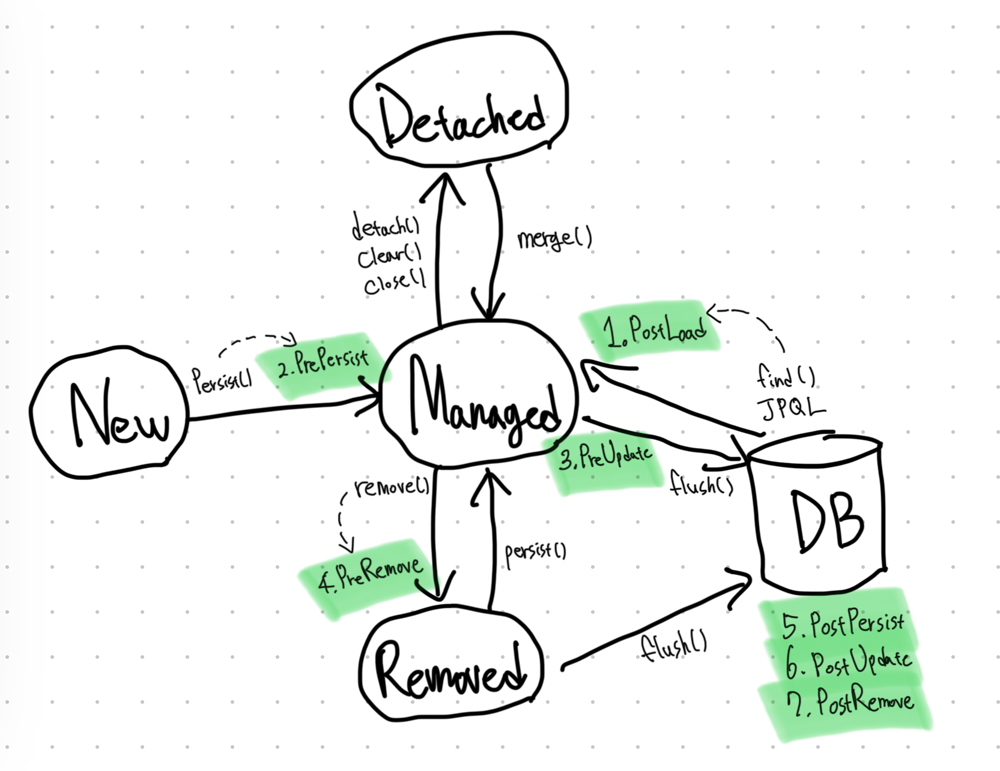

# 14장 컬렉션관 부가 기능

- JPA가 지원하는 컬렉션의 종류와 중요한 부가 기능들
- `Collection`
- `Converter`: 엔티티의 데이터를 변환해서 데이터베이스에 저장
- `Listener`: 엔티티에서 발생한 이벤트를 처리
- `Entity Graph`: 엔티티를 조회할 때 연관된 엔티티를 선택해 함께 조회

## 1. 컬렉션

- JPA는 자바에서 기본으로 제공하는 `Collection`, `List`, `Set`, `Map` 컬렉션을 지원한다.
- `@OneToMany`, `@ManyToMany`를 사용해서 일대다나 다대다 엔티티 관계를 매핑하거나 `@ElementCollection`을 사용해 값 타입을 하나 이상 보관할
  때 사용한다.
- JPA 명세에는 자바 컬렉션 인터페이스에 대한 특별한 언급이 없다. 따라서 JPA 구현체에 따라서 제공하는 기능이 조금씩 다를 수 있다.

> Map은 복잡한 매핑에 비해 활용도가 떨어지는 편이다. Map은 `@MapKey*` 어노테이션으로 매핑할 수 있다.

### 1-1. JPA와 컬렉션

- 아래와 같이 `Collection`을 사용해 매핑한 필드가 있다고 해보자.

```java

@Entity
public class Team {

  @Id
  private String id;

  @OneToMany
  @JoinColumn
  private Collection<Member> members = new ArrayList<>();
}
```

- 영속 상태가 되기 전의 컬렉션과 영속 상태과 되고 난 후의 컬렉션의 클래스를 확인해보자.

```java
Team team=new Team();

    System.out.println(team.getMembers().getClass());
    em.persist(team);
    System.out.println(team.getMembers().getClass());
```

```
class java.util.ArrayList
class org.hibernate.collection.spi.PersistentBag (과거에는 org.hibernate.collection.internal.PersistenBag)
```

- ArrayList였던 타입이 영속 상태가 된 직후에 하이버네이트가 제공하는 `PersistentBag` 타입으로 변경되었다.
- 하이버네이트는 컬렉션을 효율적으로 관리하기 위해 엔티티를 영속 상태로 만들 때 원본 컬렉션을 감싸고 있는 내장 컬렉션을 생성해 이 내장 컬렉션을 사용하도록 참조를 변경한다.
- 하이버네이트가 제공하는 내장 컬렉션은 원본 컬렉션을 감싸고 있어서 래퍼 컬렉션으로도 부른다.
- 하이버네이트는 이런 특징 때문에 컬렉션을 사용할 때 다음처럼 측시 초기화해서 사용하는 것을 권장한다.

```java
private Collection<Member> members = new ArrayList<>();
```

| Collection Interface | PersistentBag | 중복 허용 | 순서 보관 |
|:--:|:--:|:--:|:--:|
| Collection, List | PersistentBag | O | X |
| Set | PersistentSet | X | X |
| List + @OrderColumn | PersistentList | O | O |

### 1-2. Collection, List

- 중복을 허용하는 컬렉션이고 `PersistentBag`를 래퍼 컬렉션으로 사용한다.
- `ArrayList`로 초기화하면 된다.
- 객체에 추가하는 add() 메소드는 내부에서 어떤 비교도 하지 않고 항상 true를 반환한다. 같은 엔티티가 있는지 찾거나 삭제할 때는 `equals()` 메소드를 사용한다.
- 따라서 엔티티를 추가할 때 중복된 엔티티가 있는지 비교하지 않고 단순히 저장만 하면 된다. 따라서 엔티티를 추가해도 지연 로딩된 컬렉션을 초기화하지 않는다.

### 1-3. Set

- 중복을 허용하지 않는 컬렉션이며 하이버네이튼는 `PersistentSet`을 컬렉션 래퍼로 사용한다.
- `HashSet`으로 초기화하면 된다.
- 중복을 허용하지 않으므로 add() 메소드로 객체를 추가할 때마다 `equals()` 메소드로 같은 객체가 있는지 비교한다.
  - 같은 객체가 없으면 객체를 추가하고 `true`를 반환하고, 같은 객체가 이미 있어서 추가에 실패하면 `false`를 반환한다.
  - 참고로 `HashSet`은 Hash Algorithm을 사용하므로 `hashcode()`도 함께 사용해서 비교한다.
- Set은 엔티티를 추가할 때 중복된 엔티티가 있는지 비교해야 한다. 따라서 엔티티를 추가할 때 지연 로딩된 컬렉션을 초기화한다.

### 1-4. List + @OrderColumn

- `List` 인터페이스에 `@OrderColumn`을 추가하면 순서가 있는 특수한 컬렉션으로 인식한다.
- 순서가 있다는 의미는 데이터베이스에 순서 값을 저장해서 조회할 때 사용한다는 말이다.
- 하이버네이트는 내부 컬렉션인 `PersistentList`를 사용한다.

```java
@Entity
public class Board {
  @Id @GeneratedValue
  private Long id;
  
  private String title;
  private String content;
  
  @OneToMany(mappedBy = "board")
  @OrderColumn(name = "position")
  private List<Comment> comments = new ArrayList<>();
}

@Entity
public class Comment {
  @Id @GeneratedValue
  private Long id;
  
  private String comment;
  
  @ManyToOne
  @JoinColumn(name = "board_id")
  private Board board;
}
```

- 순서가 있는 컬렉션은 데이터베이스에 순서 값도 함께 관리한다.
- 여기서는 @OrderColumn의 name 속성에 `position`이라는 값을 줬다. 
  - 아래 `comment` 테이블의 `position` 컬럼과 매핑된다.

| id | comment | board_id | position |
|:--:|:--:|:--:|:--:|
| 1 | "comment1" | 1 | 0 |
| 2 | "comment2" | 1 | 1 |
| 3 | "comment3" | 2 | 0 |
| 4 | "comment4" | 2 | 1 |

- `@OrderColumn`을 사용해 `List`의 위치 값을 보관하면 편리할 것 같지만 실무에서 사용하기에는 단점이 많다.
- 따라서 `@OrderColumn`을 매핑하지 말고 개발자가 직접 `position` 필드를 관리하거나 `@OrderBy`를 사용하는 것을 권장한다.

#### @OrderColumn의 단점

- `@OrderColumn`을 `Board` 엔티티에서 매핑하므로 `comment`는 `position` 값을 알 수 없다.
  - 그래서 `commnet`를 insert할 때는 `position` 값이 저장되지 않는다.
  - `position`은 `board.comments`의 위치 값이므로 이 값을 사용해서 `position`의 값을 update하는 SQL이 추가로 발생한다.
- `List`를 변경하면 연관된 많은 위치 값을 변경해야 한다.
  - 예를 들어 `List`에 comment01부터 comment05까지 있다고 할 때 중간에 있는 comment03을 삭제하면 comment04와 comment05의 position을 값을 각각 하나씩 줄이는 update SQL이 2번 추가로 발생한다.
- 중간에 `position` 값이 없으면 조회한 `List`에는 `null`이 보관된다.
  - 예를 들어 comment03을 데이터베이스 상에서 삭제하고 `position`을 수정하지 않으면 [0, 1, 3, 4]로 남아 중간에 `2`가 없게 된다.
  - 이 때 `List`를 조회하면 `2`번 위치에 `null` 값이 보관된다. => 컬렉션을 순회할 때 `NullPointerException`이 발생해버린다.

### 1-5. @OrderBy

- 데이터베이스의 `order by` 절을 사용해서 컬렉션을 정렬한다. 따라서 순서용 컬럼을 매핑하지 않아도 된다.
- `@OrderBy`는 모든 컬렉션에서 사용할 수 있다.
  - <s>테이블 컬럼명을 대상으로 하지 않고</s> **JPQL처럼 엔티티의 필드를 대상으로 한다.**

```java
@Entity
public class Team {
  
  @Id @GeneratedValue
  private Long id;
  private String name;
  
  @OneToMany(mappedBy = "team")
  @OrderBy("username desc, id asc")
  private Set<Member> members = new ArrayList<>();
}

@Entity
public class Member {
  
  @Id @generatedValue
  private Long id;
  
  private String username;
  
  @ManyToOne
  private Team team;
}
```

<br/>

## 2. @Converter

- 컨버터(converter)를 사용하면 엔티티의 데이터를 변환해서 데이터베이스에 저장할 수 있다.

```sql
create table member (
    id varchar(255) not null,
    username varchar(255),
    vip char not null,
    primary key(id)
)
```

```java
@Entity
public class Member {
  @Id
  private String id;
  private String username;
  
  @Convert(converter=BooleanToYNConverter.class)
  private boolean vip;
}
```

- 위와 같이 테이블에서는 문자 Y, N을 사용하고 엔티티에서는 boolean을 사용하고 싶다고 가정해보자.
- 아래와 같이 컨버터를 구성하면 된다.
  - `@Converter` 어노테이션을 사용하고 `AttributeConverter` 인터페이스를 구현해야 한다.

```java
@Converter
public class BooleanToYNConverter implements AttributeConverter<Boolean, String> {
  
  @Override
  public String convertToDatabaseColumn(Boolean attribute) {
    return (attribute != null && attribute)? "Y": "N";
  }
  
  @Override
  public Boolean convertToEntityAttribute(string dbData) {
    return "Y".equals(dbData);
  }
} 
```

- `convertToDatabaseColumn`: 엔티티의 데이터를 데이터베이스 컬럼에 저장할 데이터로 변환한다.
- `convertToEntityAttribute`:  데이터베이스에서 조회한 컬럼 데이터를 엔티티의 데이터로 변환한다.
- 컨버터를 아래와 같이 클래스 레벨에서도 지정해줄 수 있다.
  - 대신 `attributeName` 속성을 사용해 어떤 필드에 컨버터를 적용할지 명시해야 한다. 

```java
@Entity
@Convert(converter = BooleanToYNConverter.class, attributeName = "vip")
public class Member {
  @Id
  private String id;
  private String username;
  
  private boolean vip;
}
```

### 2-1. 글로벌 설정

- 모든 Boolean 타입에 컨버터를 적용하려면 아래와 같이 `@Converter(autoApply = true)` 옵션을 주면 된다.
- 이제 각 엔티티에 `@Converter`를 지정하지 않아도 모든 Boolean 타입에 대해 자동으로 컨버터가 적용된다.

```java
@Converter(autoApply = true)
public class BooleanToYNConverter implements AttributeConverter<Boolean, String> {
  ...
}
```

## 3. 리스너

- 모든 엔티티를 대상으로 언제 어떤 사용자가 삭제를 요청했는지 로그로 남겨야 하는 요구사항이 있다고 해보자.
  - 이때 애플리케이션 삭제 로직을 하나씩 찾아서 로그를 남기는 것은 너무 비효율적이다.

### 3-1. 이벤트 종류

- 이벤트의 종류와 발생 시점은 아래와 같다.



1. **PostLoad**: 엔티티가 영속성 컨텍스트에 조회된 직후 또는 `refresh`를 호출한 후(2차 캐시에 저장되어 있어도 호출된다.)
2. **PrePersist**: `persist()` 메소드를 호출해서 엔티티를 영속성 컨텍스트에 관리하기 직전에 호출된다. 식별자 생성 전략을 사용한 경우 엔티티에 식별자는 아직 존재하지 않는다. 새로운 인스턴스를 `merge`할 때도 수행된다.
3. **PreUpdate**: `flush`나 `commit`을 호출해서 엔티티를 데이터베이스에 수정하기 직전에 호출된다.
4. **PreRemove**: `remove()` 메소드를 호출해서 엔티티를 영속성 컨텍스트에서 삭제하기 직전에 호출된다. 또한 삭제 명령어로 영속성 전이가 일어날 때도 호출된다. `orphanRemoval`에 대해서는 `flush`나 `commit` 시에 호출된다.
5. **PostPersist**: `plush`나 `commit`을 호출해서 엔티티를 데이터베이스에 저장한 직후에 호출된다. 식별자가 항상 존재한다. 참고로 식별자 생성 전략이 `IDENTITY`면 식별자를 생성하기 위해 `persist()`를 호출하면서 데이터베이스에 해당 엔티티를 저장하므로 이때는 `persist()`를 호출한 직후에 바로 `PostPersist`가 호출된다. 
6. **PostUpdate**: `flush`나 `commit`을 호출해서 엔티티를 데이터베이스에서 수정한 직후에 호출된다.
7. **PostRemove**: `flush`나 `commit`을 호출해서 엔티티를 데이터베이스에서 삭제한 직후에 호출된다.

### 3-2. 이벤트 적용 위치

#### 엔티티에 직접 적용

```java
@Entity
public class Duck {
  @Id @GeneratedValue
  private Long id;
  
  private String name;
  
  @PrePersist
  public void prePersist() {...}
  
  @PostPersist
  public void postPersist() {...}
  
  @PostLoad
  public voic postLoad() {...}
  
  @PreRemove
  public void preRemove() {...}
  
  @PostRemove
  public void postRemove() {...}
}
```

#### 별도의 리스너 등록

```java
@Entity
@EntityListeners(DuckListener.class)
public class Duck {}

public class DuckListener {
  
  @PrePersist
  public void prePersist(Object obj) {...}

  // 특정 타입이 확실하면 특정 타입을 받을 수 있다.
  @PostPersist
  public void postPersist(Duck duck) {...}
}
```

#### 기본 리스너 사용  

- 설정 파일에서 기본 리스너를 적용할 수도 있다.
- 여러 리스너를 등록했을 때 이벤트 호출 순서는 아래와 같다.
  1. 기본 리스너
  2. 부모 클래스 리스너
  3. 리스너
  4. 엔티티

#### 더 세밀한 설정

- `@ExcludeDefaultListeners`: 기본 리스너 무시
- `@ExcludeSuperclassListeners`: 상위 클래스 이벤트 리스너 무시

```java
@Entity
@EntityListeners(DuckListener.class)
@ExcludeDefaultListeners
@ExcludeSuperclassListeners
public class Duck extends BaseEntity {}
```

<br/>

## 4. 엔티티 그래프

- 엔티티 그래프 기능은 엔티티 조회시점에 연관된 엔티티들을 함께 조회하는 기능이다.

### 4-1. Named 엔티티 그래프

- Named 엔티티 그래프는 `@NamedEntityGraph`로 정의한다.

```java
@NamedEntityGraph(name = "Order.withMember", attributeNodes = {
    @NamedAttributeNode("member")
})
@Entity
@Table(name = "orders")
public class Order {
  
  @Id @GeneratedValue
  private Long id;
  
  @ManyToOne(fetch = FetchType.LAZY, optional = false)
  @JoinColumn(name = "member_id")
  private Member member;
}
```

- `@NamedEntityGraph`
  - `name`: 엔티티 그래프의 이름을 정의한다.
  - `attributeNodes`: 함께 조회할 속성을 선택한다. `@NamedAttributeNode`를 사용하고 그 값으로 함께 조회할 속성을 선택하면 된다.
- 지연 로딩으로 설정되어 있지만 엔티티 그래프에서 함께 조회할 속성으로 `member`를 선택했으므로 이 엔티티 그래프를 사용하면 `Order`를 조회할 때 연관된 `Member`도 함께 조회할 수 있다.

### 4-2. em.find()에서 엔티티 그래프 사용

- Named 엔티티 그래프를 사용하려면 정의한 엔티티 그래프를 `em.getEntityGraph`를 통해서 찾아오면 된다.
  - 엔티티 그래프는 JPA의 힌트 기능을 사용해 동작하는데 힌트의 키로 `jakarta.persistence.fetchgraph`를 사용하고 힌트의 값으로 찾아온 엔티티 그래프를 사용하면 된다.

```java
EntityGraph graph = em.getEntityGraph("Order.withMember");
Map hints = new HashMap();
hints.put("jakarta.persistence.fetchgraph", graph);
Order order = em.find(Order.class, orderId, hints);
```

### 4-3. subgraph

- 이번에는 `Order` -> `OrderItem` -> `Item`까지 조회해 보겠다.
- 직접 관리하는 필드가 아니라면 `subgraph`를 사용하면 된다.

```java
@NamedEntityGraph(name = "Order.withAll", attributeNodes = {
    @NamedAttributeNode("member"),
    @NamedAttributeNode(value = "orderItems", subgraph = "orderItems")},
    subgraphs = @NamedSubgraph(name = "orderItems", attributeNodes = {@NamedAttributeNode("item")})
)
@Entity
@Table(name = "orders")
public class Order {
  
  @Id @GeneratedValue
  private Long id;
  
  @ManyToOne(fetch = FetchType.LAZY, optional = false)
  @JoinColumn(name = "member_id")
  private Member member;
  
  @OneToMany(mappedBy = "order", cascade = CascadeType.ALL)
  private List<OrderItem> orderItems = new ArrayList<>();
}

@Entity
public class OrderItem {
  @Id @GeneratedValue
  private Long id;
  
  @ManyToOne(fetch = FetchType.LAZY)
  @JoinColumn(name = "item_id")
  private Item item;
}
```

- 이 엔티티 그래프는 `Order -> Member`, `Order -> OrderItem`, `OrderItem -> Item`의 객체 그래프를 함께 조회한다.
- 이때 `OrderItem -> Item`은 `Order`의 객체 그래프가 아니므로 `subgraphs` 속성으로 정의해야 한다.
- 이제 아래와 같이 조회하면 된다.

```java
Map hints = new HashMap();
hints.put("jakarta.persistence.fetchgraph", em.getEntityGraph("Order.withAll"));
Order order = em.find(Order.class, orderId, hints);
```

- 아래 SQL 문이 실행될 것이다.

```sql
select o.*, m.*, oi.*, i.*
from orders o
    inner join member m on o.member_id = m.id
    left outer join order_item oi on o.id = oi.order_id
    left outer join item i on oi.item_id = i.id
where o.id=?
```

### 4-4 JPQL에서 엔티티 그래프 사용

- JPQL에서 엔티티 그래프를 사용하는 방법은 `em.find()`와 동일하게 힌트만 추가하면 된다.

```java
List<Order> resultList =
  em.createQuery("select o from Order o where o.id = :orderId", Order.class)
        .setParameter("orderId", orderId)
        .setHint("jakarta.persistence.fetchgraph", em.getEntityGraph("Order.withAll"))
        .getResultList();
```

- member와의 관계를 `optional = false`로 두어 필수 관계로 설정했지만 left outer join이 되어버린다.

```sql
select o.*, m.*, oi.*, i.*
from orders o
    left outer join member m on o.member_id = m.id
    left outer join order_item oi on o.id = oi.order_id
    left outer join item i on oi.item_id = i.id
where o.id=?
```

- 만약 inner join을 하고 싶다면 아래와 같이 JPQL에서 명시해줘야 한다.

```jpaql
select o from Order o join fetch o.emember where o.id = :orderId 
```

### 4-5. 동적 엔티티 그래프

- 엔티티 그래프를 동적으로 구성하려면 `createEntityGraph()` 메소드를 사용하면 된다.

```java
EntityGraph<Order> graph = em.createEntityGraph(Order.class);
graph.addAttributeNodes("member");

Map hints = new HashMap();
hints.put("jakarta.persistence.fetchgraph", graph);

Order order = em.find(Order.class, orderId, hints);
```

### 4-6. 엔티티 그래프 정리

#### ROOT에서 시작

- 엔티티 그래프는 항상 조회하는 엔티티의 ROOT에서 시작해야 한다.

#### 이미 로딩된 엔티티

- 영속성 컨텍스트에 해당 엔티티가 이미 로딩되어 있으면 엔티티 그래프가 적용되지 않는다.

#### fetchgraph, loadgraph 차이

- `jakarta.persistence.fetchgraph`는 엔티티 그래프에 선택한 속성만 함께 조회한다.
- `jakarta.persistence.loadgraph`는 선택한 속성뿐만 아니라 글로벌 fetch 모드가 `FetchType.EAGER`로 설정된 연관관계도 포함해서 함께 조회한다.

<br/>

# 참고자료

- 자바 ORM 표준 JPA 프로그래밍, 김영한 지음
