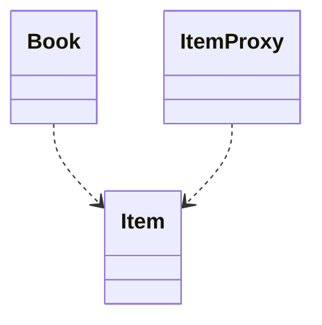
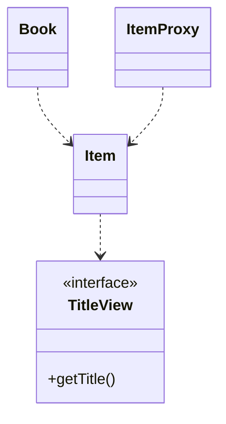
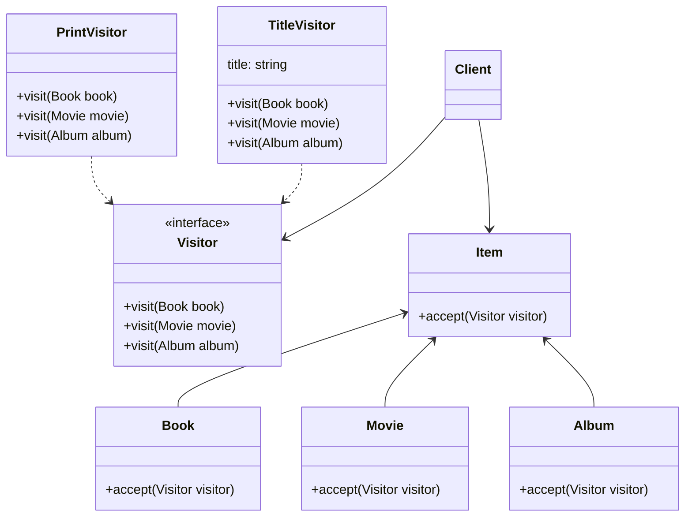

# 15장 고급 주제와 성능 최적화

## 1. 예외처리

### 1-1. JPA 표준 예외

- JPA 표준 예외들은 `jakarta.persistence.PersistenceException`의 자식 클래스다.
    - 또 이 예외 클래스는 `RuntimeException`의 자식이다.
    - 따라서 JPA 예외는 모두 언체크 예외다.
- JPA 표준 예외는 크게 2가지로 나눌 수 있다.
    1. 트랜잭션 롤백을 표시하는 예외
    2. 트랜잭션 롤백을 표시하지 않는 예외
- 트랜잭션 롤백을 표시하는 예외는 심각한 예외이므로 복구해선 안 된다.
    - 이 예외가 발생하면 트랜잭션을 강제로 커밋해도 트랜잭션이 커밋되지 않고 대신에 `jakarta.persistence.RollbackException` 예외가 발생한다.
- 반면 트랜잭션 롤백을 표시하지 않는 예외는 심각한 예외가 아니므로 개발자가 트랜잭션을 커밋할지 롤백할지를 판단하면 된다.

#### 트랜잭션 예외를 표시하는 예외

|Exception|Description|
|:--:|:--:|
|`jakarta.persistence.EntityExistsException`|`EntityManaber.persist()` 호출 시 이미 같은 엔티티가 있으면 발생한다.|
|`jakarta.persistence.EntityNotFoundException`|`EntityManager.getReference()`를 호출했는데 실제 사용 시 엔티티가
존재하지 않으면 발생한다. `refresh()`, `lock()`에서도 발생한다.|
|`jakarta.persistence.OptimisticLockException`|낙관적 락 충돌 시 발생한다.|
|`jakarta.persistence.PessimisticLockException`|비관적 락 충돌 시 발생한다.|
|`jakarta.persistence.RollbackException`|`EntityTransaction.commit()` 실패 시 발생한다. 롤백이 표시되어 있는 트랜잭션 커밋
시에도 발생한다.|
|`jakarta.persistence.TransactionRequiredException`|트랜잭션이 필요할 때 트랜잭션이 없으면 발생한다. 트랜잭션 없이 엔티티를 변경할 때
주로 발생한다.|

#### 트랜잭션 롤백을 표시하지 않는 예외

|Exception|Description|
|:--:|:--:|
|`jakarta.persistence.NoResultException`|`Query.getSingleResult()`를 호출했는데 결과가 하나도 없으면 발생한다.|
|`jakarta.persistence.NonUniqueResultException`|`Query.getSingleResult()`를 호출했는데 결과가 둘 이상이면 발생한다.|
|`jakarta.persistence.LockTimeoutException`|비관적 락에서 시간 초과 시 발생한다.|
|`jakarta.persistence.QueryTimeoutException`|쿼리 실행 시간 초과 시 발생한다.|

### 1-2. 스프링 프레임워크의 JPA 예외 변환

- 서비스 계층에서 데이터 접근 계층의 구현 기술에 직접 의존하는 것은 좋은 설계라고 할 수 없다.
    - 이건 예외도 마찬가지다.
- 예를 들면 `jakarta.persistence.PersistenceException`는 `org.springframework.ormjpa.JpaSystemException`로
  변환한다.

### 1-3. 스프링 프레임워크에 JPA 예외 변환기 적용

- JPA 예외를 스프링 프레임워크가 제공하는 추상화된 예외로 변경하려면 `PersistenceExceptionTranslationPostProcessor`를 스프링 빈으로
  등록하면 된다.

```java

@Configuration
public class JpaConfig {

  @Bean
  public PersistenceExceptionTranslationPostProcessor exceptionTranslation() {
    return new PersistenceExceptionTranslationPostProcessor();
  }
}
```

### 1-4 트랜잭션 롤백 시 주의사항

- 트랜잭션을 롤백하는 것은 데이터베이스의 반영사항만 롤백하는 것이지 수정한 자바 객체까지 원상태로 복구해주지는 않는다.
- 따라서 트랜잭션이 롤백된 영속성 컨텍스트를 그대로 사용하는 것은 위험하다.
- 새로운 영속성 컨텍스트를 생성해 사용하거나 `EntityManager.clear()`를 호출해서 영속성 컨텍스트를 초기화한 다음에 사용해야 한다.
    - 특히 OSIV를 사용할 때 문제가 된다.

<br/>

## 2. 엔티티 비교

- 영속성 컨텍스트 내부에는 엔티티 인스턴스를 보관하기 위한 1차 캐시가 있다. 이 1차 캐시는 영속성 컨텍스트와 생명주기를 같이 한다.
- 영속성 컨텍스를 통해 데이터를 저장하거나 조회하면 1차 캐시에 엔티티가 저장된다.
  - 이 1차 캐시 덕분에 변경 감지 기능도 동작하고 이름 그대로 1차 캐시로 사용되어 데이터베이스를 통하지 않고 데이터를 바로 조회할 수 있다.
- 영속성 컨텍스트를 더 정확히 이해하기 위해서는 1차 캐시의 가장 큰 장점인 **애플리케이션 수준의 반복 가능한 읽기**를 이해해야 한다.
  - 같은 영속성 컨텍스트에서 엔티티를 조회하면 항상 같은 엔티티 인스턴스를 반환한다.
  - 단순히 동등성 비교 수준이 아니라 정말 주소값이 같은 인스턴스를 반환한다.

### 2-1. 영속성 컨텍스트가 같을 때 엔티티 비교

- 영속성 컨텍스트가 같으면 엔티티를 비교할 때 다음 3가지 조건이 모두 만족한다.
1. 동일성 identical: `==` 비교가 같다.
2. 동등성 equivalent: `equals()` 비교가 같다.
3. 데이터베이스 동등성: @Id인 데이터베이스 식별자가 같다.

### 2-2. 영속성 컨텍스트가 다를 때 엔티티 비교

- 영속성 컨텍스트가 다를 때 엔티티 비교는 아래와 같다.
1. 동일성 비교에 실패한다.
2. 동등성 비교를 성공하기 위해 `equals()`를 구현해야 한다. (비즈니스 키)
3. 데이터베이스 동등성은 만족한다.

<br/>

## 3. 프록시 심화 주제

- 프록시는 원본 엔티티를 상속받아 만들어지므로 엔티티를 사용하는 클라이언트는 엔티티가 프록시인지 아니면 원본 엔티티인지 구분하지 않고 사용할 수 있다.

### 3-1.영속성 컨텍스트와 프록시

- 영속성 컨텍스트는 자신이 관리하는 영속 엔티티의 동일성을 보장한다.
- 그렇다면 프록시로 조회한 엔티티의 동일성도 보장할까?

```java
Member refMember = em.getReference(Member.class, "member1");
Member foundMember = em.find(Member.class, "member1");
```

- 결론적으로는 보장한다. 위의 경우 프록시 객체로 동일하다.
- `find`로 찾을 때 영속성 컨텍스트가 원본이 아닌 프록시를 반환해주기 때문이다.
- 반대로 하면 어떨까?

```java
Member foundMember = em.find(Member.class, "member1");
Member refMember = em.getReference(Member.class, "member1");
```

- `find`로 원본 엔티티를 영속성 컨텍스트가 들고 있기 때문에 ref로 조회해도 프록시가 아닌 원본 엔티티를 반환받게 된다.

### 3-2. 프록시 타입 비교

- 프록시로 조회한 엔티티와 타입을 비교할 때는 `==` 비교 대신에 `instanceof`를 사용해야 한다.
  - 프록시는 원본 엔티티를 상속받아 만들어지기 때문이다.

### 3-3. 프록시 동등성 비교

- 엔티티의 동등성을 비교하려면 `equals()` 메소드를 오버라이딩하고 비교하면 된다.
- 그런데 프록시면 문제가 생길 수 있다. 아래 코드의 문제가 무엇일까?

```java
@Entity
public class Member {
  
  @Id
  private String name;
  
  @Override
  public boolean equals(Object obj) {
    if (this == obj) return true;
    if (obj == null) return false;
    if (this.getClass() != obj.getClass()) return false; // 문제1
    
    Member member = (Member) obj;
    // 문제2
    if (name != null ? !name.equals(member.name): member.name != null) {
      return false;
    }
    return true;
  }
}
```

1. `==` 비교는 `instanceof`로 바꿔줘야 한다.
  - `if (!(obj instanceof Member)) return false;`
2. 멤버 변수는 직접 접근하지 않고 getter를 통해 접근해야 한다.
  - `if (name != null? !name.equals(member.getName()): member.getName() != null return false;`

### 상속관계와 프록시

- 프록시를 부모 타입으로 조회하면 문제가 발생한다.
- 프록시를 부모 타입으로 조회하면 부모 타압을 기반으로 프록시가 생성된다. 



- 결과적으로 프록시를 `instanceof` 연산을 사용할 수 없게 되고 하위 타입으로 다운캐스팅 할 수 없다는 문제가 있다.

#### JPQL로 대상 직접 조회

- 가장 간단한 방법은 처음부터 자식 타입을 직접 조회하는 것이다.
- 대신 다형성을 활용할 수 없다는 단점이 있다.

#### 프록시 걷어내기

- 아래와 같이 프록시를 걷어내고 원본엔티티를 받아오는 방법을 사용할 수도 있다.

```java
public class ProxyUtils {
  
  // 하이버네이트가 제공하는 프록시에서 원본 엔티티를 찾는 기능을 수행
  public static <T> T unProxy(Object entity) {
    if (entity instanceof HibernateProxy) {
      entity =  ((HibernateProxy) entity)
              .getHibernateLazyInitializer()
              .getImplemetation();
    }
    return (T) entity;
  }
}
```

- 이 방법은 프록시에서 원본 엔티티를 직접 꺼내기 때문에 프록시와 원본 엔티티의 동일성 비교가 실패한다는 문제점이 있다.
  - 영속성 컨텍스트에서는 프록시를 가지고 있을 것이고, 비즈니스 계층에서 사용하는 것은 원본 엔티티이기 때문!

#### 기능을 위한 별도의 인터페이스 제공

- 아래와 같이 인터페이스를 제공하고 각각의 클래스가 자신에 맞는 기능을 구현하는 것은 다형성을 활용하는 좋은 방법이다.
- 이 방법을 사용할 때는 프록시의 특징 때문에 프록시의 대상이 되는 타입에 인터페이스를 적용해야 한다.



#### 비지터 패턴 사용



```java
public interface Visitor {
  void visit(Book book);
  void visit(Movie movie);
  void visit(Album album);
}
```

```java
public class PrintVisitor implements Visitor {
  
  @Override
  public void visit(Book book) {...}

  @Override
  public void visit(Album album) {...}

  @Override
  public void visit(Movie movie) {...}
}

public class TitleVisitor implements Visitor {

  private String title;
  
  public String getTitle() {
    return title;
  }
  
  @Override
  public void visit(Book book) {...}

  @Override
  public void visit(Album album) {...}

  @Override
  public void visit(Movie movie) {...}
}
```

```java
@Entity
@Inheritance(strategy = IngeritanceType.SINGLE_TABLE)
@DiscirminatorColumn(name = "DTYPE")
public abstract class Item {
  @Id
  @GeneratedValue
  private Long id;
  
  private String name;
  
  public abstract void accept(Visitor visitor);
}

@Entity
@DiscriminatorValue("B")
public class Book extends Item {
  private String author;
  private String isbn;
  
  @Override
  public void accept(Visitor visitor) {
    visitor.visit(this);
  }
}
```

- 자식 클래스들은 부모에 정의한 `accept(visitor)` 메소드를 구현한다.
  - 구현 내용은 단순히 파라미터로 넘어온 `Visitor`의  `visit(this)`를 호출하면서 자신을 파라미터로 넘기는 것이 전부다.

#### 비지터 패턴과 확장성

- 비지터 패턴은 새로운 기능이 필요할 때 새로운 `Visitor`만 추가하면 된다.
- 따라서 기존 코드의 구조를 변경하지 않고 기능을 추가할 수 있다는 장점이 있다.
- 비지터 패턴의 장점을 정리하자면 아래와 같다.

1. 프록시에 대한 걱정 없이 안전하게 원본 엔티티에 접근할 수 있다.
2. `instanceof`와 타입캐스팅 없이 코드를 구현할 수 있다.
3. 알고리즘과 객체 구조를 분리해서 구조를 수정하지 않고 새로운 동작을 추가할 수 있다.

- 단점은 아래와 같다.

1. 너무 복자하고 더플 디스패치를 사용하기 때문에 이해하기 어렵다.
2. 객체 구조가 변경되면 모든 `Visitor`를 수정해야 한다.

<br/>

## 4. 성능 최적화

### 4-1. N+1 문제

#### 즉시 로딩

```java
@Entity
public class Member {
  
  @Id
  @GeneratedValue
  private Long id;
  
  @OneToMany(mappedBy = "member", fetch = FetchType.EAGER)
  private  List<Order> orders = new ArrayList<Order>();
}
```

- `em.find()` 메소드로 조회하면 즉시 로딩으로 설정한 정보도 함께 조회하기 때문에 N+1 문제가 발생하지 않는다
- 하지만 아래와 같이 JPQL이 들어가는 순간 `FetchType.EAGER`로 설정해도 N+1 문제가 발생한다.

```java
List<Member> members =
      em.createQuery("select m from Member m", Member.class)
        .getResultList();
```

- member 데이터가 5개 들어가 있고 각각 주문이 하나씩 들어가 있다고 가정해보자.
- 이제 쿼리가 실행되면 member의 수만큼 아래와 같이 연관된 주문을 조회하는 쿼리를 하나씩 실행해버린다.

```sql
select * from member;
select * from orders where member_id = 1;
select * from orders where member_id = 2;
select * from orders where member_id = 3;
select * from orders where member_id = 4;
select * from orders where member_id = 5;
```

#### 지연 로딩

- 지연 로딩 역시 N+1 문제가 발생한다.
- 객체 그래프를 나중에 탐색하거나 연관된 컬렉션을 반복문을 통해 꺼내게 되면 초기화하는 수만큼 SQL이 실행되어 N+1 문제가 발생해버린다.

#### 페치 조인

- 페치 조인을 사용하면 N+1 문제를 방지할 수 있다.

```jpaql
select m from Member m join fetch m.orders
```

- 위 JPQL은 아래 쿼리로 실행된다.

```sql
select m.*, o.* from member m
    inner join orders o on m.id=o.member_id;
```

#### 하이버네이트 @BatchSize

- 하이버네이트가 제공하는 `org.hibernate.annotations.BatchSize` 어노테이션을 사용해 N+1 문제를 해결할 수 있다.
- 연관된 엔티티를 조회할 때 지정한 size만큼 SQL의 IN절을 사용해서 조회한다.
  - 만약 조회한 회원이 10명인데 size=5로 지정하면 2번의 SQL만 추가로 실행된다.

```java
@Entity
public class Member {
  
  @BatchSize(size = 5)
  @OneToMany(mappedBy = "member", fetch = FetchType.EAGER)
  private List<Order> orders = new ArrayList<Order>();
}
```

- 지연 로딩으로 설정하면 지연 로딩된 엔티티를 최초 사용하는 시점에 다음 SQL을 실행해서 5건의 데이터를 미리 로딩해둔다.
- 그리고 6번째 데이터를 사용하면 다음 SQL을 추가로 실행한다.

```sql
select * from orders
    where member_id in (?, ?, ?, ?, ?);
```

> 참고
> - `hibernate.default_batch_fetch_size` 속성을 사용하면 애플리케이션 전체에 기본으로 `@BatchSize`를 적용할 수 있다.

```yaml
spring:
  jpa:
    properties:
      hibernate.default_batch_fetch_size: 1000
```

#### 하이버네이트 @Fetch(FetchMode.SUBSELECT)

- 하이버네이트가 제공하는 `org.hibernate.annotations.Fetch` 어노테이션에 `FetchMode`를 `SUBSELECT`로 사용하면 연관된 데이터를 조회할 때 서브 쿼리를 사용해 N+1 문제를 해결한다.

```java
@Entity
public class Member {
  ...
  
  @Fetch(FetchMode.SUBSELECT)
  @OneToMany(mappedBy = "member", fetch = FetchType.EAGER)
  private List<Order> orders = new ArrayList<>();
}
```

- JPQL을 실행해보면

```jpaql
select m from Member m where m.id > 10;
```

- 아래와 같이 SQL이 서브 쿼리로 실행된다.
  - 즉시 로딩으로 설정하면 조회 시점에
  - 지연 로딩으로 설정하면 엔티티를 사용하는 시점에

```sql
select o from orders o
    where o.member_id in (
        select m.id from member m where m.id > 10);
```

#### 정리

- 가장 추천하는 방법은 지연 로딩은만 사용하는 것

### 4-2. 읽기 전용 쿼리의 성능 최적화

- 엔티티가 영속성 컨텍스트에 관리되면 1차 캐시부터 변경 감지까지 얻을 수 있는 혜택이 많다.
- 하지만 영속성 컨텍스트는 변경 감지를 위해 스냅샷 인스턴스를 보관하므로 더 많은 메모리를 사용해야 한다는 단점이 있다.
- 읽기 전용으로 엔티티를 조회하면 메모리 사용량을 최적화할 수 있다.

#### 스칼라 타입으로 조회

- 영속성 컨텍스트에서는 엔티티만 관리한다.
- 프로젝션으로 조회하면 영속성 컨텍스트에서 관리하지 않는다.

#### 읽기 전용 쿼리 힌트 사용

- `org.hibernate.readOnly`라는 하이버네이트 전용 힌트를 사용할 수 있다.
  - 이렇게 조회하면 영속성 컨텍스트는 스냅샷을 보관하지 않는다.

```java
TypedQuery<Order> query = em.createQuery("select o from Order o", Order.class);
query.setHint("org.hibernate.readOnly", true);
```

#### 읽기 전용 트랜잭션 사용

- 아래와 같이 `@Transactional` 어노테이션을 사용해 읽기 전용 모드로 설정할 수 있다.

```java
@Service
@Transactional(readOnly = true)
public class OrderService {...}
```

- 이렇게 하면 강제로 플러시를 호출하지 않는 한 플러시가 일어나지 않는다.
- 따라서 트랜잭션을 커밋해도 영속성 컨텍스트를 플러시하지 않는다.
  - 플러시할 때 일어나는 스냅샷 비교와 같은 무거운 로직들을 수행하지 않으므로 성능이 향상된다.
  - 물론 트랜잭션이 시작되므로 트랜잭션 시작, 로직 수행, 트랜잭션 커밋의 과정은 이뤄진다.

#### 트랜잭션 밖에서 읽기

- 트랜잭션 없이 엔티티를 조회하는 방법이다. 조회가 목적일 때만 사용해야 한다.

```java
@Transactional(propagation = Propagation.NOT_SUPPORTED)
```

#### 정리

- 가장 효과적인 방법인 `읽기 전용 트랜잭션`과 `읽기 전용 쿼리 힌트`를 동시에 사용하는 것이다.
  - `읽기 전용 트랜잭션`: 플러시가 일어나지 않게 함
  - `읽기 전용 쿼리 힌트`: 메모리 최적화

### 4-3. 배치 처리

#### JPA 등록 배치

- 수천에서 수만 건 이상의 엔티티를 한 번에 등록할 때 주의할 점은 영속성 컨텍스트에 엔티티가 계속 쌓이지 않도록 일정 단위마다 영속 컨텍스트의 엔티티를 데이터베이스에 플러시하고 초기화해야 한다.
  - 만약 영속성 컨텍스트에 너무 많은 엔티티가 저장되면 메모리 부족 오류가 발생할 수 있다.

#### JPA 페이징 배치 처리

- 반복문을 통해 페이징 하는 방식이다.
- 각 페이징을 조회하고 `em.flush()`와 `em.clear()`를 통해 플러시와 초기화를 실행한다.
- 그리고 다음 반복문에서 동일하게 로직을 실행한다.

#### 하이버네이트 scroll 사용

- 하이버네이트는 `scroll`이라는 이름으로 JDBC 커서를 지원한다.

#### 하이버네이트 무상태 세션 사용

- 무상태 세션은 영속성 컨텍스트가 없다.
- 대신 `update()` 메소드를 직접 호출해야 한다.

### 4-4. SQL 쿼리 힌트 사용

- SQL 힌트는 하이버네이트 쿼리가 제공하는 `addQueryHint()` 메소드를 사용한다.

```java
Session session = em.unwrap(Session.class);

List<Member> members = session.createQuery("select m from Member m")
        .addQueryHint("FULL (MEMBER)")
        .list();
```

### 4-5 트랜잭션을 지원하는 쓰기 지연과 성능 최적화

#### 트랜잭션을 지원하는 쓰기 지연과 JDBC 배치

- `hibernate.jdbc.batch_size`를 통해 배치 사이즈를 설정할 수 있다. 
  - 데이터 등록, 수정, 삭제할 때 SQL 쿼리를 얼마나 모아서 실행할 것인가

> IDENTITY 식별자 생성 전략은 엔티티를 데이터베이스에 저장해야 식별자를 구할 수 있으므로 `em.persist()`를 호출하는 즉시 INSER SQL이 데이터베이스에 전달된다. 따라서 쓰기 지연을 활용한 성능 최적화를 할 수 없다.

#### 트랜잭션을 지원하는 쓰기 지연과 애플리케이션 확장성

- JPA는 커밋을 해야 플러시를 호출하고 데이터베이스에 수정 쿼리르 보낸다.
- 쿼리를 보낵 바로 트랜잭션을 커밋하므로 결과적으로 데이터베이스에 락이 걸리는 시간을 최소화한다.

<br/>

# 참고자료

- 자바 ORM 표준 JPA 프로그래밍, 김영한 지음
