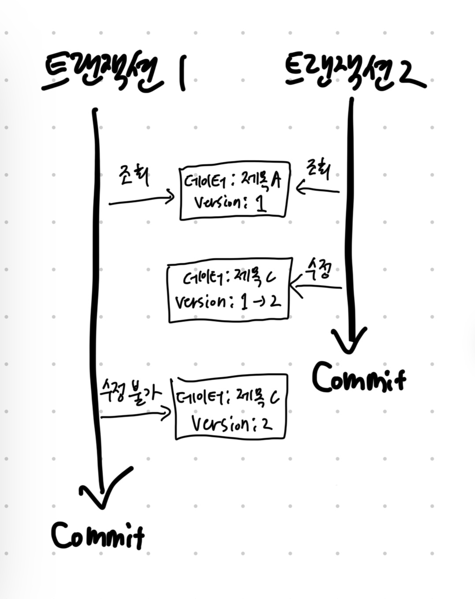
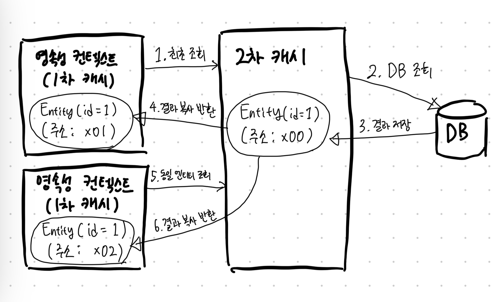

# 16장 트랜잭션과 락, 2차 캐시

## 1. 트랜잭션과 락

### 1-1. 트랜잭션과 격리 수준

#### 트랜잭션 ACID 원칙

- `원자성 Atomicity`: 트랜잭션 내에서 실행한 작업들은 마치 하나의 작업인 것처럼 모두 성공하거나 실패해야 한다.
- `일관성 Consistency`: 모든 트랜잭션은 일관성 있는 데이터베이스 상태를 유지해야 한다. 예를 들어 데이터베이스에서 정한 무결성 제약 조건을 항상 만족해야 한다.
- `격리성 Isolation`: 동시에 실행되는 트랜잭션들이 서로에게 영향을 미치지 않도록 격리한다. 예를 들어 동시에 같은 데이터를 수정하지 못하도록 해야 한다. 격리성은 동시성과 관련된 성능 이슈로 인해 격리 수준을 선택할 수 있다.
- `지속성 Durability`: 트랜잭션을 성공적으로 끝내면 그 결과가 항상 기록되어야 한다. 중간에 시스템에 문제가 발생해도 데이터베이스 로그 등을 사용해서 성공한 트랜잭션 내용을 복구해야 한다.ㄴ

#### 격리 수준

- 트랜잭션 격리 수준이 아래와 같이 4가지를 지원한다.
1. READ UNCOMMITTED
2. READ COMMITTED
3. REPEATABLE READ
4. SERIALIZABLE

> - 트랜잭션 격리 수준에 따른 동작 방식은 데이터베이스마다 조금씩 다르다.
> - 데이터베이스들이 더 많은 동시성을 처리하기 위해 락보다는 MVCC를 사용하므로 락을 사용하는 데이터베이스와 양간 다른 특성을 지닌다.

### 1-2. 낙관적 락과 비관적 락

#### 낙관적 락

- `낙관적 락`은 이름 그대로 트랜잭션 대부분은 충돌이 발생하지 않는다고 낙관적으로 가정하는 방법이다.
- JPA가 제공하는 버전 관리 기능을 사용해 처리할 수 있다. (애플리케이션이 제공하는 락)
- 낙관적 락은 트랜잭션을 커밋하기 전까지는 트랜잭션의 충돌을 알 수 없다는 특징이 있다.

#### 비관적 락

- `비관적 락`은 이름 그대로 트랜잭션의 충돌이 발생한다고 가정하고 우선 락을 걸고 보는 방법이다.
- 데이터베이스가 제공하는 락 기능을 사용한다.
- 대표적으로 `select for update` 구문이 있다.

#### 두 번의 갱신 분실 문제 second lost updates problem

- 두 번의 갱신 분실 문제는 데이터베이스 트랜잭션의 범위를 넘어선다. 트랜잭션만으로는 문제를 해결할 수 없다는 얘기다.
- 이때는 아래 3가지 방법 중 하나를 선택할 수 있다.

1. **마지막 커밋만 인정하기**
2. **최초 커밋만 인정하기**
3. **충돌되는 갱신 내용 병합하기**

- 기본적으로 **마지막 커밋만 인정하기** 방식이 사용된다.
- JPA가 제공하는 버전 관리 기능을 사용해 손쉽게 **최초 커밋만 인정하기** 기능을 구현할 수 있다.

### 1-3. @Version

- `@Version`의 적용 가능 타입은 아래와 같다.
  - `Lon`
  - `Integer`
  - `Short`
  - `Timestamp`
- 아래는 코드 예시이다.

```java
@Entity
public class Board {
  @Id
  private String id;
  private String title;
  
  @Version
  private Integer version;
}
```

- 위와 같이 `@Version`을 붙여 놓으면 엔티티를 수정할 때마다 버전이 하나씩 자동으로 증가한다.
- 그리고 엔티티를 수정할 때 조회 시점의 버전과 수정 시점의 버전이 다르면 예외가 발생한다.



- 트랜잭션2가 커밋되면 `version`이 2로 올라간 상태로 데이터베이스에 저장된다.
- 트랜잭션1에서 엔티티를 조회할 때와 버전(`1`)과 데이터베이스의 버전(`2`)이 다르므로 예외가 발생한다.
- 따라서 버전 정보를 사용하면 **최초 커밋만 인정하기**가 적용된다.

#### 버전 정보 비교 방법

- 아래와 같은 쿼리로 비교를 진행하게 된다.

```sql
UPDATE BOARD
SET
    TITLE=?,
    VERSION=? # (버전 +1 증가)
WHERE
    ID=?
    AND VERSION # (버전 비교)
```

- 데이터베이스 버전과 엔티티 버전이 같으면 데이터를 수정하면서 동시에 버전도 하나 증가시킨다.
- 만약 데이터베이스에 버전이 이미 증가해서 수정 중인 엔티티의 버전과 다르면 UPDATE 쿼리의 WHERE 문에서 VERSION 값이 다르므로 수정할 대상이 없다.
  - 이때는 버전이 이미 증가한 것으로 판단해서 JPA가 예외를 발생시킨다.
- `@Version`으로 추가한 버전 관리 필드는 JPA가 직접 관리하므로 개발자가 임의로 수정하면 안 된다.
- 만약 버전 값을 강제로 증가하려면 특별한 락 옵션을 선택하면 된다.

### 1-4. JPA 락 사용

- 락은 다음 위치에 적용할 수 있다.
  - `EntityManager.lock()`
  - `EntityManager.find()`
  - `EntityManager.refresh()`
  - `Query.setLockMode()` => `TypeQeury`도 포함
  - `@NamedQuery`

- 아래는 즉시 락을 거는 방법이다.

```java
em.find(Board.class, id, LockModeType.OPTIMISTIC);
```

- 반면 아래와 같이 필요할 때 락을 걸 수도 있다.

```java
Board board = em.find(Board.class, id);
...
em.lock(board, LockModeType.OPTIMISTIC);
```

### 1-5. JPA 낙관적 락

- JPA가 제공하는 낙관적 락은 `@Version`을 사용한다.
- 낙관적 락에서 발생하는 예외는 아래와 같다.
  - `jakarta.persistence.OptimisticLockException` (JPA 예외)
  - `org.hibernate.StaleObjectStateException` (하이버네이트 예외)
  - `org.springframework.orm.ObjectOptimisticLockingFailureException` (스프링 예외 추상화)

#### LockModeType.NONE

- 락 옵션을 적용하지 않아도 엔티티에 `@Version`이 적용된 필드만 있으면 낙관적 락이 적용된다.

#### LockModeType.OPTIMISTIC

- `@Version`만 적용했을 때는 엔티티를 수정해야 버전을 체크하지만 이 옵션을 추가하면 엔티티를 조회만 해도 버전을 체크한다.
- 쉽게 이야기해서 한 번 조회한 엔티티는 트랜잭션을 종료할 때까지 다른 트랜잭션에서 변경하지 않음을 보장한다.

#### LockModeType.OPTIMISTIC_FORCE_INCREMENT

- 낙관적 락을 사용하면서 버전 정보를 강제로 증가시킨다.
- 엔티티를 수정하지 않아도 버전 정보를 강제로 증가시킨다. 이때 데이터베이스의 버전이 엔티티의 버전과 다르면 예외가 발생한다.

### 1-6. JPA 비관적 락

- JPA가 제공하는 비관적 락은 데이터베이스 트랜잭션 락 매커니즘에 의존하는 방법이다.
- 주로 SQL 쿼리에 `select for update` 구문을 사용하면서 시작하고 버전 정보는 사용하지 않는다.
- 비관적 락 모드는 주로 `PESSIMISTIC_WRITE` 모드를 사용한다.

#### 비관적 락의 특징

- 엔티티가 아닌 스칼라 타입을 조회할 때도 사용할 수 있다.
- 데이터를 수정하는 즉시 트랜잭션 충돌을 감지할 수 있다.

#### PESSIMISTIC_WRITE

- 비관적 락이라 하면 일반적으로 이 옵션을 뜻한다. 데이터베이스에 쓰기 락을 걸 때 사용한다.

#### PESSIMISTIC_READ

- 데이터를 반복 읽기만 하고 수정하지 않는 용도로 락을 걸 때 사용한다. 일반적으로 잘 사용하지 않는다.

#### PESSIMISTIC_FORCE_INCREMENT

- 비관적 락 중 유일하게 버전 정보를 사용한다.
- 비관적 락이지만 버전 정보를 강제로 증가시킨다.

#### 비관적 락과 타임아웃

- 비관적 락을 사용하면 락을 획득할 때까지 트랜잭션이 대기한다.
- 무한정 대기할 수는 없으므로 타임아웃 시간을 줄 수 있다.

```java
Map<String, Object> properties = new HashMap<String, Object>();
properties.put("jakarta.persistence.lock.timeout", 10000); // 타임아웃 10초로 설정
Board board = em.find(Board.class, id, LockModeType.PESSIMISTIC_WRITE, properties);
```

<br/>

## 2. 2차 캐시

### 2-1. 1차 캐시와 2차 캐시

- 네트워를 통해 데이터베이스에 접근하는 시간 비용은 애플리케이션 서버에서 내부 메모리에 접근하는 시간 비용보다 수만에서 수십만 배 이상 비싸다.
  - 따라서 조회한 데이터를 메모리에 캐시해서 데이터베이스 접근 횟수를 줄이면 애플리케이션 성능을 획기적으로 개선할 수 있다.
- 영속성 컨텍스트 내부에서 엔티티를 보관하는 저장소가 있는데 이것을 1차 캐시라 한다.
  - 이점이 많지만 일반적인 웹 애플리케이션 환경은 트랜잭션을 시작하고 종료할 때까지만 1차 캐시가 유효하다.
  - 따라서 애플리케이션 전체를 보면 데이터베이스 접근 횟수를 획기적으로 줄이진 못한다.
- 하이버네이트를 포함한 대부분의 JPA 구현체들은 애플리케이션 범위의 캐시를 지원하는데 이것을 공유 캐시 또는 2차 캐시라 한다.

#### 1차 캐시

- 1차 캐시는 영속성 컨텍스트 내부에 있다. 엔티티 매니저로 조회하거나 변경하는 모든 엔티티는 1차 캐시에 저장된다.
- 트랜잭션을 커밋하거나 플러시를 호출하면 1차 캐시에 있는 엔티티의 변경 내역을 데이터베이스에 동기화한다.
- 1차 캐시의 특징은 아래와 같다.
  - 1차 캐시는 같은 엔티티가 있으면 해당 엔티티를 그대로 반환한다. 따라서 1차 캐시는 객체 동일성을 보장한다.
  - 1차 캐시는 기본적으로 영속성 컨텍스트 범위의 캐시다. (보통은 트랜잭션 범위의 캐시)

#### 2차 캐시

- 애플리케이션에서 공유하는 캐시를 JPA는 `공유 캐시 shared cache`라 하는데 일반적으로 `2차 캐시 second level cache, 2L cache`라 부른다.
- 2차 캐시는 애플리케이션 범위의 캐시다. 따라서 애플리케이션을 종료할 때까지 캐시가 유지된다.
  - 분산 캐시나 클러스터링 환경의 캐시는 애플리케이션보다 더 오래 유지될 수 있다.
- 2차 캐시를 적용하면 엔티티 매니저를 통해 데이터를 조회할 때 우선 2차 캐시에서 찾고 없으면 데이터베이스에서 찾는다.
  - 2차 캐시를 적절히 활용하면 데이터베이스 조회 횟루를 획기적으로 줄일 수 있다.



- 2차 캐시는 동시성을 극대화하려고 캐시한 객체를 직접 반환하지 않고 복사본을 만들어서 반환한다.
  - 만약 캐시한 객체를 그대로 반환하면 여러 곳에서 같은 객체를 동시에 수정하는 문제가 발생할 수 있다.
  - 이 문제를 해결하려면 객체에 락을 걸어야 하는데 이렇게 하면 동시성이 떨어질 수 있다.
  - 락에 비하면 객체를 복사하는 비용은 아주 저렴하다. 따라서 2차 캐시는 원본 대신에 복사본을 반환한다.
- 2차 캐시의 특징은 아래와 같다.
  - 2차 캐시는 영속성 유닛 범위의 캐시다.
  - 2차 캐시는 조회한 객체를 그대로 반환하는 것이 아니라 복사본을 만들어서 반환한다.
  - 2차 캐시는 데이터베이스 기본 키를 기준으로 캐시하지만 영속성 컨텍스트가 다르면 객체 동일성을 보장하지 않는다.

### 2-2. JPA 2차 캐시 기능

- JPA 구현체 대부분은 캐시 기능을 각자 지원했는데 JPA는 2.0에 와서야 캐시 표준을 정의했다.
  - 세밀한 설정을 하려면 구현체에 의존적인 기능을 사용해야 한다.

#### 캐시 모드

- 2차 캐시를 사용하려면 아래와 같이 `jakarta.persistence.Cacheable` 어노테이션을 사용하면 된다.
  - 속성 값의 기본은 true다.

```java
@Cacheable
@Entity
public class Member {
  
  @Id
  @GeneratedValue
  private Long id;
}
```

- 아래와 같이 애플리케이션 전체에 캐시를 어떻게 적용할지 옵션을 설정해야 한다.
  - 하지만 `ALL`로 두면 쓸데없는 엔티티도 캐시될 수 있으니 사용하지 않는 것이 좋다.

```yaml
spring:
  jpa:
    properties:
      jakarta.persistence.sharedCache.mode: ALL
```

- 보통 `ENABLE_SELECTIVE` 모드를 사용한다고 한다. 

|캐시 모드|설명|
|:--:|:--:|
|ALL|모든 엔티티를 캐시한다.|
|NONE|캐시를 사용하지 않는다.|
|ENABLE_SELECTIVE|`Cacheable(true)`로 설정된 엔티티만 캐시를 적용한다.|
|DISABLE_SELECTIVE|모든 엔티티를 캐시하는데 `Cacheable(false)`로 명시된 엔티티는 캐시하지 않는다.|
|UNSPECIFIED|JPA 구현체가 정의한 설정을 따른다.|

#### 캐시 조회, 저장 방식 설정

- 캐시를 무시하고 데이터베이스를 직접 조회하거나 캐시를 갱신하려면 캐시 조회 모드와 캐시 보관 모드를 사용하면 된다.
- 아래와 같이 `entityManager`를 사용해 캐시 조회 모드와 보관 모드를 사용할 수 있다.

```java
em.setProperty("jakarta.persistence.cache.retrieveMode", CacheRetrieveMode.BYPASS);
em.setProperty("jakarta.persistence.cache.storeMode", CacheRetrieveMode.BYPASS);
```

- 캐시 조회 모드나 보관 모드에 따라 사용할 프로퍼티와 옵션이 다르다.
- 아래는 프로퍼티 이름이다.
  - `jakarta.persistence.cache.retrieveMode`
  - `jakarta.persistence.cache.storeMode`
- 옵션은 아래와 같다.
  - `jakarta.persistence.CacheRetrieveMode`: 캐시 조회 모든 설정 옵션
  - `jakarta.persistence.CacheStoreMode`: 캐시 보관 모드 설정 옵션

```java
public enum CacheRetrieveMode {
  USE,
  BYPASS
}
```

- `CacheRetrieveMode.USE`: 캐시에서 조회한다. 기본값이다.
- `CacheRetrieveMode.BYPASS`: 캐시를 무시하고 데이터베이스에 직접 접근한다.

```java
public enum CacheStoreMode {
  USE,
  BYPASS,
  REFRESH
}
```

- `CacheStoreMode.USE`: 조회한 데이터를 캐시에 저장한다. 조회한 데이터가 이미 캐시에 있으면 캐시 데이터를 최신 상태로 갱신하지는 않는다. 트랜잭션을 커밋하면 등록 수정한 엔티티도 캐시에 저장한다. 기본값이다.
- `CacheStoreMode.BYPASS`: 캐시에 저장하지 않는다.
- `CacheStoreMode.REFRESH`: USE 전략에 추가로 데이터베이스에서 조회한 엔티티를 최신 상태로 다시 캐시한다.
- 캐시 모드는 `EntityManager.setProperty()`로 전체 설정할 수도 있지만 세밀한 설정을 원한다면 `EntityManager.find()`, `EntityManager.refresh()`에 설정할 수도 있다.

#### JPA 캐시 관리 API

- JPA는 캐시를 관리하기 위한 `jakarta.persistence.Cache` 인터페이스를 제공한다.
- 실제 캐시를 적용하려면 구현체의 설명서를 읽어보아야 한다.

```java
Cache cache = emf.getCache();
boolean contains = cache.contains(TestEntity.class, testEntity.getId());
```

### 2-3. 하이버네이트와 EHCACHE 적용

- 하이버네이트가 지원하는 캐시는 크게 3가지가 있다.
1. **엔티티 캐시**: 엔티티 단위로 캐시한다. 식별자로 엔티티를 조회하거나 컬렉션이 아닌 연관된 엔티티를 로딩할 때 사용한다.
2. **컬렉션 캐시**: 엔티티와 연관된 컬렉션을 캐시한다. **컬렉션이 엔티티를 담고 있으면 식별자 값만 캐시한다.** (하이버네이트 기능)
3. **쿼리 캐시**: 쿼리와 파라미터 정보를 키로 사용해서 캐시한다. **결과가 엔티티면 식별자 값만 캐시한다.** (하이버네이트 기능)
- 참고로 JPA 표준에는 엔티티 캐시만 정의되어 있다.

#### 환경설정

- 하이버네이트에서 EHCACHE를 사용하려면 아래와 같이 의존성을 추가해줘야 한다.

```groovy
implementation 'org.hibernate:hibernate-ehcache:5.6.15.Final'
```

- ehcache는 따로 상세 설정이 필요한데, 자세한 내용은 공식 문서를 참고하자.
  - 캐시를 얼마만큼 보관할지(공간적), 얼마 동안 보관할지(시간적)와 같은 캐시 정책
  - 캐시 사용정보 설정

#### 엔티티 캐시와 컬렉션 캐시

```java
@Cacheable
@Cache(usage = CacheConcurrencyStrategy.READ_WRITE) // (1)
@Entity
public class ParentMember {
  
  @Id
  @GeneratedValue
  private Long id;
  private String name;
  
  @Cache(usage = CacheConcurrencyStrategy.READ_WRITE) // (2)
  @OneToMany(mappedBy = "parentMember", cascade = CascadeType.ALL)
  private List<ChildMember> childMembers = new ArrayList<>();
  
  ...
}
```

- `jakarta.persistence.Cacheable`: 엔티티를 캐시하기 위해 적용해야 하는 어노테이션
- `org.hibernate.annotations.Cache`: 하이버네이트 전용 어노테이션. (1)캐시에 관련된 세밀한 설정을 하거나 (2)컬렉션 캐시를 적용할 때 사용
- `ParentMember`는 엔티티 캐시가 적용되고 `ParentMember.childMembers`는 컬렉션 캐시가 적용된다.

#### Cache

- 하이버네이트 전용인 `org.hibernate.annotations.Cache` 어노테이션을 사용하면 세밀한 캐시 설정이 가능하다.

|속성|설명|
|:--:|:--:|
|usage|`CacheConcurrencyStrategy`를 사용해서 캐시 동시성 전략을 설정|
|region|캐시 지역 설정|
|include|연관 객체를 캐시에 포함할지 선택한다. all, non-lazy 옵션을 선택할 수 있다. 기본값은 all|

- 중요한 것은 캐시 동시성 전략을 설정할 수 있는 usage 속성이다.
  - `org.hibernate.annotations.CacheConcurrencyStrategy`

|속성|설명|
|:--:|:--:|
|NONE|캐시를 설정하지 않는다.|
|READ_ONLY|읽기 전용으로 설정한다. 등록, 삭제는 가능하지만 수정은 불가능하다. 참고로 읽기 전용인 불변 객체는 수정되지 않으므로 하이버네이트는 2차 캐시를 조회할 때 객체를 복사하지 않고 원본 객체를 반환한다.|
|NONSTRICT_READ_WRITE|엄격하지 않은 읽고 쓰기 전략이다. 동시에 같은 엔티티를 수정하면 데이터 일관성이 깨질 수 있다. EHCACHE는 데이터를 수정하면 캐시 데이터를 무효화한다.|
|READ_WRITE|읽기 쓰기가 가능하고 READ COMMITED 정도의 격리 수준을 보장한다. EHCACHE는 데이터를 수정하면 캐시 데이터도 같이 수정한다.|
|TRANSACTIONAL|컨테이너 관리 환경에서 사용할 수 있다. 설정에 따라 REPEATABLE READ 정도의 격리 수준을 보장받을 수 있다.|

- 캐시 종류에 따른 동시성 전략 지원 여부는 하이버네이트 공식 문서가 제공하는 표를 참고하자.

#### 캐시 영역

- 위에서 캐시를 적용한 코드는 다음 `캐시 영역 Cache Region`에 저장된다.
1. 엔티티 캐시 영역: 기본적으로 [패키지 명 + 클래스 명]을 사용한다. `@Cache`의 `region` 속성으로 설정할 수도 있다. 
2. 컬렉션 캐시 영역: [패키지 명 + 클래스 명 + 필드 명]을 사용한다.

#### 쿼리 캐시

- 쿼리 캐시는 쿼리와 파라미터 정보를 키로 사용해서 쿼리 결과를 캐시하는 방법이다.
- 쿼리 캐시를 적용하려면 영속성 유닛을 설정에 `hibernate.cache.use_query_cache` 옵션을 꼭 true로 설정해야 한다.
- 그리고 쿼리 캐시를 적용하려는 쿼리마다 `org.hibernate.cacheable`을 true로 설정하는 힌트를 주면 된다.

```java
em.createQuery("select i from Item i", Item.class)
        .setHint("org.hibernate.cacheable", true)
        .getResultList();
```

#### 쿼리 캐시 영역

- `hibernate.cache.use_query_cache` 옵션을 true로 설정하면 두 캐시 영역이 추가된다.
  - `org.hibernate.cache.internal.StandardQueryCache`: 쿼리 캐시를 보관하는 영역
  - `org.hibernate.cache.spi.UpdateTimestampsCache`: 쿼리 캐시가 유효한지 확인하기 위해 가장 최근 변경 시간을 저장하는 영역 (테이블 명과 타임스탬프 보관)
- 쿼리 캐시를 잘 활용하면 극적인 성능 향상이 있지만 빈번하게 변경이 있는 테이블에 사용하면 오히려 성능이 저하된다.
  - 따라서 수정이 거의 일어나지 않는 테이블에 사용해야 효과를 볼 수 있다.

#### 쿼리 캐시와 컬렉션 캐시 주의점

- 엔티티 캐시를 사용하면 엔티티 정보를 모두 캐시하는 반면 **쿼리 캐시와 컬렉션 캐시는 결과 집합의 식별자 값만 캐시한다**
  - 식별자 값을 하나씩 엔티티 캐시에서 조회해 실제 엔티티를 찾는다.
- 문제는 쿼리 캐시나 컬렉션 캐시만 사용하고 대상 엔티티에 엔티티 캐시를 적용하지 않으면 성능상 심각한 문제가 발생할 수 있다.
  - 엔티티 캐시를 적용하지 않으면 2차 캐시에 값이 없을 거고, 값이 없으면 DB에서 조회해와야 한다.
- 따라서 쿼리 캐시나 컬렉션 캐시를 사용하면 결과 대상 엔티티에 는 꼭 엔티티 캐시를 적용해야 한다.

<br/>

# 참고자료

- 자바 ORM 표준 JPA 프로그래밍, 김영한 지음

