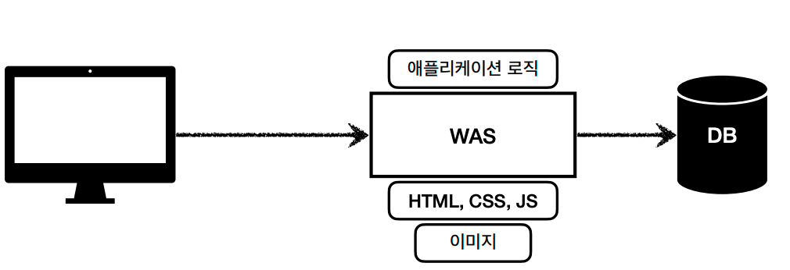
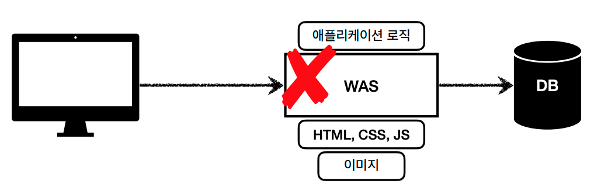
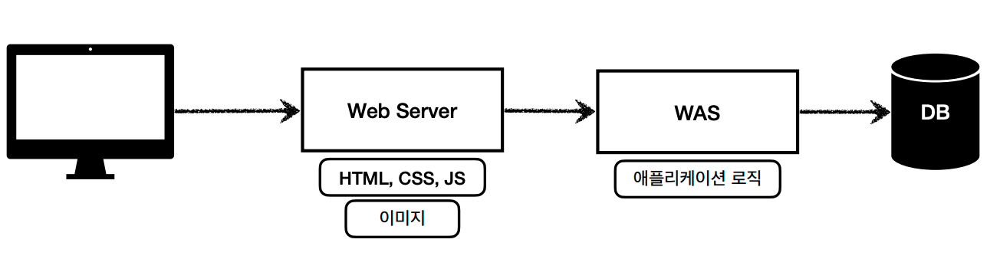
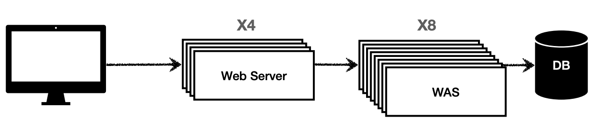
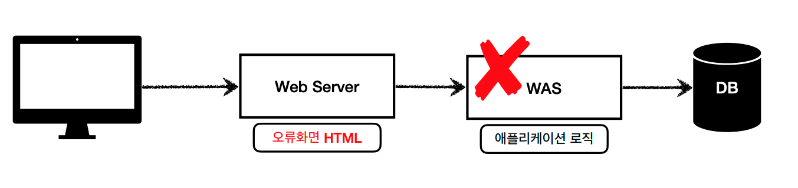

# Spring MVC

## 웹 Web

- 웹은 HTTP를 기반으로 동작한다. 모든 것이 HTTP라고 봐도 무방하다.
- HTML, TEXT, IMAGE, 음성, 영상, 파일, JSON, XML (API) 등 거의 모든 형태의 데이터 전송 가능하다.

### 웹서버

- HTTP를 기반으로 동작하는 컴퓨터!
- 정적 리소스와 기타 부가 기능을 제공해준다.
- 여기서 정적 리소스란 정적인 HTML, CSS, JS, 이미지, 영상과 같은 파일을 의미한다.
- 웹서버의 예로는 NGINX, APACHE 등이 있다.

### WAS(Web Application Server)

- WAS 또한 HTTP 기반으로 동작한다. 웹 서버 기능 포함을 하고(정적 리소스 제공 가능) 프로그램 코드를 실행해서 애플리케이션 로직 수행한다.
- 동적 HTML, HTTP API(JSON) 등의 리소스를 제공하고 서블릿, JSP, 스프링 MVC 등의 프로그램을 실행할 수 있다.
- 예시로는 톰캣(Tomcat) Jetty, Undertow 등이 있다.

### 둘의 차이?

- 웹 서버는 정적 리소스, WAS는 어플리케이션 로직을 담당하지만, 사실 둘의 용어도 경계도 모호하다고 볼 수 있다.
- 웹 서버에서도 프로그램을 실행하는 기능을 포함하기도 하고, WAS에서도 웹 서버의 기능을 제공하기 때문에 거의 유사하다.
- 자바는 서블릿 컨테이너 기능을 제공하면 WAS라고 본다. (그런데 서블릿없이 자바 코드를 실행하는 서버 프레임워크도 있어서 약간 애매..)
- WAS는 어플리케이션 코드를 실행하는데 특화되어 있다고 보면 된다.

 

## 웹 시스템 구성

### WAS & DB

- 최소 WAS, DB 2가지를 통해 웹 시스템을 구성할 수 있다.

### Web Server & WAS & DB

 

## MVC란 무엇인가?

## 참고자료

- 김영한 MVC 강의
