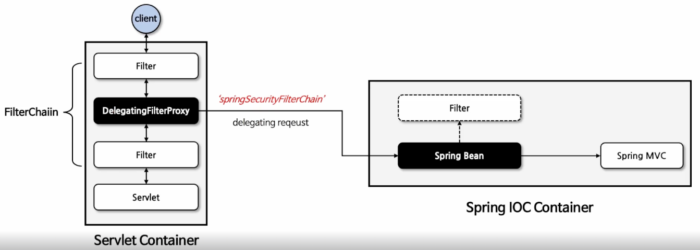
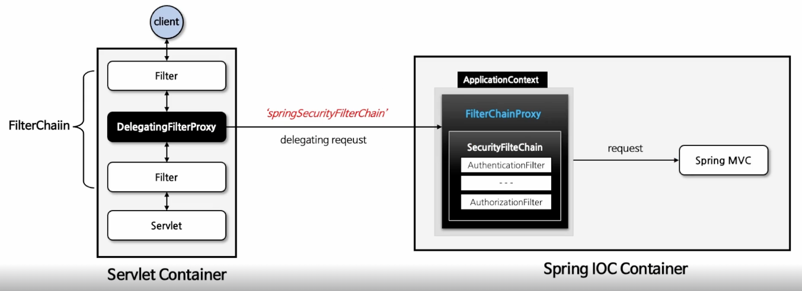

# Spring Security Initialization

## 자동 설정에 의한 기본 보안 작동

- 서버가 가동되면 스프링 시큐리티의 초기화 작업 및 보안설정이 이뤄진다. (별도의 작성 없이)

1. 기본적으로 모든 요청에 대하여 인증여부를 검증하고 인증이 승인되어야 자원에 접근 가능
2. 인증 방식은 폼 로그인 방식과 httpBasic 로그인 방식 제공
3. 인증을 시도할 수 있는 로그인 페이지가 자동적으로 생성되어 렌더링
4. 인증 승인이 이루어질 수 있도록 한 개의 계정이 기본적으로 제공 (SecurityProperties 설정 클래스에서 계정을 생성)
   - username: user
   - password: 랜덤 문자열 => 로그에 찍힘

- 아래의 `defaultSecurityFilterChain` 메소드를 유의깊게 보자.

```java
@Configuration(proxyBeanMethods = false)
@ConditionalOnWebApplication(type = Type.SERVLET)
class SpringBootWebSecurityConfiguration {

	@Configuration(proxyBeanMethods = false)
	@ConditionalOnDefaultWebSecurity
	static class SecurityFilterChainConfiguration {

		@Bean
		@Order(SecurityProperties.BASIC_AUTH_ORDER)
		SecurityFilterChain defaultSecurityFilterChain(HttpSecurity http) throws Exception {
			http.authorizeHttpRequests((requests) -> requests.anyRequest().authenticated());
			http.formLogin(withDefaults());
			http.httpBasic(withDefaults());
			return http.build();
		}

	}
	
	@Configuration(proxyBeanMethods = false)
	@ConditionalOnMissingBean(name = BeanIds.SPRING_SECURITY_FILTER_CHAIN)
	@ConditionalOnClass(EnableWebSecurity.class)
	@EnableWebSecurity
	static class WebSecurityEnablerConfiguration {

	}
}
```

- `SecurityProperties`에서 User를 생성하고 Security 기본 설정에서 사용하게 한다.

```java
@ConfigurationProperties(
  prefix = "spring.security"
)
public class SecurityProperties {
    ...
    
    private final User user = new User();
    
    ...
}
```

- 자동 설정은 무조건 실행되는 것이 아니라 `@ConditionalOnDefaultWebSecurity`의 조건에 의해 실행된다.

```java
@Target({ ElementType.TYPE, ElementType.METHOD })
@Retention(RetentionPolicy.RUNTIME)
@Documented
@Conditional(DefaultWebSecurityCondition.class)
public @interface ConditionalOnDefaultWebSecurity {}
```

- 조건은 `@Conditional`의 `DefaultWebSecurityCondition`에 존재한다.
- `@ConditionalOnClass`와 `@ConditionalOnMissingBean` 조건이 모두 참이어햐만 기본 보안 작동이 이뤄진다.
  - Security 의존성이 존재하면 `SecurityFilterChain` 클래스와 `HttpSecurity` 클래스가 존재하기 때문에 참이다.
  - `SecurityFilterChain`의 빈을 따로 생성해준 적이 없다면 참이 된다.

```java
class DefaultWebSecurityCondition extends AllNestedConditions {

	DefaultWebSecurityCondition() {
		super(ConfigurationPhase.REGISTER_BEAN);
	}

	@ConditionalOnClass({ SecurityFilterChain.class, HttpSecurity.class })
	static class Classes { }
	
	@ConditionalOnMissingBean({ SecurityFilterChain.class })
	static class Beans { }
}
```

<br/>

## SecurityBuilder & SecurityConfigurer


- `SecurityBuilder`는 빌더 클래스로 웹 보안을 구성하는 빈 객체와 설정 클래스를 생성하는 역할을 한다.
  - 대표적인 구현체로는 `HttpSecurity`, `WebSecurity` 등이 있다.
- `SecurityConfigurer`는 Http 요청과 관련된 보안처리를 담당하는 필터들을 생성하고 초기화 설정에 관여한다.
  - `SecurityBuilder`는 `SecurityConfigurer`를 참조하고 있다.
  - 인증 및 인가 초기화 작업이 `SecurityConfigurer`에 의해 진행된다.


1. `AutoConfiguration`(자동 설정)에 의해 `SecurityBuilder` 클래스가 생성된다.
2. `SecurityBuilder` 클래스는 설정 클래스인 `SecurityConfigurer`를 생성한다.
3. `SecurityConfigurer`는 매개변수로 `builder`를 받아 `init(B builder)` / `configure(B builder)` 메소드로 초기화 작업을 진행한다.
    - 여기서 `builder`란 `SecurityBuilder`를 의미한다.
    - `init(B builder)` / `configure(B builder)` 메소드를 통해 필터를 생성하고 인증/인ㄴ 초기화 작업을 진행한다.


- `SecurityBuilder` 클래스의 구현체 중에서 가장 핵심적인 `HttpSecurity`의 예시를 살펴보자.
1. 자동 설정에 의해 `HttpSecurity` 구현체가 빈으로 생성되어 등록된다.
2. `HttpSecurity`는 `SecurityConfigurer`의 수많은 설정 클래스를 생성한다.
3. `SecurityConfigurer`는 또 필요한 필터를 생성한다.

## HttpSecurity


- `HttpSecurityConfiguration`에서 HttpSecurity를 생성하고 초기화를 진행한다.
- `HttpSecurity`는 보안에 필요한 각 설정 클래스와 필터를 생성하고 최종적으로 `SecurityFilterChain` 빈을 생성한다.

<br/>

### SecurityFilterChain

- `HttpSecurity`의 결과물이다.
- `SecurityFilterChain`은 인터페이스이며 `DefaultSecurityFilterChain`라는 구현체가 존재한다.
  


1. 클라이언트가 서버로 요청을 보냈을 때, 요청된 request와 requestMatcher를 매칭한다.
    - 매칭되면 getFilter()를 통해 필터 체인에 포함된 필터 리스트를 가져와 작업을 수행한다.
    - 매칭되니 않으면 해당 `SecurityFilterChain`은 건너 뛰게 된다.
2. 필터에서는 `FilterChain` 파라미터의 `doFilter()` 메소드를 사용해 필터가 차례대로 실행된다.
3. 필터에서 모든 요청이 처리되면 `Servlet`으로 전달된다.

<br/>

## WebSecurity


- `WebSecurityConfiguration`에서 `WebSecurity`를 생성하고 초기화를 진행한다.
- `WebSecurity`는 `HttpSecurity`에서 생성한 `SecurityFilterChain` 빈을 `SecurityBuilder`에 저장한다.
- `WebSecurity`가 `build()`를 실행하면 `SecurityBuilder`에서 `SecurityFilterChain`을 꺼내 `FilterChainProxy`를 생성자에게 전달한다.
- `SecurityFilterChain`은 필터들의 목록을 가지고 있을 뿐이다. `FilterChainProxy`는 `SecurityFilterChain`으로부터 필터를 조회해서 작업을 처리하는 역할을 한다.
- `WebSecurity`의 `performBuild()`에서 `ArrayList<SecurityFilterChain>` 형태의 `securityFilterChains`라는 변수를 선언하고, `FilterChainProxy`의 생성자에 `securityFilterChains`를 전달해 객체를 생성한다.

```java
FilterChainProxy filterChainProxy = new FilterChainProxy(securityFilterChains);
```

<br/>

## Filter

- 서블릿 필터는 웹 어플리케이션에서 클라이언트의 요청과 서버의 응답을 가공하거나 검사하는데 사용되는 구성 요소
- 클라이언트의 요청이 서블릿에 도달하기 전이나 서블릿이 응답을 클라이언트에게 보내기 전에 특정 작업을 수행할 수 있다.
- 서블릿 컨테이너(WAS)에서 생성되고 실행되며 종료된다.


```java
public interface Filter {

    default void init(FilterConfig filterConfig) throws ServletException {
    }

    void doFilter(ServletRequest request, ServletResponse response, FilterChain chain)
            throws IOException, ServletException;

    default void destroy() {
    }
}

```

### DelegatingFilterProxy

- 스프링에서 사용되는 특별한 서블릿 필터로 서블릿 컨테이너와 스프링 애플리케이션 컨텍스트 간의 연결고리이다.
- 서블릿 필터의 역할을 수행함과 동시에 스프링 의존성 주입 및 빈 관리 기능과 연동되도록 설계된 필터다.
- `springSecurityFilterChain` 이라는 이름으로 생성된 빈(`FilterChainProxy`)을 `ApplicationContext`에서 찾아 요청을 위임한다.
- 실제 보안 처리는 수행하지 않지만, 스프링 애플리케이션 컨텍스트와 연결해 스프링의 기능을 사용할 수 있도록 도와준다.
  - 원래 서블릿 컨테이너에서는 Spring의 DI나 AOP를 사용하지 못한다.



### FilterChainProxy

- `springSecurityFilterChain`의 이름으로 생성되는 필터 빈으로서 `DelegatingFilterProxy`으로부터 요청을 위임받고 보안 처리 역할을 한다.
- 내부적으로 하나 이상의 `SecurityFilterChain` 객체를 가지고 있으며 요청 URL 정보를 기준으로 적절한 `SecurityFilterChain`을 선택하여 필터를 호출한다.
- `HttpSecurity`를 통해 API 추가 시 관련 필터가 추가된다.
- 사용자의 요청을 필터 순서대로 호출해 보안 기능을 동작시키고 필요 시 직접 필터를 생성해 기존의 필터의 앞단이나 뒷단에 추가할 수 있다.



### FilterChainProxy에서 처리되는 필터

- 총 16개의 기본 필터가 순서대로 실행된다.
- 맨 마지막 인가 처리를 하는 필터까지 특별한 예외나 오류가 발생하지 않으면 성공적으로 요청이 서블릿으로 넘어간다.
0. `DisableEncodeUrlFilter`
1. `WebAsyncManagerIntegrationFilter`
2. `SecurityContextHolderFilter`
3. `HeaderWriterFilter`
4. `CorsFilter`
5. `CsrfFilter`
6. `LogoutFilter`
7. `UsernamePasswordAuthenticationFilter`
8. `DefaultLoginPageGeneratingFilter`
9. `DefaultLogoutPageGeneratingFilter`
10. `BasicAuthenticationFilter`
11. `RequestCacheAwareFilter`
12. `SecurityContextHolderAwareReuqestFilter`
13. `AnonymousAuthenticationFilter`
14. `ExceptionTranslationFilter`
15. `AuthorizationFilter`

<br/>

<br/><br/>

# 참고자료

- [스프링 시큐리티 완전 정복 [6.x 개정판]](https://www.inflearn.com/course/%EC%8A%A4%ED%94%84%EB%A7%81-%EC%8B%9C%ED%81%90%EB%A6%AC%ED%8B%B0-%EC%99%84%EC%A0%84%EC%A0%95%EB%B3%B5/dashboard)