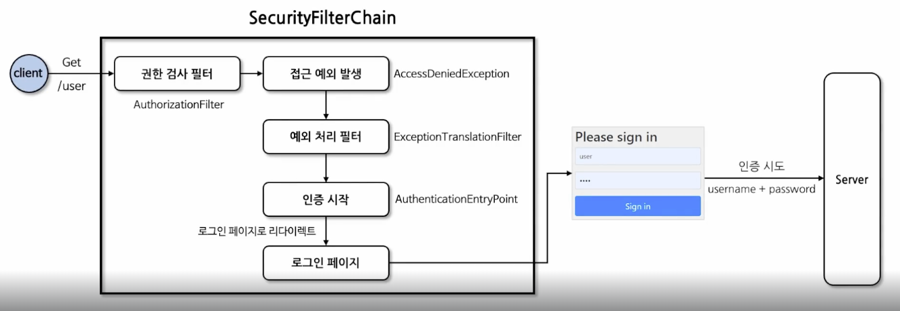
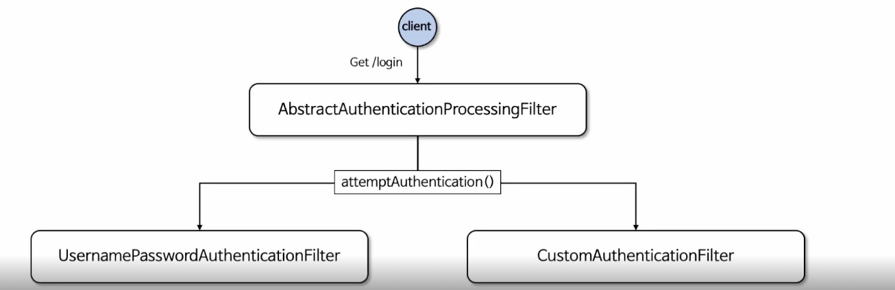
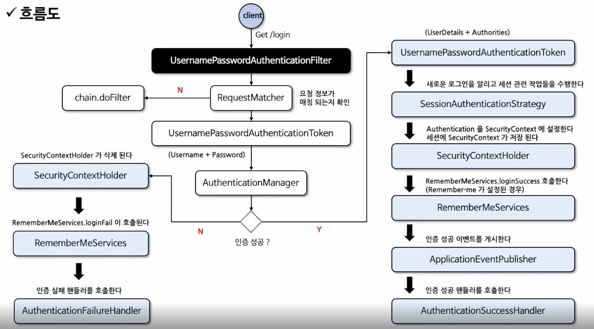
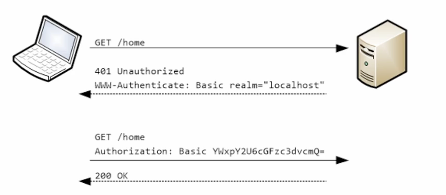
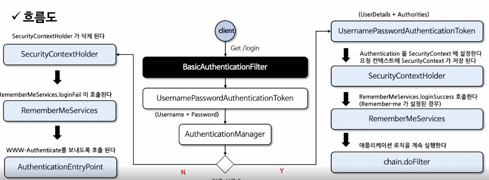

# Certification

## Form Login

- HTTP 기반의 폼 로그인 인증 메커니즘을 활성화하는 API
- 사용자 인증을 위한 사용자 정의 로그인 페이지를 쉽게 구현할 수 있다.
- 기본적으로 스프링 시큐리티가 제공하는 기본 로그인 페이지를 사용하며 사용자 이름과 비밀번호 필드가 포함된 간단한 로그인 양식을 제공
- 사용자는 웹 폼을 통해 자격 증명을 제공, `Spring Security`는 `HttpServletRequest`에서 이 값을 읽어온다.



### Form Login API

- `FormLoginConfigurer` 설정 클래스를 통해 API 설정 가능
- 내부적으로 `UsernamePasswordAuthenticationFilter`가 생성되어 폼 방식의 인증 처리 담당

```java
@Configuration
@EnableWebSecurity
public class SecurityConfig_httpBasic {

  @Bean
  public SecurityFilterChain securityFilterChain(HttpSecurity http) throws Exception {
    http.formLogin ( httpSecurityFormLoginConfigurer -> httpSecurityFormLoginConfigurer
                    .loginPage("/loginPage")                      // 사용자 정의 로그인 페이지로 전환, 기본 로그인페이지 무시
                    .loginProcessingUrl("/loginProc")             // 사용자 이름과 비밀번호를 검증할 URL 지정 (Form action)
                    .defaultSuccessUrl("/", true)                 // 로그인 성공 이후 이동 페이지, alwaysUse 가 true 이면 무조건 지정된 위치로 이동(기본은 false) 
                                                                  // 인증 전에 보안이 필요한 페이지를 방문하다가 인증에 성공한 경우이면 이전 위치로 리다이렉트 됨
                    .failureUrl("/failed")                        // 인증에 실패할 경우 사용자에게 보내질 URL 을 지정, 기본값은 "/login?error" 이다
                    .usernameParameter("username")                // 인증을 수행할 때 사용자 이름(아이디)을 찾기 위해 확인하는 HTTP 매개변수 설정, 기본값은 username
                    .passwordParameter("password")                // 인증을 수행할 때 비밀번호를 찾기 위해 확인하는 HTTP 매개변수 설정, 기본값은 password
                    .failureHandler(AuthenticationSuccessHandler) // 인증 실패 시 사용할 AuthenticationFailureHandler를 지정
                                                                  // 기본값은 SimpleUrlAuthenticationFailureHandler 를 사용하여 "/login?error"로 리다이렉션 함
                    .successHandler(AuthenticationFailureHandler) // 인증 성공 시 사용할 AuthenticationSuccessHandler를 지정
                                                                  // 기본값은 SavedRequestAwareAuthenticationSuccessHandler 이다
                    .permitAll());                                // failureUrl(), loginPage(), loginProcessingUrl() 에 대한 URL 에 모든 사용자의 접근을 허용 함
    return http.build();
  }
}
```

<br/>

## UsernamePasswordAuthenticationFilter

- 스프링 시큐리티는 `AbstractAuthenticationProcessingFilter` 클래스를 사용자의 자격 증명을 인증하는 기본 필터로 사용
- `UsernamePasswordAuthenticationFilter`는 `AbstractAuthenticationProcessingFilter`를 확장한 클래스로 `HttpServletRequest`에서 제출된 사용자 이름과 비밀번호로부터 인증을 수행
- 인증 프로세스가 초기화 될 때 로그인 페이지와 로그아웃 페이지 생성을 위한 `DefaultLoginPageGeneratingFilter` 및 `DefaultLogoutPageGeneratingFilter`가 초기화



### 처리과정

- 사용자가 Get 방식으로 로그인 요청을 하면 `UsernamePasswordAuthenticationFilter`가 요청을 가로챈다.
- 이 때 인증 처리를 해야하는 요청인지 아닌지를 검증하고 과정을 진행한다. (`RequestMatcher`에서 true를 반환해야 다음 과정으로 넘어감)
  - `RequestMatcher`에서 false를 반환하면 `chain.doFilter()`가 호출되어 다음 필터로 넘어가 버린다. 
- `UsernamePasswordAuthenticationToken`은 인증 처리를 하기 위한 인증 객체다.
- `AuthenticationManager`는 아이디와 패스워드가 담긴 토큰(`UsernamePasswordAuthenticationToken`)을 받아 인증 처리를 진행한다.



<br/>

## HTTP Basic 인증

- HTTP는 액세스 제어와 인증을 위한 프레임워크를 제공하며 가장 일반적인 인증 방식은 "Basic" 인증 방식이다.
- RFC 7235 표준이며 인증 프로토콜은 HTTP 인증 헤더에 기술되어 있다.



1. 클라이언트는 인증정보 없이 서버로 접속을 시도한다.
2. 서버가 클라이언트에게 인증 요구를 보낼 때 401 Unauthorized 응답과 함께 WWW-Authenticate 헤더를 기술해서 realm(보안영역)과 Basic 인증 방법을 보낸다.
3. 클라이언트가 서버로 접속할 때 Base64로 username과 password를 인코딩하고 Authorization 헤더에 담아서 요청한다.
4. 성공적으로 완료되면 정상적인 상태 코드를 반환한다.

> - base64로 인코딩된 값은 디코딩이 가능하기 때문에 인증정보가 노출된다.
> - 이 상태로 그대로 통신하면 민감 정보가 노출될 수 있기 때문에!! HTTP Basic 인증은 반드시 HTTPS와 같이 TLS 기술과 함께 사용해야 한다.
 
### HttpBasic API

- `HttpBasicConfigurer` 설정 클래스를 통해 여러 API를 설정할 수 있다.
- 내부적으로 `BasicAuthenticationFilter`가 생성되어 기본 인증 방식의 인증 처리를 담당하게 된다.
- 사실 바꿀 것이 별로 없다. 기본 설정으로 둬도 문제될 것이 없다.

```java
@Configuration
@EnableWebSecurity
public class SecurityConfig_httpBasic {

  @Bean
  public SecurityFilterChain securityFilterChain(HttpSecurity http) throws Exception {
    http.httpBasic(httpSecurityHttpBasicConfigurer -> httpSecurityHttpBasicConfigurer
      .realmName("name") // HTTP 기본 영역을 설정
      .authenticationEntryPoint((request, response, authException) -> {})); // 인증 실패 시 호출되는 AuthenticationEntryPoint
                                                                            // 기본값은 "Realm" 영역으로 BasicAuthenticationEntryPoint를 사용
    return http.build();
  }
}
```

<br/>

## BasicAuthenticationFilter

- 기본 인증 서비스를 제공할 때 사용
- `BasicAuthenticationConverter`를 사용해서 요청 헤더에 기술된 인증정보의 유효성을 체크하며 Base64 인코딩된 username과 password 추출
  - `BasicAuthenticationConverter`에서 유효성 체크가 성공해야 `UsernamePasswordAuthenticationToken`으로 username과 password를 추출한다.
- 인증 이후 세션을 사용하는 경우와 사용하지 않는 경우에 따라 처리되는 흐름의 차이가 있다.
- 세션을 사용하는 경우 매 요청마다 인증과정을 거치지 않으나 세션을 사용하지 않는 경우 매 요청마다 인증과정을 거치야 한다.



- `OncePerRequestFilter`눈 해당 필터가 요청에 대해 한 번만 동작하도록 보장해주는 필터다.
  - `doFilterInternal()`이라는 메소드로 필터가 실행된다.
- session에 인증객체가 저장되어 있으면 그냥 넘어가고, 인증객체가 존재하지 않으면 인증 처리를 실행한다.

```java
public class BasicAuthenticationFilter extends OncePerRequestFilter {
  ...
}
```

<br/>

## RememberMe

- 사용자가 웹사이트나 애플리케이션 로그인할 때 자동으로 인증 정보를 기억하는 기능
- `UsernamePasswordAuthenticationFilter`와 함께 사용되며, `AbstractAuthenticationProcessingFilter` 슈퍼클래스에서 훅을 통해 구현된다.
- 인증 성공 시 `RememberMeServices.loginSuccess()` 메소드를 통해 `RememberMe` 토큰을 생성하고 쿠키로 전달한다.
- 인증 실패 시 `RememberMeServices.loginFail()` 메소드를 통해 쿠키를 지운다.
- `LogoutFilter`와 연계해서 로그아웃 시 쿠키를 지운다.

### 토큰 생성

- 기본적으로 암호화된 토큰으로 생성되며 브라우저에 쿠키를 보내고 향후 세션에서 이 쿠키를 감지하여 자동 로그인이 이뤄지는 방식으로 진행된다.

```java
base64(username + ":" + expirationTime + ":" + algorithmName + ":" + algorithmHex(username + ":" + expirationTime + ":" + password + ":" + key))
```

- username: `UserDetailsService`로 식별 가능한 사용자 이름
- password: 검색된 `UserDetails`와 일치하는 비밀번호
- expirationTime: rememberMe 토큰이 만료되는 날짜와 시간을 밀리초로 표현
- key: rememberMe 토큰의 수정을 방지하기 위한 키
- algorithmName: rememberMe 토큰 서명을 생성하고 검증하는 데 사용되는 알고리즘(기본적으로 SHA-256 알고리즘을 사용)

### 구현체

- 기본적으로 두 구현체 모두 사용자의 정보를 검색하기 위한 `UserDetailsService`가 필요하다.
- `TokenBasedRememberMeServices`: 쿠키 기반 토큰의 보안을 위해 해싱 사용
- `PersistenceBasedRememberMeServices`: 생성된 토큰을 저장하기 위해 데이터베이스나 다른 영구 저장 매체 사용

### API

```java
@Configuration
@EnableWebSecurity
@RequiredConstructor
public class SecurityConfig_httpBasic {
  
  private final UserDetailsService userDetailsService;

  @Bean
  public SecurityFilterChain securityFilterChain(HttpSecurity http) throws Exception {
    http.rememberMe(httpSecurityRememberMeConfigurer -> httpSecurityRememberMeConfigurer
            .alwaysRemember(true)                   // rememberMe 매개변수가 설정되지 않았을 때도 쿠키가 항상 생성되어야 하는지에 대한 여부
            .tokenValiditySeconds(3600)             // 토큰이 유효한 시간(초 단위)를 지정할 수 있다.
            .userDetailsService(userDetailsService) // UserDetails를 조회하기 위해 사용되는 UserDetailsService를 지정
            .rememberMeParameter("remember")        // 로그인 시 사용자를 기억하기 위해 사용되는 HTTP 매개변수. 기본값은 "remember-me" 이다.
            .rememberMeCookieName("remember")       // rememberMe 인증을 위한 토큰을 저장하는 쿠키 이름. 기본값은 "remember-me" 이다.
            .key("security"));                      // rememberMe 인증을 위해 생성된 토큰을 식별하는 키를 설정
    return http.build();
  }
}
```

<br/>

<br/><br/>

# 참고자료

- [스프링 시큐리티 완전 정복 [6.x 개정판]](https://www.inflearn.com/course/%EC%8A%A4%ED%94%84%EB%A7%81-%EC%8B%9C%ED%81%90%EB%A6%AC%ED%8B%B0-%EC%99%84%EC%A0%84%EC%A0%95%EB%B3%B5/dashboard)