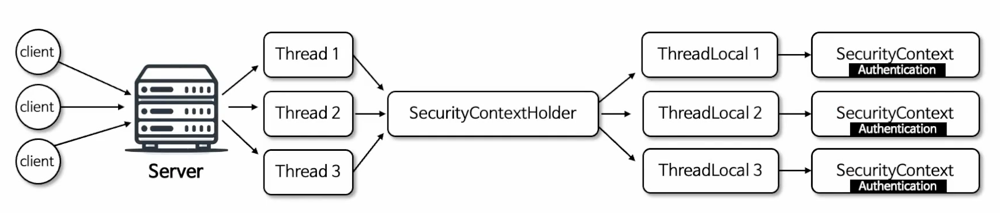

# Authentication Architecture

## Security Authentication/Authorization

- `AuthenticationFilter`가 인증처리를 진행해 `Authentication` 객체를 생성해 `AuthenticationManager`에 전달
- `AuthenticationManager`는 `AuthenticationProvider`에 사용자가 존재하는지, 사용자의 아이디 & 패스워드가 맞는지에 대한 처리를 위임
- `AuthenticationProvider`는 인증이 성공하면 `Authentication` 객체를 만들어 상위 계층으로 전달한다. 
- `SecurityContextHolder`를 통해 `SecurityContext`에 `Authentication`을 저장한다.


<br/>

## 인증 Authentication

- 인증은 특정 자원에 접근하려는 유저의 신원을 확인하는 방법
- 사용자 인증의 일반적인 방법은 사용자 이름과 비밀번호를 입력하게 하는 것으로, 인증이 수행되면 신원을 확인하고 권한 부여를 할 수 있다.
- `Authentication`은 사용자 인증 정보를 저장하는 토큰 개념의 객체로 활용되며 인증 이후 `SecurityContext`에 저장되어 전역적으로 참조가 가능하다.

### Authentication API

- `Authentication`은 `Principal`을 상속한다.

```java
public interface Authentication extends Principal, Serializable {
  ...
}
```

- `Authentication`의 메소드 종류는 아래와 같다.
  - `getPrincipal()`: `Principal`은 인증 주체를 의미. 인증 요청의 경우 사용자 이름을 가져오고, 인증 후에는 UserDetails 타입의 객체를 가져온다.
  - `getCredentials()`: `Credential`이란 인증 주체가 올바른 것을 증명하는 자격 증명을 뜻함. 대개 비밀번호
  - `getAuthorities()`: 인증 주체인 `Pricipal`에 부여된 권한
  - `getDetails()`: 인증 요청에 대한 추가적인 세부사항을 저장한 객체를 받는다. IP 주소, 인증서 일련번호 등 
  - `isAuthenticated()`: 인증 상태 반환
  - `setAuthenticated(boolean)`: 인증 상태 설정

### 인증 절차

- 인증 처리 전 단계
  1. 클라이언트로부터 로그인 요청을 받았을 때, 필터체인이 실행되다가 `AuthenticationFilter` 차례가 오면 인증 처리를 시작할 준비를 한다.
  2. `AuthenticationFilter`는 사용자가 전달한 정보를 바탕으로 `Authentication` 객체를 만든다.
  3. `AuthenticationManager`에 `Authentication` 객체를 전달한다.
- 인증 처리 단계
  1. `AuthenticationManager`는 전달받은 `Authentication` 객체와 `UserDetailsService` 객체 등을 활용해 인증 처리를 수행한다.
  2. 인증 처리를 통해 신원을 확인하면 `Authentication` 객체를 만드는데, 위의 `AuthenticationFilter`가 만들었던 `Authentication` 객체와는 살짝 다르다.
  3. 이제 `Authentication` 객체를 `AuthenticationFilter`로 다시 전달하는데, 필터는 `SecurityContextHolder`를 사용해 `SecurityContext`를 생성하고 거기에 `Authentication` 객체를 넣어 저장한다.


<br/>

## SecurityContext

### SecurityContext

- Authentication 저장
- ThreadLocal 저장소를 사용해 각 스레드가 자신만의 보안 컨텍스트를 유지
- 애플리케이션 어느 곳에서나 접근 가능. 현재 사용자의 인증 상태나 권한을 사용하는 데 사용

### SecurityContextHolder

- `SecurityContext`를 저장한다.
- `SecurityContextHolderStrategy` 인터페이스를 사용해 다양한 저장 전략을 사용할 수 있다. (전략 패턴 사용)
  - 기본 전략은 `MODE_THREADLOCAL`이다.
  - `SecurityContextHolder.setStrategyName(String)` 메소드를 사용해 전략 모드를 직접 지정할 수 있다.
- 저장 모드 종류는 아래와 같다.
  - `MODE_THREADLOCAL`: 기본 모드. 각 스레드가 독립적인 보안 컨텍스트를 가진다.
  - `MODE_INHERITABLETHREADLOCAL`: 부모 스레드로부터 자식 스레드로 보안 컨텍스트가 상속되며 작업을 스레드 간 분산 실행하는 경우 유용
  - `MODE_GLOBAL`: 전역적으로 단일 보안 컨텍스트를 사용하며 서버 환경에서는 부적합하다. 간단한 애플리케이션에서나 사용

### SecurityContextHolderStrategy API

- `clearContext()`: 현재 컨텍스트 삭제. 보통 `SecurityContextHolder.getContextHolderStrategy().clearContext()`로 호출
- `getContext()`: 현재 컨텍스트 반환. `SecurityContextHolder.getContextHolderStrategy().getContext()`로 호출
- `getDeferredContext()`: 현재 컨텍스트를 반환하는 `Supplier` 반환
- `setContext()`: 현재 컨텍스트 저장
- `setDeferredContext()`: 현재 컨텍스트트 반환하는 `Supplier` 저장
- `createEmptyContext()`: 비어있는 새 컨텍스트 생성

```java
public interface SecurityContextHolderStrategy {

	void clearContext();

	SecurityContext getContext();

	default Supplier<SecurityContext> getDeferredContext() {
		return this::getContext;
	}

	void setContext(SecurityContext context);

	default void setDeferredContext(Supplier<SecurityContext> deferredContext) {
		setContext(deferredContext.get());
	}

	SecurityContext createEmptyContext();
}
```

### SecurityContextHolderStrategy 구현체

- `ThreadLocalSecurityContextHolderStrategy`: `MODE_THREADLOCAL`
- `InheritableThreadLocalSecurityContextHolderStrategy`: `MODE_INHERITABLETHREADLOCAL`
- `GlobalSecurityContextHolderStrategy`: `MODE_GLOBAL`

### SecurityContextHolder의 구조

- 스레드마다 할당되는 전용 저장소에 `SecurityContext`를 저장하기 때문에 동시성의 문제가 없다.
- 스레드 풀에서 운용되는 스레드일 경우 새로운 요청이더라도 기존의 `ThreadLocal`이 재사용될 수 있기 때문에 클라이언트로 응답 직전에 항상 `SecurityContext`를 삭제해준다.



<br/>

## AuthenticationManager

- 인증 필터로부터 `Authentication` 객체를 전달 받아 인증을 시도하며 인증에 성공할 경우 사용자 정보, 권한 등을 포함한 완전히 채워진 `Authentication` 객체를 반환한다.
- `AuthenticationManager`는 여러 `AuthenticationProvider`를 관리하며 `AuthenticationProvider` 목록을 순차적으로 순회하며 인증 요청을 처리
- `AuthenticationProvider` 목록 중에서 인증 처리 요건에 맞는 적절한 `AuthenticationProvider`를 찾아 인증처리를 위임한다.
- `AuthenticationManagerBuilder`에 의해 객체가 생성되며 주로 사용하는 구현체로 `ProviderManager`가 제공된다.

### AuthenticationMangerBuilder

- AuthenticationManager 객체를 생성하며 UserDetails 및 AuthenticationProvider를 추가할 수 있다.
- `HttpSecurity.getSharedObject(AuthenticationManagerBuilder.class)`를 통해 객체를 참조할 수 있다

### AuthenticationManager 동작

- `Authentication` 객체는 Form Login, HttpBasic, RememberMe, OAuth2 인증 등으로 생성되어 `ProviderManager`로 전달된다.
- `ProviderManager`는 인증 방식에 따라 Provider를 선택해 처리한다. 
  - `DaoAuthenticationProvider` - Form Login 
  - `BasicAuthenticationProvider` - HttpBasic
  - `RemeberMeAuthenticationProvider` - RememberMe
- 선택적으로 부모 AuthenticationManager를 구성할 수 있으며 이 부모는 `AuthenticationProvider`가 인증을 수행할 수 없는 경우에 추가적으로 탐색할 수 있다.
  - OAuth2의 경우가 부모격의 `ProviderManager`에게 요청해 Provider를 가져온다.
  - `OAuth2AuthenticationProvider` - OAuth2
- 일반적으로 `AuthenticationProvider`로부터 `null`이 아닌 응답을 받을 때까지 차례대로 시도하며 응답을 받지 못하면 `ProviderNotFoundException`과 함께 인증이 실패한다.

### HttpSecurity를 활용한 방법

```java
@Configuration
@EnableWebSecurity
public class SecurityConfig_AuthenticationManager {

  @Bean
  public SecurityFilterChain securityFilterChain(HttpSecurity http) throws Exception {
    AuthenticationManagerBuilder authenticationManagerBuilder = http.getSharedObject(AuthenticationManagerBuilder.class);
    AuthenticationManager authenticationManager = authenticationManagerBuilder.build(); // build()는 최초 한 번만 호출
    AuthenticationManager authenticationManager2 = authenticationManagerBuilder.getObject(); // build() 후에는 getObject()로 참조

    http
        .authorizeHttpRequests(auth -> auth
                .requestMatchers("/api/login").permitAll()
                .anyRequest().authenticated())
        .authenticationManager(authenticationManager)
        .addFilterBefore(customFilter(authenticationManager), UsernamePasswordAuthenticationFilter.class);
    return http.build();
  }

  // Bean 으로 선언하면 안된다. AuthenticationManager는 빈이 아니기 때문에 주입받지 못한다.
  public CustomAuthenticationFilter customFilter(AuthenticationManager authenticationManager)
          throws Exception {
    CustomAuthenticationFilter customAuthenticationFilter = new CustomAuthenticationFilter();
    customAuthenticationFilter.setAuthenticationManger(authenticationManager);
    return customAuthenticationFilter;
  }
}
```

### 직접 생성하는 방법

```java
@Configuration
@EnableWebSecurity
public class SecurityConfig_AuthenticationManager {

  @Bean
  public SecurityFilterChain securityFilterChain(HttpSecurity http) throws Exception {
    http.authorizeHttpRequests(auth -> auth.anyRequest().authenticated());
    http.formLogin(Customizer.withDefaults());
    http.addFilterBefore(customFilter(), UsernamePasswordAuthenticationFilter.class);
    return http.build();
  }

  @Bean // Bean으로 선언 가능
  public CustomAuthenticationFilter customFiler() throws Exception {

    List<AuthenticationProvider> list1 = List.of(new DaoAuthenticationProvider());
    ProviderManager parent = new ProviderManager(list1);
    List<AuthenticationProvider> list2 = List.of(new AnonymousAuthenticationProvider("key"), new CustomAuthenticationProvider());
    ProviderManager authenticationManager = new ProviderManager(list2, parent);

    CustomAuthenticationFilter customAuthenticationFilter = new CustomAuthenticationFilter();
    customAuthenticationFilter.setAuthenticationManger(authenticationManager);
    return customAuthenticationFilter;
  }
}
```

<br/>

<br/><br/>

# 참고자료

- [스프링 시큐리티 완전 정복 [6.x 개정판]](https://www.inflearn.com/course/%EC%8A%A4%ED%94%84%EB%A7%81-%EC%8B%9C%ED%81%90%EB%A6%AC%ED%8B%B0-%EC%99%84%EC%A0%84%EC%A0%95%EB%B3%B5/dashboard)