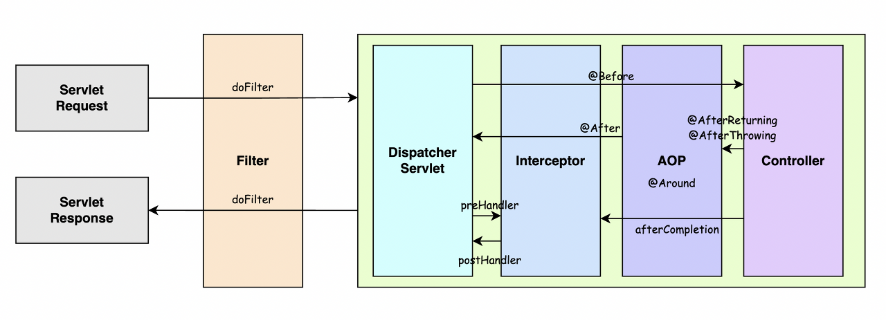
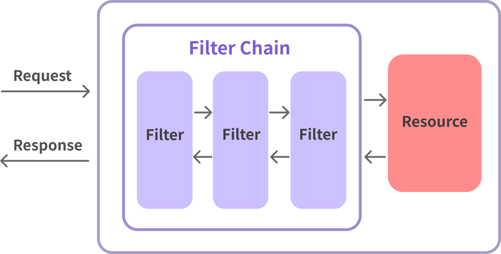
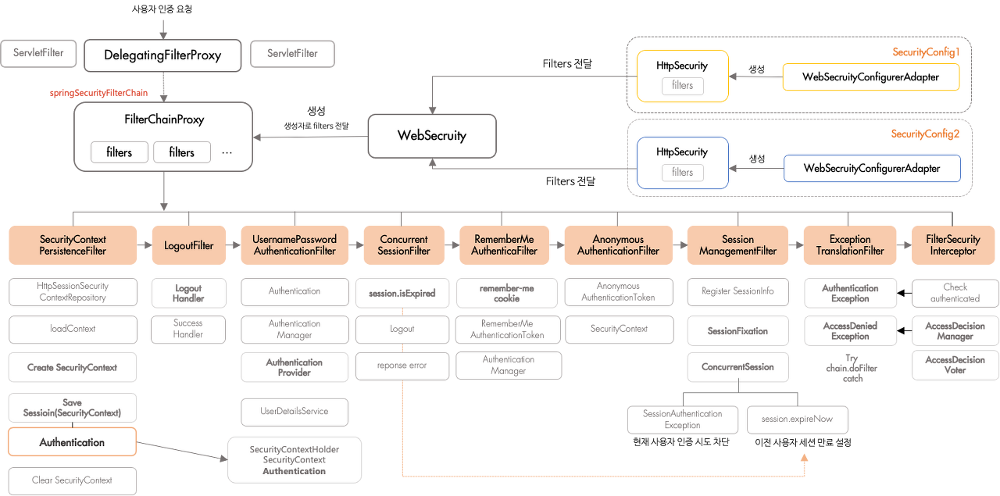
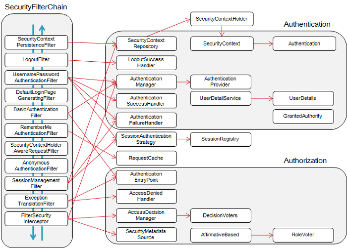

# Spring Security

## 사전지식! Filter란?

- Filter란 Web Application에서 관리되는 영역으로써 Spring Boot Framework에서 Client로 부터 오는 요청/응답에 대해서 최초/최종 단계의 위치에 존재하며, 이를 통해서 요청/응답의 정보를 변경하거나, Spring에 의해서 데이터가 변환되기 전의 순수한 Client의 요청/응답 값을 확인 할 수 있다
- **유일하게 ServletRequest, ServletResponse의 객체를 변환**할 수 있다
- 주로 Spring Framework에서는 request/response의 logging 용도로 활용하거나, 인증과 관련된 Logic들을 해당 Filter에서 처리한다
- 이를 선/후 처리 함으로써, Service business logic과 분리 시킨다



### Filter의 기능

- Filter 인터페이스는 아래와 같은 형태이다.
    - `init`: 필터가 웹 컨테이너에 생성될 때 실행
    - `doFilter`: request, response가 필터를 거칠 때 수행되는 메소드. **FilterChain으로 전달된 체인의 doFilter를 실행해 다음 체인을 따라가게 만들 수 있다.**
    - `destroy`: 필터가 소멸될 때 실행

```java
public interface Filter {

    public default void init(FilterConfig filterConfig) throws ServletException {}

    public void doFilter(
				ServletRequest request, 
			  ServletResponse response,
			  FilterChain chain
		) throws IOException, ServletException;

    public default void destroy() {}
}
```

### Filter Chain

- 아래와 같이 Filter Chain을 통해 여러 필터가 연쇄적으로 동작하게 할 수 있다.



### Interceptor(보너스)

- 아래는 interceptor의 interface
    - `preHandle`: 컨트롤러가 호출되기 전에 실행. 전처리 작업이나 요청 정보를 가공 및 추가할 때 사용. 반환값이 true면 다음 단계로 진행되지만, false일 때는 작업을 중단하여 이후의 작업은 진행되지 않는다.
    - `postHandle`: 후처리 작업을 진행할 때 사용. 컨트롤러 하위 계층에서 예외가 발생하면 `postHandle`은 호출되지 않는다.
    - `afterCompletion`: 요청 처리 중에 사용한 리소스를 반환할 때 사용하면 좋다. 컨트롤러 하위 계층에서 예외가 발생해도 afterCompletion은 반드시 호출한다.

```java
public interface HandlerInterceptor {

    default boolean preHandle(
				HttpServletRequest request, 
				HttpServletResponse response, 
				Object handler
		) throws Exception {  
        return true;
    }

    default void postHandle(
				HttpServletRequest request, 
				HttpServletResponse response,
				Object handler,
        @Nullable ModelAndView modelAndView
		) throws Exception { }

    default void afterCompletion(
				HttpServletRequest request, 
				HttpServletResponse response, 
				Object handler,
        @Nullable Exception ex
		) throws Exception { }

}
```

### DelegatingFilterProxy

- 요청이 오면 DelegatingFilterProxy가 요청을 받아서 필터(스프링 빈)에게 요청을 위임하는 역할을 한다. 아래와 같은 플로우로 실행된다.
    1. Filter 구현체가 스프링 빈으로 등록됨
    2. ServletContext가 Filter 구현체를 갖는 DelegatingFilterProxy를 생성함
    3. ServletContext가 DelegatingFilterProxy를 서블릿 컨테이너에 필터로 등록함
    4. 요청이 오면 DelegatingFilterProxy가 필터 구현체에게 요청을 위임하여 필터 처리를 진행함
- 기존 Spring에서는 직접 등록해줘야 됐지만, Spring Boot에서는 DelegatingFilterProxy를 사용하지 않는다. 톰캣과 같은 서블릿 컨테이너까지 프레임워크에서 제어할 수 있기 때문이다. (그냥 spring boot가 다 알아서 해준다는 말) ⇒ 근데 Security에서는 DelegatingFilterProxy를 사용한다는데 뭐지..?

## Security 구조



## Security Filter Chain

### 기본적인 Security Filter Chain



## Custom Filter

- `AbstractAuthenticationProcessingFilter`를 상속해 구현했다.
- 해당 필터는 doFilter를 직접 구현하지 않아도 자동으로 다음 필터체인으로 넘겨준다.

```java
public abstract class AbstractAuthenticationProcessingFilter extends GenericFilterBean
		implements ApplicationEventPublisherAware, MessageSourceAware {

	...
	@Override
	public void doFilter(ServletRequest request, ServletResponse response, FilterChain chain)
			throws IOException, ServletException {
		doFilter((HttpServletRequest) request, (HttpServletResponse) response, chain);
	}

	private void doFilter(HttpServletRequest request, HttpServletResponse response, FilterChain chain)
			throws IOException, ServletException {
		if (!requiresAuthentication(request, response)) {
			chain.doFilter(request, response);
			return;
		}
		try {
			Authentication authenticationResult = attemptAuthentication(request, response);
			if (authenticationResult == null) {
				// return immediately as subclass has indicated that it hasn't completed
				return;
			}
			this.sessionStrategy.onAuthentication(authenticationResult, request, response);
			// Authentication success
			if (this.continueChainBeforeSuccessfulAuthentication) {
				chain.doFilter(request, response);
			}
			successfulAuthentication(request, response, chain, authenticationResult);
		}
		catch (InternalAuthenticationServiceException failed) {
			this.logger.error("An internal error occurred while trying to authenticate the user.", failed);
			unsuccessfulAuthentication(request, response, failed);
		}
		catch (AuthenticationException ex) {
			// Authentication failed
			unsuccessfulAuthentication(request, response, ex);
		}
	}
	...
}
```

- 위와 같이 커스텀 필터를 구성해 `UsernamePasswordAuthenticationFilter` 전에 배치했다.
    - 여기서 `UsernamePasswordAuthenticationFilter`은 인증 객체를 만들어서 Authentication 객체를 만들어 아이디 패스워드를 저장하고, AuthenticationManager에게 인증처리를 맡긴다.

# 참고 블로그

[[Spring] 필터(Filter) vs 인터셉터(Interceptor) 차이 및 용도 - (1)](https://mangkyu.tistory.com/173)
