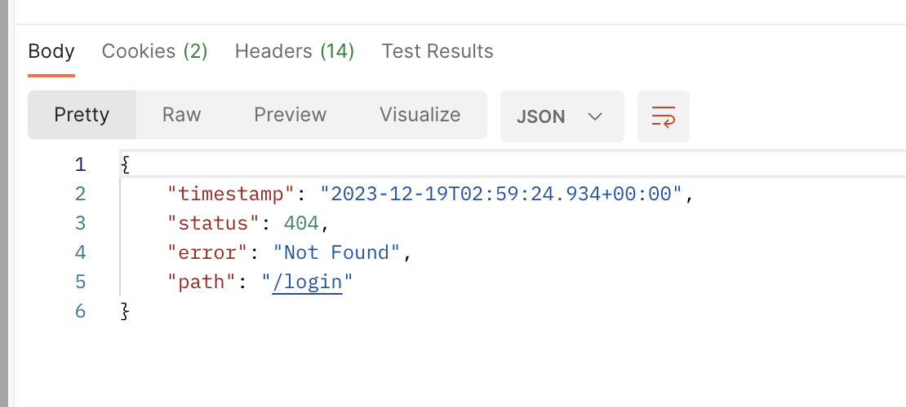

# Logout

- 시큐리티에서는 기본 로그아웃을 제공한다.
  - `/logout` 경로의 GET과 POST 메소드 요청
  - `ServerCsrfTokenRepository`와 `ServerSecurityContextRepository`를 비우고 Login Page로 리다이렉트한다.

# Logout Custom

- `HttpSecurity` 객체의 체이닝 메소드 중 `logout` 메소드를 사용해 로그아웃 기능을 커스터마이징할 수 있다.

```java
public final class HttpSecurity extends AbstractConfiguredSecurityBuilder<DefaultSecurityFilterChain, HttpSecurity>
    implements SecurityBuilder<DefaultSecurityFilterChain>, HttpSecurityBuilder<HttpSecurity> {
  
  ...
  
  public HttpSecurity logout(Customizer<LogoutConfigurer<HttpSecurity>> logoutCustomizer) throws Exception {
    logoutCustomizer.customize(getOrApply(new LogoutConfigurer<>()));
    return HttpSecurity.this;
  } 
  
  ...
  
}
```

- 람다를 통해 logout 메소드에 전달하는 것은 `LogoutConfigurer` 객체이다. 아래의 핵심 메소드를 사용해 로그아웃을 핸들링한다.
  - `logoutUrl(String logoutUrl)`
  - `logoutSuccessHandler(LogoutSuccessHandler logoutSuccessHandler)`
  - `addLogoutHandler(LogoutHandler logoutHandler)`
  - `deleteCookies(String... cookieNamesToClear)`
  - `logoutRequestMatcher(RequestMatcher logoutRequestMatcher)`

```java
public final class LogoutConfigurer<H extends HttpSecurityBuilder<H>>
		extends AbstractHttpConfigurer<LogoutConfigurer<H>, H> {

  ...
  
  public LogoutConfigurer<H> logoutUrl(String logoutUrl) {
    this.logoutRequestMatcher = null;
    this.logoutUrl = logoutUrl;
    return this;
  }
  
  public LogoutConfigurer<H> addLogoutHandler(LogoutHandler logoutHandler) {
    Assert.notNull(logoutHandler, "logoutHandler cannot be null");
    this.logoutHandlers.add(logoutHandler);
    return this;
  }

  public LogoutConfigurer<H> logoutSuccessHandler(LogoutSuccessHandler logoutSuccessHandler) {
    this.logoutSuccessUrl = null;
    this.customLogoutSuccess = true;
    this.logoutSuccessHandler = logoutSuccessHandler;
    return this;
  }

  public LogoutConfigurer<H> deleteCookies(String... cookieNamesToClear) {
    return addLogoutHandler(new CookieClearingLogoutHandler(cookieNamesToClear));
  }

  public LogoutConfigurer<H> logoutRequestMatcher(RequestMatcher logoutRequestMatcher) {
    this.logoutRequestMatcher = logoutRequestMatcher;
    return this;
  }
  
  ...
}
```

<br/>

## 1. URI Custom

- `LogoutConfigurer`의 `logoutUrl(String logoutUrl)`를 사용하여 로그아웃 시 사용할 URI를 지정할 수 있다.
- 아래와 같이 `logoutUrl` 메소드에 스트링 형식의 path를 전달하면 된다.

```java
@Configuration
@EnableWebSecurity
@RequiredArgsConstructor
public class SecurityConfig {
  
  @Bean
  public SecurityFilterChain filterChain(HttpSecurity http) throws Exception {
    http
        .logout((logout) -> logout.logoutUrl("/api/v1/auth/logout"));
  }
}
```

## 2. Clean Up Handler Custom

- Logout의 Clean Up Handler를 지정하지 않으면 위에서 설명했다시피 `ServerCsrfTokenRepository`와 `ServerSecurityContextRepository`를 Clean Up 한다.
- `LogoutConfigurer`의 `addLogoutHandler` 메소드를 사용해 로그아웃의 Clean Up 핸들러를 지정해줄 수 있다.
  - `CookieClearingLogoutHandler`는 스프링에서 제공해주는 Cookie 제거 Handler이다.
  - 생성자는 `CookieClearingLogoutHandler(String... cookiesToClear)`이다. 제거하고 싶은 쿠키를 전달하고 싶은만큼 전달하면 된다.

```java
@Configuration
@EnableWebSecurity
@RequiredArgsConstructor
public class SecurityConfig {

  ...
  
  @Bean
  public SecurityFilterChain filterChain(HttpSecurity http) throws Exception {
    http
        .logout((logout) -> logout.addLogoutHandler(new CookieClearingLogoutHandler("accessToken", "refreshToken")));
  }
}
```

- `CookieClearingLogoutHandler` 객체를 사용하는 것과 똑같은 효과를 볼 수 있는 방법이 있는데, `LogoutConfigurer`의 `deleteCookies(String... cookieNamesToClear)` 메소드를 사용하는 방법이다.

```java
@Configuration
@EnableWebSecurity
@RequiredArgsConstructor
public class SecurityConfig {

  ...
  
  @Bean
  public SecurityFilterChain filterChain(HttpSecurity http) throws Exception {
    http
        .logout((logout) -> logout.deleteCookies("accessToken", "refreshToken"));
  }
}
```

### 쿠키를 비워줄 때 주의해야할 점

- 위에서 설명한 방식은 `HttpServletResponse의` `addCookie` 메소드를 통해 추가된 Cookie를 지울 때 사용한다.
  - 해당 방식은 `Cookie` 객체를 사용해 쿠키를 구성한다. `Cookie` 객체는 치명적인 단점이 있는데 same site 설정을 할 수 있는 메소드가 없다는 문제가 있다.

```java
public final class CookieClearingLogoutHandler implements LogoutHandler {

	private final List<Function<HttpServletRequest, Cookie>> cookiesToClear;

	public CookieClearingLogoutHandler(String... cookiesToClear) {
		Assert.notNull(cookiesToClear, "List of cookies cannot be null");
		List<Function<HttpServletRequest, Cookie>> cookieList = new ArrayList<>();
		for (String cookieName : cookiesToClear) {
			cookieList.add((request) -> {
				Cookie cookie = new Cookie(cookieName, null);
				String contextPath = request.getContextPath();
				String cookiePath = StringUtils.hasText(contextPath) ? contextPath : "/";
				cookie.setPath(cookiePath);
				cookie.setMaxAge(0);
				cookie.setSecure(request.isSecure());
				return cookie;
			});
		}
		this.cookiesToClear = cookieList;
	}

	/**
	 * @param cookiesToClear - One or more Cookie objects that must have maxAge of 0
	 * @since 5.2
	 */
	public CookieClearingLogoutHandler(Cookie... cookiesToClear) {
		Assert.notNull(cookiesToClear, "List of cookies cannot be null");
		List<Function<HttpServletRequest, Cookie>> cookieList = new ArrayList<>();
		for (Cookie cookie : cookiesToClear) {
			Assert.isTrue(cookie.getMaxAge() == 0, "Cookie maxAge must be 0");
			cookieList.add((request) -> cookie);
		}
		this.cookiesToClear = cookieList;
	}

	@Override
	public void logout(HttpServletRequest request, HttpServletResponse response, Authentication authentication) {
		this.cookiesToClear.forEach((f) -> response.addCookie(f.apply(request)));
	}

}
```

- 하지만 `ResponseCookie` 객체를 사용해 쿠키를 구성하면 `HttpServletResponse`의 `setHeader` 메소드를 사용해 쿠키를 설정해주는데, `Cookie` 객체를 사용한 방식과는 다르기 때문에 스프링에서 제공해주는 방식을 그대로 사용하면 아래와 같은 에러가 터진다.

```shell
11:23:31.752 [http-nio-5555-exec-10] ERROR org.apache.catalina.core.ContainerBase.[Tomcat].[localhost].[/].[dispatcherServlet] - Servlet.service() for servlet [dispatcherServlet] in context with path [] threw exception [Filter execution threw an exception] with root cause
java.lang.NoSuchMethodError: 'java.lang.String jakarta.servlet.http.Cookie.getAttribute(java.lang.String)
```

- 따라서 `HttpServletResponse`의 Header에 담긴 쿠키를 지워주는 커스텀 로직을 작성해 핸들러로 등록해줘야 한다.
- 아래는 그 예시이다.
- `CustomCookieLogoutHandler`

```java
@Component
@RequiredArgsConstructor
public class CustomCookieLogoutHandler implements LogoutHandler {

  private final TokenProvider tokenProvider;

  @Override
  public void logout(
      HttpServletRequest request, HttpServletResponse response, Authentication authentication) {
    ResponseCookie access =
        tokenProvider.makeExpiredTokenCookie(CookieName.ACCESS_TOKEN.getCode(), null);
    ResponseCookie refresh =
        tokenProvider.makeExpiredTokenCookie(CookieName.REFRESH_TOKEN.getCode(), null);
    response.addHeader(HttpHeaders.SET_COOKIE, access.toString());
    response.addHeader(HttpHeaders.SET_COOKIE, refresh.toString());
  }
}

```

- `SecurityConfig`

```java
@Configuration
@EnableWebSecurity
@RequiredArgsConstructor
public class SecurityConfig {

  private final LogoutHandler logoutHandler;
  
  @Bean
  public SecurityFilterChain filterChain(HttpSecurity http) throws Exception {
    http
        .logout((logout) -> logout.addLogoutHandler(logoutHandler));
  }
}
```


## 3. Success Handler Custom

- LogoutSuccessHandler를 따로 지정해주지 않으면 기본적으로 `HttpStatusReturningLogoutSuccessHandler`를 사용한다.

```java
@Configuration
@EnableWebSecurity
@RequiredArgsConstructor
public class SecurityConfig {

  ...
  
  @Bean
  public SecurityFilterChain filterChain(HttpSecurity http) throws Exception {
    http
        .logout((logout) -> logout.logoutSuccessHandler(new HttpStatusReturningLogoutSuccessHandler()));
  }
}
```

- `/login`으로 리다이렉트한다. 
- 내가 원하는 주소나 액션을 넣고 싶으면 따로 커스텀을 해줘야한다. 그렇지 않으면 아래와 같은 에러가 발생할 수 있다.



### 로그아웃 SuccessHandler Custom

- `login` 경로로 리다이렉션되지 않도록 변경하는 예시이다.
- `LoginSuccessHandler`
  - 따로 리다이렉트 로직을 구현하지 않고 204 NO_CONTENT만 내려주는 간단한 로직

```java
public class CustomLogoutSuccessHandler implements LogoutSuccessHandler {

  @Override
  public void onLogoutSuccess(
      HttpServletRequest request, HttpServletResponse response, Authentication authentication)
      throws IOException, ServletException {
    response.setStatus(HttpStatus.NO_CONTENT.value());
  }
}
```

- `SecurityConfig`

```java
@Configuration
@EnableWebSecurity
@RequiredArgsConstructor
public class SecurityConfig {

  private final LogoutSuccessHandler logoutSuccessHandler;
  
  @Bean
  public SecurityFilterChain filterChain(HttpSecurity http) throws Exception {
    http
        .logout((logout) -> logout.logoutSuccessHandler(logoutSuccessHandler));
  }
}
```

<br/>

# 참고자료

- [공식문서: Logout](https://docs.spring.io/spring-security/reference/reactive/authentication/logout.html)
- [공식문서: Handling Logouts](https://docs.spring.io/spring-security/reference/servlet/authentication/logout.html)