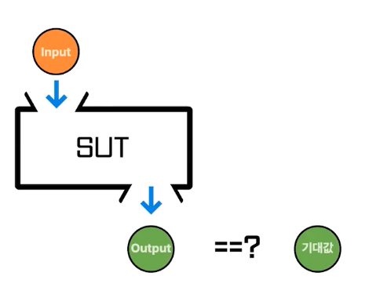
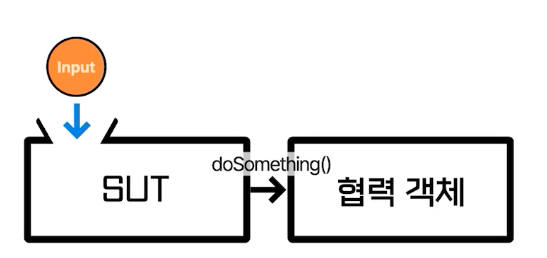

# 기본 개념

## 1. SUT

- System Under Test의 약자
- 테스트하려는 대상을 의미

```java
class MyTest {
  @Test
  void 유저는_북마크를_toggle_추가할_수_있다() {
    // given
    User user = User.builder()
        .bookmark(new ArrayList())
        .build();

    // when
    user.toggleBookmark("my-link");

    // then
    boolean result = user.hasBookmark("my-link");
    assertThat(result).isTrue();
  } 
}
```

- 위 코드의 경우 `user`가 `SUT`이다.
- 아래와 같이 `user`를 `sut`로 대체해 작성하기도 한다.

```java
class MyTest {
  @Test
  void 유저는_북마크를_toggle_추가할_수_있다() {
    // given
    User sut = User.builder()
        .bookmark(new ArrayList())
        .build();

    // when
    sut.toggleBookmark("my-link");

    // then
    boolean result = sut.hasBookmark("my-link");
    assertThat(result).isTrue();
  } 
}
```

## 2. BDD

- Behavior driven development
- given-when-then 


## 3. 상호 작용 테스트 Interaction Test

- 대상 함수의 구현을 호출하지 않으면서 그 함수가 어떻게 호출되는지 검증하는 기법
- 이렇게 메소드가 호출됐는지 검증하는 방법은 좋은 방법이 아니다. 내부 구현을 어떻게 했는지 감시하는 것인데, 이는 캡슐화에 위배된다.

```java
class MyTest {
  @Test
  void 유저는_북마크를_toggle_추가할_수_있다() {
    // given
    User sut = User.builder()
        .bookmark(new ArrayList())
        .build();

    // when
    sut.toggleBookmark("my-link");

    // then
    assertThat(sut.hasBookmark("my-link")).isTrue();
    verify(sut).markModified(); // Interaction test
  } 
}
```

## 4. 상태 검증 vs 행위 검증

### 상태 기반 검증



- State-Based-Verification
- 어떤 값을 시스템에 넣었을 때, 나오는 결과값을 기댓값과 비교하는 방식

```java
class MyTest {
  @Test
  void 유저는_북마크를_toggle_추가할_수_있다() {
    // given
    User sut = User.builder()
        .bookmark(new ArrayList())
        .build();

    // when
    sut.toggleBookmark("my-link");

    // then
    assertThat(sut.hasBookmark("my-link")).isTrue();
    assertThat(sut.isModified()).isTrue();
  } 
}
```

### 행위 기반 검증



- Behavior-Based-Verification
- (=상호 작용 테스트)

```java
class MyTest {
  @Test
  void 유저는_북마크를_toggle_추가할_수_있다() {
    // given
    User sut = User.builder()
        .bookmark(new ArrayList())
        .build();

    // when
    sut.toggleBookmark("my-link");

    // then
    assertThat(sut.hasBookmark("my-link")).isTrue();
    verify(sut).markModified(); // Interaction test
  } 
}
```

## 5. Test Fixture

- 테스트에 필요한 자원을 생성하는 것

```java
class MyTest {
  
  private User sut;
  
  @BeforeEach
  void 사용자를_미리_할당합니다() {
    sut = User.builder()
        .bookmark(new ArrayList())
        .build();
  }

  @Test
  void 유저는_북마크를_toggle_추가할_수_있다() {
    // given
    sut.appentBookmark("my-link");

    // when
    sut.toggleBookmark("my-link");

    // then
    assertThat(sut.hasBookmark("my-link")).isTrue();
    verify(sut).markModified(); // Interaction test
  }
}
```

## 6. 비욘세 규칙

- 구글에서 만든 규칙, 대중적인 규칙은 아니라고 한다.

> 비욘세 싱글 레이디
> 
> "네가 나를 좋아했다면 프로포즈 했었어야지"

- 위 문구를 테스트에 적용해본다면? `상태를 유지하고 싶었다면, 테스트를 만들었어야지`
- "유지하고 싶은 상태가 있으면 전부 테스트로 작성해주세요. 그게 곧 정책이 될 겁니다."

## 7. Testability

- 테스트 가능성
- 소프트웨어가 테스트 가능한 구조인가?

<br/>

# 테스트 대역 Test Double

- 테스트 대역
- 참고할만한 글: [마틴 파울러 아티클](https://martinfowler.com/articles/mocksArentStubs.html)
- 아래의 예시를 보자. 테스트가 돌아갈 때마다 실제 이메일을 보내는 게 맞을까? 아니다. 그 부분에 가짜 객체를 넣어주는 것이 좋다. 

```java
class MyTest {
  
  @Test
  void 이메일_회원가입을_할_수_있다() {
    // given
    UserCreateRequest userCreateRequest = UserCreateRequest.builder()
        .email("bell@mobidoc.us")
        .password("1234")
        .build();

    // when
    UserService sut = UserService.builder()
        .registerEmailSender(new DummyRegisterEmailSender())
        .userRepository(userRepository)
        .build();
    sut.register(userCreateRequest);

    // then
    User user = userRepository.getByEmail("bell@mobidoc.us");
    assertThat(user.isPending()).isTrue();
  }
}
```

## 1. Dummy

- 아무런 동작도 하지 않고 그저 코드가 정상적으로 돌아가기 위해 전달하는 객체
- 위 테스트 코드의 `Dummy`인 `DummyRegisterEmailSender`를 아래와 같이 구성할 수 있다.

```java
class DummyRegisterEmailSender implements RegisterEmailSender {
  
  public void send(String email, String message) {
    // do nothing
  }
}
```

## 2. Fake

- Local에서 사용하거나 테스트에서 사용하기 위해 만들어진 가짜 객체
- 단순한 형태로 동일한 기능은 수행하나, 프로덕션에서 쓰기에는 부족한 객체
- 자체적인 로직이 있다는 점에서 Dummy와 다르다.

```java
class MyTest {
  
  @Test
  void 이메일_회원가입을_할_수_있다() {
    // given
    UserCreateRequest userCreateRequest = UserCreateRequest.builder()
        .email("bell@mobidoc.us")
        .password("1234")
        .build();
    FakeRegisterEmailSender registerEmailSender = new FakeRegisterEmailSender();

    // when
    UserService sut = UserService.builder(registerEmailSender)
        .registerEmailSender()
        .userRepository(userRepository)
        .build();
    sut.register(userCreateRequest);

    // then
    User user = userRepository.getByEmail("bell@mobidoc.us");
    assertThat(user.isPending()).isTrue();
    assertThat(registerEmailSender.findLatestMessage("bell@mobidoc.us").isPresent()).isTrue();
    assertThat(registerEmailSender.findLatestMessage("bell@mobidoc.us").get()).isEqualTo("~~");
  }
}
```

```java
class FakeRegisterEmailSender implements RegisterEmailSender {
  
  private final Map<String, List<String>> latestMessages = new HashMap<>();
  
  public void send(String email, String message) {
    List<String> records = latestMessages.getOrDefault(email, new ArrayList<>());
    records.add(message);
    latestMessages.put(email, records);
  }
  
  public Optional<String> findLatestMessage(String email) {
    return latestMessages.getOrDefault(email, new ArrayList<>()).stream.findFirst();
  }
}
```

## 3. Stub

- 미리 준비된 값을 출력하는 객체
- 미리 준비된 결과 외에는 응답하지 않는다.

```java
class StubUserRepository implements UserRepository {
  public User getByEmail(String email) {
      if (email.equals("bell@mobidoc.us")) {
        return User.builder()
            .email("bell@mobidoc.us")
            .status("PENDING")
            .build();
      }
      throw new UsernameNotFoundException(email);
  }
}
```

- 위의 방식보다는 보통 Mockito 프레임워크를 이용해서 구현된다.

```java
class MyTest {
  
  @Test
  void test() {
    // given
    given(userRepository.getByEmail("bell@mobidoc.us")).willReturn(User.builder()
        .email("bell@mobidoc.us")
        .status("PENDING")
        .build());

    // when
    ...

    // then
    ...
  }
}
```

## 4. Mock

- 메소드 호출을 확인하기 위한 객체
- 행위에 대한 기대를 명세하고 그에 따라 동작하도록 만들어진 객체
- 자가 검증 능력을 가지고 있다.
- 사실상 테스트 더블과 동일한 의미로 사용된다. (stub, dummy, fake 모두 mock이라고 부른다.)

## 5. Spy

- Stub이면서 호출된 내용을 기록하여 보여줄 수 있는 객체
- 일부는 실제 객체처럼 동작시키고 일부만 Stubbing할 수 있다.


## Stub vs Mock

### Stub

- 상태 검증(State Verification)
- 어떤 기능을 요청했을 때 내부적인 상태가 어떻게 바뀌었는지에 집중한다.

### Mock

- 행위 검증(Behavior Verification)
- 어떤 메소드가 실행했을 때 어떤 결과가 Return 되는지.