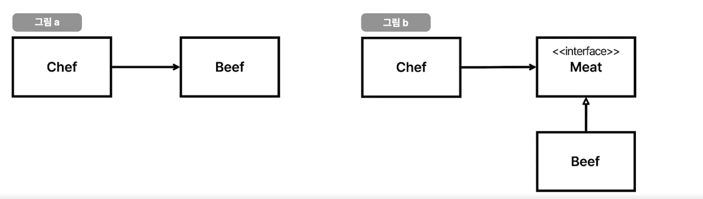

# 의존성과 Testability

## 1. 의존성

> Dependency or coupling, a state in which one object uses a function of another object

- A가 B를 사용하면 A는 B에 의존한다고 할 수 있다.

### 의존성 주입 Dependency Injection

- 의존성을 약화시키는 테크닉
- 인스턴스를 만드는 것보다 의존성 주입을 하는 이유 
  - `new는` 사실상 하드 코딩이기 때문이다.
  - 싱글톤 패턴을 통한 자원 절약

### 의존성 역전 Dependency Inversion

- 의존성 역전 원칙은 SOLID 원칙 중 하나이다. (DIP)

> 의존성 역전?
> 
> 첫째, 상위 모듈은 하위 모듈에 의존해서는 안된다. 상위 모듈과 하위 모듈 모두 추상화에 의존해야 한다.
> 둘째, 추상화는 세부 사항에 의존해서는 안된다. 세부사항이 추상화에 의존해야 한다.

- 의존성 역전은 "화살표 방향을 바꾸는" 테크닉이다.



> 고수준 정책을 구현하는 코드는 저수준 세부사항을 구현하는 코드에 절대로 의존해서는 안된다. 대신 세부사항이 정책에 의존해야 한다.
> 
> 자바와 같은 정적 타입 언어에서 이 말은 use, import, include 구문이 오직 인터페이스나 추상 클래스 같은 추상적인 선언만을 참조해야 한다는 뜻이다. 
> 우리가 의존하지 않도록 피하고자 하는 것은 바로 변동성이 큰 구체적인 요소다.
> 
> 로버트 마틴, <클린 아키텍처 소프트웨어 구조와 설계의 원칙>

<br/>

## 2. 의존성과 테스트

- 테스트를 잘하려면 의존성 주입과 의존성 역전을 잘 다룰 수 있어야 한다.
- 의존성이 숨겨져 있다면 "신호"다. 고쳐야 한다.
- 대부부의 소프트웨어 문제는 의존성 역전으로 해결이 가능하다.

### 문제의 코드

- User 객체는 Clock 객체에 의존하고 있다.
- 때문에 테스트에서 문제가 발생한다. `???`에 도대체 뭐가 들어가야할까..?

```java
class User {
  private long lastLoginTimestamp;
  
  public void login() {
    ...
    this.lastLoginTimestamp = Clock.systemUTC().millis();
  }
}
```

```java
class UserTest {
  
  @Test
  void login_test() {
    // given
    User user = new User();
    
    // when
    user.login();
    
    // then
    assertThat(user.getLastLoginTimestamp()).isEqualTo(???);
  }
}
```

### 해결방법 1: 의존성 주입

- 의존성 주입은 테스트하기 쉽게 만들어주는 좋은 테크닉 중 하나지만, 폭탄 돌리기가 될 수 있다.

```java
class User {
  private long lastLoginTimestamp;
  
  public void login(Clock clock) {
    ...
    this.lastLoginTimestamp = clock.systemUTC().millis();
  }
}
```

```java
class UserTest {
  
  @Test
  void login_test() {
    // given
    User user = new User();
    Clock clock = Clock.fixed(Instant.parse("2024-02-27T00:00:00.00Z"), ZoneOffset.UTC);
    
    // when
    user.login(clock);
    
    // then
    assertThat(user.getLastLoginTimestamp()).isEqualTo(???);
  }
}
```

- 하지만 결국 다른 테스트에도 영향이 간다.
- 아래 예시를 보면 UserService에서도 Clock이 숨겨진 의존성이 되는 것을 확인할 수 있다.

```java
class UserService {
  public void login(User user) {
    ...
    user.login(Clock.systemUTC());
  }
}
```

### 해결방법 2: 의존성 역전

- 의존성 주입 + 의존성 역전 테크닉을 통해 배포 환경과 테스트 환경을 분리할 수 있다.
- 아래 예시를 보자. ClockHolder라는 인터페이스를 정의 현재 시간을 구할 수 있도록 구현했다.
- User와 UserService는 이제 Clock이 아닌 ClockHolder라는 인터페이스에 의존하게 된다.

```java
interface ClockHolder {
  long getMillis();
}
```

```java
class User {
  private long lastLoginTimestamp;
  
  public void login(ClockHolder clockHolder) {
    ...
    this.lastLoginTimestamp = clockHolder.getMillis();
  }
}
```

```java
@Service
@RequiredArgsConstructor
class UserService {
  
  private final ClockHolder clockHolder;
  
  public void login(User user) {
    ...
    user.login(Clock.systemUTC());
  }
}
```

- 아래와 같이 실제 사용하는 객체(`SystemClockHolder`)와 Test용 객체(`TestClockHolder를`) 구분해 구현할 수 있다.

```java
@Component
class SystemClockHolder implements ClockHolder {
  
  @Override
  public long getMillis() {
    return Clock.systemUTC().millis();
  }
}
```

```java
@AllArgsConstructor
class TestClockHolder implements ClockHolder {
  
  private Clock clock;
  
  @Override
  public long getMillis() {
    return clock.millis();
  }
}
```

- 테스트용 `TestClockHolder`를 아래와 같이 활용해볼 수 있다.
- 항상 같은 결과만 내려주는 일관된 테스트를 만들 수 있다!

```java
class UserServiceTest {
  
  @Test
  void login_test() {
    // given
    User user = new User();
    Clock clock = Clock.fixed(Instant.parse("2024-02-27T00:00:00.00Z"), ZoneOffset.UTC);
    UserService userService = new UserService(new TestClockHolder(clock));
    
    // when
    userService.login(user);
    
    // then
    assertThat(user.getLastLoginTimestamp()).isEqualTo(~~);
  }
}
```

<br/>

## 3. Testability

- 얼마나 쉽게 input을 변경하고, output을 검증할 수 있는지
- 아래 코드는 의존성이 감춰져 있기 때문에 input을 제어하기 어렵다. 따라서 testability가 낮은 코드이다.

```java
class User {
  private long lastLoginTimestamp;
  
  public void login() {
    ...
    this.lastLoginTimestamp = Clock.systemUTC().millis();
  }
}
```

### Input 예시

- 아래 코드를 살펴보자. UUID라는 객체가 숨겨져 있다.

```java
@Getter
@Builder(access = AccessLevel.PRIVATE)
@RequiredArgsConstructor
public class Account {
  private final String username;
  private final String authToken;
  
  public static Account create(String username) {
    return Account.builder()
          .username(username)
          .authToken(UUID.randomUUID().toString())
          .build();
  }
}
```

- 권한 토근(authToken)을 검증하기 위해 아래와 같이 어거지로 테스트를 만들어볼 수 있지만 좋은 방법은 아니다.
- static 메소드는 mockito로 stub이 불가능하여 이를 가능하게 해주는 PowerMock 라이브러리를 통해 구성해줄 수 있다.
- 그런데 사실 아래의 방식으로 해결이 불가능하다. UUID는 static class이기 때문이다... (리플렉션 동작이 제대로 되지 않으며, 에러가 발생한다.)

```java
class AccountTest {
  
  @Test
  void create() {
    // given
    String username = "foobar";
    String expectedAuthToken = "~~~~~";
    PowerMockito.mockStatic(UUID.class);
    when(UUID.randomeUUID()).thenReturn(UUID.fromString(expectedAuthToken));
    
    // when
    Account account = Account.create(username);
    
    // then
    assertThat(account.getUsername()).isEqaulTo(username);
    assertThat(account.getAuthToken()).isEqaulTo(expectedAuthToken);
  }
}
```

- 위에서 살펴본 바와 같이 의존성 역전을 사용하면 쉽게 해결할 수 있다.
- AuthTokenGenerator 인터페이스를 만들고 UUID 생성 방식과 Test용 객체를 만들자.
- 테스트용 생성 객체는 UUID를 주입 받을 것이다.

```java
interface AuthTokenGenerator {
  String getAuthToken();
}
```

```java
@Component
public class UUIDAuthTokenGenerator {
  
  public String getAuthToken() {
    return UUID.randomUUID().toString();
  }
}
```

```java
@RequiredArgsConstructor
public class TestAuthTokenGenerator {
  
  private final UUID uuid;
  
  public String getAuthToken() {
    return uuid.toString();
  }
}
```

- 이제 Account에서는 AuthTokenGenerator를 주입받아 사용한다.

```java
@Getter
@Builder(access = AccessLevel.PRIVATE)
@RequiredArgsConstructor
public class Account {
  private final String username;
  private final String authToken;
  
  public static Account create(String username, AuthTokenGenerator tokenGenerator) {
    return Account.builder()
          .username(username)
          .authToken(tokenGenerator.getAuthToken())
          .build();
  }
}
```

- 개선된 `Account`와 테스트용 객체를 통해 아래와 같이 테스트를 개선해볼 수 있다.

```java
class AccountTest {
  
  @Test
  void create() {
    // given
    String username = "foobar";
    UUID uuid = UUID.randomeUUID();
    String expectedAuthToken = uuid.toString();
    
    // when
    Account account = Account.create(username, new TestAuthTokenGenerator(uuid));
    
    // then
    assertThat(account.getUsername()).isEqaulTo(username);
    assertThat(account.getAuthToken()).isEqaulTo(expectedAuthToken);
  }
}
```

### Output 예시

- 아래와 같이 리턴 값이 없어 외부에서 결과를 볼 수 없는 경우가 있다. 이 때도 testability가 낮다고 볼 수 있다.

```java
public class Example {
  public void processDate(int[] numbers) {
    int sum = 0;
    for (int number: numbers) {
      sum += number;
    }
    System.out.println("Sum: " + sum);
  }
}
```