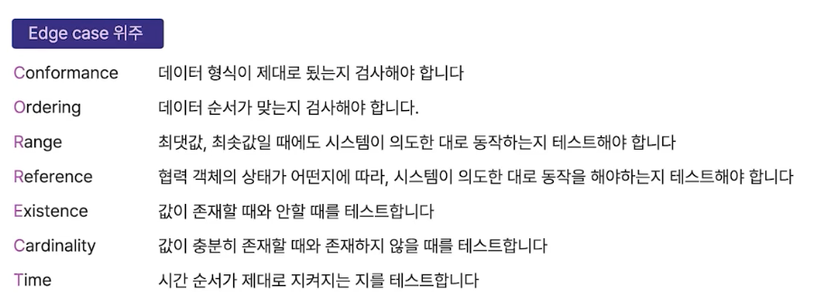
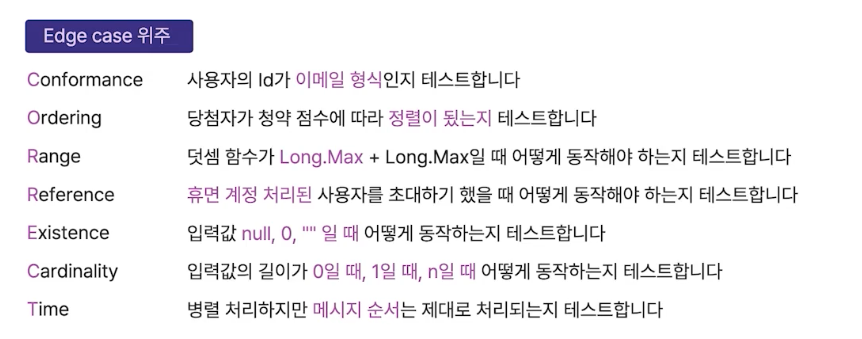

# Where: 어디까지 테스트 해야하는가?

- 커버리지가 중요한 게 아니다.
- 릴리즈할 때 확신을 줄 수 있으면 된다.

# What: 무엇을 테스트 해야하는가?

## Right-BICEP

- ref. 제프 랭어, 앤디 헌트, 데이브 토마스 저. 자바와 JUnit을 활요한 실용주의 단위 테스트 클린 코드의 핵심, 단위 테스트로 소프트웨어의 품질을 향상시킨다!

### Right - 결과가 올바른가?

> 다른 관점으로, 어떤 작은 부분의 코드에 대한 행복 경로 테스트를 할 수 없다면 그내용을 완전히 이해하지 못한 것입니다. 그리고 앞의 질문에 대답할 수 있을 때까지 잠시 추가 개발을 보류하면 좋습니다.

### B: Boundary Conditions - 경계 조건이 맞는가?

> 코드에 있는 분명한 행복 경로는 입력 값의 양극단을 다루는 코드 시나리오의 경계 조건에 걸리지 않을 수도 있습니다.
> 
> 여러분이 마주치는 수많은 결함은 이러한 모서리 사례(coner case)이므로 테스트로 이것들을 처리해야 합니다.
>
 
- Edge Case: 시스테 내부 조건에 의해 발생하는 특별한 케이스를 의미 (ex. Long의 Max 값은 언어마다 다르다)
- Corner Case: 시스템 내/외부 조건에 의해 발생하는 특별한 케이스를 의미 (ex. 네트워크가 단절된 경우, 서버의 메모리가 128MB인 경우)

### I: Inversion relationship - 역 관계를 검사할 수 있는가?

- 역 관계를 검증할 수 있다면 검증하라.
- 굳이?

### C: Cross Check - 교차 검사할 수 있는가?

- 내가 구현한 것과 유사한 라이브러리가 있다면, 구현한 값과 라이브러리 값을 비교하여 검증한다.
- 굳이?

### E: Error Conditions - 오류 상황을 강제로 일어나게 할 수 있는가?

- 오류 상황을 강제로 발생시키고 시스템이 어떻게 동작하는지를 테스트해야 한다.
- 극한 상황에도 테스트가 되어야 한다!
    - 메모리가 가득 찰 때
    - 디스크 공간이 가득 찰 때
    - 서버와 클라이언트 간 시간이 다를 때
    - 네트워크 가용성 및 오류들
    - 시스템 로드
    - 제한된 색상 팔레트
    - 매우 높거나 낮은 비디오 해상도

### P: Performance Characteristics - 성능 조건은 기준에 부합하는가?

- 시스템 성능이 제대로 요구에 부합하는지 테스트한다.
- 일반적으로 e2e(대형) 테스트에 사용되기 때문에 단위 테스트와는 약간 거리가 있다.

 

# Why: 테스트는 왜 해야하는가?

- 테스트 코드를 작성하는 건 사실 굉장히 귀찮다.
- 지속적으로 테스트 코드를 짤려면 충분한 동기부여가 있어야 한다. 따라서 테스트 코드를 짜는 이유를 명확히 하는 것이 좋다.

## 인수 테스트

- 사람은 항상 실수를 유발할 수 있는 가능성을 가지고 있다.
- 사람이 하는 테스트는 소프트웨어가 커지는 속도를 따라잡지 못하게 되는 경우가 생긴다.

### 인수테스트의 문제점

- 커버할 수 없는 영역이 발생
- 경험과 감에 의존
- 늦은 피드백
- 유지보수 어려움
- 소프트웨어에 대한 신뢰도 감소

## 테스트 자동화

- 테스트 코드를 작성해 자동화하면 무엇이 좋을까?
- 바로 피드백을 받을 수 있을 것이고 소프트웨어에 대한 안정감과 신뢰성을 높일 수 있을 것이다.

### 테스트는 잘 짜야한다

- 테스트 코드가 너무 엉망이라면 테스트 코드를 봤을 때 건드리고 싶지 않은 영역이 될 수 있다.
- 테스트를 짜놨으니 잘 돌아가겠지하며 넘겨짚게 되는 등 여러 부작용이 발생할 수 있다.
- 테스트를 작성하는 것도 중요하지만 잘 만드는 것도 중요하다.

## 정리

### 테스트 코드를 작성하지 않으면?

- 변화가 생기는 매순간마다 발생할 수 있는 모든 Case를 고려해야 한다.
- 변화가 생기는 매순간마다 모든 팀원이 동일한 고민을 해야 한다.
- 빠르게 변화하는 소프트웨어의 안정성을 보장할 수 없다.

### 테스트 코드가 병목이 된다면?

- 프로덕션 코드의 안정성을 제공하기 어려워진다.
- 테스트 코드 자체가 유지보수하기 어려운, 새로운 짐이 된다.
- 잘못된 검증이 이뤄질 가능성이 생긴다.

### 올바른 테스트

- 자동화 테스트로 비교적 빠른 시간 안에 버그를 발견할 수 있고, 수동 테스트에 드는 비용을 크게 절약할 수 있다.
- 소프트웨어의 빠른 변화를 지원한다.
- 팀원들의 집단 지성을 팀 차원의 이익으로 승격시킨다.
- 가까이 보면 느리지만, 멀리 보면 가장 빠르다.

 

# 참고자료

- 인프런 강의: [Java/Spring 테스트를 추가하고 싶은 개발자들의 오답노트](https://www.inflearn.com/course/%EC%9E%90%EB%B0%94-%EC%8A%A4%ED%94%84%EB%A7%81-%ED%85%8C%EC%8A%A4%ED%8A%B8-%EA%B0%9C%EB%B0%9C%EC%9E%90-%EC%98%A4%EB%8B%B5%EB%85%B8%ED%8A%B8/dashboard)
- 인프런 강의: [Practical Testing: 실용적인 테스트 가이드](https://www.inflearn.com/course/practical-testing-%EC%8B%A4%EC%9A%A9%EC%A0%81%EC%9D%B8-%ED%85%8C%EC%8A%A4%ED%8A%B8-%EA%B0%80%EC%9D%B4%EB%93%9C/dashboard)
