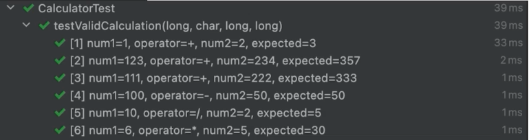

# 테스트 팁

## Parameterized Test

- 똑같은 로직을 여러 번 돌려서 테스트하고 싶을 때 사용하는 방식이다.

### For문을 사용한 테스트?

- 동일 로직을 여러 번 돌릴 때 아래와 같이 테스트하면 좋지 않는 점은 아래와 같다
  - 테스트에 논리 연산이 들어간다는 점
  - 테스트가 실패했을 때 무엇 때문에 실패했는지 한 눈에 알 수 없다는 점

```java
class CalculatorTest {
  
  private final Calculator calculator = new Calculator();
  
  @Test
  void testValidCalculation() throws InvalidOperationException, DivideByZeroException {
    long[] num1Array = new long[]{1, 123, 111, 100, 10, 6};
    long[] num2Array = new long[]{2, 234, 222, 50, 2, 5};
    char[] operatorArray = new char[]{'+', '+', '+', '-', '/', '*'};
    long[] expectedArray = new long[]{3, 357, 333, 50, 5, 30};
    
    for (int i = 0; i < num1Array.length; i++) {
      // given
      long num1 = num1Array[i];
      long num2 = num2Array[i];
      char operator = operatorArray[i];
      long expected = expectedArray[i];
      
      // when
      long result = calculator.calculate(num1, operator, num2);
      
      // then
      assertEqauls(expected, result);
    }
  }
}
```

### 이럴 땐 @ParameterizedTest를 사용하자

- 반복적인 테스트를 논리 로직 없이 돌릴 수 있는 방법이다.

```java
class CalculatorTest {
  
  private final Calculator calculator = new Calculator();
  
  @ParameterizedTest
  @MethodSource("provideValidInputs")
  void testValidCalculation() throws InvalidOperationException, DivideByZeroException {
    // when
    long result = calculator.calculate(num1, operator, num2);
    
    // then
    assertEqauls(expected, result);
  }
  
  private static Stream<Arguments> provideValidInputs() {
    return Stream.of(
        Arguments.of(1, '+', 2, 3),
        Arguments.of(123, '+', 234, 357),
        Arguments.of(111, '+', 222, 333),
        Arguments.of(100, '-', 50, 50),
        Arguments.of(10, '/', 2, 5),
        Arguments.of(6, '*', 5, 30)
    );
  }
}
```

- 위 테스트를 실행하면 아래와 같은 결과를 보여준다



<br/>

## assertAll

- 중간에 실패해도 assert를 모두 돌릴 수 있는 방법이다.
- 그냥 assertThat을 사용했을 때, 중간에 틀린 구문이 있을 경우 assert가 해당 위치에서 멈춰버린다. 그 때문에 그 이후의 검증문이 잘 동작하는지 바로 확인할 수 없다.
- 하지만 아래와 같이 assertAll로 감싸주면 테스트가 중간에 실패하더라도 모든 assert를 돌리기 때문에 다른 지점에서 테스트가 성공하는지 확인할 수 있다.

```java
Assertions.assertAll(
    () -> assertThat(result.getId()).isEqualTo(1),
    () -> assertThat(result.getAddress()).isEqualTo("Incheon"),
    () -> assertThat(result.getNickname()).isEqualTo("bell3")
);
```

## 하나의 테스트

- 한 문단에 한 주제
- 한 개의 테스트는 한 개만 테스트해야 한다. 테스트에서 가장 중요한 건 가시성, 가독성, 표현력이다.
- 테스트 하나에 when이나 then이 너무 많아지면 오히려 테스트 가독성이 떨어질 수 있다
- 만약 다른 사람과 협업을 하고 있다면? 후임자들이 when과 then을 계속 추가할 수도 있다.

### assert는 하나만?

- 하나의 테스트에서 하나의 테스트만 진행해야한다는 원칙이 assert문을 하나만 넣어야 된다는 말과 동일한 것은 아니다.

> 몇몇 TDD 실천가들은 각 테스트에 예상 구문이나 assert를 하나만 담아야한다고 제안하기도 한다.
> 
> 우리는 그 방법이 실용적이지 않다는 사실을 알게 됐다.
> 
> 다시 한 번 강조하지만 표현력이 핵심이다.
> 
> 테스트를 읽는 사람으로서 뭐가 중요한지 가늠할 수 있는가?
> 
> 스티브 프리먼, 냇 프라이스 지음. 테스트 주도 개발로 배우는 객체 지향 설계와 실천
> 

## Thread.sleep

- 테스트에는 Thread sleep을 넣지 말라.
- 비동기 처리를 위해 Thread sleep을 사용하면 개발자 개별의 데스크탑 성능에 따라 테스트 결과가 달라질 수 있다.
- 가장 간단한 해결책은 Thread.join을 사용하는 것이다. 하지만 어디에서나 사용할 수 있는 범용적인 해결책은 아니다.

### Awaitility

- `Awaitility`라는 라이브러리를 사용하면 비동기 테스트가 쉬워진다.

```java
class AsynchronousTest {
  
  @Test
  void CountUpThread는_목표치까지_카운트한다() {
    // given
    int goal = 100_000;
    CountUpThread countUpThread = new CountUpThread(goal);
    
    // when
    countUpThread.start();
    await()
        .atMost(10, timeUnit.SECONDS)
        .until(countUpThread::getCurrentCount, equalTo(goal));
    
    // then
    assertThat(countUpThread.getCurrentCount()).isEqaulTo(goal);
  }
}
```

## FIRST 원칙

### F: Fast - 테스트는 빨라야한다.
### I: Independent - 테스트는 독립적이어야 한다
### R: Repeatable - 테스트는 반복 수행해도 결과가 같아야한다
### S: Self-Validating - 테스트를 수행하면 시스템의 성공/실패를 알 수 있어야 한다
### T: Timely - 테스트는 적시에(코드 구현 전) 작성되어야 한다