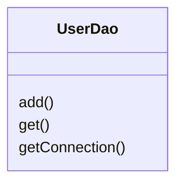
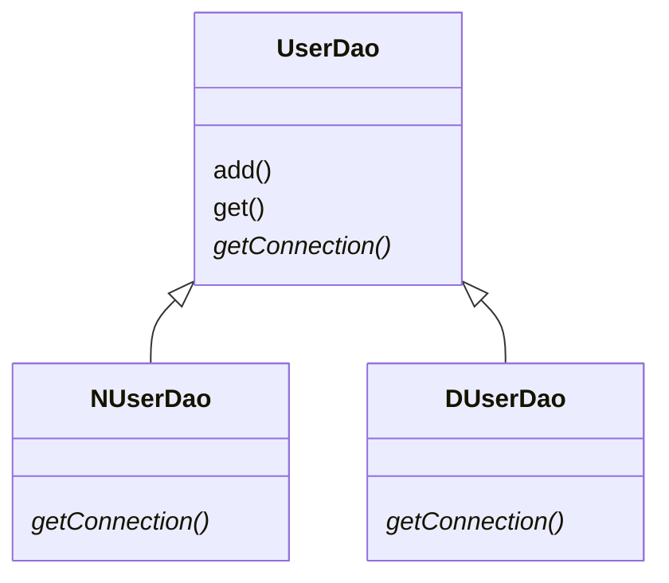
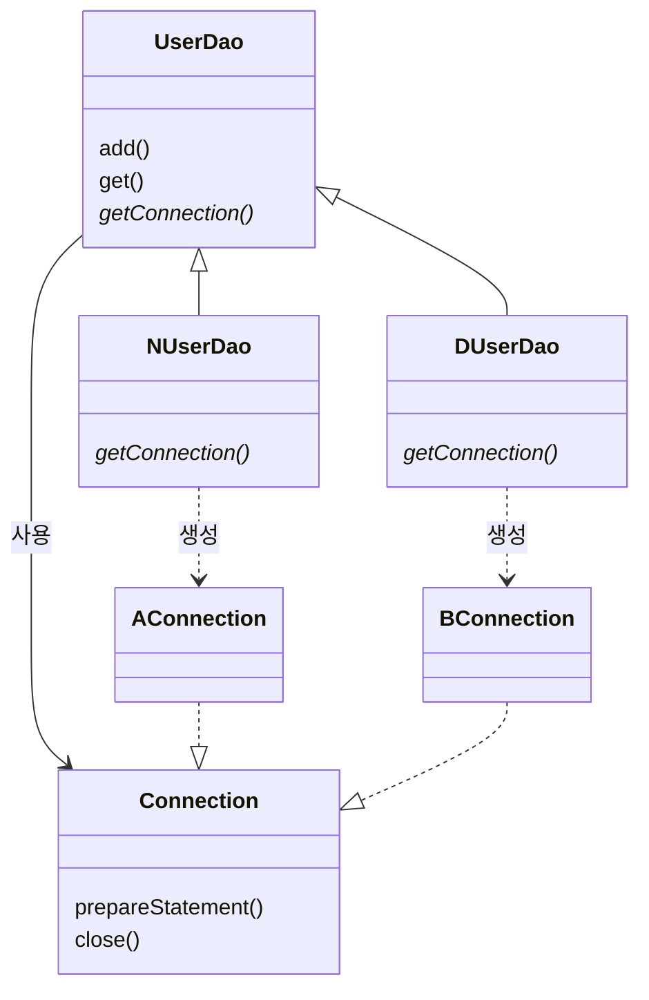
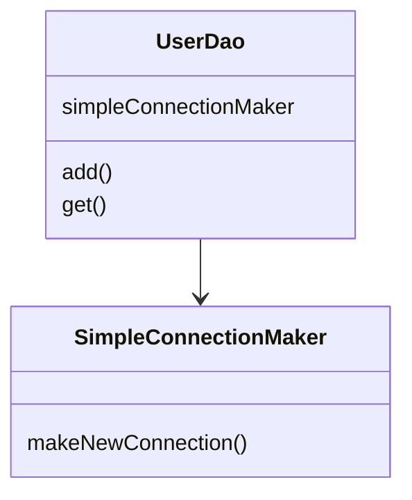
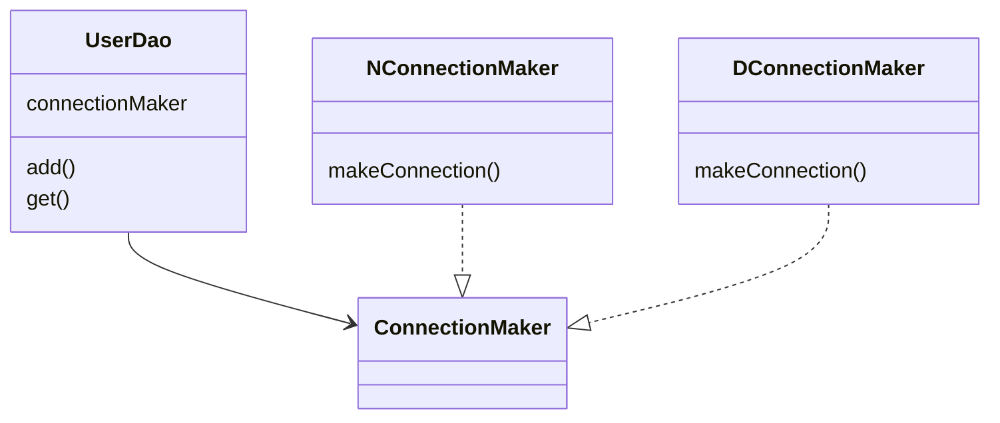
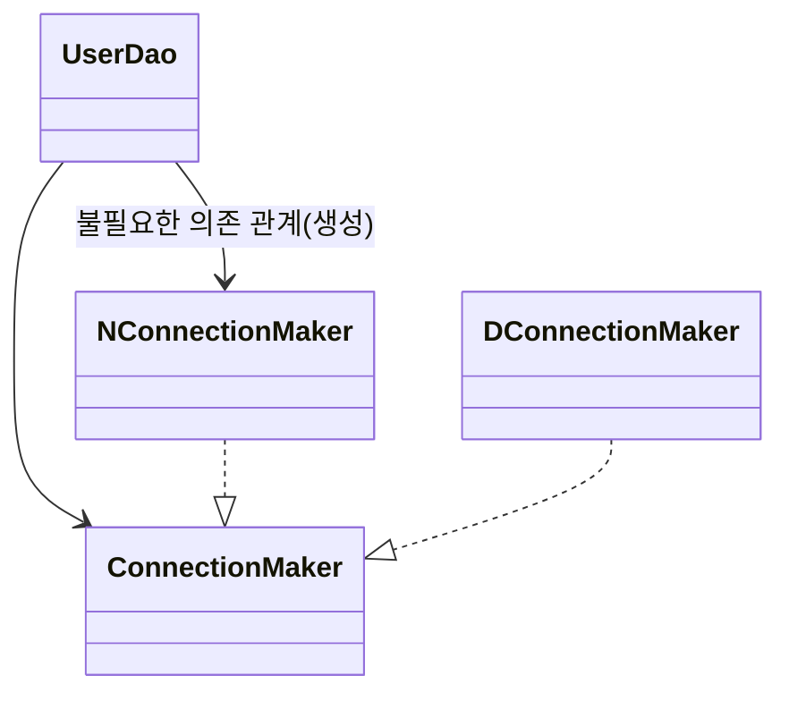
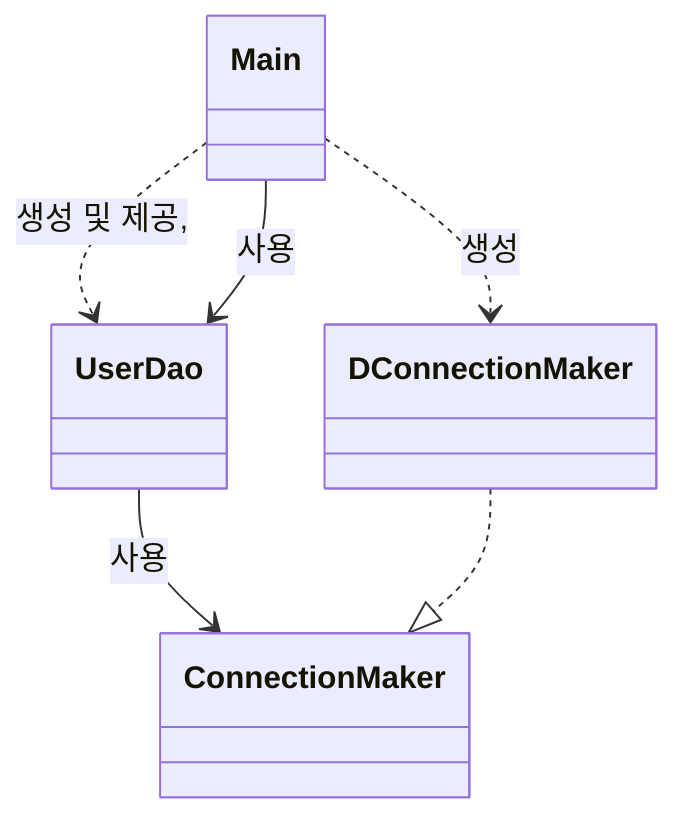
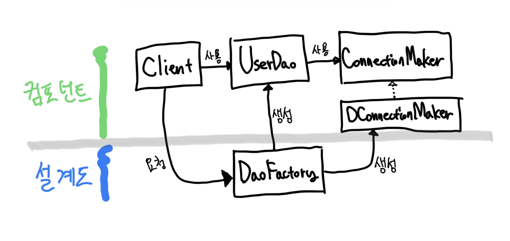

# Chapter01. 오브젝트와 의존관계

- 스프링을 이해하려면 먼저 오브젝트에 깊은 관심을 가져야 한다.
- 애플리케이션에서 오브젝트가 생성되고 다른 오브젝트와 관계를 맺고, 사용되고, 소멸하기까지의 전 과정을 진지하게 생각해볼 필요가 있다.
- 더 나아가서 오브젝트는 어떻게 설계돼야 하는지, 어떤 단위로 만들어지며 어떤 과정을 통해 자신의 존재를 드러내고 등장해야 하는지에 대해서도 살펴봐야 한다.
- 결국 오브젝트 설계와 구현에 관한 여러 가지 응용 기술과 지식이 요구된다.

## 1.1 초난감 DAO

### 1.1.1 User

> #### DAO
> - `Data Access Object`는 DB를 사용해 데이터를 조회하거나 조작하는 기능을 전담하도록 만든 오브젝트를 말한다.

> #### JavaBean
> - JavaBean은 원래 비주얼 툴에서 조작 가능한 컴포넌트를 말한다.
> - 이제 JavaBean이라고 말하면 비주얼 컴포넌트라기보다는 다음 두 가지 관계에 따라 만들어진 오브젝트를 가리킨다. (간단하게 Bean이라고 부르기도 한다.)
> 1. `디폴트 생성자`: 자바빈은 파라미터가 없는 디폴트 생성자를 갖고 있어야 한다. 툴이나 프레임워크에서 리플렉션을 이용해 오브젝트를 생성하기 때문에 필요하다.
> 2. `프로퍼티`: 자바빈이 노출하는 이름을 가진 속성을 프로퍼티라고 한다. 프로퍼티는 set으로 시작하는 수정자 메소드와 get으로 시작하는 접근자 메소드를 이용해 수정 또는 조회할 수 있다.

### 1.1.2 UserDao

- JDBC를 이용하는 작업의 일반적인 순서는 다음과 같다.
1. DB 연결을 위한 `Connection`을 가져온다.
2. SQL을 담은 `Statement(또는 PreparedStatement)`를 만든다.
3. 만들어진 `Statement`를 실행한다.
4. 조회의 경우 SQL 쿼리의 실행 결과를 `ResultSet`으로 받아서 정보를 저장할 오브젝트에 옮겨준다. (여기서는 User)
5. 작업 중에 생성된 `Connection`, `Statement`, `ResultSet` 같은 리소스는 작업을 마친 후 반드시 닫아준다.
6. JDBC API가 만들어내느 `예외 Exception`을 잡아서 직접 처리하거나, 메소드에 `throws`를 선언해서 예외가 발생하면 메소드 밖으로 던지게 한다.

```java
public class UserDao {

  public void add(User user) throws ClassNotFoundException, SQLException {
    Class.forName("com.mysql.cj.jdbc.Driver");
    Connection c = DriverManager.getConnection(
        "jdbc:mysql://localhost:3307/spring", "root", "qwer1234");

    PreparedStatement ps = c.prepareStatement(
        "insert into users(id, name, password) values(?,?,?)");
    ps.setString(1, user.getId());
    ps.setString(2, user.getName());
    ps.setString(3, user.getPassword());

    ps.executeUpdate();

    ps.close();
    c.close();
  }

  public User get(String id) throws ClassNotFoundException, SQLException {
    Class.forName("com.mysql.cj.jdbc.Driver");
    Connection c = DriverManager.getConnection(
        "jdbc:mysql://localhost:3307/spring", "root", "qwer1234");

    PreparedStatement ps = c.prepareStatement(
        "select * from users where id = ?");
    ps.setString(1, id);

    ResultSet rs = ps.executeQuery();
    rs.next();
    User user = new User();
    user.setId(rs.getString("id"));
    user.setName(rs.getString("name"));
    user.setPassword(rs.getString("password"));

    rs.close();
    ps.close();
    c.close();

    return user;
  }
}
```

- 초난감 코드의 조건을 두루 갖춘 DAO 코드
  - 왜 이 코드에 문제가 많다고 하는 것일까?
  - 잘 동작하는 코드를 굳이 수정하고 개선해야 하는 이유는 뭘까?
  - 그렇게 DAO 코드를 개선했을 때의 장점은 무엇일까?
  - 그런 장점들이 당장에, 또는 미래에 주는 유익은 무엇인가?
  - 또, 객체지향 설계의 원칙과는 무슨 상관이 있을까?
  - 이 DAO를 개선하는 경우와 그대로 사용하는 경우, 스프링을 사용하는 개발에서 무슨 차이가 있을까?
- 스프링을 공부한다는 건 바로 이런 문제 제기와 의문에 대한 답을 찾아나가는 과정이다.
  - 스프링은 기계적인 답변이나 성급한 결론을 주지 않는다.

## 1.2 DAO의 분리

### 1.2.1 관심사의 분리

- 어떻게 변경이 일어날 때 필요한 작업을 최소화하고, 그 변경이 다른 곳에 문제를 일으키지 않게 할 수 있을까?
  - `분리와 확장`을 고려한 설계

#### 분리 

- `관심사의 분리 Separation of Concerns`
- 변화는 대체로 집중된 한 가지 관심(ex. DB를 오라클에서 MySQL로 수정)에 대해 일어나지만 그에 따른 작업은 한 곳에 집중되지 않는 경우가 많다.
  - 단지 DB 접속용 암호를 변경하려고 DAO 클래스 수백 개를 모두 수정?
  - 트랜잭션이 기술이 바뀌어 비즈니스 로직이 담긴 코드의 구조를 모두 변경해야 한다면?
- 변화가 한 번에 한 가지 관심에 집중돼서 일어난다면, 우리가 준비해야 할 일은 한 가지 관심이 한 군데에 집중되게 하는 것이다.
  - 즉 관심이 같은 것끼리는 모으고, 관심이 다른 것은 따로 떨어져 있게 하는 것이다.

### 1.2.2 커넥션 만들기 추출

#### UserDao 관심사

1. DB와 연결을 위한 커넥션 가져오기
   - 어떤 DB? 어떤 드라이버? 어떤 로그인 정보? 그 커넥션을 생성하는 방법은 또 어떤 것인지?
2. 사용자 등록을 위해 DB에 보낼 SQL 문장을 담을 `Statement`를 만들고 실행하는 것.
   - 바인딩과 실행.
3. 작업이 끝난 리소스를 시스템에 반

- 현재 관심사가 방만하게 중복되어 있고, 여기저기 흩어져 있어서 다른 관심의 대상과 얽혀 있으면, 변경이 일어날 때 엄청난 고통을 일으키는 원인이 된다.

#### 중복 코드 메소드 추출

```java
public class UserDao {
  
  //...
  
  private static Connection getConnection() throws ClassNotFoundException, SQLException {
    Class.forName("com.mysql.cj.jdbc.Driver");
    Connection c = DriverManager.getConnection(
        "jdbc:mysql://localhost:3307/spring", "root", "qwer1234");
    return c;
  }
}
```

#### 변경에 대한 검증: 리팩토링과 테스트

> #### 리팩토링
> - 기존의 코드를 외부의 동작방식에는 변화 없이 내부 구조를 변경해서 재구성하는 작업 또는 기술.

- 위의 기법은 리팩토링 중에서도 `메소드 추출 extract method`이다.

### 1.2.3 DB 커넥션 만들기 독립

- N사와 D사가 각기 다른 종류의 DB를 사용하고 있고, DB 커넥션을 가져오는 데 있어 독자적으로 만든 방법을 적용하고 싶어한다면 어떻게 해야 할까?

#### 상속을 통한 확장

- `getConnection()`을 추상 메소드로 만드는 것은 어떨까?



- 아래와 같이 말이다.



- 코드 예시

```java
public abstract class UserDao {

  public void add(User user) throws ClassNotFoundException, SQLException {
    Connection c = getConnection();

    // ...
  }
  
  // ...

  public abstract Connection getConnection() throws ClassNotFoundException, SQLException;
}


public class DUserDao extends UserDao {

  @Override
  public Connection getConnection() throws ClassNotFoundException, SQLException {
    // 구현
  }
}

public class NUserDao extends UserDao {

  @Override
  public Connection getConnection() throws ClassNotFoundException, SQLException {
    // 구현
  }
}
```

- 위의 코드는 2가지의 패턴을 사용했다. 
  - `템플릿 메소드 패턴 Template Method Pattern`: 기본적인 로직의 흐름은 슈퍼클래스에서 만들고, 기능의 일부는 서브클래스에서 구현
  - `팩토리 메소드 패턴 Factory Method Pattern`: `Connection` 객체를 어떻게 생성할 것인지 서브클래스에서 구체적으로 결정한다.
- 최종적으로 아래와 같은 형태가 된다.



- 하지만 이 방법은 상속을 사용했다는 단점이 있다. 상속 자체는 간단해 보이고 사용하기도 편리하게 느껴지지만 사실 많은 한계점이 있다.
- 상속관계는 두 가지 다른 관심사에 대해 긴밀한 결합을 허용한다.

## 1.3 DAO의 확장

- `데이터 액세스 로직`과 `DB 연결`. 2개의 관심은 변화의 성격이 다르다.
- 변화의 성격이 다르다는 건 변화의 이유와 시기, 주기 등이 다르다는 뜻이다.

### 1.3.1 클래스의 분리

- DB 커넥션과 관련된 부분을 별도의 클래스에 담아보자.



- 아래는 코드 예시

```java
public class UserDao {

  private SimpleConnectionMaker simpleConnectionMaker;

  public UserDao() {
    simpleConnectionMaker = new SimpleConnectionMaker();
  }

  public void add(User user) throws ClassNotFoundException, SQLException {
    Connection c = simpleConnectionMaker.makeNewConnection();
    //...
  }
}

public class SimpleConnectionMaker {

  public Connection makeNewConnection() throws ClassNotFoundException, SQLException {
    Class.forName("com.mysql.cj.jdbc.Driver");
    Connection c = DriverManager.getConnection(
            "jdbc:mysql://localhost:3307/spring", "root", "qwer1234");
    return c;
  }
}
```

- 여기서 문제. N사와 D사에 `UserDao` 클래스만 공급하고 상속을 통해 DB 커넥션 기능을 확장해서 사용하게 했던 게 다시 불가능해졌다.
- 이렇게 클래스를 분리한 경우에도 상속을 이용했을 때와 마찬가지로 자유로운 확장이 가능하게 하려면 두 가지 문제를 해결해야 한다.
1. `SimpleConnectionMaker`의 메소드가 문제다.
  - 만약 다른 회사에서 사용하는 `Connection` 생성 메소드의 이름이 다르다면..? 지금은 2개만 수정하면 되지만, 수십 수백 개가 되면 그때는 작업의 양이 너무 커진다.
2. DB 커넥션을 제공하는 클래스가 어떤 것인지를 `UserDao`가 구체적으로 알고 있어야 한다는 점이다.
  - `UserDao`에 `SimpleConnectionMaker`라는 클래스 타입의 인스턴스 변수가지 정의해놓고 있으니, N사에서 다른 클래스를 구현하면 어쩔 수 없이 `UserDao` 자체를 다시 수정해야 한다.

### 1.3.2 인터페이스 도입

- 가장 좋은 해결책은 두 개의 클래스가 서로 긴밀하게 연결되어 있지 않도록 중간에 추상적인 느슨한 연결고리를 만들어주는 것이다.
- 자바가 추상화를 위해 제공하는 가장 유용한 도구는 바로 인터페이스다.



### 1.3.3 관계설정 책임의 분리

- `UserDao`와 `ConnectionMaker`라는 두 개의 관심을 인터페이스를 써가면서까지 거의 완벽하게 분리했는데도, 왜 `UserDao`가 인터페이스뿐 아니라 구체적인 클래스까지 알아야 한다는 문제가 발생하는 것일까?
  - `UserDao`에는 어떤 `ConnectionMaker` 구현 클래스를 사용할지를 결정하는 `new DConnectionMaker()`라는 코드가 있다.
  - 이 관심사를 담은 코드를 `UserDao`에서 분리하지 않으면 `UserDao`는 결코 독립적으로 확장 가능한 클래스가 될 수 없다.
- 오브젝트 사이의 관계가 만들어지려면 일단 만들어진 오브젝트가 있어야 하는데, 이처럼 직접 생성자를 호출해서 직접 오브젝트를 만들 수도 있지만, 외부에서 만들어준 것을 가져오는 방법도 있다.



- 객체지향을 다형성을 활용해 구현체를 런타임에 결정할 수 있게 하면 된다!
- 아래와 같이 의존성 주입을 해주면 불필요한 의존성을 끊어낼 수 있다.

```java
public UserDao(final ConnectionMaker connectionMaker) {
  this.connectionMaker = connectionMaker;
}
```

- 아래와 같이 `UserDao`와 `ConnectionMaker`의 관계를 연결해주는 코드가 따로 필요하다.

```java
UserDao dao = new UserDao(new DConnectionMaker());
```

- 결과적으로 아래와 같은 구조가 된다.



### 1.3.4 원칙과 패턴

#### 개방 폐쇄 원칙

- OCP. Open-Closed Principle
- '클래스나 모듈은 확장에는 열려 있어야 하고 변경에는 닫혀 있어야 한다'
- `UserDao`는 DB 연결 방법이라는 기능을 확장하는 데는 열려 있다. 전혀 전혀 영향을 주지 않고도 얼마든지 기능이 확장 가능하다.
- 인터페이스를 사용해 확장 기능을 정의한 대부분의 API는 바로 이 개방 폐쇄 원칙을 따른다고 볼 수 있다.

> #### 객체지향 설계 원칙 SOLID
> - Single Responsibility Principle
> - Open Closed Principle
> - Liskov Subsititution Principle
> - Interface Segragation Principle
> - Dependency Inversion Principle

#### 높은 응집도와 낮은 결합도

- 응집도가 높다는 것은 변화가 일어날 때 해당 모듈에서 변하는 부분이 크다는 것으로 설명할 수도 있다.
  - 즉, 변경이 일어날 때 모듈의 많은 부분이 함께 바뀐다면 응집도가 높다고 말할 수 있다.
- 낮은 결합도는 높은 응집도보다 더 민감한 원칙이다.
  - 책임과 관심사가 다른 오브젝트 또는 모듈과는 낮은 결합도, 즉 느슨하게 연결된 형태를 유지하는 것이 바람직하다.
  - 여기서 결합도란 '하나의 오브젝트가 변경이 일어날 때에 관계를 맺고 있는 다른 오브젝트에게 변화를 요구하는 정도'라고 설명할 수 있다.
  - 결국 하나의 변경이 발생할 때 마치 파문이 이는 것처럼 여타 모듈과 객체로 변경에 대한 요구가 전파되지 않는 상태를 말한다.

#### 전략 패턴

- 개선한 구조를 디자인 패턴의 시각으로 보면 `전략 패턴 Strategy Pattern`에 해당한다고 볼 수 있다.
  - 개방 폐쇄 원칙의 실현에도 가장 잘 들어맞는 패턴이다.
  - 전략 패턴은 자신의 기능 `맥락 Context`에서, 필요에 따라 변경이 필요한 알고리즘을 인터페이스를 통해 통째로 외부로 분리시키고, 이를 구현한 구체적인 알고리즘 클래스를 필요에 따라 바꿔서 사용할 수 있게 하는 디자인 패턴이다.
- 컨텍스트(`UserDao`)를 사용하는 클라이언트(`Main`)는 컨텍스트가 사용할 전략(`ConnectionMaker` 구현체)을 컨텍스트의 생성자 등을 통해 제공해주는 게 일반적이다.

<br/>

## 1.4 제어의 역전 IoC

### 1.4.1 오브젝트 팩토리

- `UserDao`와 `ConnectionMaker` 구현 클래스의 오브젝트를 만드는 것과, 그렇게 만들어진 두 개의 오브젝트가 연결돼서 사용될 수 있도록 관계를 맺어주자. 

#### 팩토리

```java
public class DaoFactory {

  public UserDao userDao() {
    ConnectionMaker connectionMaker = new DConnectionMaker();
    UserDao userDao = new UserDao(connectionMaker);
    return userDao;
  }
}
```

- Main에서는 아래와 같이 사용하면 된다.

```java
UserDao dao = new DaoFactory().userDao();
```

#### 설계도로서의 팩토리



- `DaoFactory`를 분리했을 때 얻을 수 있는 장점은 매우 다양하다. 그중에서도 애플리케이션의 컴포넌트 역할을 하는 오브젝트와 애플리케이션의 구조를 결정하는 오브젝트를 분리했다는 데 가장 큰 의미가 있다.

### 1.4.2 오브젝트 팩토리의 활용

- 만약 `DaoFactory`에 다른 Dao를 만드는 메소드를 추가한다면 어떻게 될까?
  - `AccountDao`, `MessageDao`
- `ConnectionMaker connectionMaker = new DConnectionMaker();` 코드가 중복되기 시작할 것이다.
- 그러면 `Connection`을 만드는 메소드를 새로 만들면 된다.

```java
public class DaoFactory {

  public UserDao userDao() {
    return new UserDao(connectionMaker());
  }

  public AccountDao accountDao() {
    return new AccountDao(connectionMaker());
  }

  public MessageDao messageDao() {
    return new MessageDao(connectionMaker());
  }

  public ConnectionMaker connectionMaker() {
    return new DConnectionMaker();
  }
}
```

### 1.4.3 제어권의 이전을 통한 제어관계 역전

- 제어의 역전이라는 건, 간단히 프로그램의 제어 흐름 구조가 뒤바뀌는 것이라고 설명할 수 있다.
- 지금의 구조는 모든 오브젝트를 사용하는 쪽에서 제어하는 구조다.
- 반면 제어의 역전은 이런 제어 흐름이 개념을 거꾸로 뒤집는 것이다.
  - 제어의 역전에서는 오브젝트가 자신이 사용할 오브젝트를 스스로 선택하지 않는다. 당연히 생성하지도 않는다.
  - 또 자신도 어떻게 만들어지고 어디서 사용되는지를 알 수 없다. 모든 제어 권한을 자신이 아닌 다른 대상에게 위임하기 때문이다.
- 프레임워크가 제어의 역전 개념이 적용된 대표적인 기술이다. 프레임워크는 라이브러리의 다른 이름이 아니다.
  - 라이브러리를 사용하는 애플리케이션 코드는 제어의 흐름을 직접 제어한다.
  - 프레임워크는 애플리케이션 코드가 프레임워크에 의해 사용된다. 프레임워크가 흐름을 주도하고, 그 도중에 개발자가 만든 애플리케이션 코드를 사용하도록 만드는 방식이다.
- 하지만 IoC는 기본적으로 프레임워크만의기술ㄷ 아니고 프레임워크가 꼭 필요한 개념도 아니다.
  - 단순하게 생각하면 디자인 패턴에서도 발견할 수 있는 것처럼 상당히 폭넓게 사용되는 프로그래밍 모델이다.
  - `DaoFactory`는 오브젝트 수준의 가장 단순한 IoC 컨테이너 내지는 IoC 프레임워크라고 불릴 수 있다.

# 참고자료

- 토비의 스프링, 이일민 저