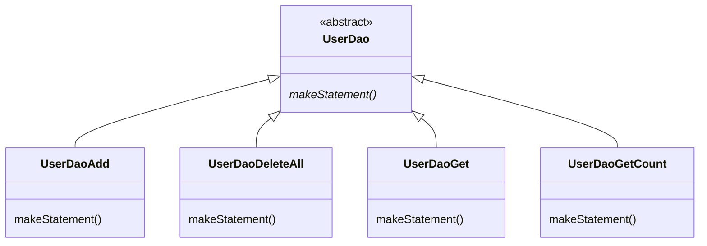
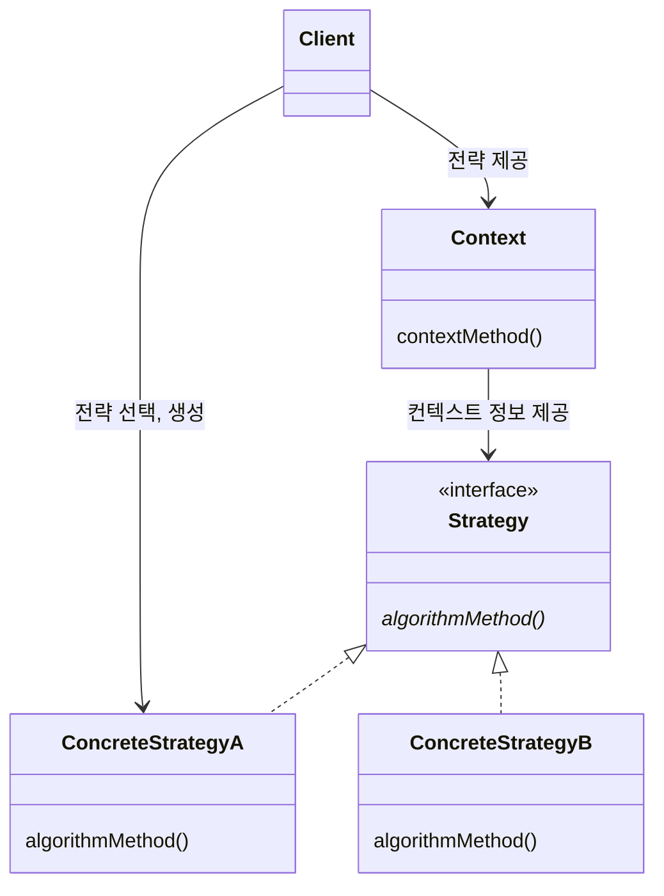

# Chapter03. 템플릿

- 변화의 특성이 다른 부분을 구분해주고, 각각 다른 목적과 다른 이유에 의해 다른 시점에 독립적으로 변경될 수 있는 효율적인 구조를 만들어 주는 것이 OCP다.
- 템플릿이란 바뀌는 성질이 다른 코드 중에서 변경이 거의 일어나지 않으며 일정한 패턴으로 유지되는 특성을 가진 부분을 자유롭게 변경되는 성질을 가진 부분으로부터 독립시켜서 효과적으로 활용할 수 있도록 하는 방법이다.

## 1. 다시 보는 초난감 DAO

### 1-1. 예외처리 기능을 갖춘 DAO

- DB 커넥션이라는 제한적인 리소스 공유할 때 반드시 지켜야 하는 원칙! 바로 예외처리!
  - 예외가 발생하더라도 사용한 리소스를 반드시 반환하도록 만들어야 하기 때문!

#### JDBC 수정 기능의 예외처리 코드

- 만약 문제가 발생해서 `Connection`과 `PreparedStatement`의 `close()` 메소드가 실행되지 않아서 제대로 리소스가 반환되지 않는다면???
  - 이 문제가 계속해서 쌓이면 어느 순간에 커넥션 풀에 여유가 없어지고 리소스가 모자란다는 심각한 오류를 내며 서버가 중단될 수 있다.

> #### 리소스 반환과 close
> - `Connection`과 `PreparedStatement`에는 `close()`라는 메소드가 있다.
>   - 단순하게 생각하면 만들어진 걸 종료하는 것이라고 볼 수 있지만 보통 리소스를 반환한다는 의미로 이해하는 것이 좋다.
> - `Connection`과 `PreparedStatement`는 보통 `풀 Pool` 방식으로 운영된다.
>   - 미리 정해진 풀 안에 제한된 수의 리소스를 만들어두고 필요할 때 이를 할당하고, 반환하면 다시 풀에 넣는 방식으로 운영된다.
> - 요청이 매우 많을 경우 유리하며, 사용한 리소스는 빠르게 반환해야 한다. 그렇지 않으면 리소스가 고갈되고 결국 문제가 발생한다.

- 따라서 어떤 경우에도 리소스를 반환하도록 `try/catch/finally` 구문 사용을 권장한다. 

```java
public void deleteAll() throws ClassNotFoundException, SQLException {
    Connection c = null;
    PreparedStatement ps = null;
    try {
      c = dataSource.getConnection();
      ps = c.prepareStatement("delete from users");
      ps.executeUpdate();
    } catch (SQLException e) {
      throw e;
    } finally {
      if (ps != null) {
       try {
         ps.close();
       } catch (SQLException e) {}
      }
      if (c != null) {
       try {
         c.close();
       } catch (SQLException e) {}
      }
    }
}
```

#### JDBC 조회 기능의 예외처리

- 조회를 위한 JDBC 코드는 좀더 복잡해진다. `Connection`과 `PreparedStatement` 외에도 `ResultSet`이 추가되기 때문이다.

```java
public int getCount() throws ClassNotFoundException, SQLException {
  Connection c = null;
  PreparedStatement ps = null;
  ResultSet rs = null;

  try {
    c = dataSource.getConnection();
    ps = c.prepareStatement("select count(*) from users");
    rs = ps.executeQuery();
    rs.next();
    return rs.getInt(1);
  } catch (SQLException e) {
    throw e;
  } finally {
    if (rs != null) {
      try {
        rs.close();
      } catch (SQLException e) {
      }
    }
    if (ps != null) {
      try {
        ps.close();
      } catch (SQLException e) {
      }
    }
    if (c != null) {
      try {
        c.close();
      } catch (SQLException e) {
      }
    }
  }
}
```

## 2. 변하는 것과 변하지 않는 것

### 2-1. JDBC try/catch/finally 코드의 문제점

- 복잡한 `try/catch/finally` 블록이 2중으로 중첩까지 되어 나오는데다, 모든 메소드마다 반복된다.
  - 위 코드를 Copy&Paste 하다보면 실수가 나올 수밖에 없다.
- 테스트를 통해 DAO마다 예외상황에서 리소스를 반납하는지 체크한다면? => 좋은 생각이긴 한데 막상 적용하기는 쉽지 않다.
  - 예외상황을 처리하는 코드는 테스트하기가 매우 어렵고 모든 DAO 메소드에 대해 이런 테스트를 일일이 한다는 건 매우 번거롭다.
  - 게다가 강제로 예외상황을 만들려면 테스트를 위해 특별히 개발한 `Connection`과 `PreparedStatement` 구현 클래스가 필요하다. => 구현? 쉽지 않다.
  - 또한, 테스트 코드의 양이 엄청나게 늘어난다.

### 2-2. 분리와 재사용을 위한 디자인 패턴 적용

- 먼저 변하는 부분과 변하지 않는 부분을 분리해보자.
  - 변하지 않는 부분: `Connection`과 `PreparedStatement` (+ `ResultSet`)을 가져오는 코드와 실행하는 부분
  - 변하는 부분: `PreparedStatement`를 만드는 부분 (+ `ResultSet`으로 조회하는 부분)

#### 메소드 추출

- 먼저 생각해볼 수 있는 방법은 변하는 부분을 메소드로 빼는 것이다.
  - 당장 적용해봐선 별 이득이 없어보인다.

#### 템플릿 메소드 패턴의 적용

- 변하지 않는 부분은 슈퍼클래스에 두고 변하는 부분은 추상 메소드로 정의해둬서 서브클래스에서 오버라이드하여 새롭게 정의해 쓰도록 하는 방법이다.
- 아래는 `UserDao`를 Abstract Class로 만들고 `UserDaoDeleteAll` 클래스를 구현한 예시이다.

```java
public class UserDaoDeleteAll extends UserDao {
  
  protected PreparedStatement makeStatement(final Connection c) throws SQLException {
    return c.prepareStatement("delete from users");
  }
}
```

- OCP를 그럭저럭 지키는 구조를 만들어 낼 수는 있을 것 같다. 하지만 템플릿 메소드 패턴으로의 접근은 제한이 많다.
  - 가장 큰 문제는 DAO 로직마다 상속을 통해 새로운 클래스를 만들어야 한다는 점이다.



- 또 확장구조가 이미 클래스를 설계하는 시점에서 고정되어 버린다는 점이다.
  - 이미 클래스 레벨에서 컴파일 시점에 이미 그 관계가 결정되어 있따.
  - 따라서 그 관계에 대한 유연성이 떨어져 버린다.

#### 전략 패턴의 적용

- 전략 패턴은 OCP를 잘 지키는 구조이면서도 템플릿 메소드 패턴보다 유연하고 확장성이 뛰어나다.
- `deleteAll()`의 컨텍스트를 정리해보면 다음과 같다.
  - DB 커넥션 가져오기
  - `PreparedStatement`를 만들어줄 외부 기능 호출하기
  - 전달받은 `PreparedStatement` 실행하기
  - 예외가 발생하면 이를 다시 메소드 밖으로 던지기
  - 모든 경우에 만들어진 `PreparedStatement`와 `Connection`을 적절히 닫아주기
- 두 번째 작업인 "`PreparedStatement`를 만들어줄 외부 기능 호출하기"가 전략 패턴에서 말하는 전략이라고 볼 수 있다.

```java
public interface StatementStrategy {
  PreparedStatement makePreparedStatement(Connection connection) throws SQLException;
}
```

- `deleteAll()` 예시

```java
public class DeleteAllStatement implements StatementStrategy {
  @Override
  public PreparedStatement makePreparedStatement(final Connection c) throws SQLException {
    return c.prepareStatement("delete from users");
  }
}
```

```java
public void deleteAll() throws SQLException {
  ...
  try {
    c = dataSource.getConnection();
  
    StatementStrategy strategy = new DeleteAllStatement();
    ps = strategy.makePreparedStatement(c);
  
    ps.executeUpdate();
  } catch (SQLException e) {
  ...
}
```

- 하지만 이렇게 컨텍스트 안에 구체적인 전략 클래스인 `DeleteAllStatement`를 사용하도록 고정되어 있다면 뭔가 이상하다.
  - 컨텍스트가 `StatementStrategy` 인터페이스뿐 아니라 특정 구현 클래스인 `DeleteAllStatement`를 직접 알고 있다는 건, 전략패턴에도 OCP에도 잘 들어맞는다고 볼 수 없기 때문.

#### DI 적용을 위한 클라이언트/컨텍스트 분리

- 전략 패턴에 따르면 `Context`가 어떤 전략을 사용하게 할 것인가는 `Context`를 사용하는 앞단의 `Client`가 결정하는 게 일반적이다.
  - `Client`가 구체적인 전략의 하나를 선택하고 오브젝트로 만들어서 `Context`에 전달하는 것이다.



- 중요한 것은 이 컨텍스트에 해당하는 JDBC `try/catch/finally` 코드를 클라이언트 코드인 `StatementStrategy`를 만드는 부분에서 독립시켜야 한다는 점이다.

```java
StatementStrategy strategy = new DeleteAllStatement();
```

- 전략 인터페이스인 `StatementStrategy`를 컨텍스트 메소드 파라미터로 지정할 필요가 있다.

```java
public void jdbcContextWithStatementStrategy(StatementStrategy strategy) throws SQLException {
  Connection c = null;
  PreparedStatement ps = null;
  try {
    c = dataSource.getConnection();

    ps = strategy.makePreparedStatement(c);

    ps.executeUpdate();
  } catch (SQLException e) {
    throw e;
  } finally {
    if (ps != null) {
      try {
        ps.close();
      } catch (SQLException e) {
      }
    }
    if (c != null) {
      try {
        c.close();
      } catch (SQLException e) {
      }
    }
  }
}
```

> #### 마이크로 DI
> - 의존관계 주입은 다양한 형태로 적용할 수 있다.
>   - DI의 가장 중요한 개념은 제 3자의 도움을 통해 두 오브젝트 사이에 유연한 관계가 설정되도록 만든다는 것이다.
> - 일반적으로 DI는 의존관계에 있는 두 개의 오브젝트와 이 관계를 다이내믹하게 설정해주는 `오브젝트 팩토리(DI Container)`, 그리고 이를 사용하는 `클라이언트`라는 4개의 오브젝트 사이에서 일어난다.
> - 하지만 때로는 원시적인 전략 패턴 구조를 따라 클라이언트가 오브젝트 팩토리의 책임을 함께 지고 있을 수도 있다.
>   - 또는 클라이언와 전랴이 결합될 수도 있다.
>   - 심지어 클라이언트와 DI 관계에 있는 두 개의 오브젝트가 모두 하나의 클래스 안에 담길 수도 있다.
> - 이런 경우에는 DI가 매우 작은 단위의 코드와 메소드 사이에서 일어나기도 한다.
>   - 얼핏 보면 DI 같아 보이지 않지만, 세밀하게 관찰해보면 작은 단위지만 엄연히 DI가 이뤄지고 있음을 알 수 있따.
>   - 이렇게 DI의 장점을 단순화해서 IoC 컨테이너의 도움 없이 코드 내에서 적용한 경우를 마이크로 DI라고 한다.
>   - 또는 코드에 의한 DI라는 의미로 수동 DI라고 부를 수도 있다.

## 3. JDBC 전략 패턴의 최적화

### 3-1. 전략 클래스의 추가 정보

- `add()`는 `deleteAll()`과 달리 `User`를 전달받아야 한다.
  - `StatementStrategy`의 구현체인 `AddStatement`의 생성자에 `User`를 전달받는 방식 사용.

```java
public void add(User user) throws SQLException {
  StatementStrategy st = new AddStatement(user);
  jdbcContextWithStatementStrategy(st);
}
```

### 3-2. 전략과 클라이언트의 동거

- 두 가지 불만
1. DAO 메소드마다 새로운 `StatementStrategy` 구현 클래스를 만들어야 한다는 점.
2. DAO 메소드에서 `StatementStrategy`에 전달할 `User`와 같은 부가적인 정보가 있는 경우, 이를 위해 오브젝트를 전달받는 생성자와 이를 저장해둘 인스턴스 변수를 번거롭게 만들어야 한다는 점.

#### 로컬 클래스

- `StatementStrategy` 전략 클래스를 매번 독립된 파일로 만들지 말고 `UserDao` 메소드 안에 내부 클래스로 정의

> #### 중첩 클래스의 종류
> - 다른 클래스 내부에 정의되는 클래스를 `중첩 클래스 nested class`라고 한다. 중첩 클래스는 두 가지로 분류할 수 있다. 
>   - 독립적으로 오브젝트로 만들어질 수 있는 `static class`
>   - 자신이 정의된 클래스의 오브젝트 안에서만 만들어질 수 있는 `inner class`
> - `inner class`는 다시 `범위 scope`에 따라 세 가지로 구분된다.
>   - `member inner class`: 오브젝트 레벨에서 정의
>   - `local class`: 메소드 레벨에서 정의
>   - `anonymous inner class`: 이름을 갖지 않는 클래스. 범위는 선언된 위치에 따라서 다르다.

#### 익명 내부 클래스

> #### anonymous inner class
> `new 인터페이스이름() {클래스 본문}`

## 4. 컨텍스트와 DI


# 참고자료

- 토비의 스프링, 이일민 저
