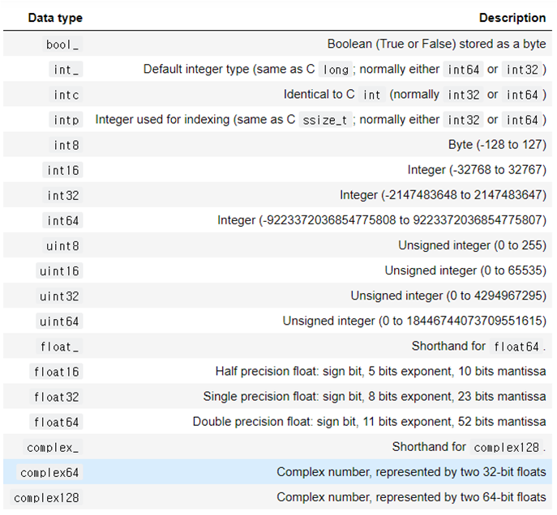

# 01 데이터 사이언스를 위한 라이브러리

## 1. Numpy

<hr/>
Numpy란 "Numerical Python"의 약자로 대규모 다차원 배열과 행렬 연산에 필요한 다양한 함수를 제공하는 라이브러리이다. 파이썬의 list를 개선한 형태인 Numpy의 ndarray 객체는 더 많은 데이터를 더 빠르게 처리할 수 있도록 도와준다.

넘파이는 N차원 배열 객체, 선형대수학, 푸리에 변환 및 난수 기능, 범용적 데이터 처리를 위한 다차원 컨테이너 등의 기능을 제공한다. Numpy를 사용하기 위해 아래와 같이 선언해주면 된다.


```python
import numpy as np
np.__version__
```


    '1.20.3'


Tip! 만약 모든 출력을 보고 싶다면 아래와 같이 적어주면 된다.


```python
from IPython.core.interactiveshell import InteractiveShell
InteractiveShell.ast_node_interactivity = "all"
```


### 1-1. Numpy 배열

<hr/>

Numpy 배열인 ndarray객체는 array메소드를 통해 생성할 수 있는데, 파라미터로 파이썬의 list형의 데이터를 넣어주면 된다.


```python
arr = np.array([1,2,3])
arr
```


    array([1, 2, 3])


```python
arr = np.array([1,2,3], dtype="float64")
arr
```


    array([1., 2., 3.])


### 1-2. Numpy 메소드를 통해 배열 만들기

<hr/>


```python
# 0으로 채운 길이 10의 정수 배열
np.zeros(10, dtype=int)

# 1로 채운 3x5 부동 소수점 배열
np.ones((3, 5), dtype=float)

# 3.14로 채운 3x5 배열
np.full((3, 5), 3.14)

# 3x3 단위행렬(곱했을 때 1과 같은 역할을 하는 행렬)
np.eye(3)

np.empty(3)
```


    array([0, 0, 0, 0, 0, 0, 0, 0, 0, 0])


    array([[1., 1., 1., 1., 1.],
           [1., 1., 1., 1., 1.],
           [1., 1., 1., 1., 1.]])


    array([[3.14, 3.14, 3.14, 3.14, 3.14],
           [3.14, 3.14, 3.14, 3.14, 3.14],
           [3.14, 3.14, 3.14, 3.14, 3.14]])


    array([[1., 0., 0.],
           [0., 1., 0.],
           [0., 0., 1.]])


    array([1., 1., 1.])


- 난수를 통한 배열 생성

np.random을 이용한 배열 생성으로 random, normal, randint, randn, rand 등이 있다.

Tip! np.random.seed(임의의 숫자)를 이용하면 같은 값의 난수 입력을 받을 수 있어 비교하기가 편하다.


```python
# 0과 1사이의 난수
np.random.random((3, 3))

# 정규 분포(평균=0, 표준 편차=1)의 난수로 채운 3x3 배열 만들기
np.random.normal(0, 1, (3, 3))

# [0, 10] 사이의 정수 난수
np.random.randint(0, 10, (3, 3))
```


    array([[0.51929269, 0.87042204, 0.34542374],
           [0.61417534, 0.14085319, 0.35836425],
           [0.08454166, 0.1238812 , 0.48541826]])


    array([[-0.32989793,  0.88326328, -1.2605663 ],
           [ 1.771476  , -1.11999977, -1.30756471],
           [ 0.48020197,  0.92547754,  0.12026089]])


    array([[4, 4, 8],
           [3, 8, 0],
           [5, 3, 8]])


- numpy.linspace

numpy.linspace(start, stop, num=50, endpoint=True, retstep=False, dtype=None) <br/>
start부터 stop까지의 범위에서 데이터를 생성

<br/>

- numpy.arange

numpy.arange([start,] stop[, step,], dtype=None) <br/>
start부터 stop미만까지의 범위에서 step 간격의 데이터를 생성

<br/>

- numpy.logspace

numpy.logspace(start, stop, num=50, endpoint=True, base=10.0, dtype=None) <br/>
로그 스케일의 linspace함수


```python
np.arange(0, 20, 2)

np.linspace(0, 1, 5)

np.logspace(0, 1, 5, endpoint=True)
```


    array([ 0,  2,  4,  6,  8, 10, 12, 14, 16, 18])


    array([0.  , 0.25, 0.5 , 0.75, 1.  ])


    array([ 1.        ,  1.77827941,  3.16227766,  5.62341325, 10.        ])


### 1-3. Numpy 데이터 타입

<hr/>




### 1-4. Numpy 배열 접근

<hr/>

- ndarray의 정보 알아내기

```python
ndarray.ndim            # 배열의 차원 (ex- 1차원배열, 3차원배열)
ndarray.shape           # 배열의 형상 (ex- 3차원이면, (x축, y축, z축) 반환)
ndarray.size            # 배열의 요소 수
ndarray.dtype           # 배열의 데이터타입
ndarray.itemsize        # 배열 요소의 바이트크기
ndarray.nbytes          # 배열 전체 메모리 크기 (바이트 단위)
```

<br/>

- ndarray가 2차원 배열일 때, 행 또는 열 정보만 뽑아내기

```python
ndarray[0, :]  # 첫 번째 행만 반환

ndarray[:,1]   # 두 번째 열만 반환
```


### 1-5. Numpy 배열 재구조화

<hr/>
<br/>

- Numpy.ndarray.reshape(shape, order='C')


```python
grid = np.arange(1, 10).reshape((3, 3))
print(grid)

x = np.array([1, 2, 3])
x.reshape((3, 1))       # 열벡터로 변경
x.reshape((1, 3))       # 행백터로 변경
```

<br/>

- Numpy.newaxis


```python
x[:, np.newaxis]        # 열벡터로 변경
x[np.newaxis, :]        # 행백터로 변경
```

    [[1 2 3]
     [4 5 6]
     [7 8 9]]
    


    array([[1],
           [2],
           [3]])


    array([[1, 2, 3]])


    array([[1],
           [2],
           [3]])


    array([[1, 2, 3]])


<br/>

#### 접합하기 

- Numpy.concatenate

배열을 접합시킴

- Numpy.vstack

배열을 수직으로 쌓는 방식

- Numpy.hstack

배열을 수평으로 쌓는 방식


```python
x = np.array([1, 2, 3])
y = np.array([3, 2, 1])
np.concatenate([x, y])

z = [99, 99, 99]
print(np.concatenate([x, y, z]))

grid = np.array([[1,2,3], [4,5,6]])
# 수직으로 연결
np.concatenate([grid, grid])

# 수평으로 연결
np.concatenate([grid, grid], axis=1)

np.vstack([x, grid])

y = np.array([[10], [10]])
np.hstack([grid, y])
```


    array([1, 2, 3, 3, 2, 1])


    [ 1  2  3  3  2  1 99 99 99]
    


    array([[1, 2, 3],
           [4, 5, 6],
           [1, 2, 3],
           [4, 5, 6]])


    array([[1, 2, 3, 1, 2, 3],
           [4, 5, 6, 4, 5, 6]])


    array([[1, 2, 3],
           [1, 2, 3],
           [4, 5, 6]])


    array([[ 1,  2,  3, 10],
           [ 4,  5,  6, 10]])


<br/>

#### 분할하기 

- Numpy.split(ary, indices_or_sections, axis=0)

indices_or_sections에 적힌 인덱스에 따라 슬라이싱해서 나눔

- Numpy.vsplit

인덱스에 맞게 수평으로 분할

- Numpy.hsplit

인덱스에 맞게 수직으로 분할


```python
x = [0, 1, 2,3,4,5,6,7,8,9]
x1, x2, x3 = np.split(x, (3, 5))
print(x1, x2, x3)

x1, x2, x3, x4, x5 = np.split(x, (3, 5, 6, 9))
print(x1, x2, x3, x4, x5)

grid = np.arange(16).reshape((4,4))
grid

upper, lower = np.vsplit(grid, [2])
upper
lower

left, right = np.hsplit(grid, [2])
left
right
```

    [0 1 2] [3 4] [5 6 7 8 9]
    [0 1 2] [3 4] [5] [6 7 8] [9]
    


    array([[ 0,  1,  2,  3],
           [ 4,  5,  6,  7],
           [ 8,  9, 10, 11],
           [12, 13, 14, 15]])


    array([[0, 1, 2, 3],
           [4, 5, 6, 7]])


    array([[ 8,  9, 10, 11],
           [12, 13, 14, 15]])


    array([[ 0,  1],
           [ 4,  5],
           [ 8,  9],
           [12, 13]])


    array([[ 2,  3],
           [ 6,  7],
           [10, 11],
           [14, 15]])


### 1-6. Numpy 메소드

<hr/>

| Operator | Method| Description |
|:---------------: | :---------------: | :---------------: |
| `+` | `Numpy.add` | 더하기 |
| `-` | `Numpy.subtract` | 빼기 |
| `-` | `Numpy.negative` | unary negation(단항 부정) |
| `*` | `Numpy.multiply` | 곱하기 |
| `/` | `Numpy.divide` | 나누기 |
| `//` | `Numpy.floor_divide` | 정수만 취하는 나누기 |
| `**` | `Numpy.power` | 제곱 |
| `%` | `Numpy.mod` | 나머지 연산 |
| `ㅣ변수ㅣ` | `Numpy.abs` | 절대값 연산 |
| `sin` | `Numpy.sin` | sin 연산 |
| `cos` | `Numpy.cos` | cos 연산 |
| `tan` | `Numpy.tan` | tan 연산 |
| `e^x` | `Numpy.exp` | e의 제곱 |
| `ln` | `Numpy.log` | 자연로그 |
| `log2` | `Numpy.log2` | log2(x) |
| `log10` | `Numpy.log10` | 상용로그 |


```python
x = np.array([-2, -1, 0, 1, 2])
abs(x)
np.absolute(x)
np.abs(x)
```


    array([2, 1, 0, 1, 2])


    array([2, 1, 0, 1, 2])


    array([2, 1, 0, 1, 2])


```python
theta = np.linspace(0, np.pi, 3)

print("theta      = ", theta)
print("sin(theta) = ", np.sin(theta))
print("cos(theta) = ", np.cos(theta))
print("tan(theta) = ", np.tan(theta))
```

    theta      =  [0.         1.57079633 3.14159265]
    sin(theta) =  [0.0000000e+00 1.0000000e+00 1.2246468e-16]
    cos(theta) =  [ 1.000000e+00  6.123234e-17 -1.000000e+00]
    tan(theta) =  [ 0.00000000e+00  1.63312394e+16 -1.22464680e-16]
    


```python
x = [-1, 0, 1]
print("x         = ", x)
print("arcsin(x) = ", np.arcsin(x))
print("arccos(x) = ", np.arccos(x))
print("arctan(x) = ", np.arctan(x))
```

    x         =  [-1, 0, 1]
    arcsin(x) =  [-1.57079633  0.          1.57079633]
    arccos(x) =  [3.14159265 1.57079633 0.        ]
    arctan(x) =  [-0.78539816  0.          0.78539816]
    


```python
x = [1, 2, 3]
print("x     =", x)
print("e^x   =", np.exp(x))
print("2^x   =", np.exp2(x))
print("3^x   =", np.power(3, x))
```

    x     = [1, 2, 3]
    e^x   = [ 2.71828183  7.3890561  20.08553692]
    2^x   = [2. 4. 8.]
    3^x   = [ 3  9 27]
    


```python
x = [1, 2, 4, 10]
print("x        =", x)
print("ln(x)    =", np.log(x))
print("log2(x)  =", np.log2(x))
print("log10(x) =", np.log10(x))
```

    x        = [1, 2, 4, 10]
    ln(x)    = [0.         0.69314718 1.38629436 2.30258509]
    log2(x)  = [0.         1.         2.         3.32192809]
    log10(x) = [0.         0.30103    0.60205999 1.        ]
    


```python
x = [0, 0.001, 0.01, 0.1]
# e^x - 1 값
print("exp(x) - 1 =", np.expm1(x))

# log(1+x) 값
print("log(1 + x) =", np.log1p(x))


x = [np.e-1, 10, 100]
# e^x - 1 값
print("exp(x) - 1 =", np.expm1(x))

# log(1+x) 값
print("log(1 + x) =", np.log1p(x))
```

    exp(x) - 1 = [0.         0.0010005  0.01005017 0.10517092]
    log(1 + x) = [0.         0.0009995  0.00995033 0.09531018]
    exp(x) - 1 = [4.57494152e+00 2.20254658e+04 2.68811714e+43]
    log(1 + x) = [1.         2.39789527 4.61512052]
    


## 2. Matplotlib

<hr/>


```python

```


## 3. Pandas

<hr/>


```python

```
