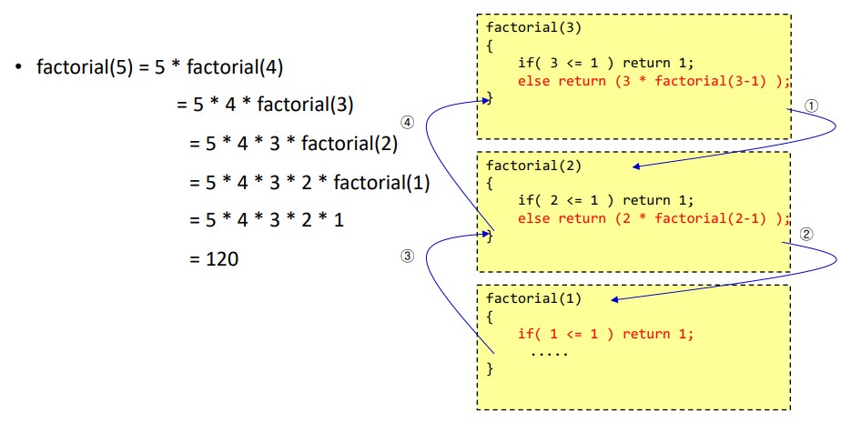
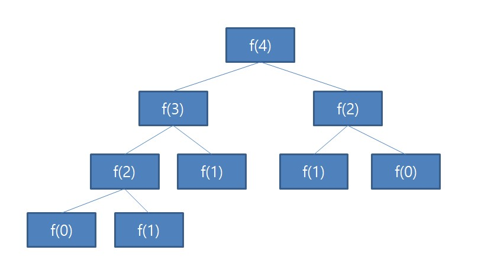
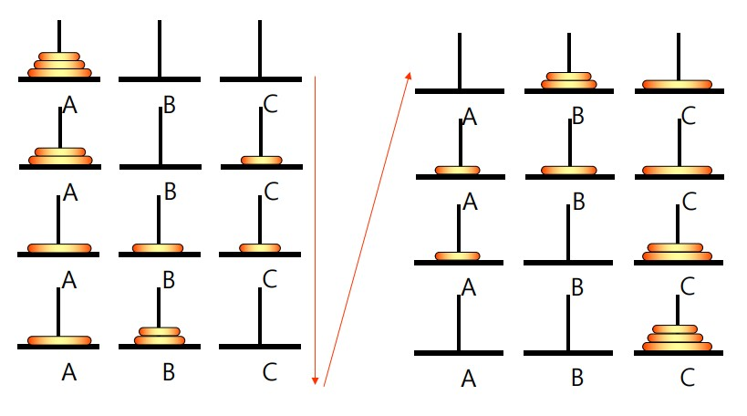

# 02 순환 Recursion

## 1. 순환의 개념

<hr/>

<br/>

### 1-1. 순환이란?

<hr/>

순환이란 알고리즘이나 함수가 수행 도중에 자기 자신을 다시 호출하여 문제를 해결하는 기법이다. 정의 자체가 순환적으로 되어 있는 경우에 적합한 방법이다.
<br/>

순환의 가장 간단한 예로는 팩토리얼있다. 아래는 c언어로 팩토리얼 구하는 함수를 만든 것이다.

```c
int factorial(int n){
    if (n <= 1) return(1);
    else return (n * factorial(n-1))
}
```

<br/>
아래 그림은 팩토리얼 함수의 호출 순서이다.



<br/>
순환은 자기 자신을 호출하는 부분과 호출을 멈추는 부분으로 구성되어 있는데 만약 멈추게 하는 부분이 없다면 시스템 스택을 모두 소모할 때까지 계속해서 호출하다가 결국 메모리가 꽉차게 되면 오류를 발생시키면서 프로그램이 비정상적으로 멈추게된다.<br/>
위의 예시를 다시 살펴보자. factorial(1)에서 순환을 멈추는 부분인 `if(n <= 1) return 1` 에 의해 순환이 끝나고 값을 반환하게 된다. 만약 이 부분이 없다면 오류가 발생하게 된다.

<br/>

### 1-2. 순환을 반복으로 바꾸기

<hr/>

순환은 반복과 성격이 비슷하기 때문에 for, while 등의 반복문으로 대체할 수 있다. 문제에 따라 순환을 사용하면 간결해지는 방법, 반복을 사용해야 효율적인 방법이 다르기 때문에 경우에 맞게 선택해 사용하면 된다.
<br/>

아래 예시는 팩토리얼을 반복문으로 바꿔 구현한 예이다.

```c
int factorial(int n) {
    int k, v=1;
    for (k = n; k > 0; k--)
        v = v * k
    return v;
}
```

<br/>

반복을 사용한 팩토리얼 함수의 시간복잡도는 O(n)이다. 순환을 이용한 시간복잡도도 또한 O(n)이다. 둘의 시간복잡도는 같지만, 순환 방식은 순환 호출을 스택에 계속해서 쌓기 때문에 공간복잡도가 더 높고, 수행시간도 더 걸린다. 그러므로 반복문을 사용한 방법이 더 효율적이라고 볼 수 있다.

<br/><br/>

## 2. 순환 vs 반복

<hr/>

<br/>

### 2-1. 거듭제곱값 계산

<hr/>

아래 C언어 코드들은 거듭제곱 값을 프로그래밍한 것이다. 첫 번째 방식은 순환방식, 두 번째 방식은 반복문을 사용한 것이다.

```c
double power(double x, int n){
    if (n == 0)
        return 1;
    else if ((n%2) == 0)
        return power(x*x, n/2);
    else
        return x * power(x*x, (n-1)/2);
}
```

```c
double power(double x, int n){
    int i;
    double result = 1.0;

    for(i=0; i<n; i++)
        result = result * x;

    return result;
}
```

<br/>
이제 둘을 비교해보자. 순환방식은 수학을 이용한 방법이다. 순환을 호출할 때 x<sup>2</sup>을 넣어 승수를 절반으로 줄인다. (2<sup>n</sup> -> 2<sup>n-1</sup> -> ... -> 2<sup>1</sup> -> 2<sup>0</sup>) 즉, 호출을 할 때마다 문제의 크기가 2로 나눈 것만큼 줄어들기 때문에 시간복잡도가 O(log<sub>2</sub> n)이다. <br/>
반면 반복문은 n만큼 반복 연산해야하기 때문에 시간복잡도가 O(n)이다.
<br/><br/>

물론 수학적인 방식을 이용했기때문에 당연히 순환적인 방식이 빠를 수밖에 없는 거 아닌가라고 생각할 수 있을 것이다. 그러나 반복문에서는 수학적인 방식을 사용하기 위해 설정해야할 것들이 많기 때문에 코드가 많이 복잡해질 수 있다. 그러므로 순환방식이 더 적합하다고 볼 수 있다.

<br/>

|               |  순환 방식  |      반복 방식       |
| :-----------: | :---------: | :------------------: |
|  시간복잡도   |    O(n)     | O(log<sub>2</sub> n) |
| 실제 수행속도 | 약 7초 가량 |    약 0.5초 가량     |

<br/>

### 2-2. 피보나치 수열

<hr/>

피보나치 수열을 순환으로 구현한 방식

```c
int f(int n) {
    if( n==0 ) return 0;
    if( n==1 ) return 1;
    return (fib(n-1) + fib(n-2));
}
```

피보나치 수열을 반복으로 구현한 방식

```c
int f(int n) {
    if (n == 0) return 0;
    if (n == 1) return 1;

    int pp = 0;
    int p = 1;
    int result = 0;

    for (int i = 2; i <= n; i++) {
        result = p + pp;
        pp = p;
        p = result;
    }

    return result;
}
```

<br/>

피보나치 수열을 순환으로 구성하면 아래와 같이 똑같은 f(0) 함수를 2번 f(1)함수를 3번 호출하는 것을 확인할 수 있다. 같은 항을 중복해서 호출하는 것이다. 굉장히 비효율적이다.


순환방식의 시간복잡도는 다음과 같은 점화식으로 표현할 수 있다. <br/>
T(n) = T(n-1) + T(n-2) + C <br/>
위 수식을 빅오표기법으로 나타내면 O(2<sup>n</sup>)이다.

<br/>

반면 반복문을 통해 코드를 설계하면 O(n)으로 해결할 수 있다.

<br/>

### 2-3. 하노이의 탑

<hr/>

하노이탑 문제는 대표적인 순환 문제이다. 문제의 조건은 아래와 같다.

- 문제는 막대 A에 쌓여있는 원판 n개를 막대 C로 옮기는 것이다.
- 한 번에 하나의 원판만 이동할 수 있다
- 맨 위에 있는 원판만 이동할 수 있다
- 크기가 작은 원판 위에 큰 원판이 쌓일 수 없다.
- 중간의 막대를 임시적으로 이용할 수 있으나 앞의 조건들을 지켜야 한다.

<br/>

아래 그림을 살펴보자.



<br/>

하노이의 탑 문제는 일정한 규칙이 있다. 원판의 개수가 홀수 개라면 최상단의 원판을 C로 옮기는 것으로 시작하면 된다. 만약 원판의 개수가 짝수 개라면 최상단 원판을 B로 옮기는 것으로 시작하면 된다.
이제 규칙을 잘 이용해 원판을 옮기면 A에서 C로 옮길 수 있을 것이다.

<br/>

이 논리를 반복문으로 간단하게 표현할 수 있을까? 많이 어려울 것이다. 하지만 순환을 이용한다면 아래와 같이 굉장히 간단하게 표현할 수 있다.

```c
void hanoi_tower(int n, char from, char tmp, char to) {
    if (n == 1) printf(("원판 1을 %c 에서 %c으로 옮긴다.\n",from,to);
    else {
        hanoi_tower(n-1, from, to, tmp);
        printf("원판 %d을 %c에서 %c으로 옮긴다.\n",n, from, to);
        hanoi_tower(n-1, tmp, from, to);
    }

}
int main(void){
    hanoi_tower(4, 'A', 'B', 'C');
    retrun 0;
}
```

실행결과

```
원판1을 A에서 B으로 옮긴다.
원판2을 A에서 C으로 옮긴다.
원판1을 B에서 C으로 옮긴다.
원판3을 A에서 B으로 옮긴다.
원판1을 C에서 A으로 옮긴다.
원판2을 C에서 B으로 옮긴다.
원판1을 A에서 B으로 옮긴다.
원판4을 A에서 C으로 옮긴다.
원판1을 B에서 C으로 옮긴다.
원판2을 B에서 A으로 옮긴다.
원판1을 C에서 A으로 옮긴다.
원판3을 B에서 C으로 옮긴다.
원판1을 A 에서 B으로 옮긴다.
원판2을 A에서 C으로 옮긴다.
원판1을 B에서 C으로 옮긴다.
```

<br/>
