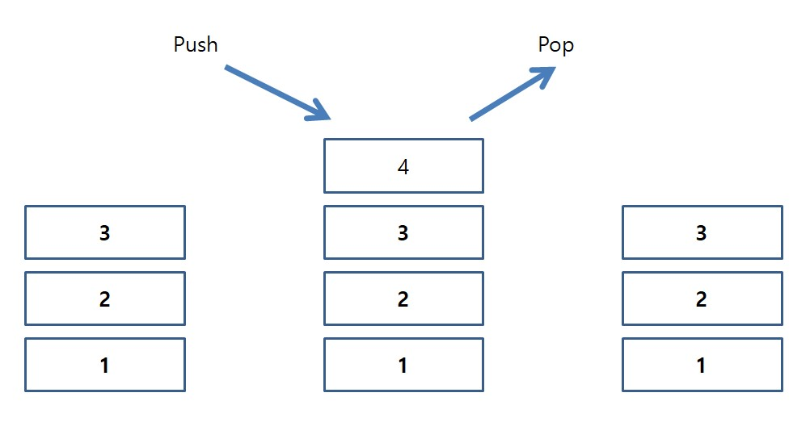

# 03 스택 Stack

## 1. 스택의 개념

<hr/>

<br/>

### 1-1. 스택이란?

<hr/>
스택은 쌓아놓은 더미이다. 상자를 쌓는다고 하면 아래에서부터 차곡차곡 쌓아놓을 것이다. 중간에 있는 상자가 필요하면 맨위에서부터 상자를 하나씩 빼서 꺼낼 것이다. 이런 입출력 형태를 선입후출(FILO: First In Last Out) 또는 후입선출(LIFO: Last In First Out)이라고 한다.

<br/>



<br/>

함수를 호출할 때도 컴퓨터 시스템은 위와 같은 스택 구조를 사용한다. 시스템 스택에 함수를 차곡차곡 쌓아 위에서부터 차례대로 꺼내 수행한다.

<br/>

### 1-2. 스택의 기능

<hr/>

가장 기본적인 스택은 6가지 기능을 가지고 있다.

- create(): 스택을 생성한다.
- is_full(s): 스택이 포화상태인지 검사한다.
- is_empty(s): 스택이 공백상태인지 검사한다.
- push(s, item): 스택에 데이터를 추가한다.
- pop(s): 스택에서 데이터를 제거하고 반환한다.
- peek(s): 스택의 데이터를 반환하기만 한다.

스택의 기능을 추상 자료형으로 표현하면 다음과 같을 것이다.

```
· 객체: 0개 이상의 원소를 가지는 유한 선형 리스트

· 연산:
▪ create(size) ::= 최대 크기가 size인 공백 스택을 생성한다.
▪ is_full(s) ::= if(스택의 원소수 == size) return TRUE;
                 else return FALSE;
▪ is_empty(s) ::= if(스택의 원소수 == 0) return TRUE;
                  else return FALSE;
▪ push(s, item) ::= if( is_full(s) ) return ERROR_STACKFULL;
                    else 스택의 맨 위에 item을 추가한다.
▪ pop(s) ::= if( is_empty(s) ) return ERROR_STACKEMPTY;
             else 스택의 맨 위의 원소를 제거해서 반환한다.
▪ peek(s) ::= if( is_empty(s) ) return ERROR_STACKEMPTY;
              else 스택의 맨 위의 원소를 제거하지 않고 반환한다.
```

<br/><br/>

## 2. 스택의 구현

<hr/>

스택은 1차원 배열을 이용해 구현할 수 있다. Stack의 MAX_SIZE를 설정하고, 가장 최근에 입력되었던 자료를 가리키는 top 변수를 사용해 스택을 제어해야한다. 이제부터 C언어를 통해 스택을 구현해보겠다.

<br/>

### 2-1. 전역변수로 스택 구현

<hr/>

1차원 배열과 top 변수를 모두 전역 변수로 둔다. 전역 변수로 지정되면 굳이 배열과 top 변수를 매개 변수로 전달할 필요가 없다.

> 핵심코드(전역변수 선언)

```c
#define MAX_SIZE 100

typedef int element;
element stack[MAX_SIZE];
int top = -1;
```

[전역변수 스택 구현코드](stack-code/globalStack.c)

<br/>

### 2-2. 스택의 요소를 구조체로 만들기

<hr/>

> 핵심코드(구조체로 요소 선언)

```c
#define MAX_SIZE 100
#define MAX_STRING 100

typedef struct {
    char id[MAX_STRING];
    char password[MAX_STRING];
    char name[MAX_STRING];
} element;

element stack[MAX_SIZE];
int top = -1;
```

<br/>

### 2-3. 구조체로 스택 구현

<hr/>

> 핵심코드(구조체 선언)

```c
#define MAX_SIZE 100
typedef int element; // element를 int로 선언

typedef struct {
    element data[MAX_SIZE];
    int top;
} Stack;

...

int main(void){
    Stack s; // 스택 정적 생성
}
```

[구조체 스택 구현코드](stack-code/structStack.c)

<br/>

### 2-3. 동적 배열 스택 구현

<hr/>

> 핵심코드(할당 및 재할당)

```c
typedef struct {
	element *data;
	int capacity;  // 현재 스택 크기
	int top;
} Stack;

void init(Stack* s) {
	s->top = -1;
	s->capacity = 1;
	s->data = (element*)malloc(s->capacity * sizeof(element));
}

void push(Stack* s, element item) {
	if (is_full(s)) {
		s->capacity *= 2;
		s->data = (element*)realloc(s->data, s->capacity * sizeof(element));
	}
	s->data[++(s->top)] = item;
}
```

[동적 배열 스택 구현코드](stack-code/dynamicStack.c)

<br/><br/>

## 3. 스택 응용

<hr/>

### 3-1. 괄호검사

<hr/>

괄호 검사의 조건은 3가지가 있다.

1. 왼쪽 괄호의 개수와 오른쪽 괄호의 개수가 같아야 한다.
2. 같은 괄호에서 왼쪽 괄호는 오른쪽 괄호보다 먼저 나와야 한다.
3. 서로 다른 종류의 왼쪽 괄호와 오른쪽 괄호 쌍은 서로를 교차하면 안 된다.

<br/>

위 조건을 프로그램으로 구현할 때 **스택**을 사용하면 된다. 왼쪽 괄호를 만나면 스택에 push하고 알맞은 오른쪽 괄호를 만나면 pop을 진행하면 되는 간단한 로직이다.

<br/>

[괄호 검사 구현코드](stack-code/parentheses.c)

<br/>

### 3-2. 후위 표기식 변환 및 계산

<hr/>

추후 업데이트
[후위 표기식 구현코드](stack-code/postfix.c)

<br/>

### 3-3. 미로 탐색

<hr/>

[미로탐색 구현코드](stack-code/maze.c)

<br/>

### 3-4. 스택계산기

<hr/>

[간단한 스택계산기](stack-code/stackComputer.c)

<br/>
