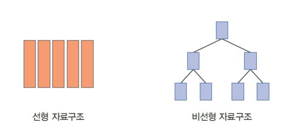
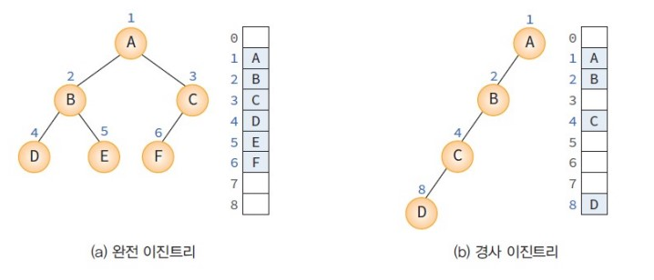
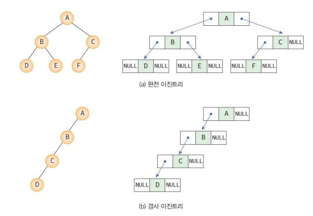
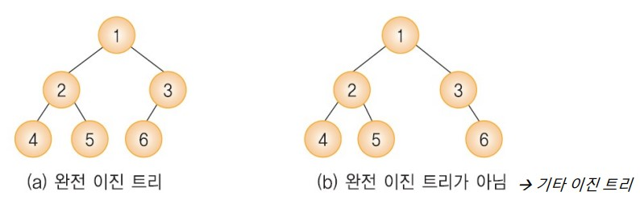
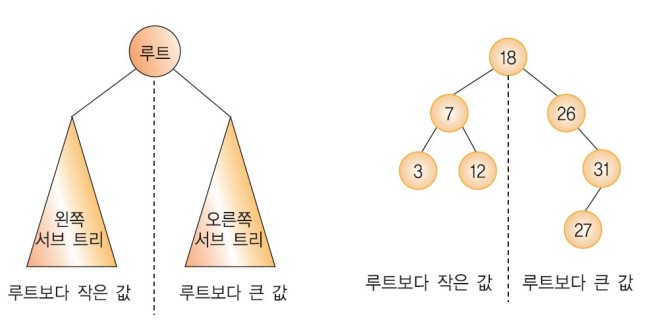
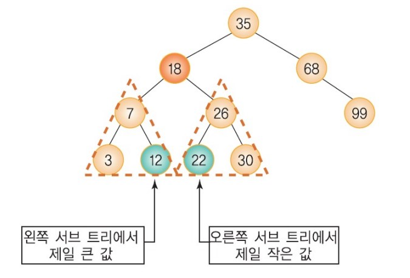
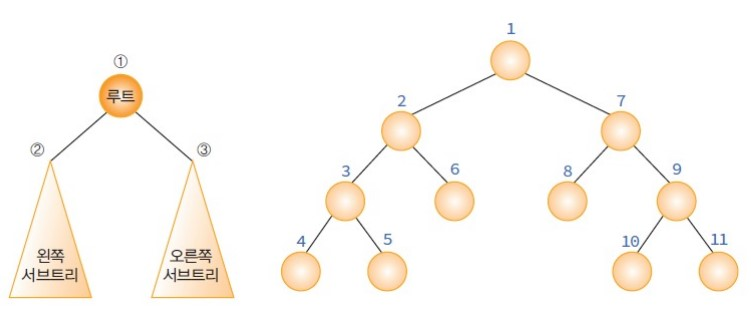
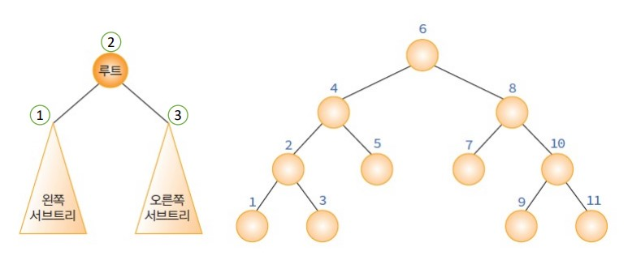
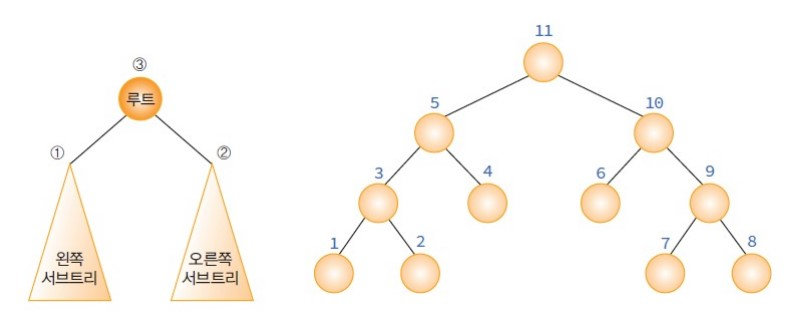

# 07 트리 Tree

## 출처

- C언어로 쉽게 풀어쓴 자료구조(천인국, 공용해, 하상호 저)

<br/>

## 목차

1. [트리의 개념](#1-트리의-개념) <br/>
   &nbsp; 1-1. [트리란](#1-1-트리란) <br/>
   &nbsp; 1-2. [트리의 표현방법](#1-2-트리의-표현방법) <br/>

<br/>

2. [트리의 종류](#2-트리의-종류) <br/>
   &nbsp; 2-1. [이진 트리](#2-1-이진-트리) <br/>
   &nbsp; 2-2. [이진 탐색 트리](#2-2-이진-탐색-트리) <br/>

<br/>

3. [트리의 순회](#3-트리의-순회) <br/>
   &nbsp; 3-1. [전위순회](#3-1-전위순회) <br/>
   &nbsp; 3-2. [중위순회](#3-2-중위순회) <br/>
   &nbsp; 3-2. [후위순회](#3-3-후위순회) <br/>

<br/>

4. [트리의 구현](#4-트리의-구현) <br/>
   &nbsp; 4-1. [이진 트리 구현](#4-1-이진-트리-구현) <br/>
   &nbsp; 4-2. [이진 탐색 트리 구현](#4-2-이진-탐색-트리-구현) <br/>

<br/><br/>

## 1. 트리의 개념

<hr/>

<br/>

### 1-1. 트리란?

<hr/>

**트리**는 리스트, 스택, 큐와 같은 선형 자료 구조가 아닌 계층적인 특징을 가지고 있는 **비선형 자료 구조**이다. 트리라고 부르는 이유는 나무를 엎어놓은 것과 같은 모양새를 하고 있어 그 이름이 붙게 되었다.



<br/>

#### 트리를 이해하기 위해 필요한 용어

- 노드(node): 트리의 구성요소
- 간선(edge): 노드를 연결하는 선
- 루트(root): 부모가 없는 노드
- 서브트리(subtree): 하나의 노드와 그 노드들의 자손들로 이루어진 트리
- 단말 노드(terminal node): 자식이 없는 노드
- 비단말 노드(nonterminal node): 적어도 하나의 자식을 가지는 노드
- 자식 노드: 간선으로 연결된 하위 노드
- 부모 노드: 간선으로 연결된 상위 노드
- 형제 노드: 같은 레벨에 있는 노드
- 조상 노드(조부모 노드): 2계층 위로 간선이 연결된 노드
- 레벨(level): 트리의 각층의 번호
- 높이(height): 트리의 최대 레벨
- 차수(degree): 노드가 가지고 있는 자식 노드의 개수

<br/>

트리는 부모-자식 관계의 노드들로 이루어진다. 계층적인 조직의 표현이나 컴퓨터 디스크의 디렉토리 구조, 인공지능에서의 의사결정트리 등에 사용된다.

### 1-2. 트리의 표현방법

<hr/>

트리를 표현하는 방법은 크게 2가지 있다. 배열을 이용하는 방법과 포인터를 사용하는 방법이다.
<br/>

#### 배열을 이용한 트리

먼저 **배열**을 이용해 트리를 만드는 방법에 대해 설명하겠다. 모든 이진 트리를 **포화 이진 트리**라고 가정해보자. 각 노드에 번호를 붙여서 그 번호를 배열의 인덱스로 삼아 데이터를 배열에 저장하면 배열을 이용해 트리를 만들 수 있다.



배열을 이용한 트리의 부모와 자식 인덱스 관계는 아래와 같다.

- 노드 i의 부모 노드 인덱스 = i/2
- 노드 i의 왼쪽 자식 노드 인덱스 = 2i
- 노드 i의 오른쪽 자식 노드 인덱스 = 2i+1

<br/>

#### 링크를 이용한 배열

포인터를 이용하여 부모노드가 자식노드를 가리키게 하는 방법이다.



<br/>

포인터를 이용한 트리를 구조체로 구현하면 아래와 같다. 값을 저장할 변수와 왼쪽 서브트리와 오른쪽 서브트리를 가리킬 수 있는 2개의 포인터가 필요하다.

```c
typedef struct TreeNode {
   int data;
   struct TreeNode *left, *right;
} TreeNode;
```

<br/><br/>

## 2. 트리의 종류

<hr/>

트리는 **이진트리**와 **일반트리**로 나뉜다. 이진트리는 최대 2개의 자식만 가지는 것이고, 일반 트리는 그러한 제한이 없는 트리를 말한다.

<br/>

### 2-1. 이진 트리

<hr/>

트리 중에서 가장 많이 쓰이는 트리는 이진 트리이다. 모든 노드가 2개의 서브 트리를 가지고 있는 트리를 이진 트리(binary tree)라고 한다. 서브 트리는 공집합일 수 있다. 최대 2개까지의 자식 노드만 가지고 있을 수 있기 때문에 모든 노드의 차수는 2 이하가 된다.

<br/>

이진 트리는 다음과 같은 **성질**을 가지고 있다.

- n개의 노드를 가진 이진트리는 정확히 n-1 개의 간선을 가진다.
- 높이가 h인 이진트리는 최소 h개의 노드를 가지고, 최대 $ 2^h-1 $개의 노드를 가진다.
- n개의 노드를 가지는 이진트리의 높이는 최대 n이고 최소 $ ⌈log_2(n+1)⌉ $이다.

<br/>

이진 트리는 아래와 같이 **분류**할 수 있다.

- 포화 이진 트리(full binary tree)
- 완전 이진 트리(complete binary tree)
- 기타 이진 트리

**포화 이진 트리**는 높이를 k라고 할 때 정확하게 $ 2^k-1 $개의 노드를 가지고 있는 트리를 말한다.<br/>
**완전 이진 트리**는 높이를 k라고 할 때 레벨 1부터 k-1까지는 완전히 채워져있고, 마지막 레벨인 k에서는 왼쪽부터 오른쪽으로 차례대로 채워지는 트리를 말한다.



<br/>

### 2-2. 이진 탐색 트리

<hr/>

이진 탐색 트리(binary search tree)는 이진 트리 기반의 탐색을 위한 자료구조이다. 탐색은 컴퓨터 프로그램에서 매우 중요하다. 가장 시간이 많이 걸리는 작업 중 하나이므로 효율적으로 처리하는 것이 핵심이다. 이진 탐색 트리의 정의는 아래와 같다.

- 모든 원소의 키는 유일한 키를 가진다.
- 왼쪽 서브 트리 키들은 루트 키보다 작다.
- 오른쪽 서브 트리의 키들은 루트의 키보다 크다.
- 왼쪽과 오른쪽 서브 트리도 이진 탐색 트리이다.



이진탐색을 중위순회하면 오름차순으로 정렬된 값을 얻을 수 있다.

<br/>

이진 탐색 트리의 제일 중요한 연산은 탐색, 삽입, 삭제 연산이다.

#### 탐색연산

- 비교한 결과가 같으면 탐색이 성공적으로 끝난다.
- 비교한 결과가, 주어진 키 값이 루트 노드의 키값보다 작으면 탐색은 이 루트 노드의 왼쪽 자식을 기준으로 다시 시작한다.
- 비교한 결과가, 주어진 키 값이 루트 노드의 키값보다 크면 탐색은 이 루트 노드의 오른쪽 자식을 기준으로 다시 시작한다.

#### 삽입연산

- 위 서술된 탐색을 수행한다.
- 탐색에 실패한 위치에 새로운 노드를 삽입한다.

#### 삭제 연산

- 3가지 경우를 고려
  1.  삭제하려는 노드가 단말 노드 일 경우
  2.  삭제하려는 노드가 하나의 왼쪽이나 오른쪽 서브 트리 중
      하나만 가지고 있는 경우
  3.  삭제하려는 노드가 두개의 서브 트리 모두 가지고 있는 경우
- 첫 번째 경우: 단말노드의 부모노드를 찾아서 연결을 끊는다.
- 두 번째 경우: 해당 노드를 삭제하고 서브트리는 부모노드에 붙여준다.
- 마지막 경우: 삭제노드와 가장 비슷한 값을 가진 노드를 삭제노드 위치로 가지고 온 뒤 그 노드는 삭제한다. 가장 비슷한 값이란? **왼쪽 서브 트리에서 제일 큰 값** 또는 **오른쪽 서브 트리에서 제일 작은 값**이다.



<br/><br/>

## 3. 트리의 순회

<hr/>

트리는 3가지의 기본적인 순회방법이 있다.

1. 전위순회(preorder traversal) : VLR
   - 자손노드보다 루트노드를 먼저 방문한다.
2. 중위순회(inorder traversal) : LVR
   - 왼쪽 자손, 루트, 오른쪽 자손 순으로 방문한다.
3. 후위순회(postorder traversal) : LRV
   - 루트노드보다 자손을 먼저 방문한다.

(V=루트, L=왼쪽 서브 트리, R=오른쪽 서브 트리)

<br/>

### 3-1. 전위순회

<hr/>

1. 루트 노드를 방문한다
2. 왼쪽 서브트리를 방문한다
3. 오른쪽 서브트리를 방문한다



<br/>

#### 전위순회의 의사코드(순환호출 사용)

```
preorder(x)
if x ≠ NULL
   then print DATA(x);
      preorder(LEFT(x));
      preorder(RIGHT(x));
```

<br/>

### 3-2. 중위순회

<hr/>

1. 왼쪽 서브트리를 방문한다
2. 루트 노드를 방문한다
3. 오른쪽 서브트리를 방문한다



<br/>

#### 중위순회의 의사코드

```
inorder(x)
if x ≠ NULL
   then preorder(LEFT(x));
      print DATA(x);
      preorder(RIGHT(x));
```

<br/>

### 3-3. 후위순회

<hr/>

1. 왼쪽 서브트리를 방문한다
2. 오른쪽 서브트리를 방문한다
3. 루트 노드를 방문한다



<br/>

#### 후위순회의 의사코드

```
postorder(x)
if x ≠ NULL
   then preorder(LEFT(x));
      preorder(RIGHT(x));
      print DATA(x);
```

<br/><br/>

## 4. 트리의 구현

<hr/>

### 4-1. 이진 트리 구현

<hr/>

- 링크로 구현한 이진트리: [링크](https://github.com/pythonstrup/TIL/tree/main/Data-Structure/tree/linkTree.c)
- 전위순회&중위순회&후위순회: [링크](https://github.com/pythonstrup/TIL/tree/main/Data-Structure/tree/order.c)
- 반복문으로 구현한 순회: [링크](https://github.com/pythonstrup/TIL/tree/main/Data-Structure/tree/inorder_iter.c)
- 레벨순회: [링크](https://github.com/pythonstrup/TIL/tree/main/Data-Structure/tree/levelorder.c)
- 스레드 이진 트리: [링크](https://github.com/pythonstrup/TIL/tree/main/Data-Structure/tree/threadTree.c)

<br/>

### 4-2. 이진 탐색 트리 구현

<hr/>

- 이진 탐색 트리(순환): [링크](https://github.com/pythonstrup/TIL/tree/main/Data-Structure/tree/search.c)
- 이진 탐색 트리(탐색-반복문): [링크](https://github.com/pythonstrup/TIL/tree/main/Data-Structure/tree/search_iter.c)
- 이진 탐색 트리 응용: [전화번호 찾기](https://github.com/pythonstrup/TIL/tree/main/Data-Structure/tree/phone.c)

<br/>
