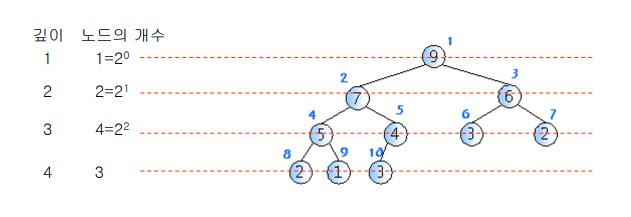
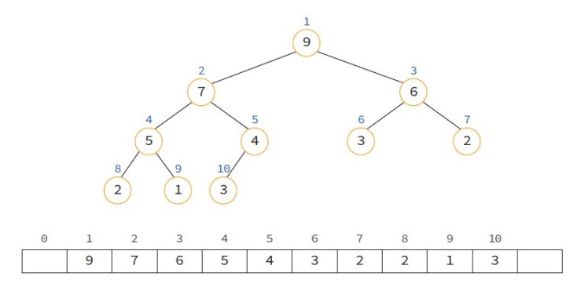
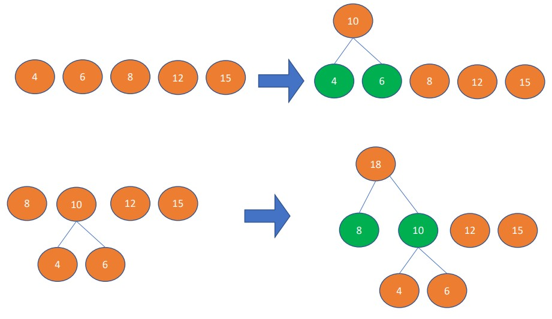
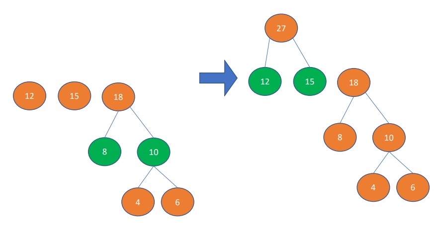
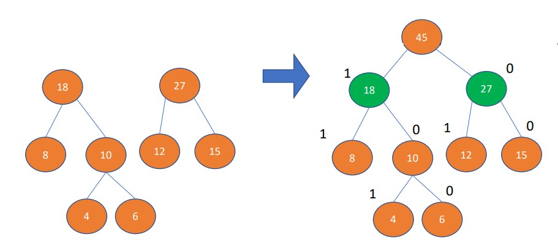

# 08 우선순위 큐 Priority Queue

## 출처

- C언어로 쉽게 풀어쓴 자료구조(천인국, 공용해, 하상호 저)

<br/>

<hr/>

## 목차

1. [우선순위 큐의 개념](#1-트리의-개념) <br/>
   &nbsp; 1-1. [우선순위 큐란](#1-1-우선순위-큐란) <br/>
   &nbsp; 1-2. [우선순위 큐의 기능](#1-2-우선순위-큐의-기능) <br/>
   &nbsp; 1-2. [우선순위 큐의 표현방법](#1-3-우선순위-큐의-표현방법) <br/>

<br/>

2. [히프](#2-히프) <br/>
   &nbsp; 2-1. [히프란?](#2-1-히프란) <br/>
   &nbsp; 2-2. [배열을 이용한 구현](#2-2-배열을-이용한-구현) <br/>
   &nbsp; 2-3. [히프를 통한 구현](#2-3-히프를-통한-구현) <br/>

<br/>

3. [우선순위 큐 응용](#3-우선순위-큐-응용) <br/>
   &nbsp; 3-1. [히프 정렬](#3-1-히프-정렬) <br/>
   &nbsp; 3-2. [머신 스케줄링](#3-2-머신-스케줄링) <br/>
   &nbsp; 3-3. [허프만 코드](#3-3-허프만-코드) <br/>

<br/><br/>

<hr/>

## 1. 트리의 개념

<br/>

<hr/>

### 1-1. 우선순위 큐란?

<br/>

**우선순위 큐(Priority Queue)**는 우선순위를 가진 항목들을 저장하는 큐로 FIFO(First In First Out) 순서가 이닌 순위가 높은 데이터가 먼저나가는 자료구조를 말한다.

<br/>

- 스택 큐, 우선순위 큐 비교

|자료구조|우선 삭제되는 요소|
|:----:|:----:|
|스택|가장 최근에 들어온 데이터|
|큐|가장 먼저 들어온 데이터|
|우선순위 큐|가장 우선순위가 높은 데이터|

<br/>

우선순위 큐는 시뮬레이션 시스템, 네트워크의 트래픽 제어, 운영체제 작업스케줄링 등에 사용된다.

<br/>

<hr/>

### 1-2. 우선순위 큐의 기능

<br/>

우선 순위 큐의 추상 자료형(ADT)를 살펴보자.

```
·객체: n개의 element형의 우선 순위를 가진 요소들의 모임

·연산: 
▪ create() ::= 우선순위큐를 생성한다.
▪ init(q) ::= 우선순위큐 q를 초기화한다.
▪ is_empty(q) ::= 우선순위큐 q가 비어있는지를 검사한다. 
▪ is_full(q) ::= 우선순위큐 q가 가득 찼는가를 검사한다.
▪ insert(q, x) ::= 우선순위큐 q에 요소 x를 추가한다.
▪ delete(q) ::= 우선순위큐로부터 가장 우선순위가 높은 요소를 삭제하고 이 요소를 반환한다.
▪ find(q) ::= 우선순위가 가장 높은 요소를 반환한다.
```

<br/>

위 기능 중에서 가장 중요한 연산은 insert(삽입) 연산과 delete(삭제) 연산이다. 삽입, 삭제의 우선순위를 어떻게 정하느냐에 따라 **최소 우선순위 큐**와 **최대 우선순위 큐**로 분류를 나눌 수 있다.

<br/><br/>

<hr/>

### 1-3. 우선순위 큐의 표현방법

<br/>

우선순위 큐를 구현하는 방법은 아래와 같다.

1. 배열을 이용한 우선순위 큐
2. 연결리스트를 이용한 우선순위 큐
3. 히프(heap)를 이용한 우선수위 큐

<br/>

- 시간복잡도 비교

|표현방법|삽 입|삭 제|
|:--:|:--:|:--:|
|&nbsp; 순서없는 배열 &nbsp;|&nbsp; O(1) &nbsp;|&nbsp; O(n) &nbsp;|
|&nbsp; 순서없는 연결 리스트 &nbsp;|&nbsp; O(1) &nbsp;|&nbsp; O(n) &nbsp;|
|&nbsp; 정렬된 배열 &nbsp;|&nbsp; O(n) &nbsp;|&nbsp; O(1) &nbsp;|
|&nbsp; 정렬된 연결 리스트 &nbsp;|&nbsp; O(n) &nbsp;|&nbsp; O(1) &nbsp;|
|&nbsp; 히프 &nbsp;|&nbsp; O($log_2{n}$) &nbsp;|&nbsp; O($log_2{n}$) &nbsp;|

시간 복잡도에서 히프가 유리하다는 것을 알 수 있다.

<br/>

<hr/>

## 2. 히프

<br/>

<hr/>

### 2-1. 히프란?

<br/>

히프(heap)는 뭔가가 쌓여있는 '더미' 모습과 비슷하며 붙여진 이름으로, **완전이진트리**를 기반으로 하고 있다. 기본적으로 노드의 키들은 아래의 식을 만족한다.(최대 히프)

$$ 부모노드의\; key\quad\geqq\quad  자식노드의 key\; $$

<br/>

또한 히프트리는 중복된 값을 허용할 수 있다. 히프는 우선순위 큐와 마찬가지로 우선순위의 기준에 따라 종류가 나뉜다.
- 최대 히프(max heap): $ 부모노드의\; key\quad\geqq\quad  자식노드의 key\; $ 
- 최소 히프(min heap): $ 부모노드의\; key\quad\geqq\quad  자식노드의 key\; $

<br/>

n 개의 노드를 가지고 있는 히프의 높이 h는 $log_2{n}$ 과 같다



<br/>

```
cf) 주의사항!! 자료구조 Heap과 메모리 영역인 Heap은 완전히 다른 개념이다!!
```

<br/>

<hr/>

### 2-2. 배열을 이용한 구현

<br/>

히프는 완전이진트리이므로 각 노드에 번호를 붙일 수 있다. 이 번호를 배열의 인덱스라고 생각하고 구현을 하면 된다.



<br/>

배열로 히프를 구현하면, 부모노드와 자식노드를 찾는 것이 굉장히 쉽다. 이 방식은 아래와 같은 원리를 따른다.

- 왼쪽 자식의 인덱스 = (부모의 인덱스)*2
- 오른쪽 자식의 인덱스 = (부모의 인덱스)*2 + 1
- 부모의 인덱스 = (자식의 인덱스)/2

<br/>

히프는 아래와 같이 정의할 수 있다.

```c
#define MAX_ELEMENT 200

typedef struct {
   int key;
} element;

typedef struct {
   element heap[MAX_ELEMENT];
   int heap_size;
} HeapType;

HeapType heap;             // 정적 메모리 할당 사용
HeapType *heap = create(); // 동적 메모리 할당 사용
```

<br/>

히프에서 가장 중요한 연산은 삽입연산과 삭제연산이다. 자세한 설명은 아래와 같다.

- 삽입 연산(upheap)
   1.  히프에 새로운 요소가 들어 오면, 일단 새로운 노드를 히프의 마지막 노드에 이어서 삽입
   2.  삽입 후에 새로운 노드를 부모 노드들과 교환해서 히프의 성질을 만족

<br/>

- 삭제 연산(downheap)
   1. 루트 노드를 삭제
   2. 마지막 노드를 루트 노드로 이동
   3.  루트에서부터 단말 노드까지의 경로에 있는 노드들을 교환하여 히프 성질을 만족

<br/>

히프 코드: [링크](https://github.com/pythonstrup/TIL/tree/main/Data-Structure/heap/heap.c)

<br/><br/>

<hr/>

## 3. 우선순위 큐 응용

<br/>

<hr/>

### 3-1. 히프 정렬

<br/>

히프를 이용해 정렬을 하는 방법이다. 정렬할 요소들을 최대힙에 삽입한 다음, 한 번에 하나씩 요소를 히프에서 삭제해서 배열에 저장하면 내림차순으로 저장할 수 있다. 여기서 거꾸로 뒤집으면 오름차순으로 표현할 수 있다. 일반적으로 최소힙을 사용하면 오름차순으로 정렬할 수 있다.

<br/>

삽입하거나, 삭제할 때 시간 복잡도가 O($\log{n}$)만큼 소요되고 요소의 개수가 n개이므로 전체적인 시간 복잡도는 O($n\log{n}$)이다. 히프 정렬이 유용히 쓰이는 경우는 가장 큰 값 혹은 작은 값 몇개만 필요할 때이다. (ex- top 10 등)

<br/>

히프 정렬 코드: [링크](https://github.com/pythonstrup/TIL/tree/main/Data-Structure/heap/heap_sort.c)

<br/>

<hr/>

### 3-2. 머신 스케줄링

<br/>

만약 어떤 작업을 처리하는 기계가 m개 존재하고 처리할 작업이 n개 존재하면 이 m개의 기계들로 최소의 시간안에 작업들을 모두 끝내는 것이 가장 효율적일 것이다. 이 문제에 대해 최적의 해를 구하는 것은 매우 어렵지만 근사 해는 우선순위 큐를 활용하여 쉽게 찾을 수 있다.

<br/>

아래 코드는 여러 스케줄링 기법 중 가장 긴 작업을 우선적으로 기계에 할당하는 LPT(Longest Processing Time first)방식이다. 기계가 꽉 찼을 때는 Job을 할당하지 않다가 비는대로 남은 Job 중 제일 긴 것을 할당한다.

<br/>

머신 스케줄링 코드: [링크](https://github.com/pythonstrup/TIL/tree/main/Data-Structure/heap/scheduling.c)

<br/>

<hr/>

### 3-3. 허프만 코드

<br/>

아래와 같은 빈도수를 가진 문자 5개를 **3개의 고정 비트(총 8개의 문자 표현 가능)**를 이용해 고유값을 각각 할당하면 아래와 같을 것이다.

|글자|비트 코드|빈도수|총 비트 수|
|:--:|:--:|:--:|:--:|
|e|000|15|3 * 15 = 45|
|t|001|12|3 * 12 = 36|
|n|010|8|3 * 8 = 24|
|i|011|6|3 * 6 = 18|
|s|100|4|3 * 4 = 12|
|합계|||135|

총 135비트가 쓰인다. 위의 경우는 글자수가 별로 없지만 만약 글자 수가 엄청나게 많다면, 압축의 과정은 필수적일 것이다. 이 때 사용하는 것이 허프만 코드이다. 허프만 코드의 알고리즘은 메시지의 모든 글자를 카운트해 빈도수를 구하고, 빈도수에 따라 트리를 만든다. **최소힙**을 이용해 빈도가 가장 적은 트리 2개씩 묶어 하나의 트리가 될 때가지 합친다. 그 과정은 아래의 그림과 같다.





트리가 완성되면 각 글자에 대한 코드를 비트로 만들 수 있다. 해당 글자로 가는 경로를 센다. 위 그림은 왼쪽에 가중치를 1을 두고, 오른쪽에 0을 뒀지만, 둘을 바꿔 반대로 할 수도 있다. 위 트리를 통해 만든 비트체계는 아래와 같다.

|글자|트리로 만든 비트 코드|빈도수|총 비트 수|
|:--:|:--:|:--:|:--:|
|e|00|15|30|
|t|01|12|24|
|n|11|8|16|
|i|100|6|18|
|s|101|4|12|
|합계|||88|

135 - 85 = 50(비트)를 아낄 수 있다. 위의 경우, 약 37%의 용량을 아낄 수 있었다.

<br/>

허프만 코드: [링크](https://github.com/pythonstrup/TIL/tree/main/Data-Structure/heap/huffman.c)

<br/><br/>

<hr/>