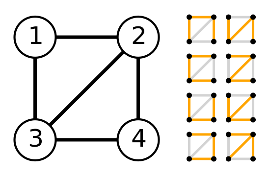
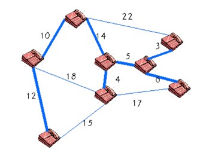
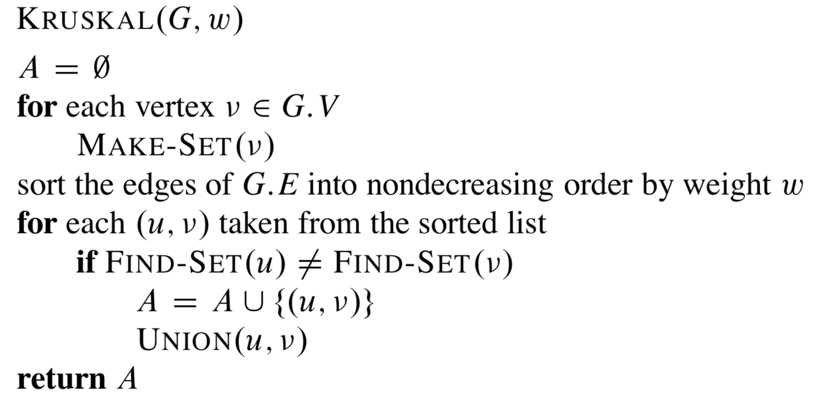
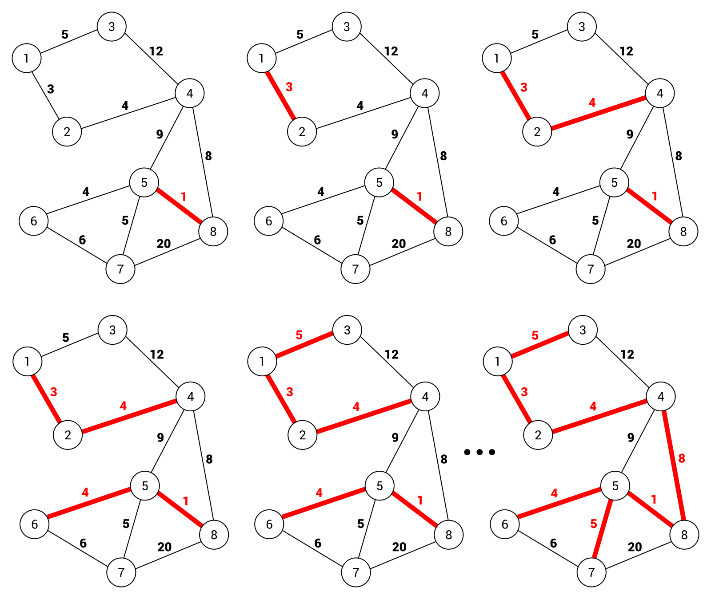
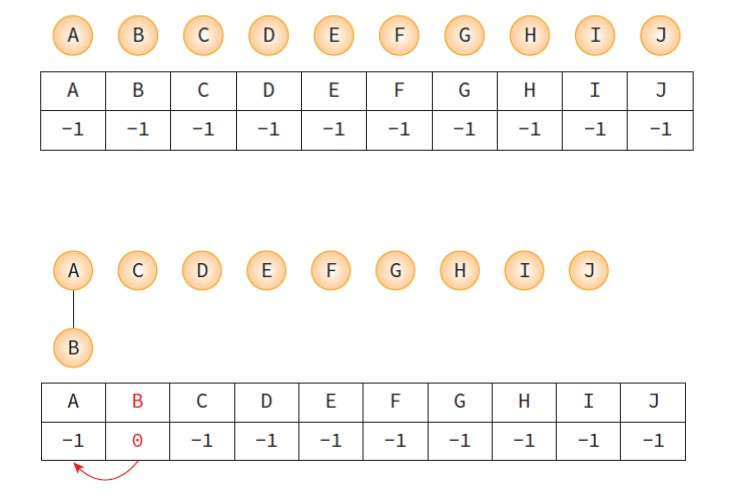
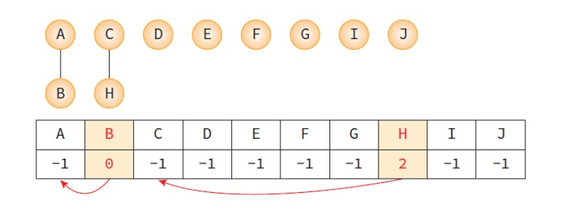
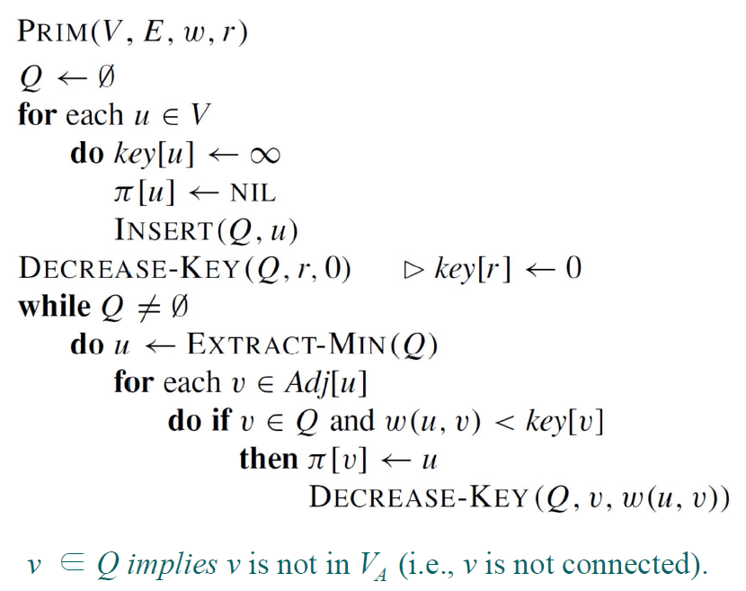
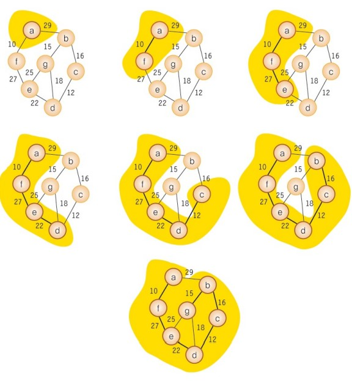

# 10 그래프 Graph 2 

## 출처

- C언어로 쉽게 풀어쓴 자료구조(천인국, 공용해, 하상호 저)

<br/>

<hr/>

## 목차

1. [최소 비용 신장 트리](#1-1-신장-트리란) <br/>
   &nbsp; 1-1. [신장 트리란](#1-1-신장-트리란) <br/>
   &nbsp; 1-2. [Kruskal의 MST 알고리즘](#1-2-kruskal의-mst-알고리즘) <br/>
   &nbsp; 1-3. [Prim의 MST 알고리즘](#1-3-prim의-mst-알고리즘) <br/>

<br/>

2. [최단 경로](#2-최단-경로) <br/>
   &nbsp; 2-1. [Dijkstra 알고리즘](#2-1-dijkstra-알고리즘) <br/>
   &nbsp; 2-2. [Floyd 알고리즘](#2-2-floyd-알고리즘) <br/>

<br/>

3. [위상 정렬](#3-위상-정렬) <br/>

<br/><br/>

<hr/>

## 1. 최소 비용 신장 트리

<br/>

<hr/>

### 1-1. 신장 트리란?

<br/>

신장 트리(spanning tree)란 그래프 내의 모든 정점을 포함하는 트리를 의미한다. 절대 사이클이 있어서는 안 된다. n개의 정점을 가지는 그래프의 신장 트리는 n-1개의 간선을 가진다.



이미지 출처: https://imgur.com/xYkNNxl

<br/>

위의 그림을 살펴보면 신장트리는 그래프의 최소 연결 **부분 그래프**가 된다. 신장트리는 통신 네트워크를 구축할 때 많이 사용된다.

<br/>

최소 비용 신장 트리는 가중치가 부여된 네트워크를 가장 적은 수의 간선과 비용으로 연결된 트리를 의미한다. 최소 비용 신장 트리를 구하는 방법으로는 Kruskal 알고리즘과 Prim 알고리즘이 있고, 이 알고리즘들은  사이클을 포함하지 않고 반드시 n-1개의 간선만을 사용한다.



<br/>

<hr/>

### 1-2. Kruskal의 MST 알고리즘

<br/>

Kruskal 알고리즘은 탐욕법(Greedy Method: 그리디 알고리즘)를 사용한다. 여기서 **그리디 알고리즘**이란 선택의 순간마다 당장 눈앞에 보이는 최적의 상황만을 쫓아 최종적인 해답에 도달하는 방법이다. 선택의 순간에는 그 해가 최적이지만 최종적인 해답이 반드시 최적이라는 보장은 없다. 그러므로 탐욕법은 항상 최적으 해답을 주는지 검증이 필요한데, Kruskal 알고리즘은 최적의 해답을 주는 것이 증명되었다. 아래는 이 알고리즘의 pseudo-code이다.



이미지 출처: https://imgur.com/uJl8xg8

<br/>

아래 그림은 위 알고리즘을 적용해 그래프를 최소 비용 신장 트리를 만드는 과정을 보여준다.



이미지 출처: https://www.oreilly.com/library/view/c-data-structures/9781788833738/a2714e77-af8c-494a-a485-df5521ced3f0.xhtml

<br/>

그런데 여기서 간선을 추가할 때 사이클이 생기지 않도록 방지해야하는데 이것을 도와주는 것이 Kruskal의 union-find 알고리즘이다. union-find는 원소가 어떤 집합에 속하는지 알아냄으로써 Kruskal 알고리즘에서 사이클 검사에 사용된다. 아래는 union-find의 pseudo-code이다.

```
UNION(a, b):
    root1 = FIND(a); // 노드 a의 루트를 찾는다. 
    root2 = FIND(b); // 노드 b의 루트를 찾는다. 
    if root1 ≠ root2 // 합한다. 
        parent[root1] = root2;

FIND(curr): // curr의 루트를 찾는다. 
    if (parent[curr] == -1) 
        return curr; // 루트
    while (parent[curr] != -1) curr = parent[curr];
    return curr;
```

<br/>

아래 그림은 연결이 전혀 없는 정점에서 위 알고리즘의 union함수를 사용한 것으로, **union(A, B)**와 **union(C, H)**를 실행했을 때의 그림이다.




<br/>

아래 코드는 최소 비용 신장 트리를 만드는 과정을 그린 그림을 코드로 구현한 것이다.

- 코드 링크: [크루스칼 알고리즘](https://github.com/pythonstrup/TIL/tree/main/Data-Structure/graph/kruskal.c)

<br/>

Kruskal 알고리즘은 대부분 간선들을 정렬하는 시간에 좌우되고 사이클 테스트 등의 작업은 정렬에 비해 매우 신속하게 진행된다. 간선 e개를 퀵 정렬과 같이 효율적인 알고리즘으로 정렬하면 **시간 복잡도는 O(e * log(e))**가 된다.

<br/>

<hr/>

### 1-3. Prim의 MST 알고리즘

<br/>

Prim의 알고리즘은 시작 정점에서부터 시작해 신장 트리 집합을 단계적으로 확장해나가는 방법이다. 인접한 정점 중에서 최저 간선으로 연결된 정점 선택하여 신장 트리 집합에 추가한다. 아래는 알고리즘의 pseudo-code이다.

<br/>



<br/>

prim 알고리즘의 과정을 그림으로 나타내면 아래와 같다.



<br/>

- 코드 링크: [프림 알고리즘](https://github.com/pythonstrup/TIL/tree/main/Data-Structure/graph/prim.c)

<br/>

prim의 알고리즘은 주 반복문이 정점의 수 n만큼 반복하고, 내부 반복문이 n번 반복하므로 **시간 복잡도는 O(n^2)**이다.<br/>
희소한 그래프는 간선이 적기 때문에 크루스칼 그래프가 유리하고 밀집한 그래프라면 prim 알고리즘이 유리할 것이다.

<br/><br/>

<hr/>

## 2. 최단 경로

<br/>

<hr/>

### 2-1. Dijkstra 알고리즘

<br/>

<hr/>

### 2-2. Floyd 알고리즘

<br/>

<hr/>

## 3. 위상 정렬

<br/>

<hr/>
