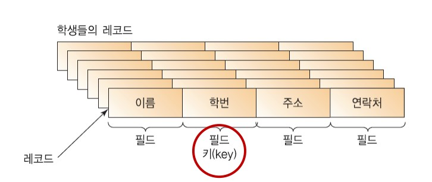
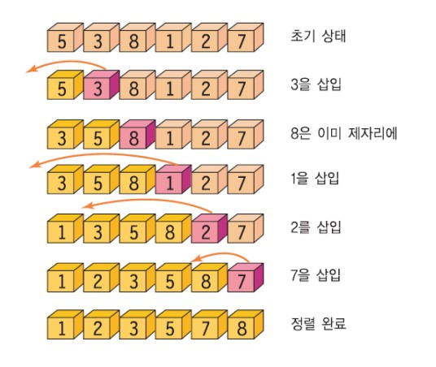
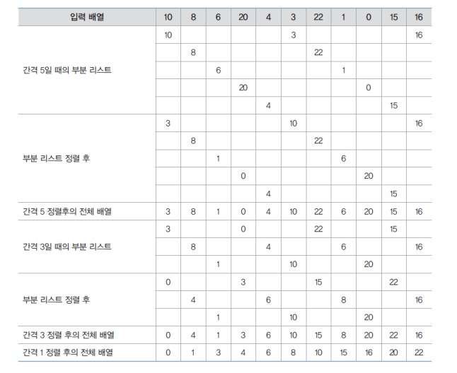
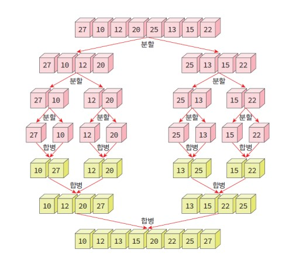
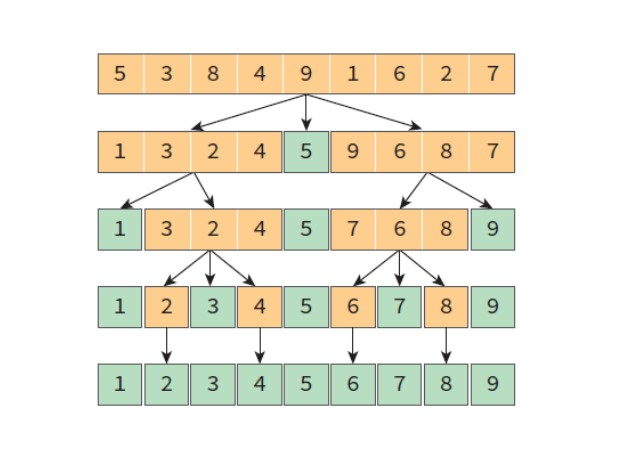
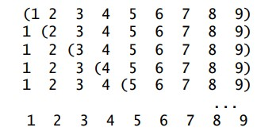

# 11 정렬 Sort 

## 출처

- C언어로 쉽게 풀어쓴 자료구조(천인국, 공용해, 하상호 저)

<br/>

<hr/>

## 목차

1. [정렬의 개념](#1-정렬의-개념) <br/>
   &nbsp; 1-1. [정렬이란](#1-1-정렬이란) <br/>
   &nbsp; 1-2. [정렬의 분류](#1-2-정렬의-분류) <br/>

<br/>

2. [정렬의 종류](#2-정렬의-종류) <br/>
   &nbsp; 2-1. [선택 정렬](#2-1-선택-정렬-selection-sort) <br/>
   &nbsp; 2-2. [삽입 정렬](#2-2-삽입-정렬-insertion-sort) <br/>
   &nbsp; 2-3. [버블 정렬](#2-3-버블-정렬-bubble-sort) <br/>
   &nbsp; 2-4. [셸 정렬](#2-4-셸-정렬-shell-sort) <br/>
   &nbsp; 2-5. [합병 정렬](#2-5-합병-정렬-merge-sort) <br/>
   &nbsp; 2-6. [퀵 정렬](#2-6-퀵-정렬-quick-sort) <br/>
   &nbsp; 2-7. [기수 정렬](#2-7-기수-정렬-radix-sort) <br/>

<br/>

3. [정렬 알고리즘의 비교](#3-정렬-알고리즘의-비교) <br/>

<br/><br/>

<hr/>

## 1. 정렬의 개념

<br/>

<hr/>

### 1-1. 정렬이란?

<br/>

정렬이란 데이터나 물건을 크기를 기준으로 오름차순이나 내림차순으로 나열하는 것을 의미한다. 정렬은 컴퓨터 공학을 포함한 모든 과학기술 분야에서 가장 기본적이고 중요한 알고리즘이다. 정렬은 특히 **자료 탐색**에 가장 핵심이 된다. 만약 사전이 알파벳으로 정렬되어있지 않다면 특정 단어를 찾는 것은 굉장히 어려운 일이 될 것이다. 

<br/>

정렬시켜야할 대상을 **레코드(record)**라고 부르고, 이 레코드는 다시 **필드(field)**라고 하는 단위로 나누어진다. 여러 필드 중에서 특히 레코드를 식별해주는 역할을 하는 필드를 **키(key)**라고 한다. 정렬이란 키값을 기준으로 순서를 재배열하는 것이다.



<br/>

<hr/>

### 1-2. 정렬의 분류

<br/>

모든 경우에 최적인 정렬 알고리즘은 없다. 자료의 초기화 여부에 따라 이동 횟수와 비교 횟수가 달라지기 때문이다. 일반적으로 둘은 서로 비례관계는 아니다. 이동 횟수는 적지만 비교 횟수가 많을 수도 있고, 그 반대가 될 수도 있다. 여기서 비교 연산과 이동 연산에 대해 알아보자.

- 비교 연산: for문과 while문의 비교 구문과 그 내부의 비교구문의 연산

- 이동 연산: 대입 연산자를 사용해 요소를 이동시키는 연산 (a = b)

참고로, 비교 연산보다 **이동 연산이 더 많은 오버 헤드가 발생**한다.

<br/>

정렬 알고리즘은 단순하지만 비효율적인 알고리즘, 복잡하지만 효율적인 정렬 알고리즘으로 나눌 수 있다. 단순과 복잡함의 기준을 코드 라인 수라고 생각하면 된다. 

- 단순, 비효율적 알고리즘: 삽입, 선택, 버블 정렬 등

- 복잡, 효율적 알고리즘: 퀵, 히프, 합병, 기수 정렬 등

만약 자료의 개수가 많다면 복잡하고 효율적인 알고리즘을 사용하는 것이 좋다. 

<br/>

외부 메모리 사용 여부에 따라 정렬은 내부 정렬(internal sorting)과 외부 정렬(external sorting)으로 나눌 수 있다. 내부 정렬은 모든 데이터가 메인 메모리에 있으며, 이 데이터만 취급하는 것을 의미한다. 반면, 외부 정렬은 데이터가 너무 많아 SSD, HDD와 같은 외부 기억 장치에 대부분의 데이터가 있고 일부만 메모리에 가져와 정렬하고 외부 기억 장치에 다시 저장하는 방식이다. 당연히 내부 정렬이 외부 정렬보다 빠르다. 

<br/>

정렬 알고리즘은 **안정성(stability)**을 기준으로 분류할 수도 있다. 여기서 안정성이란 동일한 키 값을 갖는 **레코드들의 상대적인 위치가 정렬 후에도 변하지 않는 것**을 의미한다. 즉, 불필요한 이동 연산이 일어나지 않는다는 것을 내포한다. 안정성을 가진 정렬은 삽입 정렬, 버블 정렬, 합병 정렬 등이 있다.

<br/><br/>

<hr/>

## 2. 정렬의 종류

<br/>

<hr/>

### 2-1. 선택 정렬 selection sort

<br/>

선택 정렬은 논리적으로 가장 간단한 정렬이다. 가장 작은 값을 찾아 맨 앞으로 이동시키고, 다음 단계에서는 그 다음으로 작은 값을 찾아 그 뒤의 요소와 교환시킨다. 요소가 n개라고 했을 때, n-1번만큼만 반복하면 된다. 

- 선택 정렬의 pseudo-code

```
selection_sort(A, n) 

for i←0 to n-2 do 
    least ← A[i], A[i+1],..., A[n-1] 중에서 가장 작은 값의 인덱스;
    A[i]와 A[least]의 교환;
    i++;
```

- 선택 정렬의 코드

```c
#define SWAP(x, y, t) ( (t)=(x), (x)=(y), (y)=(t) )

void selection_sort(int list[], int n)
{
    int i, j, least, temp;
    for(i=0; i<n-1; i++) {
        least = i;
        for(j=i+1; j<n; j++) // 최소값 탐색
            if(list[j]<list[least]) 
                least = j;

        SWAP(list[i], list[least], temp);
    }
}
```

코드 링크: [선택 정렬 코드](https://github.com/pythonstrup/TIL/tree/main/Data-Structure/sort/selection.c)

<br/>

선택 정렬의 비교 회수와 이동 횟수를 알아보자.

- 비교: (n-1) + (n-2) + ... + 1 = n(n-1)/2 = O(n^2)

- 이동: 3(n-1)

전체적인 시간복잡도는 O(n^2)이라고 할 수 있다. 또한 안정성을 만족하지 않는다는 것을 알 수 있다.

<br/>

<hr/>

### 2-2. 삽입 정렬 Insertion sort

<br/>

삽입 정렬은 정렬되어 있는 부분에 새로운 레코드를 올바른 위치에 삽입하는 과정을 반복한다.



<br/>

- 삽입 정렬의 pseudo-code

```
insertion_sort(A, n)
    for i ← 1 to n-1 do
        key ← A[i];
        j ← i-1;
        while j ≥ 0 and A[j] > key do
            A[j+1] ← A[j];
            j ← j-1;
    A[j+1] ← key
```

<br/>

코드 링크: [삽입 정렬 코드](https://github.com/pythonstrup/TIL/tree/main/Data-Structure/sort/insertion.c)

<br/>

삽입 정렬이 최선의 경우일 때와 최악일 경우일 때의 비교 회수, 이동 횟수 및 시간복잡도를 알아보자.

- 최선의 경우 O(n): 이미 정렬되어 있을 때
    - 비교만 n-1번 일어난다.

<br/>

- 최악의 경우 O(n^2): 역순으로 정렬되어 있을 때
    - 모든 단계에서 앞에 있는 자료를 전부다 오른쪽으로 이동시켜야한다.
    - 비교: (n-1) + (n-2) + ... + 1 = n(n-1)/2 = O(n^2)
    - 이동: n(n-1)/2 + 2(n-1) = O(n^2)

평균적으로 O(n^2)의 시간복잡도를 가지며, 많은 이동이 필요한 정렬이므로 레코드 수가 많을 경우 불리하다. 그러나 안정된 정렬 방법이고 대부분이 정렬 되어있는 레코드를 정렬할 때 매우 효율적이라는 장점이 있다. 

<br/>

<hr/>

### 2-3. 버블 정렬 Bubble sort

<br/>

버블은 코드로 표현했을 때 가장 쉬운 정렬 방법이다. 정말 단순하다. 인접한 2개의 레코드를 비교하여 순서대로 되어있지 않으면 서로 교환한다.

- 버블 정렬의 pseudo-code

```
BubbleSort(A, n)
    for i←n-1 to 1 do 
        for j←0 to i-1 do 
            j와 j+1번째의 요소가 크기 순이 아니면 교환
            j++;
        i--;
```

<br/>

코드 링크: [버블 정렬 코드](https://github.com/pythonstrup/TIL/tree/main/Data-Structure/sort/bubble.c)

<br/>

버블정렬의 복잡도를 분석해보자.

- 비교 횟수는 최선, 평균, 최악의 경우 모두 똑같다.
    - n(n-1)/2 = O(n^2)
<br/>
- 이동 횟수
    - 최선의 경우(이미 정렬된 경우): 0 회
    - 최악의 경우(역순으로 정렬): 3 * 비교횟수(n-1)
    - 평균: O(n^2)

위에서 말했다시피, 이동연산은 비교연산보다 많은 오버 헤드가 발생하기 때문에 레코드의 이동이 많은 버블 정렬은 효율과는 거리가 멀다.

<br/>

<hr/>

### 2-4. 셸 정렬 Shell sort

<br/>

셸 정렬은 삽입 정렬이 어느정도 정렬된 리스트에서 대단히 빠른 것에서 아이디어를 얻은 정렬이다. 삽입 정렬의 문제점은 요소들이 이웃한 위치로만 이동하므로, 많은 이동이 필요하다는 것이다. 그러므로 요소들이 멀리 떨어진 위치로 이동할 수 있게 하면, 적게 이동하여 알맞은 자리를 찾아갈 수 있게 된다. 

<br/>

셸 정렬에서는 전체 리스트를 일정 간격(gap)의 부분 리스트로 나눈다. 나눠진 각각의 부분 리스트를 삽입 정렬한다. 그 과정은 아래와 같다.



<br/>

코드 링크: [셸 정렬 코드](https://github.com/pythonstrup/TIL/tree/main/Data-Structure/sort/shell.c)

<br/>

셸 정렬은 불연속적인 부분 리스트에서 원거리 자료 이동을 이용하여 적은 이동 연산을 이끌어낼 수 있다는 점, 부분 리스트가 점진적으로 정렬된 상태가 되므로 삽입정렬의 속도를 증가시킨다는 점에서 장점이 있다. 셸 정렬의 시간복잡도는 최악의 경우 O(n^2)이다. 평균적인 경우에는 O(n^1.5)라고 한다.

<br/>

<hr/>

### 2-5. 합병 정렬 Merge sort

<br/>

합병 정렬은 분할 정복 기법을 이용한 정렬이다. 합병 정렬의 단계는 아래와 같다.

1. 리스트를 두 개의 균등한 크기로 분할하고 분할된 부분리스트를 정렬한다. (분할 정복)
2. 정렬된 두 개의 부분 리스트를 합하여 전체 리스트를 정렬한다. (합병)

데이터가 많으면서 자주 정렬해야할 때 아주 좋은 성능을 낸다.

<br/>

데이터 {27, 10, 12, 20, 25, 13, 15, 22}를 합병 정렬을 이용해 정렬하는 과정을 그림으로 표현한 것이다.



<br/>

- merge의 pseudo-code

```
merge(list, left, mid, right): 
// 2개의 인접한 배열 list[left..mid]와 list[mid+1..right]를 합병
    i←left;
    j←mid+1;
    k←left;
    while i≤mid and j≤right do
        if(list[i]<list[j]) 
            then
                sorted[k]←list[i];
                k++;
                i++;
            else
                sorted[k]←list[j];
                k++;
                j++;

    요소가 남아있는 부분배열을 sorted로 복사한다;
    sorted를 list로 복사한다;
```

<br/>

- merge_sort의 pseudo-code

```
merge_sort(list, left, right)
    if left < right
        mid = (left+right)/2;
        merge_sort(list, left, mid);
        merge_sort(list, mid+1, right);
        merge(list, left, mid, right);
```

<br/>

코드 링크: [합병 정렬 코드](https://github.com/pythonstrup/TIL/tree/main/Data-Structure/sort/merge.c)

<br/>

합병 정렬의 시간복잡도를 알아보자.

- 비교 횟수
    - 크기 n개인 리스트를 계속해서 2로 나눔 => log(n)개의 패스
    - 각 패스에서 리스트의 모든 레코드 n개를 비교 => n번의 비교 연산

<br/>

- 이동 횟수
    - 레코드의 이동이 각 패스에서 2n번 발생하므로 전체 레코드의 이동은 2n*log(n)번 발생
    - 레코드의 크기가 큰 경우에는 매우 큰 시간적 낭비 초래
    - 레코드를 연결 리스트로 구성하여 합병 정렬할 경우, 매우 효율적

최적, 평균, 최악의 경우 큰 차이 없이 O(n log n)의 복잡도를 가진다. 안정적인 정렬 방법이며, 데이터의 초기 분산 순서에 영향을 덜 받는다는 장점이 있다.

<br/>

<hr/>

### 2-6. 퀵 정렬 Quick sort

<br/>

퀵 정렬은 평균적으로 가장 빠른 수행 속도를 가진 정렬 방식이다. 퀵 정렬도 합병 정렬과 마찬가지로 분할 정복 기법을 사용한다. 전체 리스트를 2개의 부분 리스트로 분할하고, 각각의 부분리스트를 다시 퀵 정렬한다. 퀵 정렬에서는 피봇의 역할이 중요한데 피봇을 기준으로 정렬를 계속해서 반복한다. 그 자세한 과정은 아래와 같다.

1. 현재 리스트에서 피봇을 정한다.
2. 피봇을 기준으로 2개의 리스트로 분할한다. 피봇보다 작은 값은 왼쪽으로 큰 값은 오른쪽으로 옮긴다.
3. 나눠진 부분리스트 사이에 피봇값을 넣어준다.
4. 1~3과정을 분할된 리스트에 대해 반복한다.



<br/>

- 퀵 정렬 함수

```c
void quick_sort(int list[], int left, int right)
{ 
    if(left<right){ 
        int q=partition(list, left, right);
        quick_sort(list, left, q-1); 
        quick_sort(list, q+1, right); 
    }
}
```

<br/>

- partition 함수

```c
#define SWAP(x, y, t) ( (t)=(x), (x)=(y), (y)=(t) )

int partition(int list[], int left, int right)
{
    int pivot, temp;
    int low,high;

    low = left; 
    high = right+1;
    pivot = list[left]; 

    do {
        do
            low++;
        while(low<=right &&list[low]<pivot); 

        do
            high--;
        while(high>=left && list[high]>pivot);
        
        if(low<high) 
            SWAP(list[low], list[high], temp); 

    } while(low<high);

    SWAP(list[left], list[high], temp); 
    return high;
}
```

<br/>

코드 링크: [퀵 정렬 코드](https://github.com/pythonstrup/TIL/tree/main/Data-Structure/sort/quick.c)

<br/>

퀵 정렬의 시간복잡도를 알아보자.

- 최선의 경우(거의 균등한 리스트로 분할)
    - 패스 수: log(n) => 1/2로 문제가 분할된다.
    - 각 패스에서의 비교 횟수: n회
    - 종합적인 비교횟수: n log n

<br/>

- 최악의 경우(극도로 불균등한 리스트로 분할)
    - 패스 수: n개
    - 각 패스에서의 비교 횟수: n회
    - 종합적인 비교횟수: n^2
    - ex) 이미 정렬된 리스트를 정렬
    - 
    - 중간값을 피봇으로 선택하면 불균등 분할을 완화할 수 있다.

<br/>

<hr/>

### 2-7. 기수 정렬 Radix sort

<br/>

<br/>

코드 링크: [기수 정렬 코드](https://github.com/pythonstrup/TIL/tree/main/Data-Structure/sort/radix.c)

<br/>

<hr/>

## 3. 정렬 알고리즘의 비교

<br/>

<br/>

<hr/>