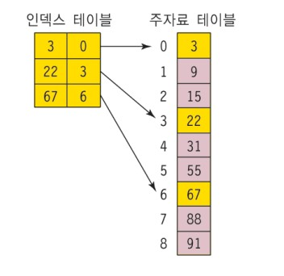
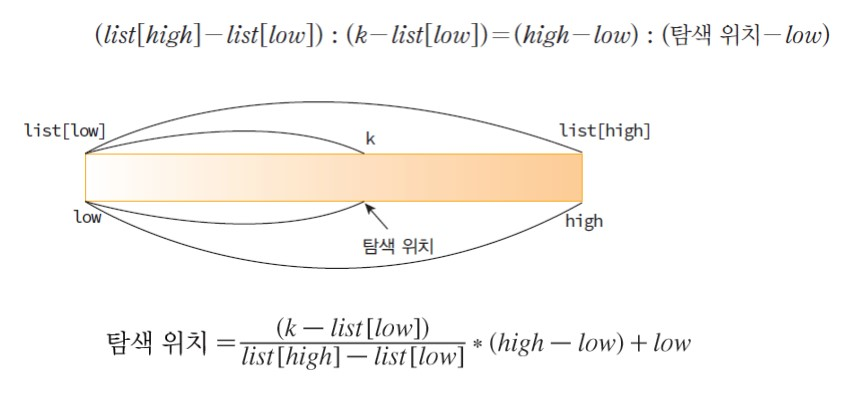
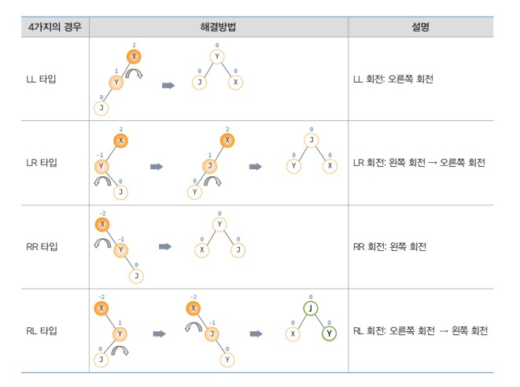
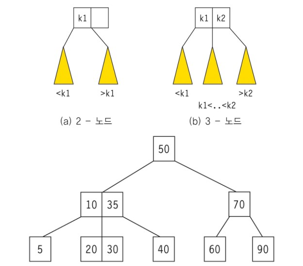
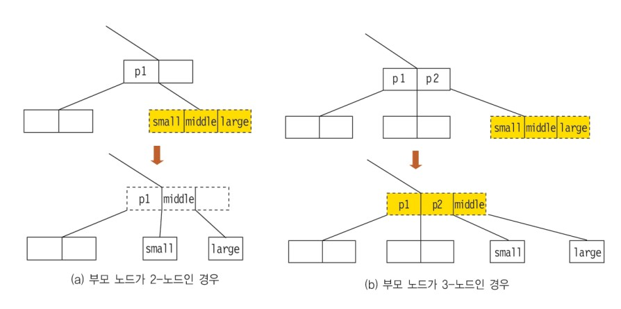
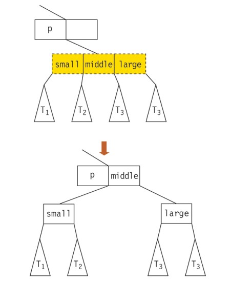
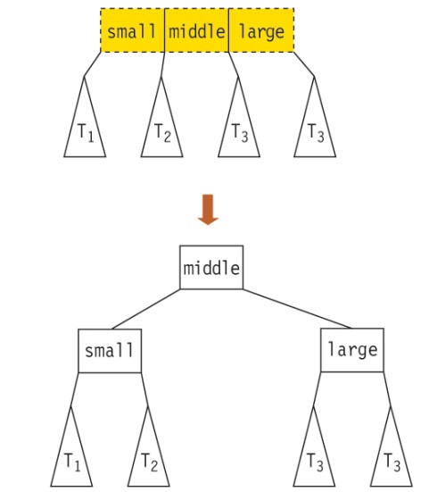

# 12 탐색 Search

## 출처

- C언어로 쉽게 풀어쓴 자료구조(천인국, 공용해, 하상호 저)

<br/>

<hr/>

## 목차

1. [탐색의 개념](#1-탐색의-개념) <br/>
   &nbsp; 1-1. [탐색이란](#1-1-탐색이란) <br/>

<br/>

2. [정렬되지 않은 배열에서의 탐색](#2-정렬되지-않은-배열에서의-탐색) <br/>
   &nbsp; 2-1. [순차 탐색](#2-1-순차-탐색-sequential-search) <br/>
   &nbsp; 2-2. [개선된 순차 탐색](#2-2-개선된-순차-탐색) <br/>

<br/>

3. [정렬된 배열에서의 탐색](#3-정렬된-배열에서의-탐색) <br/>
    &nbsp; 3-1. [이진 탐색](#3-1-이진-탐색-binary-search) <br/>
    &nbsp; 3-2. [색인 탐색](#3-2-색인-탐색-indexed-sequential-search) <br/>
    &nbsp; 3-3. [보간 탐색](#3-3-보간-탐색-interpolation-search) <br/>

<br/>

4. [균형 이진 탐색 트리](#4-균형-이진-탐색-트리) <br/>
    &nbsp; 4-1. [AVL 트리](#4-1-avl-트리) <br/>
    &nbsp; 4-2. [2-3 트리](#4-2-2-3-트리) <br/>

<br/><br/>

<hr/>

## 1. 탐색의 개념

<br/>

<hr/>

### 1-1. 탐색이란?

<br/>

탐색이란 여러 개의 자료 중에서 원하는 자료를 찾는 작업을 말한다. 컴퓨터가 가장 많이 하는 작업 중 하나이다. 그런만큼 효율성이 가장 중요한 영역이라고 볼 수 있다. 

<br/>

탐색의 단위는 항목이고 항목을 구별해주는 기준은 키(key)이다. 탐색키와 데이터로 이루어진 여러 개의 항목 중 원하는 탐색키를 찾는 것이 탐색이다. 배열, 연결리스트, 이진 탐색 트리 등의 여러 가지 자료구조에서 탐색하는 방법에 대해 알아보자.

<br/>

<br/>

<hr/>

## 2. 정렬되지 않은 배열에서의 탐색

<br/>

<hr/>

### 2-1. 순차 탐색 Sequential search

<br/>

순차 탐색은 탐색 방법 중에서 가장 간단하고 단순한 탐색 방법이다. 정렬되지 않은 배열의 항목들을 처음부터 끝까지 검사하여 원하는 항목을 찾는 무식한 방식이다. 

<br/>

low에서 high까지의 매개변수를 전달해 그 범위까지 탐색하게 만들 수 있다. 만약 탐색에 성공하면 그 인덱스를 반환하면 되고, 실패했다면 -1을 반환한다.

```c
int seq_search(int key, int low, int high)
{
    int i;
    for(i=low; i<=high; i++)
        if(list[i]==key)
        return i; // 탐색 성공
    return -1; // 탐색 실패
}
```

<br/>

<hr/>

### 2-2. 개선된 순차 탐색

<br/>

리스트의 끝부분을 잘 이용하면 순차 탐색에서 비교 횟수를 절반으로 줄일 수 있다. 리스트 끝부분에 여유 공간을 할당한다. 그리고 탐색이 시작될 때 그 여유공간에 탐색하는 값을 넣어 해당 값을 찾을 때까지 반복문을 돌린다. 만약 그 값이 리스트에 존재하면 중간에 멈출 것이고, 없다면 리스트 끝부분에 도달하게 될 것이다. 그 원리를 이용해 탐색 성공과 실패를 판가름하는 알고리즘이다.

```c
int imporved_seq_search(int key, int low, int high)
{
    int i;
    list[high+1] = key; // 키 값을 찾으면 종료
    for(i=low; list[i] != key; i++)
        ;

    if(i==(high+1)) return -1; // 탐색 실패
    else return i; // 탐색 성공
}
```

<br/>

<br/>

<hr/>

## 3. 정렬된 배열에서의 탐색

<br/>

<hr/>

### 3-1. 이진 탐색 Binary Search

<br/>

이진 탐색은 정렬된 배열을 이용하는 탐색 방법으로 중앙에 있는 값을 조사하여 항목이 왼쪽 또는 오른쪽에 있는지 알아내 탐색의 범위를 반으로 줄여가며 탐색을 진행하는 알고리즘이다. 순환이나 반복문을 이용해 쉽게 구현할 수 있다.

<br/>

- 순환을 이용한 이진탐색

```c
int search_binary(int key, int low, int high)
{
    int middle;
    while( low <= high ){ // 아직 숫자들이 남아 있으면
        middle = (low+high)/2;
        if( key == list[middle] ) // 탐색 성공
            return middle; 
        else if( key > list[middle] ) // 왼쪽 부분리스트 탐색
            return search_binary(key, low, middle-1); 
        else // 오른쪽 부분리스트 탐색
            return search_binary(key, middle+1, high); 
    }
    return -1; // 탐색 실패
}
```

<br/>

- 반복문을 이용한 이진 탐색

```c
int search_binary(int key, int low, int high)
{
    int middle;
    while( low <= high ){ // 아직 숫자들이 남아 있으면
        middle = (low+high)/2;
        if( key == list[middle] )
            return middle; // 탐색 성공
        else if( key > list[middle] )
            low = middle+1; // 왼쪽 부분리스트 탐색
        else
            high = middle-1; // 오른쪽 부분리스트 탐색
    }
    return -1; // 탐색 실패
}
```

<br/>

이진 탐색은 반복될 때마다 탐색 범위를 1/2로 줄여가므로 시간복잡도는 O(log n)이 된다.

<br/>

<hr/>

### 3-2. 색인 탐색 Indexed Sequential Search

<br/>

인덱스 테이블을 사용해 탐색의 효율을 증대시키는 순차 탐색이다. 인덱스 테이블은 주 자료 리스트에서 일정 간격으로 발췌한 자료를 가지고 있다. 리스트의 데이터 수가 n, 인덱스 테이블에 m개의 항목이 있다고 해보자. 각 인덱스 항목은 n/m번째 데이터를 가지고 있다. 시간복잡도는 log(m+n/m)이다.



<br/>

<hr/>

### 3-3. 보간 탐색 Interpolation Search

<br/>

보간 탐색이란 사전이나 전화번호부를 탐색하는 방법과 같이 탐색키가 존재할 위치를 예측해서 탐색하는 방법이다. 이진 탐색에서의 탐색 위치는 항상 (low+high)/2 였으나, 보간 탐색에서는 찾고자하는 key값과 현재의 low, high값을 고려해 탐색위치를 정한다. 공식은 아래와 같다.

$$탐색위치 = \frac{k - list[low]}{list[high] - list[low]} * (high-low) + low$$



<br/>

보간 탐색의 코드는 이진 탐색과 비슷한 구성을 가진다. 차이가 있다면 다음 탐색 위치를 정하는 것이다. 

```c
int interpolatoin_search(int key, int n)
{
    int low, high, j;
    low = 0;
    high = n - 1;
    while ((list[high] >= key) && (key > list[low])) {
        j = ((float)(key - list[low]) / (list[high] - list[low])
            *(high - low)) + low;

        if (key > list[j]) low = j + 1;
        else if (key < list[j]) high = j - 1;
        else low = j;
    }
    if (list[low] == key)
        return(low); // 탐색성공
    else
        return -1; // 탐색실패
}
```

<br/>

보간 탐색은 이진 탐색과 비슷한 O(log n)의 시간복잡도를 가진다.

<br/>

<br/>

<hr/>

## 4. 균형 이진 탐색 트리

<br/>

이진 탐색 트리 링크: [이진 탐색 링크](https://github.com/pythonstrup/TIL/blob/main/Data-Structure/07%20tree.md#2-2-%EC%9D%B4%EC%A7%84-%ED%83%90%EC%83%89-%ED%8A%B8%EB%A6%AC)

<br/>

이진 탐색과 이진 탐색 트리는 근본적으로 같은 원리에 의한 탐색 구조이다. 하지만 이진 탐색은 자료들이 배열에 저장되어 있기 때문에 삽입/삭제 연산이 매우 비효율적(O(n))이다. 삽입/삭제를 할 때마다 배열의 요소를 옮겨줘야하기 때문이다. 반면, 이진 탐색 트리는 삽입/삭제가 굉장히 효율적이기 때문에 삽입/삭제가 자주 발생한다면 이진 탐색 트리를 사용하는 것이 더 좋을 것이다.

<br/>

균형 이진 탐색 트리는 이진 탐색 트리의 기능에 균형을 추가한 것이다. 기본 이진 탐색 트리는 경사 트리가 만들어질 가능성이 있기 때문에 트리에 요소를 삽입할 때 회전을 통해 균형을 맞춰줄 수 있다.

<br/>

<hr/>

### 4-1. AVL 트리

<br/>

AVL 트리는 Adelson-Velskii와 Landis가 1962에 제안한 트리로 왼쪽과 오른쪽 서브트리의 높이 차이가 1이하인 이진 탐색 트리를 말한다. 만약 2이상의 차이가 나게 되면 회전을 통해 균형을 맞춘다.

- AVL 트리의 연산
    - 기본적인 삽입/삭제 연산은 이진 탐색 트리와 동일
    - 그러나 삽입/삭제 시 트리의 불균형을 초래할 수 있기 때문에 rotate연산이 필요

<br/>

트리의 균형이 깨지는 경우는 아래의 4가지 경우가 있다.

- AVL 트리의 회전



<br/>

AVL 트리 코드 링크: [AVL 트리 코드](https://github.com/pythonstrup/TIL/tree/main/Data-Structure/search/AVL.c)

<br/>

<hr/>

### 4-2. 2-3 트리

<br/>

2-3 트리는 차수가 2 또는 3인 노드를 가지는 트리로 삽입/삭제 알고리즘이 AVL 트리보다 더 간단하다. 차수가 2인 노드를 2-노드라고 하고 차수가 3인 노드를 3-노드라고 한다. 



왼쪽 서브트리에 있는 데이터들은 모두 k1보다 작은 값을 가진다. 중간 서브트리에 있는 데이터들은 k1보다 크고 k2보다 작다. 오른쪽에 있는 데이터들은 k2보다 크다.

<br/>

2-3 트리의 삽입 과정은 아래와 같다.


<br/>

2-3 트리에 삽입을 계속하다보면 위와 같은 **분리작업**이 일어나게 되는데 그 분류는 아래와 같다.

- 단말 노드를 분리하는 경우
    - 단말노드의 중간값이 부모노드로 올라간다.
    - 

<br/>

- 비단말 노드를 분리하는 경우
    - 노드가 가지고 있는 서브트리들도 분리해야 한다.
    - 

<br/>

- 루트 노드를 분리하는 경우
    - 루트에서 양쪽의 노드를 서브트리로 털어낸다.
    - 

<br/>

2-3 트리 코드 링크: [AVL 트리 코드](https://github.com/pythonstrup/TIL/tree/main/Data-Structure/search/AVL.c)

<br/>

2-3 트리 참고자료: [GeeksforGeeks](https://www.geeksforgeeks.org/2-3-trees-search-and-insert/)

<br/>

<hr/>

