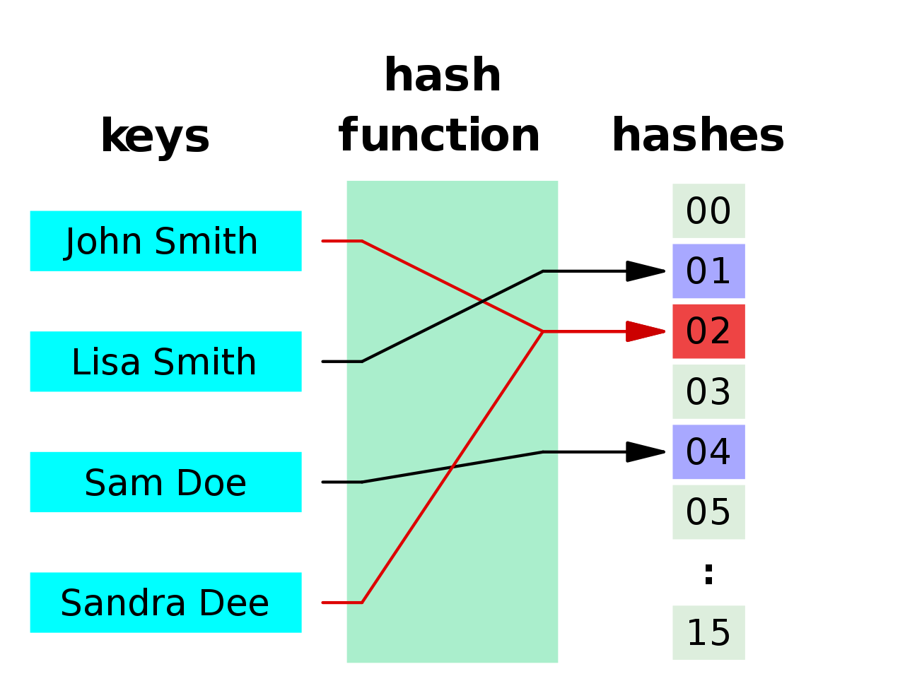
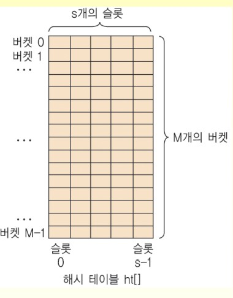
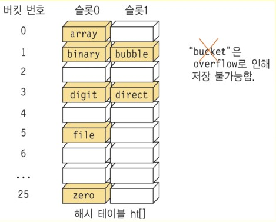
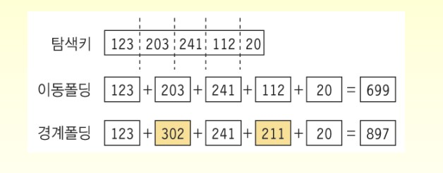
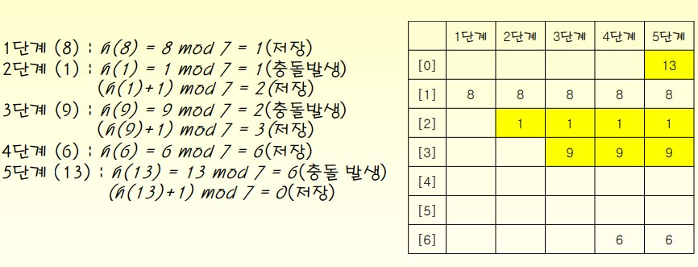

# 13 해싱 Hashing

## 출처

- C언어로 쉽게 풀어쓴 자료구조(천인국, 공용해, 하상호 저)

<br/>

<hr/>

## 목차

1. [해싱의 개념](#1-해싱의-개념) <br/>
   &nbsp; 1-1. [해싱이란](#1-1-해싱이란) <br/>
   &nbsp; 1-2. [해시테이블 Hash Table](#1-2-해시테이블-hash-table) <br/>
   &nbsp; 1-3. [해싱의 구조](#1-3-해싱의-구조) <br/>
   &nbsp; 1-4. [해시함수](#1-4-해시함수) <br/>

<br/>

2. [개방 주소법 Open Addressing](#2-개방-주소법-open-addressing) <br/>
   &nbsp; 2-1. [선형 조사법 Linear Probing](#2-1-선형-조사법-linear-probing) <br/>
   &nbsp; 2-2. [이차 조사법 Quadratic Probing](#2-2-이차-조사법-quadratic-probing) <br/>
   &nbsp; 2-3. [이중 해싱법 Double Hashing](#2-3-이중-해싱법-double-hasing) <br/>

<br/>

3. [체이닝 Chaining](#3-체이닝-chaining) <br/>

<br/>

4. [해싱의 성능 분석](#4-해싱의-성능-분석) <br/>

<br/><br/>

<hr/>

## 1. 해싱의 개념

<br/>

<hr/>

### 1-1. 해싱이란?

<br/>

해싱을 한 마디로 표현하자면 복호화가 불가능한 일방향 암호이다.

<br/>

해싱이란 앞에서 배웠던 반복 비교를 사용하지 않고 특정 계산만으로 자료의 저장 주소를 찾아내는 탐색 방법이다. O(1)의 시간복잡도로 값을 찾아내는 것이다. 여기서 말하는 특정 계산이란 키 값을 해시 함수로 연산해 결과값을 주소로 값에 접근하는 것을 말한다.

<br/>

해싱을 구현하는 방법은 다양하며 가장 많이 알려진 방법은 정적 해싱 중 하나인 제산법이다. mod 연산을 통해 키 값을 구하는 방식이다. 그 외에도 중간제곱법, 폴딩법, 기수변환법, 확장 해싱 등이 존재한다.

<br/>

<hr/>

### 1-2. 해시테이블 Hash Table

<br/>

해시테이블은 [키, 값]이 한 쌍이 이루는 집합이다. 연관 배열 추상 데이터 유형을 구현하는 데이터 구조로서, 키를 값에 매핑할 수 있다. 대부분의 상황에서 해시테이블은 검색 트리나 다른 테이블 조회 구조보다 평균적으로 더 효율적이다. 



<br/>

맵 Map이나 딕셔너리 Dictionary로 부르기도 한다. 자바에서는 해시맵 HashMap이란 호칭을 사용한다. 파이썬에서는 딕셔너리 Dictionary와 같은 개념으로 사용되지만 C#에서는 제너릭형인지 오브젝트형인지에 따라 해시테이블과 딕셔너리에 차이가 있는 것으로 보인다.

<br/>


- 딕셔너리 Dictionary의 추상 자료형(ADT)

```
객체: 일련의 (key, value) 쌍의 집합
연산:
add(key, value) ::= (key, value)를 사전에 추가한다.

delete(key) ::= key에 해당하는 (key, value)를 찾아 삭제한다. 관련된 value를 반환한다. 만약 탐색이 실패하면 NULL을 반환한다.

search(key) ::= key에 해당하는 value를 찾아 반환한다. 만약 탐색에 실패하면 NULL을 반환한다.
```

<hr/>

### 1-3. 해싱의 구조

<br/>

해싱에서는 자료를 저장할 때 배열을 사용한다. 원하는 항목이 들어있는 위치를 알고 있다면 빠르게 자료에 접근할 수 있다는 장점때문이다. 만약 해당 값의 key 값을 바로 알아낼 수만 있다면 상수 시간 안에 연산을 종료할 수 있다. 

<br/>

해싱은 어떤 항목의 키만 가지고 항목이 들어 있는 배열의 인덱스를 결정하는 기법이다. 해시 함수는 키 입력을 받아 해시 주소를 생성하고 이 해시 주소를 해시 테이블의 인덱스로 사용한다. 

<br/>

해시테이블은 버켓과 슬롯으로 구성되어 있다. 만약 해시 테이블의 버킷의 수가 상대적으로 작아져 할당된 슬롯 수보다 많은 충돌이 발생하게 되면 버킷에 더 이상 항목을 저장할 수 없게 되는 오버플로우 Overflow가 발생하게 된다. 이럴 때는 해시 함수를 수정하거나 해시테이블의 크기를 적절히 조절해줘야 한다.



<br/>

알파벳 앞자리에 의해 키가 결정된다고 가정해보자. a일 때는 0이고 b이면 1인 식이다. 입력데이터가 array, binary, bubble, file, digit, direct, zero, bucket 순이라고 할 때 아래 해시테이블과 같이 슬롯이 2칸인 경우, bucket이 오버플로우로 인해 저장되지 못하는 것을 확인할 수 있다.



<br/>

<hr/>

### 1-4. 해시함수

<br/>

해시 함수를 정하는 데 있어서 중요한 것은 3가지 이다.

1. 충돌이 적어야 한다.
2. 해시함수 값이 해시테이블의 주소 영역 내에서 고르게 분포되어야 한다.
3. 계산이 빨라야 한다.


<br/>

- 제산 함수
    - `h(k)=k mod M` 로 표현된다.
    - 해시 테이블의 크기 M은 주로 소수(prime number)로 선택한다.

```c
int hash_function(int key)
{
    int hash_index = key % M;
    if (hash_index < 0)
        hash_index += M;
    return hash_index;
}
```

<br/>

- 폴딩 함수
    - 32비트 키를 2개의 16비트로 나누어 비트별로 XOR 연산을 하는 코드는 다음과 같다. 
    - `hash_index = (short)(key ^ (key>>16)`
    - 이동 폴딩(shift folding)과 경계 폴딩(boudary folding)
    - 
    

<br/>

- 중간 제곱 함수
    - 탐색키를 제곱한 다음, 중간의 몇 비트를 취해서 해시 주소를 생성하는 방법이다.

<br/>

- 비트 추출 방법
    - 탐색키를 이진수로 간주(해시 테이블의 크기 M = 2^k일 경우)하여 임의의 위치의 k개의 비트를 해시 주소로 사용하는 방법이다.
    - 해시 주소의 집중 현상이 발생할 가능성이 높다.

<br/>

- 숫자 분석 방법
    - 키 중에서 편중되지 않은 수들을 해시테이블의 크기에 적합하게 조합하여 사용하는 방법이다. 

<br/>

- 탐색키가 문자열일 경우

```c
int hash_function(char *key)
{
    int hash_index = 0;
    while(*key)
        hash_index = g * hash_index + *key++;
    return hash_index;
}
```

<br/>

<br/><br/>

<hr/>

## 2. 개방 주소법 Open Addressing

<br/>

충돌(collision)이란 서로 다른 키를 갖는 항목들이 같은 해시주소를 갖는 현상을 말한다. 충돌이 발생하고 빈 버킷이 없으면 오버플로우가 발생한다. 충돌을 해결하는 방법은 2가지가 있다. 개방주소법과 체이닝 기법이다.

<hr/>

### 2-1. 선형 조사법 Linear Probing

<br/>

개방 주소법은 특정 버킷에서 충돌이 발생하면, 비어있는 버킷을 찾는 방법이다. 비어있는 버킷에 항목을 저장하게 된다. 여기서 비어있는 공간을 찾는 것을 조사(probing)이라고 한다. 

<br/>

선형 조사법은 **선형 탐색과 같이** 오버플로우가 발생했을 때 항목의 저장을 위해 **빈 버킷을 순차적으로 탐색**해나간다.



<br/>

선형 조사법 코드 링크: [선형 조사법](https://github.com/pythonstrup/TIL/tree/main/Data-Structure/hashing/linear_probing.c)

<br/>

<hr/>

### 2-2. 이차 조사법 Quadratic Probing

<br/>

<br/>

이차 조사법 코드 링크: [이차 조사법](https://github.com/pythonstrup/TIL/tree/main/Data-Structure/hashing/quadratic.c)

<br/>

<hr/>

### 2-3. 이중 해싱법 Double Hasing

<br/>

<br/>

이중 해싱법 코드 링크: [이중 해싱법](https://github.com/pythonstrup/TIL/tree/main/Data-Structure/hashing/double_hashing.c)

<br/>

<hr/>

## 3. 체이닝 Chaining

<br/>

<hr/>

## 4. 해싱의 성능 분석

<br/>

<hr/>