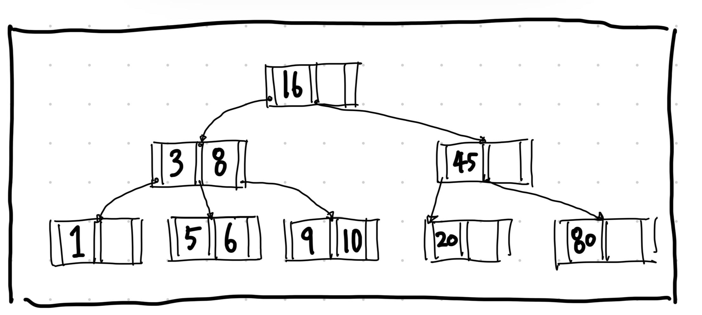
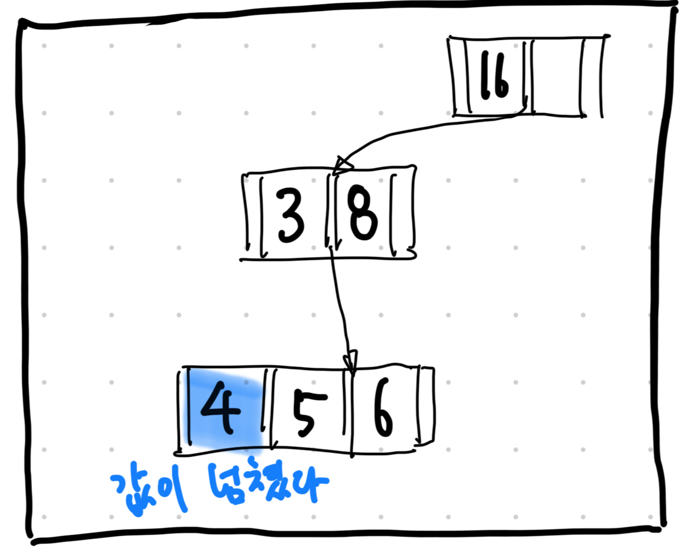
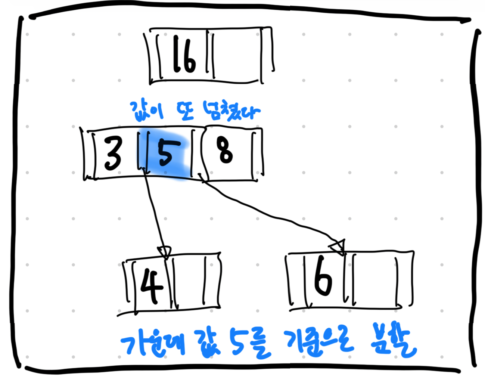
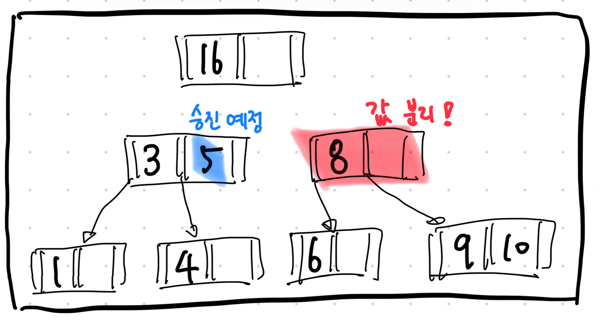
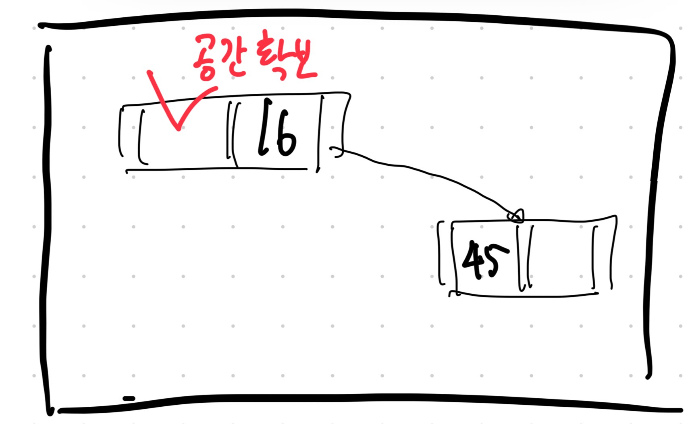
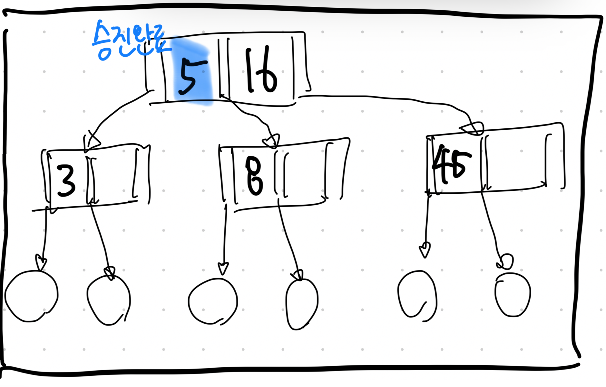
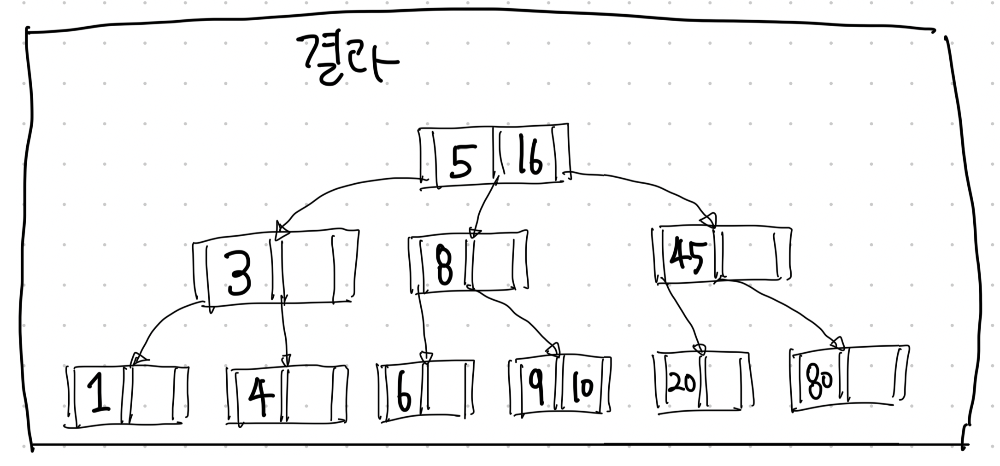

# B-tree

## B-tree의 특징

- 자녀 노드의 최대 개수를 늘리기 위해 부모 노드에 key를 하나 이상 저장
- 부모 노드의 key를 오름차순으로 정렬
- 정렬된 순서에 따라 자녀 노드들의 key 값의 범위가 결정된다.
- 머리의 root 노드, 중간의 branch 노드, 말단의 leaf 노드로 구성된다.

## B-tree의 노드 수

- 각 노드의 최대 자녀 노드 수를 `N`개 라고 가정해보자.
- 각 노드의 최대 key 개수는 `N-1`개다.
- 각 노드의 최소 자녀 노드 수는 `⌈N/2⌉`가 된다. (`root node`나 `leaf node`는 만족하지 않아도 된다.)
- 각 노드의 최소 key 개수는 `⌈N/2⌉-1`이다. (`root node`는 만족하지 않아도 된다.)

## 값의 추가

- 값은 항상 `leaf node`에 추가된다. (기본적으로 값이 추가되는 과정은 이진트리와 유사하다.        )
- 만약 노드가 최대 자녀 수가 넘어가게 되면 가운데 key를 기준으로 좌우 key들은 분할하고 가운데 key를 승진시킨다.

### 예시

- 아래와 같이 구성된 B트리가 있다고 가정해보자.

- 이제 `4`를 값으로 입력할 것이다.
- key 값을 확인해 타고 내려가다가 리프 노드에 도달에 `4`를 추가해줬더니 값이 넘쳤다.

- 중간값인 `5`를 승진시키고 좌우 값을 나눠줬다.
- 그런데 또 값이 넘쳤다.

- 다시 중간값인 `5`를 기준으로 좌우 값을 나눠준다.

- 루트 노드를 보니 `5`는 `16`보다 작기 때문에 `16`를 오른쪽으로 밀어줘야 한다.

- 이제 `5` 값을 루트 노드로 승진시킨다.

- `4` 값을 추가한 결과는 아래와 같다.

