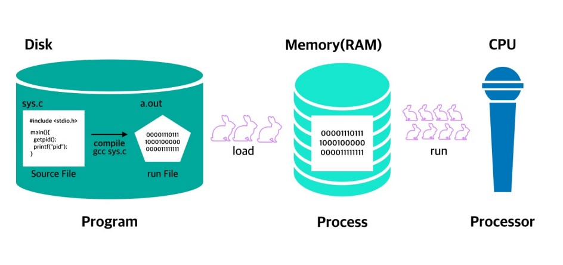
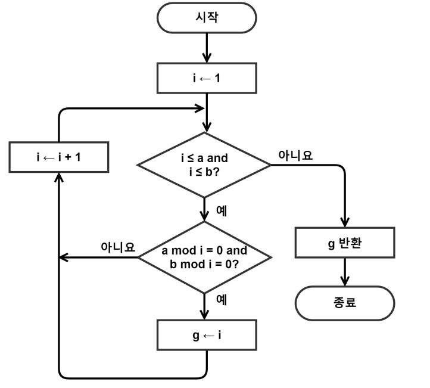
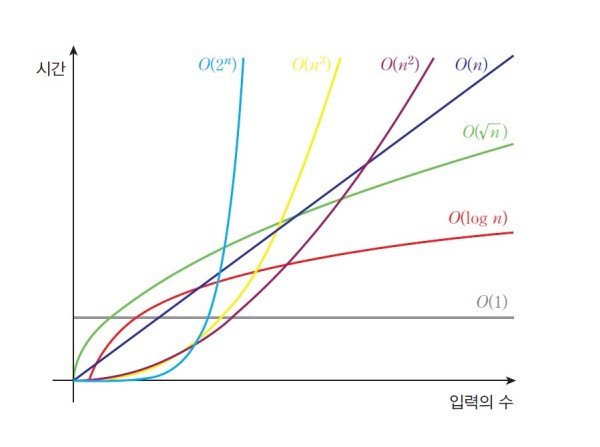

# 01 자료구조와 알고리즘

## 1. 자료구조의 기본 개념

<hr/>

<br/>

### 1-1. 프로그램 vs 프로세스 vs 프로세서

(_Program_ vs _Process_ vs _Processor_)

<hr/>

**프로그램(Program)** 이란 지정된 작업을 수행하는 명령 그룹이다. 즉, 실행될 명령 그룹을 코드로 정리해놓은 파일의 집합이다.
반면, **프로세스(Process)** 는 정해진 목적을 수행하기 위해 메모리에 나열된 작업의 목록이다. 다르게 말하자면 실행 중인 프로그램을 의미한다. <br/> 프로그램과 프로세스를 구별하는 방법은 다음과 같다. 작업의 과정이 파일이 정리되어 있다면 **프로그램** , 메모리(RAM)에 적재되어 실행 중이거나 대기 중이면 **프로세스** 라고 생각하면 된다. <br/>
또, **프로세서(Processor)** 는 프로세스와는 다른 개념으로, 하드웨어 측면에서는 컴퓨터 내에서 프로그램을 수행하는 하드웨어 유닛을 의미하고, 소프트웨어적으로는 데이터 포맷을 변환하는 역할을 수행하는 데이터 프로세싱 시스템을 의미한다. (ex- 워드프로세서)



<br/>

### 1-2. 자료형과 추상 데이터 타입(ADT)

<hr/>

자료형은 기초 자료형, 파생 자료형, 사용자 정의 자료형으로 나누어 볼 수 있다.

- 기초 자료형: char, int, float, double
- 파생 자료형: 배열, 포인턴
- 사용자 정의 자료형: 구조체, 공용체, 열거형

<br/>

그렇다면 추상 데이터 타입(ADT: Abstract Data Type)은 무엇일까? **ADT**란 일종의 **사용설명서**로 테이터 타입을 추상적(수학적)으로 정의한 것이다. 데이터나 연산이 무엇(What)인지 정의한다. 그러나 데이터나 연산이 어떻게(how) 구현할 것인지는 정의하지 않는다. C++과 자바의 추상클래스와 개념이 비슷하다고 보면 될 것 같다. <br/>
여기서 추상화란 개념을 알면 좋은데, 추상화는 사용자에게 중요한 정보는 강조되고 중요하지 않는 구현 세부사항은 제거하는 것이다. 이 아이디어가 ADT 정보 은닉의 핵심이다. 즉, ADT에서는 구현으로부터의 명세 분리가 아주 중요한 개념이다.

<br/><br/>

## 2. 알고리즘(Algorithm)

<hr/>

<br/>

### 2-1. 알고리즘의 정의

**알고리즘** 이란 컴퓨터로 문제를 풀기 위한 단계적인 절차를 의미한다. 알고리즘이 성립하려면 아래의 조건을 만족해야한다.

- 입력 : 0개 이상의 입력이 존재하여야 한다.
- 출력 : 1개 이상의 출력이 존재하여야 한다.
- 명백성 : 각 명령어의 의미는 모호하지 않고 명확해야 한다.
- 유한성 : 한정된 수의 단계 후에는 반드시 종료되어야 한다.
- 유효성 : 각 명령어들은 실행 가능한 연산이여야 한다.

<br/>

### 2-2. 알고리즘의 기술 방식

<hr/>

알고리즘은 크게 4가지 방법으로 기술할 수 있다. 영어나 한국어와 같은 자연어 기술, 흐름도(flow chart), 의사코드(pseudo-code), 프로그래밍 언어 등이다. 차례대로 알아보자.

- 자연어

사람이 이해하기 제일 쉬운 방식이지만, 자연어의 단어들을 명확하게 정의하지 않으면 의미 전달이 애매해질 수 있다.

```
add(a, b)

1. 변수 a와 b를 함수로 가져온다.
2. a와 b를 더해서 result에 저장한다.
3. result를 return 한다.
```

<br/>

- 흐름도

직관적이고 이해하기 쉬운 알고리즘 기술 방식으로, 간단한 기호와 도형으로 도식화한 것을 말한다. 그러나 복잡한 알고리즘의 경우, 알아보기 힘들 정도로 방대해질 수 있다.

예시> 최대공약수를 구하는 함수 flow-chart


<br/>

- 유사코드

의사코드라고도 불리며, 알고리즘을 기술할 때 가장 많이 사용하는 방법이다. 각 모듈이 작동하는 논리를 표현하기 위한 언어이다. 프로그램을 구현할 때 여러 가지 문제를 감출 수 있고, 핵심적인 내용에만 집중할 수 있다는 것에 장점이 있다.

```
add(a, b):
    result <- a + b
    return result
```

<br/>

- 프로그래밍 언어

C, C++, Java, Python 등의 프로그래밍 언어를 통해 기술하는 것으로, 알고리즘을 가장 정확하게 표현할 수 있는 방식이다. 하지만 실제 구현할 때, 다른 방식에 비해 굉장히 구체적이기에 알고리즘의 핵심적인 내용을 파악하는 것에 방해가 될 수 있다.

예시> C언어로 표현한 알고리즘

```
int add(int a, int b){
    int result = a + b;
    return result;
}
```

<br/>

### 2-3. 알고리즘의 성능분석

<hr/>

알고리즘 성능 분석이란 같은 목적을 가진 두 개 이상의 알고리즘을 프로그래밍 언어를 이용해 실제로 구현하여 동일한 하드웨어 조건에 놓고 수행시간을 측정하는 것을 의미한다. <br/>
수행시간을 측정하는 방법은 2가지이다. CPU 클럭수를 기준으로 측정하는 방법과 실제 시간으로 측정하는 방식이다. CPU 클럭수를 기준으로 측정하는 방식은 프로그램에서의 sleep 시간을 측정하지 않지만, 실제 시간을 측정하는 방식은 sleep된 시간까지 측정한다는 차이가 있다. <br/><br/>

수행시간을 직접 측정하는 방식은 직관적이나 수많은 환경 요소에 의한 영향을 받을 가능성이 크기 때문에 성능 측정할 때 객관적인 성능을 보여준다고 보기 어렵다. 알고리즘을 직접 실행해보지 않고 성능을 분석하는 방법을 사용하면 되는데 이를 **복잡도 분석** 이라고 한다. <br/>

복잡도의 종류로는 시간복잡도와 공간복잡도가 있다.

- 공간 복잡도

공간 복잡도란 프로그램을 실행시킬 때 필요한 공간 자원의 양을 의미한다. 최근 반도체 기술이 발달해 메모리 기능이 비약적으로 상승했고, 앞으로 계속 성능이 좋아질 것으로 예상되기 때문에 시간 복잡도에 비해 중요성이 점차 떨어지고 있다. (그래도 중요하다.)

- 시간 복잡도

가장 많이 사용되는 알고리즘의 수행 시간 기준으로, 프로그램이 실행되는 동안 수행하는 연산의 수를 입력의 크기에 대한 함수로 표현한 것이다. 알고리즘의 수행시간은 반복문이 지배하는 경우가 대부분이기 때문에 **반복문을 중심**으로 연산이 몇 번이나 일어나는지 파악하면 된다.<br/>
시간 복잡도가 높다는 의미는 입력의 크기가 증가할 때 알고리즘의 수행 시간이 훨씬 더 느려진다는 의미이다.
<br/><br/>

이런 복잡도를 표현하는 방법은 3가지이다. 빅오 표기법, 빅오메가 표기법, 빅세타 표기법인데 이중에서 빅오표기법이 가장 많이 사용된다.

- 빅오 표기법: 최악을 가정하고 수행시간을 평가

- 빅오메가 표기법: 최선의 경우를 보여줌

- 빅세타 표기법: 최선과 최악의 중간인 평균적인 복잡도를 의미

예시> 빅오 표기

```
f(n) = 5            --> O(1)
f(n) = 2n + 3       --> O(n)
f(n) = 5n^2         --> O(n^2)
f(n) = 3*2^n + 5n   --> O(2^n)
```



<br/>
