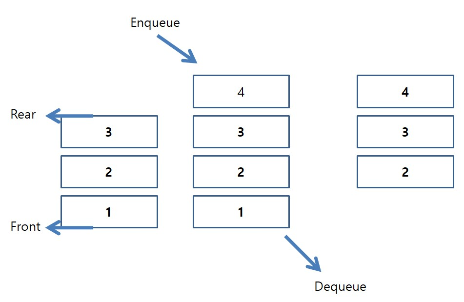
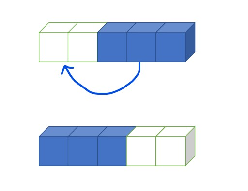
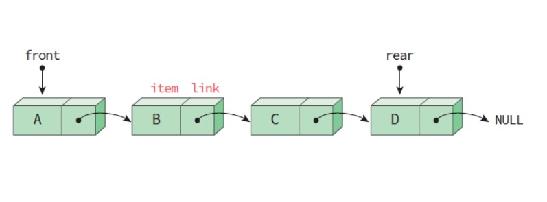

# 04 큐 Queue

## 1. 큐의 개념

<hr/>

<br/>

### 1-1. 큐란 무엇일까?

<hr/>

큐는 스택과 반대의 자료구조이다. 먼저 온 데이터가 먼저 나가는 선입선출(FIFO: First-In First-Out)의 특성을 가지고 있다. 스택도 많이 사용하는 자료구조지만, 큐는 스택보다 많이 사용되는 자료구조로 그 쓰임새가 많다. 일상생활의 예로는 매표소, 톨게이트 등이 있다. 순서대로 줄을 서는 모양이다.

<br/>

### 1-2. 큐의 기능

<hr/>

큐의 기능은 스택과 비슷하다. 데이터를 삽입하고 읽어오고 삭제한다. 다만, 큐는 [**top**만 가지고 있는 스택]과는 다르게 **front**와 **rear**를 가지고 있다. front는 데이터가 삭제되는 부분을 가리키고, rear는 제일 나중에 들어온 데이터를 가리킨다.



스택의 추상자료형은 아래와 같다.

```
 객체: 0개 이상의 요소들로 구성된 선형 리스트
 연산:
- create(max_size) ::= 최대 크기가 max_size인 공백큐를 생성한다.
- init(q) ::= 큐를 초기화한다.
- is_empty(q) ::= if(size == 0) return TRUE;
                  else return FALSE;
- is_full(q) ::= if(size == max_size) return TRUE;
                 else return FALSE;
- enqueue(q, e) ::= if( is_full(q) ) queue_full 오류;
                    else q의 끝에 e를 추가한다.
- dequeue(q) ::= if( is_empty(q) ) queue_empty 오류;
                 else q의 맨 앞에 있는 e를 제거하여 반환한다.
- peek(q) ::= if( is_empty(q) ) queue_empty 오류;
              else q의 맨 앞에 있는 e를 읽어서 반환한다.
```

<br/><br/>

## 2. 큐의 구현

<hr/>

<br/>

### 2-1. 선형큐

<hr/>

선형큐는 큐를 만드는 가장 쉬운 방법으로, 1차원 배열을 사용해 만들 수 있다. 아래는 구조체로 만든 int형 데이터 큐의 형태이다.

```c
#define MAX_SIZE 10
typedef int element;
typedef struct {
    int front;
    int rear;
    element data[MAX_SIZE];
} QueueType;
```

<br/>

선형큐는 만들기 쉽고 사용하기 간편하다는 장점이 있지만, 삭제를 하면 앞에 빈 곳을 자동으로 처리해주지 않기 때문에 삽입을 계속하려면 요소들을 계속 앞으로 이동시켜줘야하고, 매번 이렇게 처리하려면 시간이 오래 걸리고 자연스럽게 효율성은 떨어지게 된다.



<br/>

- 선형큐의 코드 링크: [선형큐 코드 보기](queue/linearQueue.c)

<br/>

### 2-2. 원형큐

<hr/>

선형큐는 재사용을 하려면 요소들을 계속해서 움직여줘야한다는 단점이 있었다. 이런 단점을 해결해주는 자료구조가 바로 원형큐이다. 선형큐(front와 rear의 시작이 -1)와는 다르게 front와 rear의 시작이 0이다. 삽입 시에는 rear만 증가하고, 삭제 시에는 front만 증가한다.

<br/>

원형큐에서 가장 중요한 포인트는 **front가 표시하고 있는 공간은 비워둬야 한다는 점이다.** (front == rear)를 만족할 때 큐가 비어있다는 것을 표시해야하기 때문이다. 반면 포화상태를 의미하는 것은 (front % MAX_SIZE == (rear+1) % MAX_SIZE)가 된다.

<br/>

계속해서 삭제연산과 삽입연산을 반복하다보면 front와 rear가 MAX_SIZE보다 커지게 되는 시점이 오게 된다. 그 때는 MAX_SIZE로 나머지 연산을 해줘 삭제로 빈공간을 다시 채우기 시작하면 큐를 재사용할 수 있다.

<br/>

- 원형큐의 코드 링크: [원형큐 코드 보기](queue/circularQueue.c)

<br/>

### 2-3.덱 Deque

<hr/>

덱(deque)은 double-ended queue이라는 뜻으로 큐의 front와
rear에서 삽입과 삭제가 모두 가능한 큐를 의미한다. 덱의 추상 자료형은 아래와 같다.

```
객체: n개의 element형으로 구성된 요소들의 순서있는 모임
연산:
- create() ::= 덱을 생성한다.
- init(dq) ::= 덱을 초기화한다.
- is_empty(dq) ::= 덱이 공백상태인지를 검사한다.
- is_full(dq) ::= 덱이 포화상태인지를 검사한다.

- add_front(dq, e) ::= 덱의 앞에 요소를 추가한다.
- add_rear(dq, e) ::= 덱의 뒤에 요소를 추가한다.

- delete_front(dq) ::= 덱의 앞에 있는 요소를 반환한 다음 삭제한다
- delete_rear(dq) ::= 덱의 뒤에 있는 요소를 반환한 다음 삭제한다.

- get_front(q) ::= 덱의 앞에서 삭제하지 않고 앞에 있는 요소를 반환한다.
- get_rear(q) ::= 덱의 뒤에서 삭제하지 않고 뒤에 있는 요소를 반환한다.
```

<br/>

아래는 원형큐를 덱으로 구현한 코드이다.

<br/>

- 덱(deque)의 코드 링크: [덱(deque) 코드 보기](queue/deque.c)

<br/>

### 2-4. 연결리스트 큐

<hr/>

아래는 연결리스트로 큐 노드를 구현한 모습이다.

```c
typedef int element;
typedef struct QueueNode {
    element data;
    struct QueueNode *link;
} QueueNode;

typedef struct {
    QueueNode *front, *rear;
} LinkedQueueType;
```

<br/>



<br/>

위에 나온 다른 큐들에 비해 어려운 것이 사실이다. link 관리도 해줘야하고 잘못하면 큐를 유실할 수도 있기 때문에 굉장히 복잡한 논리를 가지고 있는 방법이지만, Heap 영역의 용량이 허용하는 한 계속해서 데이터노드를 생성할 수 있고, 동적으로 생성하는 것이기 때문에 효율적이라 볼 수 있다.

<br/>

- 연결리스트 큐의 코드 링크: [연결리스트 큐 코드 보기](queue/linkedQueue.c)

<br/>
