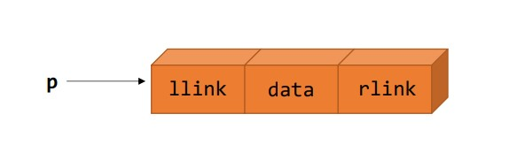
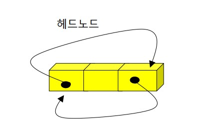

# 06 연결리스트2 Linked List

## 목차

1. [연결리스트 응용](#1-연결리스트-응용) <br/>
   &nbsp; 1-1. [다항식 계산](#1-1-다항식-계산) <br/>
   &nbsp; 1-2. [연결리스트 스택](#1-2-연결리스트-스택) <br/>
   &nbsp; 1-3. [연결리스트 큐](#1-3-연결리스트-큐) <br/>

<br/>

2. [원형 연결리스트](#2-원형-연결리스트) <br/>
   &nbsp; 2-1. [원형 연결리스트란?](#2-1-원형-연결리스트란) <br/>
   &nbsp; 2-2. [원형 연결리스트 구현](#2-2-원형-연결리스트-구현) <br/>

<br/>

3. [이중 연결리스트](#3-이중-연결리스트) <br/>
   &nbsp; 3-1. [이중 연결리스트란?](#3-1-이중-연결리스트란) <br/>
   &nbsp; 3-2. [이중 연결리스트구현](#3-2-이중-연결리스트-구현) <br/>

<br/><br/>

## 1. 연결리스트 응용

<hr/>

<br/>

### 1-1. 다항식 계산

<hr/>

2개의 다항식을 더하는 덧셈 연산을 구현한다. 헤더노드를 통해 head부분과 tail부분을 따로 관리해 다항식 연산을 좀 더 효율적으로 할 수 있다.

코드 링크: [다항식 계산](https://github.com/pythonstrup/TIL/tree/main/Data-Structure/list/polynomial.c)

<br/>

### 1-2. 연결리스트 스택

<hr/>

링크드리스트로 스택을 구현했다. top을 이용해 스택을 관리한다. heap영역이 허용하는한 스택노드를 계속해서 생성할 수 있고, 노드를 이용한다는 점만 빼면 행렬구조체를 이용한 스택과 거의 유사한 기능을 한다.

코드 링크: [연결리스트 스택](https://github.com/pythonstrup/TIL/tree/main/Data-Structure/list/linkedstack.c)
<br/>

<br/>

### 1-3. 연결리스트 큐

<hr/>

코드 링크: [연결리스트 큐](https://github.com/pythonstrup/TIL/blob/main/Data-Structure/queue/linkedQueue.c)

연결리스트 큐 설명보러가기: [큐 링크](https://github.com/pythonstrup/TIL/blob/main/Data-Structure/04%20queue.md)

<br/>

## 2. 원형 연결리스트

<hr/>

<br/>

### 2-1. 원형 연결리스트란?

<hr/>

원형 연결리스트란 마지막 노드의 링크가 첫 번째 노드를 가리키는 리스트이다. 링크를 따라가다보면 모든 노드를 거쳐서 자기자신으로 되돌아올 수 있다는 의미이다. 원형 연결리스트는 head가 핵심이라고 볼 수 있는데 아래의 설명을 보자.

- head가 첫 번째 노드를 가리키는 경우

head가 만약 맨 앞을 가리킨다면? 두 가지 경우가 있다 insert_first()를 할 경우와 insert_last()를 할 경우이다. 아래 코드를 통해 살펴보자.

```c
// insert_first()를 할 경우
temp->link = head;
head = temp
while문을 통해 꼬리노드를 찾아줘야함
```

```c
// insert_last()를 할 경우
temp->link = head;
head = temp;
while문으로 꼬리 찾기
```

<br/>

위와 같이 구성할 경우, 꼬리를 매번 찾아야하기 때문에 매우 비효율적이다.

<br/>

- head가 마지막 노드를 가리키는 경우

```c
// insert_first()
temp->link = head->link; // temp의 link 맨 앞의 노드와 연결
head->link = temp; // 꼬리의 링크를 temp와 연결
```

<br/>

단 2번의 연산으로 삽입이 가능하다. 반면 insert_last()는 어떨까?

```c
// insert_last()
temp->link = head->link; // temp의 link 맨 앞의 노드와 연결
head->link = temp; // 꼬리의 링크를 temp와 연결
head = temp; // head를 마지막노드로 옮겨줌
```

<br/>

단 3번의 연산으로 해결할 수 있다. 따라서 원형 연결리스트에서 head값은 꼬리노드를 가리키는 것이 좋다.

<br/>

### 2-2. 원형 연결리스트 구현

<hr/>

위에서 설명했던 head의 위치에 유의하여 프로그램을 작성하면 된다. 삽입연산 또한 위에서 설명했던 것과 같이 수행하면 된다.

```c
typedef int element; // 요소가 int형
// 노드
typedef struct ListNode {
	element data;
	struct ListNode *link;
} ListNode;

ListNode* insert_first(ListNode* head, element data){...}

ListNode* insert_last(ListNode* head, element data){...}

```

코드 링크: [원형 연결리스트](https://github.com/pythonstrup/TIL/tree/main/Data-Structure/list/circularList.c)

<br/><br/>

## 3. 이중 연결리스트

<hr/>

그동안 배웠던 연결리스트의 문제점은 선행노드를 찾기가 매우 어렵다는 단점이 있었다. 이 문제를 해결하기 위해 사용되는 리스트가 바로 이중 연결리스트이다.

<br/>

### 3-1. 이중 연결리스트란?

<hr/>

이중 연결리스트란 하나의 노드가 선행 노드와 후속 노드에 대한 두 개의 링크를 모두 가지는 리스트를 뜻한다. 노드에 포인터가 하나 더 필요하므로 4byte(32비트 컴퓨터의 포인터 용량)의 공간이 더 필요하고, 코드가 복잡하다는 단점이 있다.



위의 그림처럼 p가 다음 노드를 가리킬 때, 아래와 같은 속성을 보이는 것이 이중 연결 리스트이다.

- p = p->llink->rlink = p->rlink->llink

<br/>

이중 연결리스트는 헤드노드가 따로 필요하다. 헤드노드란 데이터를 가지지 않고, 삽입과 삭제 코드를 간단하게 만들어주기 위한 노드이다. 리스트가 공백상태가 되면 아래와 같아진다.



<br/>

### 3-2. 이중 연결리스트 구현

<hr/>
이중 연결리스트의 노드는 아래와 같다. 노드를 이용해 main에 head를 만들어 사용하면 된다.

```c
typedef int element;
typedef struct DlistNode {
    element data;
    struct DlistNode *llink;
    struct DlistNode *rlink;
} DlistNode;
```

<br/>

거의 대부분의 자료연산의 핵심이 삽입과 삭제 연산인 것과 마찬가지로 이중 연결리스트에서도 삽입과 삭제의 논리는 매우 중요하다. 특히 그 순서가 중요한데 아래의 코드를 살펴보자.

```c
// 새로운 데이터를 노드 before의 오른쪽에 삽입한다.
void dinsert(DListNode *before, element data)
{
    DListNode *newnode = (DListNode *)malloc(sizeof(DListNode));
    strcpy(newnode->data, data);
    newnode->llink = before;        // (1)
    newnode->rlink = before->rlink; // (2)
    before->rlink->llink = newnode; // (3)
    before->rlink = newnode;        // (4)
}
```

위는 삽입함수이다. 번호가 매겨져있는 코드를 살펴보자. (1), (2)의 순서는 바뀌어도 코드에 영향을 미치지 않지만 **(3)과 (4)의 순서가 바뀌면 before 다음부터의 리스트가 유실되므로 순서에 매우 유의해야 한다.** 추가하자면, (2) 또한 (4)보다 앞에 나와야 한다.

<br/>

```c
// 노드 removed를 삭제한다.
void ddelete(DListNode* head, DListNode* removed)
{
    if (removed == head) return; // head는 삭제할 수 없다.
    removed->llink->rlink = removed->rlink; // (1)
    removed->rlink->llink = removed->llink; // (2)
    free(removed);
}
```

위의 코드는 삭제연산을 수행하는 함수이다. 삽입연산과는 다르게 삭제연산에서는 (1), (2)의 순서에 전혀 영향을 받지 않으므로 순서를 마음대로 바꿔도 된다.

<br/>

코드 링크: [이중 연결리스트](https://github.com/pythonstrup/TIL/tree/main/Data-Structure/list/doubleList.c)

<br/><br/>
