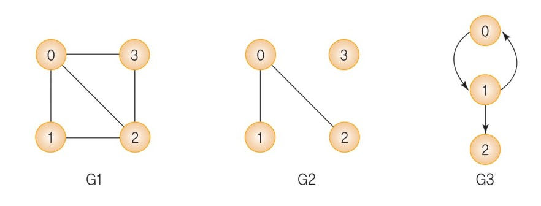
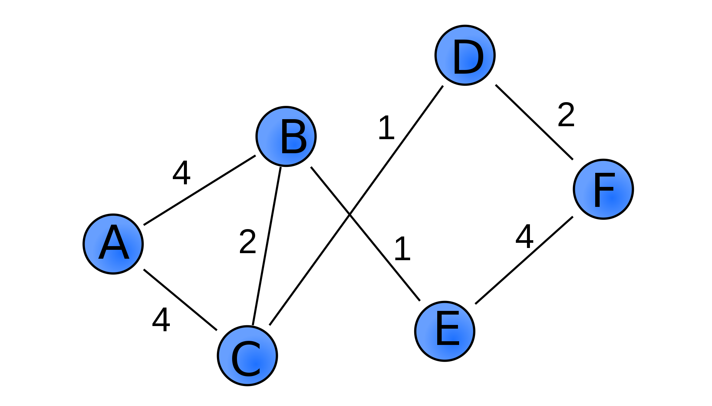
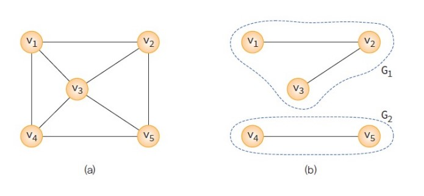
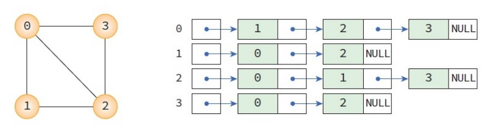
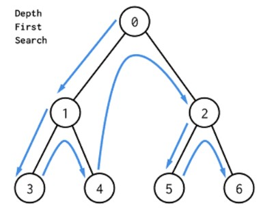
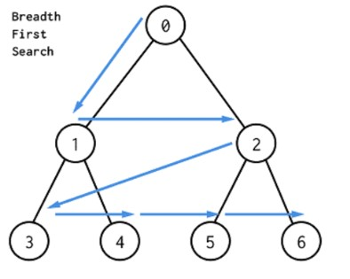

# 09 그래프 Graph

## 출처

- C언어로 쉽게 풀어쓴 자료구조(천인국, 공용해, 하상호 저)

<br/>

<hr/>

## 목차

1. [그래프의 개념](#1-그래프의-개념) <br/>
   &nbsp; 1-1. [그래프란](#1-1-그래프란) <br/>
   &nbsp; 1-2. [그래프의 종류](#1-2-그래프의-종류) <br/>
   &nbsp; 1-3. [네트워크](#1-3-네트워크) <br/>
   &nbsp; 1-4. [그래프 용어](#1-4-그래프-용어) <br/>

<br/>

2. [그래프의 표현방법](#2-그래프의-표현방법) <br/>
   &nbsp; 2-1. [인접행렬 방식](#2-1-인접행렬-방식) <br/>
   &nbsp; 2-2. [인접리스트 방식](#2-2-인접-리스트-방식) <br/>

<br/>

3. [그래프의 탐색](#3-트리의-순회) <br/>
   &nbsp; 3-1. [깊이 우선 탐색 DFS](#3-1-깊이-우선-탐색-dfsdepth-first-search) <br/>
   &nbsp; 3-2. [너비 우선 탐색 BFS](#3-2-너비-우선-탐색-bfsbreath-first-search) <br/>

<br/><br/>

<hr/>

## 1. 그래프의 개념

<hr/>

<br/>

### 1-1. 그래프란?

<br/>

그래프(graph)는 객체 사이의 연결 관계를 표현할 수 있는 자료구조이다. 그래프의 예로는 지도에서 도시들의 연결상태, 전기회로의 소자 간 연결 상태, 도로망, 대학교 선수과목 관계 등이 있다. 트리도 일종의 그래프로 받아들여진다.<br/>
선형리스트, 트리로는 도시, 소자, 자원, 프로젝트 등의 객체들이 서로 연결되어 있는 복잡한 구조를 표현할 수 없었다. 그래서 사용되는 것이 그래프이고 컴퓨터 프로그래밍에서 유용하게 사용된다.

<br/>

그래프는 1736년 오일러의 "Konigsberg의 다리" 문제를 해결하기 위해 처음으로 사용되었다. 이 문제는 모든 다리를 한 번만 건너서 처음 출발했던 장소로 돌아오는 문제인데, 오일러 정리에 의해 풀렸다. 모든 정점을에 연결된 간선의 수가 짝수이면 오일러 경로가 존재하고 홀수이면 경로가 존재하지 않는다는 결론이다.

<br/>

그래프 G는 V와 E로 표시할 수 있는데 여기서 V는 정점(vertex)이고, E는 간선(edge)이다.<br/>
- 정점 Vertex
    - 여러가지 특성을 가질 수 있는 객체
    - V(G)란 그래프 G의 정점 집합을 의미
    - 노드(node)라고도 불림

- 간선 Edge
    - 정점들 간의 관계를 의미
    - E(G)란 그래프 G의 간선 집합
    - 링크(link)라고도 불림

<br/>

아래와 같이 그래프를 표현할 수 있다.

• V(G1)= {0, 1, 2, 3}, E(G1)= {(0, 1), (0, 2), (0, 3), (1, 2), (2, 3)} <br/>
• V(G2)= {0, 1, 2, 3}, E(G3)= {(0, 1), (0, 2))} <br/>
• V(G3)= {0, 1, 2}, E(G3)= {<0, 1>, <1, 0>, <1, 2>} <br/>



<br/>

<hr/>

### 1-2. 그래프의 종류

<br/>

방향에 따라 그래프를 그래프를 분류하면 **무방향 그래프**와 **방향 그래프** 2가지 종류가 있다.

<br/>

**무방향 그래프**는 간선을 그냥 선으로 표현하며, 양방향 그래프로 간선 하나로 둘 사이를 왔다갔다할 수 있다. 위의 그래프 G1, G2가 무방향 그래프이다. 

<br/>

**방향 그래프**는 방향이 있는 그래프로 화살표로 표시한다. 화살표 방향 편도로만 움직일 수 있는 특징이 있다. 위의 그래프 G3가 이에 해당된다.

<br/>

<hr/>

### 1-3. 네트워크

<br/>

가중치 그래프(weighted graph)는 네트워크라고도 한다. 여기서 가중치 그래프란 간선에 비용(cost)이나 가중치(weight)가 할당된 그래프를 의미한다.



<br/>

<hr/>

### 1-4. 그래프 용어

<br/>

- 부분그래프(sub graph): 정점 집합 V(G)와 간선 집합 E(G)의 부분 집합으로 이루어진 그래프를 의미한다.

- 인접 정점(adjacent vertex): 하나의 정점에서 간선에 의해 직접 연결된 정점을 의미한다.

- 무방향 그래프의 차수(degree): 하나의 정점에 연결된 다른 정점의 수를 의미한다.

- 방향 그래프의 차수(degree): 진입 차수(in-degree: 외부에서 들어오는 간선의 수)와 진출 차수(out-degree: 외부로 향하는 간선의 수)로 나눌 수 있다.

- 단순 경로(simple path): 경로 중 반복되는 간선이 없는 경로

- 사이클(cycle): 단순 경로의 시작 정점과 종료 정점이 동일한 경로

- 연결 그래프(connected graph): 무방향 그래프 G에 있는 모든 정점쌍에 대하여 항상 경로가 존재한다면 G는 연결되었다고 하며, 연결 그래프라고 부른다. 아래의 (a)는 연결 그래프이고 (b)는 비연결 그래프이다.



- 완전 그래프(complete graph): 모든 정점이 연결되어있는 그래프를 의미한다. 정점의 수를 n이라고 하면 간선의 수는 `n(n-1)/2`가 된다.

<br/><br/>

<hr/>

## 2. 그래프의 표현방법

<br/>

그래프의 추상자료형은 아래와 같다.

- 그래프의 추상자료형(ADT)

```
·객체: 정점의 집합과 간선의 집합

·연산: 
▪ create_graph() ::= 그래프를 생성한다.
▪ init(g) ::= 그래프 g를 초기화한다.
▪ insert_vertex(g,v) ::= 그래프 g에 정점 v를 삽입한다.
▪ insert_edge(g,u,v) ::= 그래프 g에 간선 (u,v)를 삽입한다. 
▪ delete_vertex(g,v) ::= 그래프 g의 정점 v를 삭제한다.
▪ delete_edge(g,u,v) ::= 그래프 g의 간선 (u,v)를 삭제한다. 
▪ is_empty(g) ::= 그래프 g가 공백 상태인지 확인한다. 
▪ adjacent(v) ::= 정점 v에 인접한 정점들의 리스트를 반환한다. 
▪ destroy_graph(g) ::= 그래프 g를 제거한다.
```

<br/>

위 그래프를 표현할 수 있는 방법으로는 인접행렬(adjacent matrix) 방식과 인접 리스트(adjacent list) 방법이 있다.

<br/>

<hr/>

### 2-1. 인접행렬 방식

<br/>

먼저 **인접행렬 방식**은 간단하게 **2차원 배열**로 그래프를 정의하는 방법이다. 가장 많이 사용하는 방법이다. 정점의 수를 n이라고 했을 때, n x n 행렬을 만들 수 있다. 행렬의 요소가 1이면 연결된 것이고, 0이면 연결되지 않은 것이다. 시간복잡도는 O(n^2)이다.

<br/>

링크: [인접행렬 방식 코드](https://github.com/pythonstrup/TIL/tree/main/Data-Structure/graph/graph_matrix.c)

<br/>

<hr/>

### 2-2. 인접 리스트 방식

<br/>

인접 리스트(adjacency list)는 각 정점에 인접한 정점들을 연결리스트로 표현하는 방법으로 많이 사용하는 방법은 아니다. 간선의 수가 적은 **희소그래프**에 적합하다. 시간복잡도는 O(n + e)이다.



<br/>

링크: [인접리스트 방식 코드](https://github.com/pythonstrup/TIL/tree/main/Data-Structure/graph/graph_list.c)

<br/><br/>

<hr/>

## 3. 그래프의 탐색

<br/>

그래프 탐색은 하나의 정점에서부터 시작하여 차례대로 모든 정점들을 한 번씩 방문하는 것이다. 많은 문제들이 그래프 노드를 방문하는 것으로 해결될 수 있으며, 알고리즘 문제에서 dfs와 bfs는 가장 많이 사용되는 탐색 기법이다. 

<br/>

<hr/>

### 3-1. 깊이 우선 탐색 DFS(Depth First Search)

<br/>

한 방향으로 갈 수 있을 때까지 가다가 더 이상 갈 수 없게 되면 가장 가까운 갈림길로 돌아와 이곳에서부터 다시 깊숙히 탐색을 진행한다. 되돌아가기 위한 스택이 필요하다는 특징이 있다. 대체로 많은 사람들이 순환호출로 dfs를 구현하는데 이를 묵시적 스택이라고 한다.<br/>
이는 루트-왼쪽 서브트리-오른쪽 서브트리 순으로 방문하는 **트리의 전위 순회(inorder)**와 비슷하다.

<br/>



이미지 출처: https://dev.to/danimal92/difference-between-depth-first-search-and-breadth-first-search-6om

<br/>

링크: [깊이 우선 탐색 코드 - 순환호출](https://github.com/pythonstrup/TIL/tree/main/Data-Structure/graph/dfs.c)

<br/>

링크: [깊이 우선 탐색 코드 - 명시적 스택 사용](https://github.com/pythonstrup/TIL/tree/main/Data-Structure/graph/dfs_stack.c)

<br/>

<hr/>

### 3-2. 너비 우선 탐색 BFS(Breath First Search)

<br/>

너비 우선 탐색은 시작 정점으로부터 가까운 정점을 먼저 방문하고 멀리 떨어져있는 정점을 나중에 방문하는 순회방법이다. BFS를 구현하기 위해서는 선형 자료구조인 큐가 필요하다. BFS 알고리즘은 큐에서 정점을 꺼내 방문하고 인접 정점들을 큐에 추가한다. 그리고 큐가 소진할 때까지 동일한 코드를 반복한다. <br/> 
이는 **트리의 레벨 순회(level order)**와 비슷하다.

<br/>



이미지 출처: https://dev.to/danimal92/difference-between-depth-first-search-and-breadth-first-search-6om

<br/>

링크: [너비 우선 탐색 코드](https://github.com/pythonstrup/TIL/tree/main/Data-Structure/graph/bfs.c)

<br/>

<hr/>
